# 十、CSS3 基本语法

## 1. CSS3 新增长度单位

1. `rem` 根元素字体大小的倍数，只与根元素字体大小有关。
2. `vw` 视口宽度的百分之多少 `10vw` 就是视口宽度的 `10%` 。
3. `vh` 视口高度的百分之多少 `10vh` 就是视口高度的 `10%` 。
4. `vmax` 视口宽高中大的那个的百分之多少。（了解即可）
5. `vmin` 视口宽高中小的那个的百分之多少。（了解即可）


## 2. CSS3 新增颜色设置方式

`CSS3` 新增了三种颜色设置方式，分别是： `rgba` 、 `hsl` 、 `hsla` ，由于之前已经详细讲解，此处略过。


## 3. CSS3 新增选择器

`CSS3` 新增的选择器有：动态伪类、目标伪类、语言伪类、 `UI` 伪类、结构伪类、否定伪类、伪元素；这些在 `CSS2` 中已经详细讲解，此处略过。


## 4. CSS3 新增盒模型相关属性

### 4.1. box-sizing 怪异盒模型

使用 `box-sizing` 属性可以设置盒模型的两种类型

| 可选值        | 含义                                                     |
| ------------- | -------------------------------------------------------- |
| `content-box` | `width` 和 `height` 设置的是盒子内容区的大小。（默认值） |
| `border-box`  | `width` 和 `height` 设置的是盒子总大小。（怪异盒模型）   |

### 4.2. resize 调整盒子大小

使用 `resize` 属性可以控制是否允许用户调节元素尺寸。

| 值            | 含义                            |
| ------------- | ------------------------------- |
| `none`        | 不允许用户调整元素大小。 (默认) |
| `both `       | 用户可以调节元素的宽度和高度 。 |
| `horizontal ` | 用户可以调节元素的 **宽度** 。  |
| `vertical `   | 用户可以调节元素的 **高度**。   |

> 必须搭配`overflow`使用

### 4.3. box-shadow 盒子阴影

使用 `box-shadow` 属性为盒子添加阴影。

- 语法：
  ```css
  box-shadow: h-shadow v-shadow blur spread color inset;
  ```

- 各个值的含义：

  | 值          | 含义                                 |
  | ----------- | ------------------------------------ |
  | `h-shadow ` | 水平阴影的位置，必须填写，可以为负值 |
  | `v-shadow`  | 垂直阴影的位置，必须填写，可以为负值 |
  | `blur `     | 可选，模糊距离                       |
  | `spread `   | 可选，阴影的外延值                   |
  | `color `    | 可选，阴影的颜色                     |
  | `inset `    | 可选，将外部阴影改为内部阴影         |

- 默认值： `box-shadow:none` 表示没有阴影

- 示例：
  ```css
  /* 写两个值，含义：水平位置、垂直位置 */
  box-shadow: 10px 10px;
  
  /* 写三个值，含义：水平位置、垂直位置、颜色 */
  box-shadow: 10px 10px red;
  
  /* 写三个值，含义：水平位置、垂直位置、模糊值 */
  box-shadow: 10px 10px 10px;
  
  /* 写四个值，含义：水平位置、垂直位置、模糊值、颜色 */
  box-shadow: 10px 10px 10px red;
  
  /* 写五个值，含义：水平位置、垂直位置、模糊值、外延值、颜色 */
  box-shadow: 10px 10px 10px 10px blue;
  
  /* 写六个值，含义：水平位置、垂直位置、模糊值、外延值、颜色、内阴影 */
  box-shadow: 10px 10px 20px 3px blue inset;
  ```

### 4.4. opacity 不透明度

- `opacity` 属性能为整个元素添加透明效果， 值是 `0` 到 `1` 之间的小数， `0` 是完全透明， `1` 表示完全不透明。

> `opacity` 与 `rgba` 的区别？
>
> `opacity` 是一个属性，设置的是整个元素（包括元素里的内容）的不透明度。
>
> `rgba` 是颜色的设置方式，用于设置颜色，它的透明度，仅仅是调整颜色的透明度。


## 5. CSS3 新增背景属性

### 5.1. background-origin

- 作用：设置背景图的原点。

- 语法

  1. `padding-box` ：从 `padding` 区域开始显示背景图像。—— 默认值
  2. `border-box` ： 从 `border` 区域开始显示背景图像。

  3. `content-box` ： 从 `content` 区域开始显示背景图像。

### 5.2. background-clip

- 作用：设置背景图的向外裁剪的区域。

- 语法

  1. `border-box` ： 从 `border` 区域开始向外裁剪背景。 —— 默认值

  2. `padding-box` ： 从 `padding` 区域开始向外裁剪背景。

  3. `content-box` ： 从 `content` 区域开始向外裁剪背景。

  4. `text` ：背景图只呈现在文字上。

> 注意：若值为 `text` ，那么 `backgroun-clip` 要加上 `-webkit-` 前缀。

### 5.3. background-size

- 作用：设置背景图的尺寸。

- 语法：

  1. 用长度值指定背景图片大小，不允许负值。
     
     ```css
     background-size: 300px 200px;
     ```
     
  2. 用百分比指定背景图片大小，不允许负值。
     
     ```css
     background-size: 100% 100%;
     ```
     
  3. `auto `： 背景图片的真实大小。 —— 默认值
  
  4. `contain` ： 将背景图片等比缩放，使背景图片的宽或高，与容器的宽或高相等，再将完整背景图片包含在容器内，但要注意：可能会造成容器里部分区域没有背景图片。
  
     ```css
     background-size: contain;
     ```
  
  5. `cover` ：将背景图片等比缩放，直到完全覆盖容器，图片会尽可能全的显示在元素上，但要注意：背景图片有可能显示不完整。—— 相对比较好的选择
  
     ```css
     background-size: cover;
     ```

### 5.4. backgorund 复合属性

- 语法：

  ```css
  background: color url repeat position / size origin clip
  ```

  > **注意：**
  >
  > 1. `origin` 和 `clip` 的值如果一样，如果只写一个值，则 origin 和 clip 都设置；如果设置了两个值，前面的是 `origin` ，后面的 `clip` 。
  >
  > 2. `size` 的值必须写在 `position` 值的后面，并且用 `/` 分开。

### 5.5. 多背景图

`CSS3` 允许元素设置多个背景图片。

```css
/* 添加多个背景图 */
background: url(../images/bg-lt.png) no-repeat,
    url(../images/bg-rt.png) no-repeat right top,
    url(../images/bg-lb.png) no-repeat left bottom,
    url(../images/bg-rb.png) no-repeat right bottom;
```


## 6. CSS3新增边框属性

### 6.1 边框圆角

- 在 `CSS3` 中，使用 `border-radius` 属性可以将盒子变为圆角。

- 同时设置四个角的圆角：
  
  ```css
  border-radius:10px;
  ```
  
- 分开设置每个角的圆角（几乎不用）：

  | 属性名                       | 作用                                                         |
  | ---------------------------- | ------------------------------------------------------------ |
  | `border-top-left-radius`     | 设置左上角圆角半径：<br/>1. 一个值是正圆半径，<br/>2. 两个值分别是椭圆的 `x` 半径、 `y` 半径。 |
  | `border-top-right-radius`    | 设置右上角圆角半径：<br/>1. 一个值是正圆半径，<br/>2. 两个值分别是椭圆的 `x` 半径、 `y` 半径。 |
  | `border-bottom-right-radius` | 设置右下角圆角半径：<br/>1. 一个值是正圆半径，<br/>2. 两个值分别是椭圆的 `x` 半径、 `y` 半径。 |
  | `border-bottom-left-radius`  | 设置左下角圆角半径：<br/>1. 一个值是正圆半径，<br/>2. 两个值分别是椭圆的 `x` 半径、 `y` 半径。 |

- 分开设置每个角的圆角，综合写法（几乎不用）：
  ```css
  border-raidus: 左上角x 右上角x 右下角x 左下角x / 左上y 右上y 右下y 左下y
  ```

### 6.2 边框外轮廓（了解）

- `outline-width` ：外轮廓的宽度。

- `outline-color` ：外轮廓的颜色。

- `outline-style` ：外轮廓的风格。

  - `none` ： 无轮廓
  - `dotted` ： 点状轮廓
  - `dashed` ： 虚线轮廓
  - `solid` ： 实线轮廓
  - `double` ： 双线轮廓

- `outline-offset` 设置外轮廓与边框的距离，正负值都可以设置。

  > 注意： `outline-offset` 不是 `outline` 的子属性，是一个独立的属性。

- `outline`： 复合属性

  ```css
  outline:50px solid blue;
  ```


## 7. CSS3新增文本属性

### 7.1 文本阴影

- 在 `CSS3` 中，我们可以使用 `text-shadow` 属性给文本添加阴影

- 语法：
  
  ```css
  text-shadow: h-shadow v-shadow blur color;
  ```
  
  | 值          | 描述                               |
  | ----------- | ---------------------------------- |
  | `h-shadow ` | 必需写，水平阴影的位置。允许负值。 |
  | `v-shadow`  | 必需写，垂直阴影的位置。允许负值。 |
  | `blur `     | 可选，模糊的距离。                 |
  | `color `    | 可选，阴影的颜色。                 |

### 7.2 文本换行

- 在 `CSS3` 中，我们可以使用 `white-space` 属性设置文本换行方式。

- 常用值如下：
  
  | 值          | 描述                                                         |
  | ----------- | ------------------------------------------------------------ |
  | `normal `   | 文本超出边界自动换行，文本中的换行被浏览器识别为一个空格。（默认值） |
  | `pre`       | 原样输出，与 `pre` 标签的效果相同。                          |
  | `pre-wrap ` | 在 `pre` 效果的基础上，超出元素边界自动换行。。              |
  | `pre-line ` | 在 `pre` 效果的基础上，超出元素边界自动换行，且只识别文本中的换行，空格会忽略。 |
  | `nowrap`    | 强制不换行                                                   |

### 7.3 文本溢出

- 在 `CSS3` 中，我们可以使用 `text-overflow` 属性设置文本内容溢出时的呈现模式。

- 常用值如下：

  | 值         | 含义                                            |
  | ---------- | ----------------------------------------------- |
  | `clip`     | 当内联内容溢出时，将溢出部分裁切掉。 （默认值） |
  | `ellipsis` | 当内联内容溢出块容器时，将溢出部分替换为 ... 。 |

  > 注意：要使得 `text-overflow` 属性生效，块容器必须显式定义 `overflow` 为非 `visible`值， `white-space` 为 `nowrap` 值。

### 7.4 文本修饰

- CSS3 升级了 `text-decoration` 属性，让其变成了复合属性。

  ```css
  text-decoration: text-decoration-line || text-decoration-style || text-decoration-color
  ```
- 子属性及其含义：

  - `text-decoration-line` 设置文本装饰线的位置

    - `none` ： 指定文字无装饰 （默认值）
    - `underline` ： 指定文字的装饰是下划线
    - `overline` ： 指定文字的装饰是上划线
    - `line-through` ： 指定文字的装饰是贯穿线

  - `text-decoration-style` 文本装饰线条的形状

    - `solid` ： 实线 （默认）

      `double` ： 双线

      `dotted` ： 点状线条

      `dashed` ： 虚线

      `wavy` ： 波浪线

  - `text-decoration-color` 文本装饰线条的颜色

### 7.5 文本描边

注意：文字描边功能仅 `webkit` 内核浏览器支持。

- `-webkit-text-stroke-width` ：设置文字描边的宽度，写长度值。
- `-webkit-text-stroke-color` ：设置文字描边的颜色，写颜色值。
- `-webkit-text-stroke` ：复合属性，设置文字描边宽度和颜色。


## 8. CSS3 新增渐变

### 8.1 线性渐变

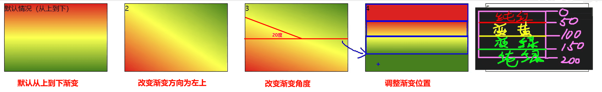

- 多个颜色之间的渐变， 默认**从上到下** 渐变
  ```css
  background-image: linear-gradient(red,yellow,green);
  ```

- 使用关键词设置线性 **渐变的方向**。
  ```css
  background-image: linear-gradient(to right top,red,yellow,green)
  ```

- 使用角度设置线性 **渐变的方向**。
  ```css
  background-image: linear-gradient(20deg,red,yellow,green);
  ```

- 调整开始 **渐变的位置**。
  ```css
  background-image: linear-gradient(red 50px,yellow 100px ,green 150px);
  ```

### 8.2 径向渐变

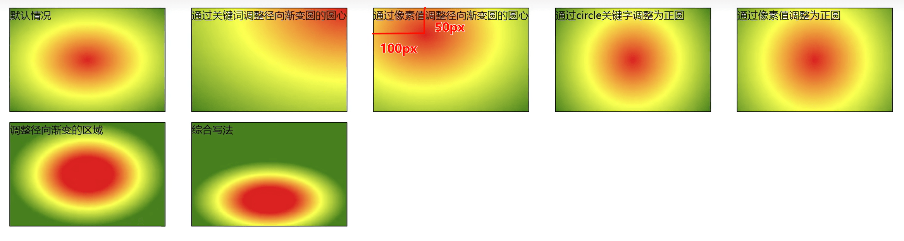

- 多个颜色之间的渐变， 默认 **从圆心四散**。（注意：不一定是正圆，要看容器本身宽高比）
  ```css
  background-image: radial-gradient(red,yellow,green);
  ```

- 使用 **关键词** 调整渐变圆的 **圆心位置**。
  ```css
  background-image: radial-gradient(at right top,red,yellow,green);
  ```

- 使用 **像素值** 调整渐变圆的 **圆心位置**
  ```css
  background-image: radial-gradient(at 100px 50px,red,yellow,green);
  ```

- 调整渐变形状为 **正圆** 。
  ```css
  background-image: radial-gradient(circle,red,yellow,green);
  ```

- 调整形状的 **半径** 。
  ```css
  background-image: radial-gradient(100px,red,yellow,green);
  background-image: radial-gradient(50px 100px,red,yellow,green);
  ```

- 调整开始 **渐变的位置**。 
  ```css
  background-image: radial-gradient(red 50px,yellow 100px,green 150px);
  ```

- 综合写法
  ```css
  background-image: radial-gradient(100px 50px at 150px 150px,red 50px,yellow 100px,green 150px);
  ```

### 8.3 重复渐变

无论线性渐变，还是径向渐变，**在没有发生渐变的位置**，继续进行渐变，就为重复渐变。

- 使用 `repeating-linear-gradient` 进行重复线性渐变，具体参数同 `linear-gradient` 。
- 使用 `repeating-radial-gradient` 进行重复径向渐变，具体参数同 `radial-gradient` 。

> 我们可以利用渐变，做出很多有意思的效果：例如：横格纸、立体球等等。


## 9. web 字体

### 9.1 基本用法

可以通过 `@font-face` 指定字体的具体地址，浏览器会自动下载该字体，这样就不依赖用户电脑上的字体了。

- 语法（简写方式）
  ```css
  @font-face {
      font-family: "情书字体";
      src: url('./方正手迹.ttf');
  }
  ```

- 语法（高兼容性写法）
  ```css
  @font-face {
      font-family: "webfont";
      font-display: swap;
      src: url('webfont.eot'); /* IE9 */
      src: url('webfont.eot?#iefix') format('embedded-opentype'), /* IE6-IE8 */
          url('webfont.woff2') format('woff2'),
          url('webfont.woff') format('woff'), /* chrome、firefox */
          url('webfont.ttf') format('truetype'), /* chrome、firefox、opera、Safari,Android*/
  	url('webfont.svg#webfont') format('svg'); /* iOS 4.1- */
  }
  ```

### 9.2 定制字体

- 中文的字体文件很大，使用完整的字体文件不现实，通常针对某几个文字进行单独定制。

- 可使用阿里 Web 字体定制工具：**https://www.iconfont.cn/webfont**

### 9.3 字体图标

- 相比图片更加清晰。
- 灵活性高，更方便改变大小、颜色、风格等。
- 兼容性好， IE 也能支持。

> 字体图标的具体使用方式，每个平台不尽相同，最好参考平台使用指南。
>
> 阿里图标官网地址：**https://www.iconfont.cn/**


## 10. 2D变换

### 10.1. 2D位移

`2D` 位移可以改变元素的位置，具体使用方式如下：

1. 先给元素添加 **转换属性** `transform`

2. 编写 `transform` 的具体值，相关可选值如下：

   | 值           | 含义                                                         |
   | ------------ | ------------------------------------------------------------ |
   | `translateX` | 设置水平方向位移，需指定长度值；若指定的是百分比，是参考自身宽度的百分比。 |
   | `translateY` | 设置垂直方向位移，需指定长度值；若指定的是百分比，是参考自身高度的百分比。 |
   | `translate ` | 一个值代表水平方向，两个值代表：水平和垂直方向。             |

3. 注意点：

   > 1. 位移与相对定位很相似，都不脱离文档流，不会影响到其它元素。
   > 2. 与相对定位的区别：相对定位的百分比值，参考的是其父元素；位移的百分比值，参考的是其自身。
   >
   > 3. 浏览器针对位移有优化，与定位相比，浏览器处理位移的效率更高。
   >
   > 4. `transform` 可以链式编写，例如：
   >
   >    ```css
   >    transform: translateX(30px) translateY(40px);
   >    ```
   >
   > 5. <span style="color: red;font-weight: 700;">位移对行内元素无效。</span>
   >
   > 6. 位移配合定位，可实现元素水平垂直居中。
   >    ```css
   >    .box {
   >        position: absolute;
   >        left: 50%;
   >        top: 50%;
   >        transform: translate(-50%, -50%);
   >    }
   >    ```

### 10.2. 2D缩放

`2D` 缩放是指：让元素放大或缩小，具体使用方式如下：

1.  先给元素添加 转换属性 `transform`

2. 编写 `transform` 的具体值，相关可选值如下：

   | 值       | 含义                                                         |
   | -------- | ------------------------------------------------------------ |
   | `scaleX` | 设置水平方向的缩放比例，值为一个数字， `1` 表示不缩放，大于 `1` 放大，小于 `1` 缩小。 |
   | `scaleY` | 设置垂直方向的缩放比例，值为一个数字， `1` 表示不缩放，大于 `1` 放大，小于 `1` 缩小。 |
   | `scale`  | 同时设置水平方向、垂直方向的缩放比例，一个值代表同时设置水平和垂直缩放；两个值分别代表：水平缩放、垂直缩放。 |

3. 注意点：

   > 1. `scale`的值，是支持写负数的，但几乎不用，因为容易让人产生误解。
   > 2. 借助缩放，可实现小于 `12px` 的文字。
   > 3. 对行内元素无效。

### 10.3. 2D旋转

`2D` 旋转是指：让元素在二维平面内，顺时针旋转或逆时针旋转，具体使用方式如下：

1. 先给元素添加 转换属性 `transform`

2. 编写 `transform` 的具体值，相关可选值如下：

   | 值       | 含义                                                         |
   | -------- | ------------------------------------------------------------ |
   | `rotate` | 设置旋转角度，需指定一个角度值( `deg` )，正值顺时针，负值逆时针。 |

> 注意： `rotateZ(20deg)` 相当于 `rotate(20deg)` ，当然到了 `3D` 变换的时候，还能写：
> `rotate(x,x,x)`

### 10.4. 2D扭曲（了解）

`2D` 扭曲是指：让元素在二维平面内被“拉扯”，进而“走形”，实际开发几乎不用，了解即可，具体使用方
式如下：

1. 先给元素添加 **转换属性** `transform`
2. 编写 `transform` 的具体值，相关可选值如下：

   | 值       | 含义                                                         |
   | -------- | ------------------------------------------------------------ |
   | `skewX`  | 设置元素在水平方向扭曲，值为角度值，会将元素的左上角、右下角 `左右拉扯` 。 |
   | `skewY ` | 设置元素在垂直方向扭曲，值为角度值，会将元素的左上角、右下角 `上下拉扯` 。 |
   | `skew`   | 一个值代表 `skewX` ，两个值分别代表： `skewX` 、 `skewY`     |

### 10.5. 多重变换

多个变换，可以同时使用一个 `transform` 来编写。

```css
transform: translate(-50%, -50%) rotate(45deg);
```

> 注意点：多重变换时，建议最后旋转。因为旋转后坐标系也会跟着旋转。

### 10.6. 变换原点

- 元素变换时，默认的原点是元素的中心，使用 `transform-origin` 可以设置变换的原点。
- 修改变换原点对位移没有影响， 对旋转和缩放会产生影响。
- 如果提供两个值，第一个用于横坐标，第二个用于纵坐标。
- 如果只提供一个，若是像素值，表示横坐标，纵坐标取 `50%` ；若是关键词，则另一个坐标取 `50%`

> 1. `transform-origin: 50% 50%` ， 变换原点在元素的中心位置，百分比是相对于自身。—— 默认值
> 2. `transform-origin: left top` ，变换原点在元素的左上角 。
> 3. `transform-origin: 50px 50px` ， 变换原点距离元素左上角 `50px 50px` 的位置。
> 4. `transform-origin: 0` ，只写一个值的时候，第二个值默认为 `50%` 。


## 11. 3D变换

### 11.1. 开启3D空间

重要原则：元素进行 `3D` 变换的首要操作：<span style="color: red;font-weight: 700;">父元素</span> 必须开启 `3D` 空间！

> 使用 `transform-style` 开启 3D 空间，可选值如下：
>
> - `flat` ： 让子元素位于此元素的二维平面内（ `2D` 空间）—— 默认值
> - `preserve-3d` ： 让子元素位于此元素的三维空间内（ `3D` 空间）

### 11.2. 设置景深

何为景深？—— 指定观察者与 `z=0` 平面的距离，能让发生 `3D` 变换的元素，产生 **透视效果(近大远小)**，看来更加立体。

> 使用 `perspective` 设置景深，可选值如下：
>
> - `none` ： 不指定透视 ——（默认值）
> - 长度值 ： 指定观察者距离 `z=0` 平面的距离，不允许负值。
>
> 注意： `perspective` 设置给发生 `3D` 变换元素的 <span style="color: red;font-weight: 700;">父元素</span>！

### 11.3. 透视点位置

所谓透视点位置，就是观察者位置；默认的透视点在元素的中心。

> 使用 `perspective-origin` 设置观察者位置（透视点的位置），例如：
>
> ```css
> /* 相对坐标轴往右偏移400px， 往下偏移300px（相当于人蹲下300像素，然后向右移动400像素看元素）*/
> perspective-origin: 400px 300px;
> ```
>
> 注意：通常情况下，我们不需要调整透视点位置。

### 11.4. 3D 位移

`3D` 位移是在 `2D` 位移的基础上，可以让元素沿 `z` 轴位移，具体使用方式如下：

1. 先给元素添加 **转换属性** `transform`

2. 编写 `transform` 的具体值， `3D` 相关可选值如下：

   | 值            | 含义                                                         |
   | ------------- | ------------------------------------------------------------ |
   | `translateZ`  | 设置 `z` 轴位移，需指定长度值，正值向屏幕外，负值向屏幕里，且不能写百分比。 |
   | `translate3d` | 第`1`个参数对应 `x` 轴，第`2`个参数对应 `y` 轴，第`3`个参数对应 `z` 轴，且均不能省略。 |

### 11.5. 3D 旋转

`3D` 旋转是在 `2D` 旋转的基础上，可以让元素沿 `x` 轴和 `y` 轴旋转，具体使用方式如下：

1. 先给元素添加 转换属性 transform
2. 编写 transform 的具体值， 3D 相关可选值如下：

   | 值         | 含义                                                         |
   | ---------- | ------------------------------------------------------------ |
   | `rotateX`  | 设置 `x` 轴旋转角度，需指定一个角度值( `deg` )，面对 `x` 轴正方向：正值顺时针，负值逆时针。 |
   | `rotateY`  | 设置 `y` 轴旋转角度，需指定一个角度值( `deg` )，面对 `y` 轴正方向：正值顺时针，负值逆时针。 |
   | `rotate3d` | 前 3 个参数分别表示坐标轴： `x` , `y` , `z` ，第 `4` 个参数表示旋转的角度，参数不允许省略。<br/>例如： `transform: rotate3d(1,1,1,30deg)`，意思是： `x` 、 `y` 、 `z` 分别旋转`30`度。 |

### 11.6. 3D 缩放
`3D` 缩放是在 `2D` 缩放的基础上，可以让元素沿 `z` 轴缩放，具体使用方式如下：

   1. 先给元素添加 **转换属性** `transform`

   2. 编写 `transform` 的具体值， `3D` 相关可选值如下：

      | 值        | 含义                                                         |
      | --------- | ------------------------------------------------------------ |
      | `scaleZ`  | 设置 `z` 轴方向的缩放比例，值为一个数字， `1` 表示不缩放，大于 `1` 放大，小于 `1` 缩小。 |
      | `scale3d` | 第`1`个参数对应 `x` 轴，第`2`个参数对应 `y` 轴，第`3`个参数对应 `z` 轴，参数不允许省略。 |

> 二维空间中`scaleZ()`沿 Z 轴的缩放变换看不到效果，只有再旋转之后才能看到变化。

###   11.7. 多重变换

   多个变换，可以同时使用一个 `transform` 来编写。

   ```css
   transform: translateZ(100px) scaleZ(3) rotateY(40deg);
   ```

   > 注意点：多重变换时，建议最后旋转。

### 11.8. 背部可见性

使用 `backface-visibility` 指定元素背面，在面向用户时是否可见，常用值如下：

- `visible` ： 指定元素背面可见，允许显示正面的镜像。—— 默认值
- `hidden` ： 指定元素背面不可见

> 注意： `backface-visibility` 需要加在发生 `3D` 变换元素的自身上。


## 12. 过渡

过渡可以在不使用 `Flash` 动画，不使用 `JavaScript` 的情况下，让元素从一种样式，平滑过渡为另一
种样式。

### 12.1. transition-property

- 作用：定义哪个属性需要过渡，只有在该属性中定义的属性（比如宽、高、颜色等）才会以有过渡
  效果。
- 常用值：
  1. `none` ：不过渡任何属性。
  2. `all` ：过渡所有能过渡的属性。
  3. 具体某个属性名 ，例如： `width` 、 `heigth`、`backgroup-color` ，若有多个以逗号分隔。

> 不是所有的属性都能过渡，值为数字，或者值能转为数字的属性，都支持过渡，否则不支持过渡。
> 常见的支持过渡的属性有：颜色、长度值、百分比、 `z-index` 、 `opacity` 、 `2D` 变换属性、 `3D` 变换属性、阴影。

### 12.2. transition-duration

- 作用：设置过渡的持续时间，即：一个状态过渡到另外一个状态耗时多久。
- 常用值：
  1. `0` ：没有任何过渡时间 —— 默认值。
  2. `s` 或 `ms` ：秒或毫秒。
  3. `列表` ：
     - 如果想让所有属性都持续一个时间，那就写一个值。
     - 如果想让每个属性持续不同的时间那就写一个时间的列表。

### 12.3. transition-delay

作用：指定开始过渡的延迟时间，单位： `s` 或 `ms`。

### 12.4. transition-timing-function

- 作用：设置过渡的类型
- 常用值：
  1. `ease` ： 平滑过渡 —— 默认值
  2. `linear` ： 线性过渡
  3. `ease-in` ： 慢 → 快
  4. `ease-out` ： 快 → 慢
  5. `ease-in-out` ： 慢 → 快 → 慢
  6. `step-start` ： 不考虑过渡时间瞬间到达终点，等同于 `steps(1, start)`
  7. `step-end` ： 过渡时间到了瞬间到达终点，等同于 `steps(1, end)`
  8. `steps( integer,?)` ： 接受两个参数的步进函数。第一个参数必须为正整数，指定函数的
     步数。第二个参数取值可以是 `start` 或 `end` ，指定每一步的值发生变化的时间点。第二个
     参数默认值为 `end` 。
  9. `cubic-bezie ( number, number, number, number)`： 特定的贝塞尔曲线类型。

> 在线制作贝赛尔曲线：https://cubic-bezier.com

### 12.5. transition 复合属性

- 如果设置了一个时间，表示 duration ；如果设置了两个时间，第一是 duration ，第二个是delay ；其他值没有顺序要求。

  ```css
  transition:1s 1s linear all;
  ```


## 13. 动画

### 13.1. 什么是帧

- 一段动画，就是一段时间内连续播放 `n` 个画面。每一张画面，我们管它叫做“帧”。一定时间内连续快速播放若干个帧，就成了人眼中所看到的动画。同样时间内，播放的帧数越多，画面看起来越流畅。


### 13.2. 什么是关键帧

- 关键帧指的是，在构成一段动画的若干帧中，起到决定性作用的 `2-3` 帧。

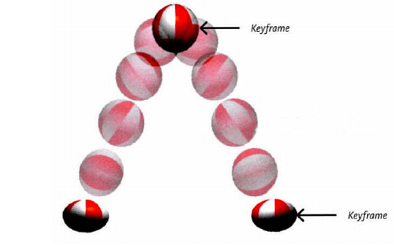

### 13.3. 动画的基本使用

- 第一步：定义关键帧（定义动画）

  1. 简单方式定义：
     ```css
     /*写法一*/
     @keyframes 动画名 {
         /*第一帧*/
     	from {
             /*property1:value1*/
             /*property2:value2*/
         }
         /*最后一帧*/
         to {
         	/*property1:value1*/
         }
     }
     ```

  2. 完整方式定义：
     ```css
     @keyframes 动画名 {
         0% {
         	/*property1:value1*/
         }
         20% {
         	/*property1:value1*/
         }
         40% {
         	/*property1:value1*/
         }
         60% {
         	/*property1:value1*/
         }
         80% {
         	/*property1:value1*/
         }
         100% {
         	/*property1:value1*/
         }
     }
     ```

- 第二步：给元素应用动画，用到的属性如下：

  1. `animation-name` ：给元素指定具体的动画（具体的关键帧）

  2. `animation-duration` ：设置动画所需时间

  3. `animation-delay` ：设置动画延迟

     ```css
     .box {
         /* 指定动画 */
         animation-name: testKey;
         /* 设置动画所需时间 */
         animation-duration: 5s;
         /* 设置动画延迟 */
         animation-delay: 0.5s;
     }
     ```

### 13.4. 动画的其他属性

- `animation-timing-function` ，设置动画的类型，常用值如下：

  > 1. `ease` ： 平滑动画 —— 默认值
  > 2. `linear` ： 线性过渡
  > 3. `ease-in` ： 慢 → 快
  > 4. `ease-out` ： 快 → 慢
  > 5. `ease-in-out` ： 慢 → 快 → 慢
  > 6. `step-start` ： 等同于 `steps(1, start)`
  > 7. `step-end` ： 等同于 `steps(1, end)`
  > 8. `steps( integer,?)` ： 接受两个参数的步进函数。第一个参数必须为正整数，指定
  > 函数的步数。第二个参数取值可以是 `start` 或 `end` ，指定每一步的值发生变化的时间
  > 点。第二个参数默认值为 `end` 。
  > 9. `cubic-bezie ( number, number, number, number)`： 特定的贝塞尔曲线类型

- `animation-iteration-count` ，指定动画的播放次数，常用值如下：

  > 1. number ：动画循环次数
  > 2. infinite ： 无限循环 

- `animation-direction` ，指定动画方向，常用值如下：

  > 1. `normal` ： 正常方向 (默认)
  > 2. `reverse` ： 反方向运行
  > 3. `alternate` ： 动画先正常运行再反方向运行，并持续交替运行
  > 4. `alternate-reverse` ： 动画先反运行再正方向运行，并持续交替运行

- `animation-fill-mode` ，设置动画之外的状态

  > 1. `forwards` ： 设置对象状态为动画结束时的状态
  > 2. `backwards` ： 设置对象状态为动画开始时的状态 (默认)

- `animation-play-state` ，设置动画的播放状态，常用值如下：

  > 1. `running` ： 运动 (默认)
  > 2. `paused` ： 暂停

### 13.5. 动画复合属性

只设置一个时间表示 `duration` ，设置两个时间分别是： `duration` 和 `delay` ，其他属性没有数量和顺序要求。

```css
.inner {
	animation: yage 3s 0.5s linear 2 alternate-reverse forwards;
}
```

> 备注： `animation-play-state` 一般单独使用。


## 14. 多列布局


常用属性如下：

- `column-count` ：指定列数，值是数字。
- `column-width` ：指定列宽，值是长度。
- `columns` ：同时指定列宽和列数，复合属性；值没有数量和顺序要求。
- `column-gap` ：设置列边距，值是长度。
- `column-rule-style` ：设置列与列之间边框的风格，值与 `border-style` 一致。
- `column-rule-width` ：设置列与列之间边框的宽度，值是长度。
- `column-rule-color` ：设置列与列之间边框的颜色。
- `coumn-rule` ：设置列边框，复合属性。
- `column-span` 指定是否跨列；值: `none` 、 `all` 。


## 15. 伸缩盒模型

### 15.1. 伸缩盒模型简介

- `2009` 年， W3C 提出了一种新的盒子模型 —— `Flexible Box` （伸缩盒模型，又称：弹性盒子）。
- 它可以轻松的控制：元素分布方式、元素对齐方式、元素视觉顺序 .......
- 截止目前，除了在部分 `IE` 浏览器不支持，其他浏览器均已全部支持。
- 伸缩盒模型的出现，逐渐演变出了一套新的布局方案 —— `flex` 布局。

> 小贴士：
> 1. 传统布局是指：基于传统盒状模型，主要靠： `display` 属性 + `position` 属性 + `float`属性。
> 2. `flex` 布局目前在移动端应用比较广泛，因为传统布局不能很好的呈现在移动设备上。

### 15.2. 伸缩容器、伸缩项目

- 伸缩容器： 开启了 `flex` 的元素，就是：伸缩容器。

  > 1. 给元素设置： `display:flex` 或 `display:inline-flex` ，该元素就变为了伸缩容器。
  > 2. `display:inline-flex` 很少使用，因为可以给多个伸缩容器的父容器，也设置为伸缩容器。
  > 3. 一个元素可以同时是：伸缩容器、伸缩项目。

- 伸缩项目：伸缩容器所有 <span style="color: red;font-weight: 700;">子元素</span> 自动成为了：伸缩项目。

  > 1. 仅伸缩容器的<span style="color: red;font-weight: 700;">子元素</span>成为了伸缩项目，孙子元素、重孙子元素等后代，不是伸缩项目。
  > 2. 无论原来是哪种元素（块、行内块、行内），一旦成为了伸缩项目，全都会“**块状化**”。

### 15.3. 主轴与侧轴

- 主轴： 伸缩项目沿着主轴排列，主轴默认是水平的，默认方向是：从左到右（左边是起点，右边是终点）。
- 侧轴： 与主轴垂直的就是侧轴，侧轴默认是垂直的，默认方向是：从上到下（上边是起点，下边是终点）。

### 15.4. 主轴方向

- 属性名： `flex-direction`
- 常用值如下：
  1. `row` ：主轴方向水平从左到右 —— 默认值
  2. `row-reverse` ：主轴方向水平从右到左。
  3. `column` ：主轴方向垂直从上到下。
  4. `column-reverse` ：主轴方向垂直从下到上。

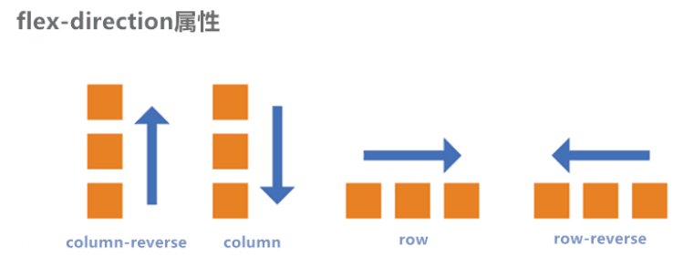

> 注意：改变了主轴的方向，侧轴方向也随之改变。

### 15.5. 主轴换行方式

- 属性名： `flex-wrap`
- 常用值如下：
  1. `nowrap` ：默认值，不换行。
     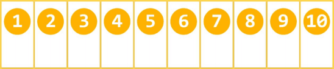
  2. `wrap` ：自动换行，伸缩容器不够自动换行。
     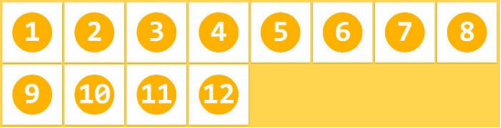
  3. `wrap-reverse` ：反向换行。
     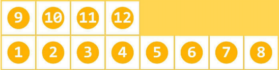

### 15.6. flex-flow

- `flex-flow` 是一个复合属性，复合了 `flex-direction` 和 `flex-wrap` 两个属性。 值没有顺序要
  求。

  ```css
  flex-flow: row wrap;
  ```

### 15.7. 主轴对齐方式

- 属性名： `justify-content`
- 常用值如下：
  1. `flex-start` ：主轴起点对齐。—— 默认值
  2. `flex-end` ：主轴终点对齐。
  3. `center` ：居中对齐
  4. `space-between` ：均匀分布，两端对齐（最常用）。
  5. `space-around` ：均匀分布，两端距离是中间距离的一半。
  6. `space-evenly` ：均匀分布，两端距离与中间距离一致。

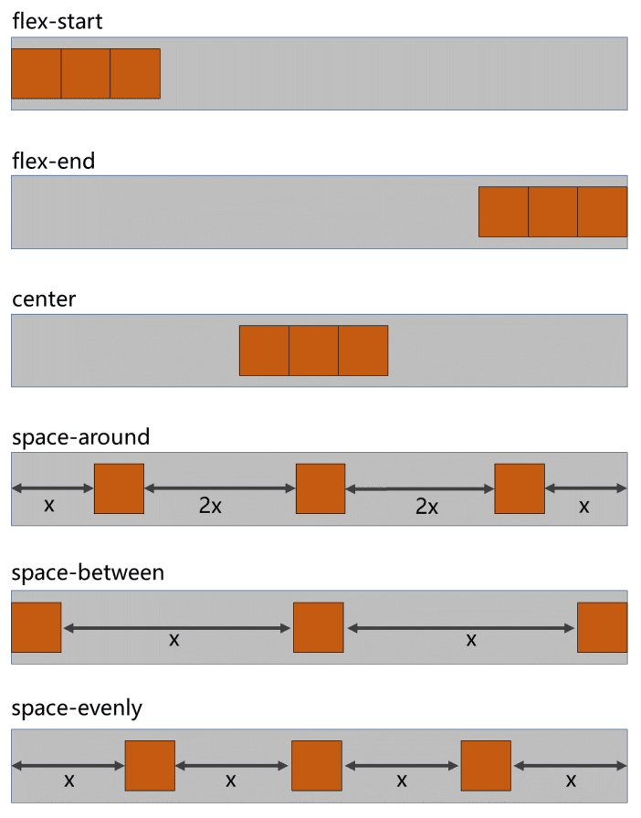

### 15.8. 侧轴对齐方式

####  1. 一行的情况

- 所需属性： `align-items`
- 常用值如下：
  1. `flex-start` ：侧轴的起点对齐。
  2. `flex-end` ：侧轴的终点对齐。
  3. `center` ：侧轴的中点对齐。
  4. `baseline` : 伸缩项目的第一行文字的基线对齐。
  5. `stretch` ：如果伸缩项目未设置高度，将占满整个容器的高度。—— （默认值）

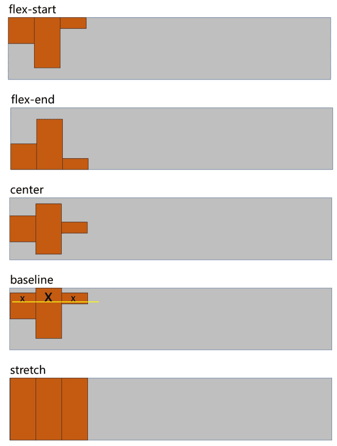

#### 2. 多行的情况

- 所需属性： `align-content`
- 常用值如下：
  1. `flex-start` ：与侧轴的起点对齐。
  2. `flex-end` ：与侧轴的终点对齐。
  3. `center` ：与侧轴的中点对齐。
  4. `space-between` ：与侧轴两端对齐，中间平均分布。
  5. `space-around` ：伸缩项目间的距离相等，比距边缘大一倍。
  6. `space-evenly` : 在侧轴上完全平分。
  7. `stretch` ：占满整个侧轴。—— 默认值

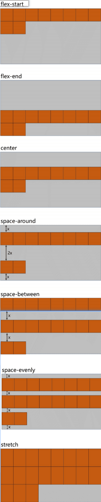

### 15.9.flex 实现水平垂直居中

方法一：父容器开启 `flex` 布局，随后使用 `justify-content` 和 `align-items` 实现水平垂直居中
```css
.outer {
    width: 400px;
    height: 400px;
    background-color: #888;
    display: flex;
    justify-content: center;
    align-items: center;
}
.inner {
    width: 100px;
    height: 100px;
    background-color: orange;
}
```

方法二：父容器开启 `flex` 布局，随后子元素 `margin: auto`
```css
.outer {
    width: 400px;
    height: 400px;
    background-color: #888;
    display: flex;
}
.inner {
    width: 100px;
    height: 100px;
    background-color: orange;
    margin: auto;
}
```

### 15.10. 伸缩性

#### 1. flex-basis

- 概念： `flex-basis` 设置的是主轴方向的 **基准长度**，会让宽度或高度失效。

  > 备注：主轴横向：宽度失效；主轴纵向：高度失效

- 作用：浏览器根据这个属性设置的值，计算主轴上是否有多余空间，默认值 `auto` ，即：伸缩项目的宽或高。

#### 2. flex-grow（伸）

- 概念： `flex-grow` 定义伸缩项目的放大比例，默认为 `0` ，即：纵使主轴存在剩余空间，也不拉伸（放大）。
- 规则：
  1. 若所有伸缩项目的 `flex-grow` 值都为 `1` ，则：它们将等分剩余空间（如果有空间的话）。
  2. 若三个伸缩项目的 `flex-grow` 值分别为： `1` 、 `2` 、 `3` ，则：分别瓜分到： `1/6` 、 `2/6` 、`3/6` 的空间。

#### 3. flex-shrink（缩）

- 概念： `flex-shrink` 定义了项目的压缩比例，默认为 `1` ，即：如果空间不足，该项目将会缩小。

- 收缩项目的计算，略微复杂一点，我们拿一个场景举例：

  > 三个收缩项目，宽度分别为： `200px` 、 `300px` 、 `200px` ，它们的 `flex-shrink` 值分别
  > 为： `1` 、 `2` 、 `3`
  > 若想刚好容纳下三个项目，需要总宽度为 `700px` ，但目前容器只有 `400px` ，还差 `300px`
  > 所以每个人都要收缩一下才可以放下，具体收缩的值，这样计算：
  >
  > 1. 计算分母： `(200×1) + (300×2) + (200×3) = 1400`
  > 2. 计算比例：
  >   - 项目一： `(200×1) / 1400 = 比例值1`
  >   - 项目二： `(300×2) / 1400 = 比例值2`
  >   - 项目三：` (200×3) / 1400 = 比例值3`
  > 3. 计算最终收缩大小：
  >   - 项目一需要收缩： `比例值1 × 300`
  >   - 项目二需要收缩： `比例值2 × 300`
  >   - 项目三需要收缩： `比例值3 × 300`

### 15.11. flex复合属性

`flex` 是复合属性，复合了： `flex-grow` 、 `flex-shrink` 、 `flex-basis` 三个属性，默认值为 `0 1 auto` 。

- 如果写 `flex:1 1 auto` ，则可简写为： `flex:auto`
- 如果写 `flex:1 1 0` ，则可简写为： `flex:1`
- 如果写 `flex:0 0 auto` ，则可简写为： `flex:none`
- 如果写 `flex:0 1 auto` ，则可简写为： `flex:0 auto` —— 即 `flex` 初始值。

### 15.12. 项目排序

- `order` 属性定义项目的排列顺序。数值越小，排列越靠前，默认为 `0` 。

### 15.13. 单独对齐

- 通过 `align-self` 属性，可以单独调整某个伸缩项目的对齐方式
- 默认值为 `auto` ，表示继承父元素的 `align-items` 属性。


## 16. 响应式布局

### 16.1 媒体查询

#### 1. 媒体类型

| 值                                                             | 含义                                                                                      |
| ------------------------------------------------------------- | --------------------------------------------------------------------------------------- |
| `all`                                                         | 检测所有设备。                                                                                 |
| `screen `                                                     | 检测电子屏幕，包括：电脑屏幕、平板屏幕、手机屏幕等。                                                              |
| `print`                                                       | 检测打印机。                                                                                  |
| <span style="color: grey;font-weight: 700;">aural</span>      | <span style="color: grey;font-weight: 700;">已废弃，用于语音和声音合成器。</span>                      |
| <span style="color: grey;font-weight: 700;">braille</span>    | <span style="color: grey;font-weight: 700;">已废弃，应用于盲文触摸式反馈设备</span>                     |
| <span style="color: grey;font-weight: 700;">embossed </span>  | <span style="color: grey;font-weight: 700;">已废弃， 用于打印的盲人印刷设备。</span>                    |
| <span style="color: grey;font-weight: 700;">handheld </span>  | <span style="color: grey;font-weight: 700;">已废弃， 用于掌上设备或更小的装置，如PDA和小型电话。</span>         |
| <span style="color: grey;font-weight: 700;">projection</span> | <span style="color: grey;font-weight: 700;">已废弃， 用于投影设备。</span>                         |
| <span style="color: grey;font-weight: 700;">tty </span>       | <span style="color: grey;font-weight: 700;">已废弃， 用于固定的字符网格，如电报、终端设备和对字符有限制的便携设备。</span> |
| <span style="color: grey;font-weight: 700;">tv</span>         | <span style="color: grey;font-weight: 700;">已废弃， 用于电视和网络电视。</span>                      |

> 完整列表请参考：https://developer.mozilla.org/zh-CN/docs/Web/CSS/@media

#### 2 媒体特性

| 值                 | 含义                                                         |
| ------------------ | ------------------------------------------------------------ |
| `width`            | 检测视口 **宽度。**                                          |
| `max-width`        | 检测视口 **最大宽度。**                                      |
| `min-width`        | 检测视口 **最小宽度。**                                      |
| `height`           | 检测视口 **高度。**                                          |
| `max-height`       | 检测视口 **最大高度。**                                      |
| `min-height`       | 检测视口 **最小高度。**                                      |
| `device-width`     | 检测设备 **屏幕的宽度。**                                    |
| `max-device-width` | 检测设备 **屏幕的最大宽度。**                                |
| `min-device-width` | 检测设备 **屏幕的最小宽度。**                                |
| `orientation`      | 检测 **视口的旋转方向**（是否横屏）<br />1. `portrait`：视口处于纵向，即高度大于等于宽度。<br />2. `landscape`：视口处于横向，即宽度大于高度。 |

> 完整列表请参考：https://developer.mozilla.org/zh-CN/docs/Web/CSS/@media

#### 3 运算符

| 值          | 含义 |
| ----------- | ---- |
| `and`       | 并且 |
| `,` 或 `or` | 或   |
| `not`       | 否定 |
| `only`      | 肯定 |

#### 4 常用阈值

在实际开发中，会将屏幕划分成几个区间，例如：

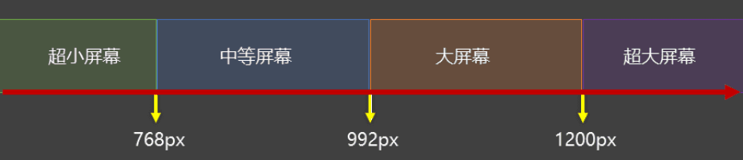

#### 5 结合外部样式的用法

**用法一：**

```css
<link rel="stylesheet" media="具体的媒体查询" href="mystylesheet.css">
```

**用法二：**

```css
@media screen and (max-width:768px) {
	/*CSS-Code;*/
}
@media screen and (min-width:768px) and (max-width:1200px) {
	/*CSS-Code;*/
}
```


## 17. BFC

### 17.1. 什么是BFC

- `W3C` 上对 `BFC` 的定义：

  > 原文：Floats, absolutely positioned elements, block containers (such as inline-blocks, tablecells, and table-captions) that are not block boxes, and block boxes with 'overflow' other than'visible' (except when that value has been propagated to the viewport) establish new block formatting contexts for their contents.
  >
  > <hr>
  >
  > 译文：浮动、绝对定位元素、不是块盒子的块容器（如 `inline-blocks` 、 `table-cells` 和
  > `table-captions` ），以及 `overflow` 属性的值除 `visible` 以外的块盒，将为其内容建立新
  > 的块格式化上下文。

- `MDN` 上对 `BFC` 的描述：

  > **块格式化上下文**（Block Formatting Context，BFC） 是 `Web` 页面的可视 `CSS` 渲染的一部分，是块盒子的布局过程发生的区域，也是浮动元素与其他元素交互的区域。

- 更加通俗的描述：

  > 1. `BFC` 是 `Block Formatting Context` （**块级格式上下文**），可以理解成元素的一个<span style="color: red;font-weight: 700;">“特异功能”</span>。
  > 2. 该 <span style="color: red;font-weight: 700;">“特异功能”</span>，在默认的情况下处于关闭状态；当元素满足了某些条件后，该“特异功能”被激活。
  > 3. 所谓激活<span style="color: red;font-weight: 700;">“特异功能”</span>，专业点说就是：该元素创建了 `BFC` （又称：开启了 `BFC `）。

### 17.2. 开启了BFC能解决什么问题

1. 元素开启 `BFC` 后，其子元素不会再产生 `margin` 塌陷问题。
2. 元素开启 `BFC` 后，自己不会被其他浮动元素所覆盖。
3. 元素开启 `BFC` 后，就算其子元素浮动，元素自身高度也不会塌陷。

### 17.3. 如何开启BFC

- 根元素
- 浮动元素
- 绝对定位、固定定位的元素
- 行内块元素
- 表格单元格： `table` 、 `thead` 、 `tbody` 、 `tfoot` 、 `th` 、 `td` 、 `tr` 、 `caption`
- `overflow` 的值不为 `visible` 的块元素
- 伸缩项目
- 多列容器
- `column-span` 为 `all` 的元素（即使该元素没有包裹在多列容器中）
- `display` 的值，设置为 `flow-root`
