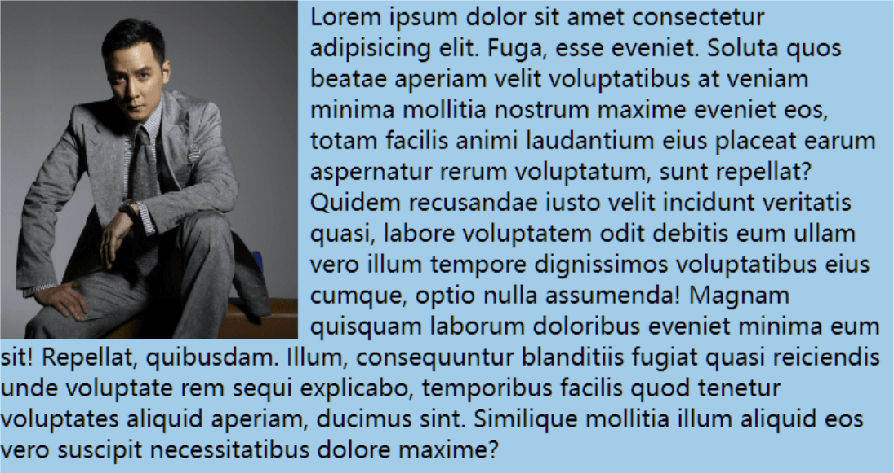

# 六、浮动

## 1. 浮动的简介

在最初，浮动是用来实现文字环绕图片效果的，现在浮动是主流的页面布局方式之一。




## 2. 元素浮动后的特点

1. 🤢脱离文档流。

2. 😊不管浮动前是什么元素，浮动后：默认宽与高都是被内容撑开（尽可能小），而且可以设置宽高。

3. 😊不会独占一行，可以与其他元素共用一行。
4. 😊不会 `margin` 合并，也不会 `margin` 塌陷，能够完美的设置四个方向的 margin 和 `padding` 。
5. 😊不会像行内块一样被当做文本处理（没有行内块的空白问题）。


## 3. 解决浮动产生的影响

### 3.1 元素浮动后会有哪些影响

**对兄弟元素的影响：** 后面的兄弟元素，会占据浮动元素之前的位置，在浮动元素的下面；对前面的兄弟无影响。

**对父元素的影响：** 不能撑起父元素的高度，导致父元素高度塌陷；但父元素的宽度依然束缚浮动的元素。

### 3.2 解决浮动产生的影响（清除浮动）

**解决方案：**

1. 方案一： 给父元素指定高度。

2. 方案二： 给父元素也设置浮动，带来其他影响。

3. 方案三： 给父元素设置 `overflow:hidden` 。

4. 方案四： 在所有浮动元素的最后面，添加一个块级元素，并给该块级元素设置 `clear:both` 。

5. **方案五**： 给浮动元素的父元素，设置伪元素，通过伪元素清除浮动，原理与方案四相同。===> 推荐使用

   ```css
   .parent::after {
       content: "";
       display: block;
       clear:both;
   }

> 布局中的一个原则：设置浮动的时候，兄弟元素要么全都浮动，要么全都不浮动。


## 4.浮动相关属性

| **CSS** **属性** | **功能**                                    | **属性值**                                                   |
| ---------------- | ------------------------------------------- | ------------------------------------------------------------ |
| `float`          | 设置浮动                                    | `left` : 设置左浮动<br/>`right` : 设置右浮动<br/>`none` ：不浮动，默认值 |
| `clear`          | 清除浮动<br/>清除前面兄弟元素浮动元素的响应 | `left` ：清除前面左浮动的影响<br/>`right` ：清除前面右浮动的影响<br/>`both` ：清除前面左右浮动的影响 |


