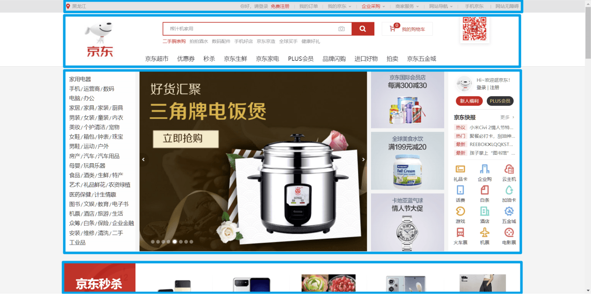

# 八、布局

## 1. 版心

- 在 `PC` 端网页中，一般都会有一个固定宽度且水平居中的盒子，来显示网页的主要内容，这是网页的**版心**。
- 版心的宽度一般是 `960 ~ 1200` 像素之间。
- 版心可以是一个，也可以是多个。
  


## 2. 常用布局名词

| **位置**           | 名词                             |
| ------------------ | -------------------------------- |
| 顶部导航条         | `topbar`                         |
| 页头               | `header`、 `page-header`         |
| 导航               | `nav` 、 `navigator` 、 `navbar` |
| 搜索框             | `search` 、 `search-box`         |
| 横幅、广告、宣传图 | `banner`                         |
| 主要内容           | `content` 、 `main`              |
| 侧边栏             | `aside` 、 `sidebar`             |
| 页脚               | `footer` 、 `page-footer`        |


## 3. 重置默认样式

很多元素都有默认样式，比如：

1. `p` 元素有默认的上下 `margin` 。
2. `h1~h6` 标题也有上下 `margin` ，且字体加粗。
3. `body` 元素有默认的 `8px` 外边距。
4. 超链接有默认的文字颜色和下划线。
5. `ul` 元素有默认的左 `pading` 。
6. .......

> 在早期，元素默认样式，能够让我们快速的绘制网页，但如今网页的设计越来越复杂，内容越来越
>
> 多，而且很精细，这些默认样式会给我们绘制页面带来麻烦；而且这些默认样式，在不同的浏览器
>
> 上呈现出来的效果也不一样，所以我们需要重置这些默认样式。

**方案一：使用全局选择器**

```css
* {
    margin: 0;
    padding: 0;
    ......
}
```

> 此种方法，在简单案例中可以用一下，但实际开发中不会使用，因为 `*` 选择的是所有元素，而并
>
> 不是所有的元素都有默认样式；而且我们重置时，有时候是需要做特定处理的，比如：想让 a 元
>
> 素的文字是灰色，其他元素文字是蓝色。

**方案二：reset.css**

选择到具有默认样式的元素，清空其默认的样式。

> 经过 `reset` 后的网页，好似“一张白纸”，开发人员可根据设计稿，精细的去添加具体的样式。

**方案三：Normalize.css**

`Normalize.css` 是一种最新方案，它在清除默认样式的基础上，保留了一些有价值的默认样式。

官网地址：**http://necolas.github.io/normalize.css/**

相对于 `reset.css` ， `Normalize.css` 有如下优点：

1. 保护了有价值的默认样式，而不是完全去掉它们。
2. 为大部分HTML元素提供一般化的样式。
3. 新增对 `HTML5` 元素的设置。
4. 对并集选择器的使用比较谨慎，有效避免调试工具杂乱。

> 备注： `Normalize.css` 的重置，和 `reset.css` 相比，更加的温和，开发时可根据实际情况进行
>
> 选择。


