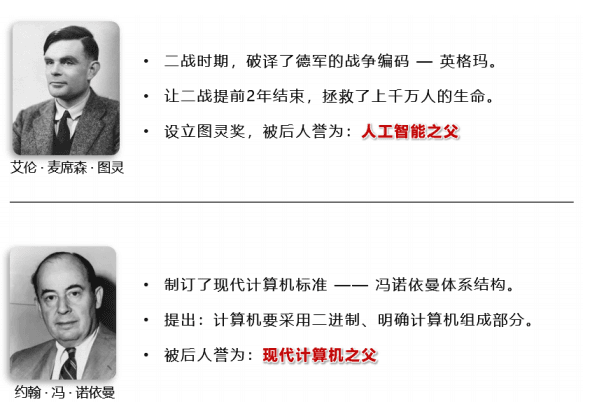
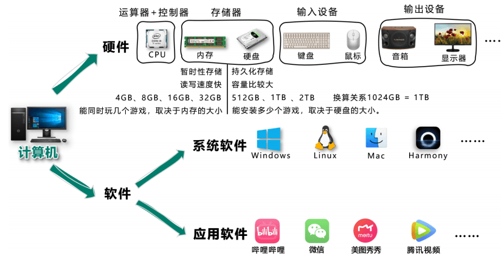
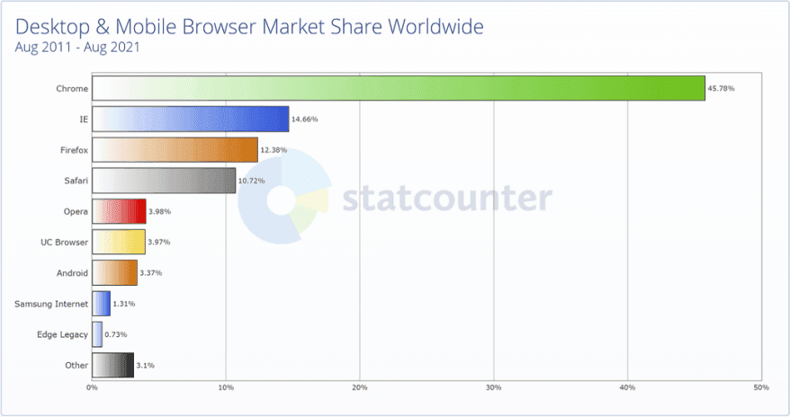
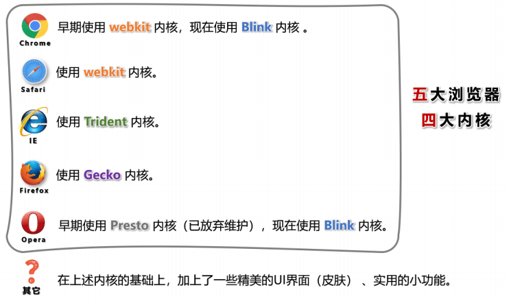
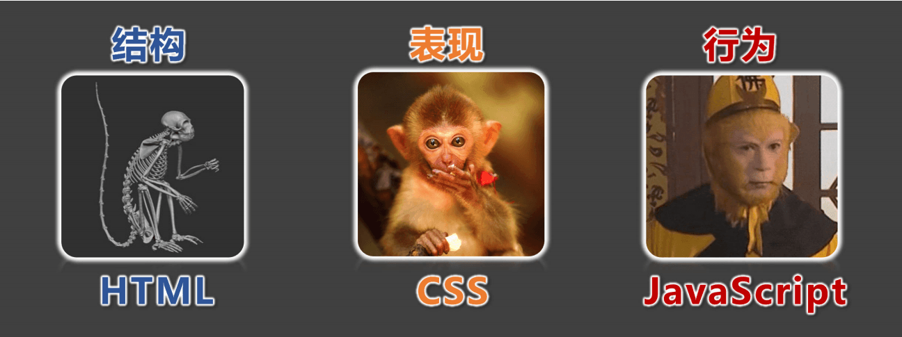

# 一、前序知识

## 1. 认识两位先驱

## 2. 计算机基础知识

1. **计算机** 俗称电脑，是现代一种用于高速计算的电子计算机器，可以进行数值计算、逻辑计算，还具有存储记忆功能。
2. 计算机由 **硬件 + 软件** 成：
硬件：看得见摸得着的物理部件。
软件：可以指挥硬件工作的指令。
3. 软件的分类：
   1. 系统软件：Windows、Linux、Android、Harmony 等。
   2. 应用软件：微信、QQ、王者荣耀、PhotoShop 等。
4. 整体图示：
   

## 3. C/S架构与B/S架构

1. 上面提到的应用软件，又分为两大类：

   - **C/S架构**，特点：需要安装、偶尔更新、不跨平台、开发更具针对性。
	- **B/S架构**，特点：无需安装、无需更新、可跨平台、开发更具通用性。

   > 名词解释：C => client（客户端）、B => browser（浏览器）、S => server（服务器）。
   > 服务器 ：为软件提供数据的设备（在背后默默的付出）。

2. 前端工程师，主要负责编写 B/S架构中的网页（呈现界面、实现交互）。

   > 备注：大前端时代，我们可以用前端的技术栈，做出一个C/S架构的应用、甚至搭建一个服务器😎。

## 4. 浏览器相关知识

浏览器是网页运行的平台，常见的浏览器有： `谷歌(Chrome)` 、 `Safari` 、 `IE` 、 `火狐(Firefox)` 、 `欧朋(Opera)` 等，以上这些是常用的五大浏览器。

1. **各大浏览器市场份额：**
   

2. **常见浏览器的内核：**
   

## 5. 网页相关概念

1. 网址：我们在浏览器中输入的地址。
2. 网页：浏览器所呈现的每一个页面。
3. 网站：多个网页构成了一个网站。
4. 网页标准：
   

