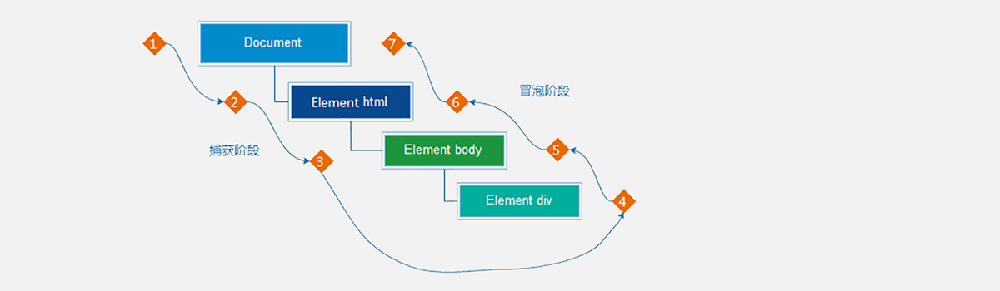

# 事件进阶

## 事件流

事件流是对事件执行过程的描述，了解事件的执行过程有助于加深对事件的理解，提升开发实践中对事件运用的灵活度。



如上图所示，任意事件被触发时总会经历两个阶段：【捕获阶段】和【冒泡阶段】。

简言之，捕获阶段是【从父到子】的传导过程，冒泡阶段是【从子向父】的传导过程。

### 捕获和冒泡

了解了什么是事件流之后，我们来看事件流是如何影响事件执行的：

```html
<body>
  <h3>事件流</h3>
  <p>事件流是事件在执行时的底层机制，主要体现在父子盒子之间事件的执行上。</p>
  <div class="outer">
    <div class="inner">
      <div class="child"></div>
    </div>
  </div>
  <script>
    // 获取嵌套的3个节点
    const outer = document.querySelector('.outer');
    const inner = document.querySelector('.inner');
    const child = document.querySelector('.child');
		
    // html 元素添加事件
    document.documentElement.addEventListener('click', function () {
      console.log('html...')
    })
		
    // body 元素添加事件
    document.body.addEventListener('click', function () {
      console.log('body...')
    })

    // 外层的盒子添加事件
    outer.addEventListener('click', function () {
      console.log('outer...')
    })
    
    // 中间的盒子添加事件
    outer.addEventListener('click', function () {
      console.log('inner...')
    })
    
    // 内层的盒子添加事件
    outer.addEventListener('click', function () {
      console.log('child...')
    })
  </script>
</body>
```

执行上述代码后发现，当单击事件触发时，其祖先元素的单击事件也【相继触发】，这是为什么呢？

结合事件流的特征，我们知道当某个元素的事件被触发时，事件总是会先经过其祖先才能到达当前元素，然后再由当前元素向祖先传递，事件在流动的过程中遇到相同的事件便会被触发。

再来关注一个细节就是事件相继触发的【执行顺序】，事件的执行顺序是可控制的，即可以在捕获阶段被执行，也可以在冒泡阶段被执行。

如果事件是在冒泡阶段执行的，我们称为冒泡模式，它会先执行子盒子事件再去执行父盒子事件，默认是冒泡模式。

如果事件是在捕获阶段执行的，我们称为捕获模式，它会先执行父盒子事件再去执行子盒子事件。

```html
<body>
  <h3>事件流</h3>
  <p>事件流是事件在执行时的底层机制，主要体现在父子盒子之间事件的执行上。</p>
  <div class="outer">
    <div class="inner"></div>
  </div>
  <script>
    // 获取嵌套的3个节点
    const outer = document.querySelector('.outer')
    const inner = document.querySelector('.inner')

    // 外层的盒子
    outer.addEventListener('click', function () {
      console.log('outer...')
    }, true) // true 表示在捕获阶段执行事件
    
    // 中间的盒子
    outer.addEventListener('click', function () {
      console.log('inner...')
    }, true)
  </script>
</body>
```

结论：

1. `addEventListener` 第3个参数决定了事件是在捕获阶段触发还是在冒泡阶段触发
2. `addEventListener` 第3个参数为  `true` 表示捕获阶段触发，`false` 表示冒泡阶段触发，默认值为 `false`
3. 事件流只会在父子元素具有相同事件类型时才会产生影响
4. 绝大部分场景都采用默认的冒泡模式（其中一个原因是早期 IE 不支持捕获）

### 阻止冒泡

阻止冒泡是指阻断事件的流动，保证事件只在当前元素被执行，而不再去影响到其对应的祖先元素。

```html
<body>
  <h3>阻止冒泡</h3>
  <p>阻止冒泡是指阻断事件的流动，保证事件只在当前元素被执行，而不再去影响到其对应的祖先元素。</p>
  <div class="outer">
    <div class="inner">
      <div class="child"></div>
    </div>
  </div>
  <script>
    // 获取嵌套的3个节点
    const outer = document.querySelector('.outer')
    const inner = document.querySelector('.inner')
    const child = document.querySelector('.child')

    // 外层的盒子
    outer.addEventListener('click', function () {
      console.log('outer...')
    })

    // 中间的盒子
    inner.addEventListener('click', function (ev) {
      console.log('inner...')

      // 阻止事件冒泡
      ev.stopPropagation()
    })

    // 内层的盒子
    child.addEventListener('click', function (ev) {
      console.log('child...')

      // 借助事件对象，阻止事件向上冒泡
      ev.stopPropagation()
    })
  </script>
</body>
```

结论：事件对象中的 `ev.stopPropagation` 方法，专门用来阻止事件流动传播，可以阻止捕获和冒泡。

>鼠标经过事件：
>
>mouseover 和 mouseout 会有冒泡效果
>
>mouseenter  和 mouseleave   没有冒泡效果 (推荐)

### 解绑事件

on事件方式，直接使用null覆盖偶就可以实现事件的解绑。

```js
// 绑定事件
btn.onclick = tunction () {
    alert('被点击了')
}

// 解绑事件
btn.onclick = null
```

addEventListener方式，必须使用：removeEventListener(事件类型, 事件处理函数, [获取捕获或者冒泡阶段])

```js
function fn () {
    alert('被点击了')
}

btn.addEventListener('click', fn)
btn.removeEventListener('click', fn)
```

> 匿名函数无法解绑

### 阻止默认行为

我们某些情况下需要阻止默认行为的发生，比如输入格式不对阻止表单域跳转等。

```html
<body>
  <form action="https://www.baidu.com">
    <input type="submit" value="注册">
  </form>

  <script>
    const form = document.querySelector('form')
    form.addEventListener('click', function(e){
      e.preventDefault()
    })
  </script>
</body>
```

## 事件委托

事件委托是利用事件流的特征解决一些现实开发需求的知识技巧，主要的作用是提升程序效率。

大量的事件监听是比较耗费性能的，如下代码所示

```html
<script>
  // 假设页面中有 10000 个 button 元素
  const buttons = document.querySelectorAll('table button');

  for(let i = 0; i <= buttons.length; i++) {
    // 为 10000 个 button 元素添加了事件
    buttons.addEventListener('click', function () {
      // 省略具体执行逻辑...
    })
  }
</script>
```

利用事件流的特征，可以对上述的代码进行优化，事件的的冒泡模式总是会将事件流向其父元素的，如果父元素监听了相同的事件类型，那么父元素的事件就会被触发并执行，正是利用这一特征对上述代码进行优化，如下代码所示：

```html
<script>
  // 假设页面中有 10000 个 button 元素
  let buttons = document.querySelectorAll('table button');
  
  // 假设上述的 10000 个 buttom 元素共同的祖先元素是 table
  let parents = document.querySelector('table');
  parents.addEventListener('click', function () {
    console.log('点击任意子元素都会触发事件...');
  })
</script>
```

我们的最终目的是保证只有点击 button 子元素才去执行事件的回调函数，如何判断用户点击是哪一个子元素呢？


事件对象中的属性 `target` 或 `srcElement`属性表示真正触发事件的元素，它是一个元素类型的节点。

```html
<script>
  // 假设页面中有 10000 个 button 元素
  const buttons = document.querySelectorAll('table button')
  
  // 假设上述的 10000 个 buttom 元素共同的祖先元素是 table
  const parents = document.querySelector('table')
  parents.addEventListener('click', function (e) {
    // e.target是点击的对象
    // 只有 button 元素才会真正去执行逻辑
    if(e.target.tagName === 'BUTTON') {
      // 执行的逻辑
    }
  })
</script>
```

优化过的代码只对祖先元素添加事件监听，相比对 10000 个元素添加事件监听执行效率要高许多！！！

## 其他事件

### 页面加载事件

加载外部资源（如图片、外联CSS和JavaScript等）加载完毕时触发的事件

有些时候需要等页面资源全部处理完了做一些事情

**事件名：load**

监听页面所有资源加载完毕：

~~~javascript
window.addEventListener('load', function() {
    // xxxxx
})
~~~

**事件名：DOMContentLoaded**

当初始的HTML文档被完全加载和解析完成之后，DOMContentLoaded事件被触发，而无需等待样式表、图像等完全加载：

```js
document.addEventListener('DOMContentLoaded', function() {
    // xxxxx
})
```

### 元素滚动事件

滚动条在滚动的时候持续触发的事件

scrollTop和scrollLeft属性可以获取被卷去的大小，**可读写**

~~~javascript
window.addEventListener('scroll', function() {
    // document.documentElement是获取html标签对象
    const n = document.documentElement.scrollTop
    div.style.display = n > 100 ? 'block' : 'none'
})
~~~

`scrollTo` 是 JavaScript 中的一个方法，用于滚动到指定的页面位置。第一个参数是横坐标，第二个参数是纵坐标。

```js
btn.addEventListener('click', function() {
    const n = document.documentElement.scrollTop
    window.scrollTo(0, 0)
    // 也可以直接调用scrollTop
    // document.documentElement.scrollTop = 0
})
```

### 页面尺寸事件

会在窗口尺寸改变的时候触发事件：

~~~javascript
window.addEventListener('resize', function() {
    // xxxxx
})
~~~

## 元素尺寸与位置

### 获取宽高

`clientHeight`和`clientWidth`属性获取元素可见部分的宽高，包括padding但不包括border、水平滚动条和margin。

```js
const div = document.querySelector('div')
div.addEventListener('click', function(){
  console.log(div.offsetHeight);
  console.log(div.offsetWidth);
})
```

`offsetHeight` 和`offsetWidth`属性获取元素可见部分的宽高，包括padding、border、水平滚动条，但不包括margin。

获取出来的是数值，方便计算

注意: 获取的是可视宽高, 如果盒子是隐藏的,获取的结果是0

```js
const div = document.querySelector('div')
div.addEventListener('click', function(){
  console.log(div.offsetHeight);
  console.log(div.offsetWidth);
})
```

### 获取位置

`offsetLeft` 和`offsetTop`是一个只读属性，属于DOM对象。

- 如果父辈元素中有定位的元素，那么返回值就是距离当前元素最近的定位元素边缘的距离。

- 如果父辈元素中没有定位元素，那么返回值就是相对于body边缘的距离。

```html
  <style>
    div {
      position: relative;
      width: 200px;
      height: 200px;
      background-color: pink;
      margin: 100px;
    }

    p {
      width: 100px;
      height: 100px;
      background-color: purple;
      margin: 50px;
    }
  </style>

<body>
  <div>
    <p></p>
  </div>
  <script>
    const p = document.querySelector('p')
    // 检测盒子的位置  最近一级带有定位的祖先元素
    console.log(p.offsetLeft)  // 50
	console.log(p.offsetTop)  //  0
  </script>
</body>
```

### 获取DOMRect对象

返回一个 `DOMRect` 对象，其提供了元素的大小及其相对于[视口](https://developer.mozilla.org/zh-CN/docs/Glossary/Viewport)的位置。

```html
<style>
    div {
      width: 400px;
      height: 200px;
      padding: 20px;
      margin: 50px auto;
      background: purple;
    }
</style>

<body>
  <div></div>
    
  <script>
    let elem = document.querySelector("div");
    let rect = elem.getBoundingClientRect();
    // 将其属性值显示出来。
    for (var key in rect) {
      if (typeof rect[key] !== "function") {
        let para = document.createElement("p");
        para.textContent = `${key} : ${rect[key]}`;
        document.body.appendChild(para);
      }
    }
  </script>
</body>
```

