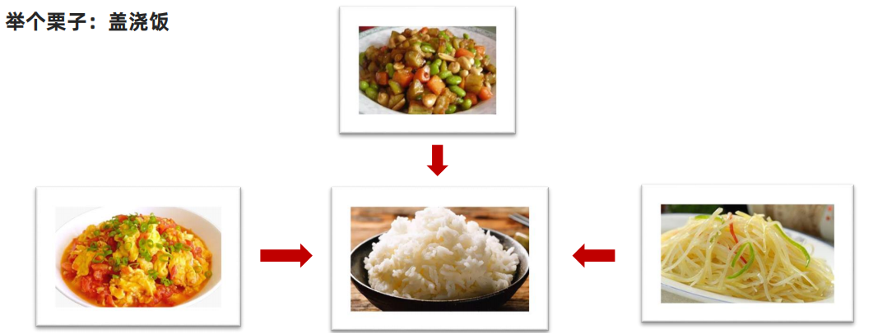

# 编程思想

> 学习 JavaScript 中基于原型的面向对象编程序的语法实现，理解面向对象编程的特征。

## 面向过程

面向过程就是分析出解决问题所需要的步骤，然后用函数把这些步骤一步一步实现，使用的时候再一个一个的依次

调用就可以了。

 举个栗子：蛋炒饭

## 面向对象

面向对象是把事务分解成为一个个对象，然后由对象之间分工与合作。

在面向对象程序开发思想中，每一个对象都是功能中心，具有明确分工。

面向对象编程具有灵活、代码可复用、容易维护和开发的优点，更适合多人合作的大型软件项目。

面向对象的特性：

- 封装性

- 继承性
- 多态性

