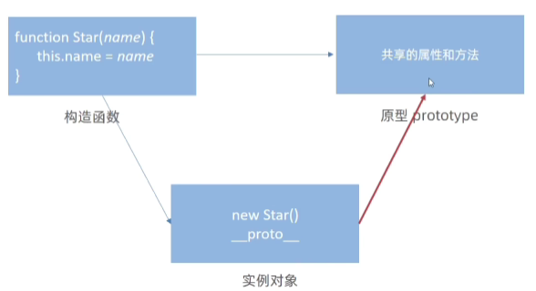
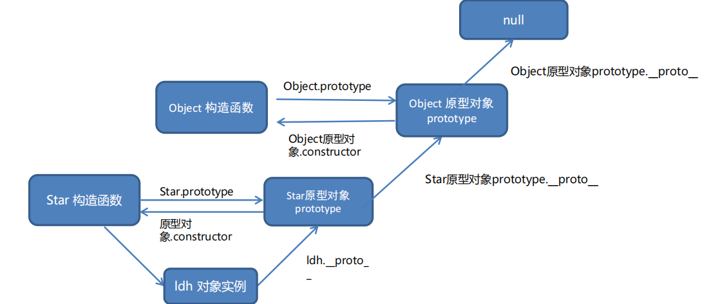

# 原型对象

所有的函数都有一个`prototype`属性。当一个函数被用作构造函数来创建新对象时，新创建的对象会从构造函数的`prototype`属性上继承属性和方法。

- JavaScript 规定，每一个构造函数都有一个 prototype 属性，指向另一个对象，所以我们也称为**原型对象**
- 这个对象可以挂载函数，对象实例化不会多次创建原型上函数，节约内存
- 我们可以把那些不变的方法，直接定义在 prototype 对象上，这样所有对象的实例就可以共享这些方法。
- **构造函数和原型对象中的this 都指向 实例化的对象**

查看原型对象：

```html
<script>
  function Person() {
    
  }

  // 每个函数都有 prototype 属性
  console.log(Person.prototype)
</script>
```

构造函数 `Person` 中定义与原型对象中相同名称的方法，这时实例对象调用则是构造函中的方法 `sayHi`。

通过以上两个简单示例不难发现 JavaScript 中对象的工作机制：当访问对象的属性或方法时，先在当前实例对象是查找，然后再去原型对象查找，并且**原型对象被所有实例共享**。

```html
<script>
  function Person() {
    // 此处定义同名方法 sayHi
    this.sayHi = function () {
      console.log('嗨!');
    }
  }

  // 为构造函数的原型对象添加方法
  Person.prototype.sayHi = function () {
    console.log('Hi~');
  }

  let p1 = new Person();
  p1.sayHi(); // 输出结果为 嗨!
</script>
```

prototype属性用法：

```html
<script>
  function Person() {
    this.name = name
    this.age = age
  }
  // 为构造函数的原型对象添加方法
  Person.prototype.sing = function() {
      console.log('我会唱歌')
  }

    
  // 实例对像，获得了构造函数中封装的所有逻辑
  let p1 = new Person('刘德华', 50)
  let p2 = new Person('张学友', 55)
  
  console.log(p1.sing === p2.sing)  // true
</script>
```

> 结合构造函数原型的特征，实际开发重往往会将封装的功能函数添加到原型对象中。

## 数组扩展封装案例

```html
<script>
  // 封装最大值方法
  Array.prototype.max = function () {
    return Math.max(...this)
  }
  // 封装最小值方法
  Array.prototype.min = function () {
    return Math.min(...this)
  }
  // 封装求和方法
  Array.prototype.sum = function () {
    return this.reduce((prev, item) => prev + item, 0)
  }

  let arr = [6, 4, 10]
  console.log(arr.max())   // 10
  console.log(arr.min())   // 4
  console.log(arr.sum())   // 20

</script>
```

## constructor 属性

每个原型对象里面都有个constructor 属性。

作用：该属性**指向**该原型对象的构造函数。

```js
function Star() {}
console.log(Star.prototype.constructor === Star)  // true
```

**使用场景：**

如果有多个对象的方法，我们可以给原型对象采取对象形式赋值。

但是这样就会覆盖构造函数原型对象原来的内容，这样修改后的原型对象 constructor 就不再指向当前构造函数了

此时，我们可以在修改后的原型对象中，添加一个 constructor 指向原来的构造函数。

```js
function Star() {}
// 通过赋值形式同时添加多个共享方法，会覆盖原对象
Star.prototype = {
  // 添加constructor属性
  constructor: Star,
  sing: function() {
    console.log('唱歌')
  },
  dance: function() {
    console.log('跳舞')
  }
}
```

## 对象原型


对象都会有一个属性 `__proto__` 指向构造函数的 prototype 原型对象，之所以我们对象可以使用构造函数 prototype 原型对象的属性和方法，就是因为对象有 `__proto__ `原型的存在。

注意：

- `__proto__` 是JS非标准属性，有时候浏览器显示`[[prototype]]`
- `[[prototype]]`和`__proto__`意义一样，只读属性
- 用来表明当前实例对象指向哪个原型对象prototype
- `__proto__`对象原型里面也有一个 constructor属性，指向创建该实例对象的构造函数



## 原型继承

继承是面向对象编程的另一个特征，通过继承进一步提升代码封装的程度，JavaScript 中大多是借助原型对象实现继承的特性。

龙生龙、凤生凤、老鼠的儿子会打洞描述的正是继承的含义。

```html
<body>
  <script>
    // 继续抽取   公共的部分放到原型上
    // const Person1 = {
    //   eyes: 2,
    //   head: 1
    // }
    // const Person2 = {
    //   eyes: 2,
    //   head: 1
    // }
    // 构造函数  new 出来的对象 结构一样，但是对象不一样
    function Person() {
      this.eyes = 2
      this.head = 1
    }
    // console.log(new Person)
    // 女人  构造函数   继承  想要 继承 Person
    function Woman() {

    }
    // Woman 通过原型来继承 Person
    // 父构造函数（父类）   子构造函数（子类）
    // 子类的原型 =  new 父类  
    Woman.prototype = new Person()   // {eyes: 2, head: 1} 
    // 指回原来的构造函数
    Woman.prototype.constructor = Woman

    // 给女人添加一个方法  生孩子
    Woman.prototype.baby = function () {
      console.log('宝贝')
    }
    const red = new Woman()
    console.log(red)
    // console.log(Woman.prototype)
    // 男人 构造函数  继承  想要 继承 Person
    function Man() {

    }
    // 通过 原型继承 Person
    Man.prototype = new Person()
    Man.prototype.constructor = Man
    const pink = new Man()
    console.log(pink)
  </script>
</body>
```

## 原型链

基于原型对象的继承使得不同构造函数的原型对象关联在一起，并且这种关联的关系是一种链状的结构，我们将原型对象的链状结构关系称为原型链。



```html
<body>
  <script>
    // function Objetc() {}
    console.log(Object.prototype)
    console.log(Object.prototype.__proto__)

    function Person() {

    }
    const ldh = new Person()
    // console.log(ldh.__proto__ === Person.prototype)
    // console.log(Person.prototype.__proto__ === Object.prototype)
    console.log(ldh instanceof Person)
    console.log(ldh instanceof Object)
    console.log(ldh instanceof Array)
    console.log([1, 2, 3] instanceof Array)
    console.log(Array instanceof Object)
  </script>
</body>
```

① 当访问一个对象的属性（包括方法）时，首先查找这个对象自身有没有该属性。

② 如果没有就查找它的原型（也就是 `__proto__`指向的 prototype 原型对象）

③ 如果还没有就查找原型对象的原型（Object的原型对象）

④ 依此类推一直找到 Object 为止（null）

⑤ `__proto__`对象原型的意义就在于为对象成员查找机制提供一个方向，或者说一条路线

⑥ 可以使用 instanceof 运算符用于检测构造函数的 prototype 属性是否出现在某个实例对象的原型链上

