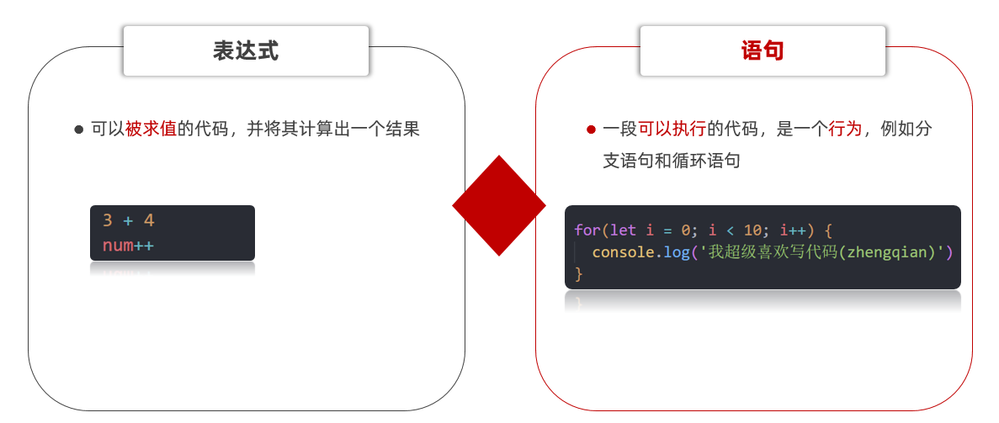

# 语句

## 表达式和语句

## 分支语句

分支语句可以根据条件判定真假，来选择性的执行想要的代码

分支语句包含：

1. if分支语句（重点）
2. 三元运算符
3. switch语句

### if 分支语句

语法：

~~~javascript
if(条件表达式) {
  // 满足条件要执行的语句
}
~~~

小括号内的条件结果是布尔值，为 true 时，进入大括号里执行代码；为false，则不执行大括号里面代码

小括号内的结果若不是布尔类型时，会发生类型转换为布尔值，类似Boolean()

如果大括号只有一个语句，大括号可以省略，但是，俺们不提倡这么做~

~~~javascript

~~~

### if双分支语句

如果有两个条件的时候，可以使用 if else 双分支语句

~~~javascript
if (条件表达式){
  // 满足条件要执行的语句
} else {
  // 不满足条件要执行的语句
}
~~~

例如：

~~~javascript
 
~~~

### if 多分支语句

使用场景： 适合于有多个条件的时候

~~~javascript
 
~~~

### 三元运算符（三元表达式）

**使用场景**： 一些简单的双分支，可以使用  三元运算符（三元表达式），写起来比 if  else双分支 更简单

**符号**：? 与 : 配合使用

语法：

~~~javascript
条件 ? 表达式1 ： 表达式2
~~~

例如：

~~~javascript
// 三元运算符（三元表达式）
// 1. 语法格式
// 条件 ? 表达式1 : 表达式2 

// 2. 执行过程 
// 2.1 如果条件为真，则执行表达式1
// 2.2 如果条件为假，则执行表达式2

// 3. 验证
// 5 > 3 ? '真的' : '假的'
console.log(5 < 3 ? '真的' : '假的')

// let age = 18 
// age = age + 1
//  age++

// 1. 用户输入 
let num = prompt('请您输入一个数字:')
// 2. 判断输出- 小于10才补0
// num = num < 10 ? 0 + num : num
num = num >= 10 ? num : 0 + num
alert(num)
~~~

### switch语句（了解）

使用场景： 适合于有多个条件的时候，也属于分支语句，大部分情况下和 if多分支语句 功能相同

注意：

1. switch case语句一般用于等值判断, if适合于区间判断
2. switchcase一般需要配合break关键字使用 没有break会造成case穿透
3. if 多分支语句开发要比switch更重要，使用也更多

例如：

~~~javascript
// switch分支语句
// 1. 语法
// switch (表达式) {
//   case 值1:
//     代码1
//     break

//   case 值2:
//     代码2
//     break
//   ...
//   default:
//     代码n
// }

~~~

### 断点调试

**作用：**学习时可以帮助更好的理解代码运行，工作时可以更快找到bug

浏览器打开调试界面

1. 按F12打开开发者工具
2. 点到源代码一栏 （ sources ）
3. 选择代码文件

**断点：**在某句代码上加的标记就叫断点，当程序执行到这句有标记的代码时会暂停下来

## 循环语句

使用场景：重复执行 指定的一段代码，比如我们想要输出10次 '我学的很棒'

学习路径：

1.while循环

2.for 循环（重点）

### while循环

while :  在…. 期间， 所以 while循环 就是在满足条件期间，重复执行某些代码。

**语法：**

~~~javascript
while (条件表达式) {
   // 循环体    
}
~~~

例如：

~~~javascript
// while循环: 重复执行代码

// 1. 需求: 利用循环重复打印3次 '月薪过万不是梦，毕业时候见英雄'
let i = 1
while (i <= 3) {
  document.write('月薪过万不是梦，毕业时候见英雄~ ')
  i++   // 这里千万不要忘了变量自增否则造成死循环
}
~~~

循环三要素：

1.初始值 （经常用变量）

2.终止条件

3.变量的变化量

例如：

~~~javascript

~~~

### 中止循环

`break`   中止整个循环，一般用于结果已经得到, 后续的循环不需要的时候可以使用（提高效率）  

`continue`  中止本次循环，一般用于排除或者跳过某一个选项的时候

~~~javascript

~~~

### 无限循环

1.`while(true)` 来构造“无限”循环，需要使用break退出循环。（常用）

2.`for(;;)` 也可以来构造“无限”循环，同样需要使用break退出循环。

~~~javascript
// 无限循环  
// 需求： 页面会一直弹窗询问你爱我吗？
// (1). 如果用户输入的是 '爱'，则退出弹窗
// (2). 否则一直弹窗询问

// 1. while(true) 无限循环
// while (true) {
//   let love = prompt('你爱我吗?')
//   if (love === '爱') {
//     break
//   }
// }

// 2. for(;;) 无限循环
for (; ;) {
  let love = prompt('你爱我吗?')
  if (love === '爱') {
    break
  }
}
~~~

