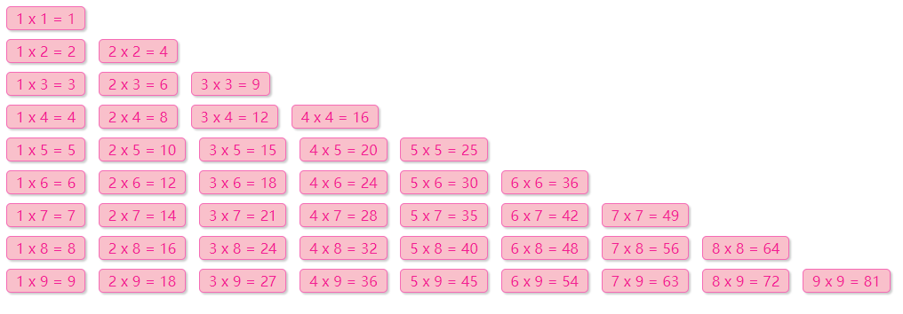

# for 语句

> 掌握 for 循环语句，让程序具备重复执行能力

`for` 是 JavaScript 提供的另一种循环控制的话句，它和 `while` 只是语法上存在差异。

## for语句的基本使用

1. 实现循环的 3 要素

```html
<script>
  // 1. 语法格式
  // for(起始值; 终止条件; 变化量) {
  //   // 要重复执行的代码
  // }

  // 2. 示例：在网页中输入标题标签
  // 起始值为 1
  // 变化量 i++
  // 终止条件 i <= 6
  for(let i = 1; i <= 6; i++) {
    document.write(`<h${i}>循环控制，即重复执行<h${i}>`)
  }
</script>
```

2. 变化量和死循环，`for` 循环和 `while` 一样，如果不合理设置增量和终止条件，便会产生死循环。


3. 跳出和终止循环

```html
<script>
    // 1. continue 
    for (let i = 1; i <= 5; i++) {
        if (i === 3) {
            continue  // 结束本次循环，继续下一次循环
        }
        console.log(i)
    }
    // 2. break
    for (let i = 1; i <= 5; i++) {
        if (i === 3) {
            break  // 退出结束整个循环
        }
        console.log(i)
    }
</script>
```

结论：

- `JavaScript` 提供了多种语句来实现循环控制，但无论使用哪种语句都离不开循环的3个特征，即起始值、变化量、终止条件，做为初学者应着重体会这3个特征，不必过多纠结三种语句的区别。
- 起始值、变化量、终止条件，由开发者根据逻辑需要进行设计，规避死循环的发生。
- 当如果明确了循环的次数的时候推荐使用`for`循环,当不明确循环的次数的时候推荐使用`while`循环

>注意：`for` 的语法结构更简洁，故 `for` 循环的使用频次会更多。


## 循环嵌套

利用循环的知识来对比一个简单的天文知识，我们知道地球在自转的同时也在围绕太阳公转，如果把自转和公转都看成是循环的话，就相当于是循环中又嵌套了另一个循环。


实际上 JavaScript 中任何一种循环语句都支持循环的嵌套，如下代码所示：


```html
// 1. 外面的循环 记录第n天 
for (let i = 1; i < 4; i++) {
    document.write(`第${i}天 <br>`)
    // 2. 里层的循环记录 几个单词
    for (let j = 1; j < 6; j++) {
        document.write(`记住第${j}个单词<br>`)
    }
}
```

记住，外层循环循环一次，里层循环循环全部

### 倒三角

~~~javascript
 // 外层打印几行
for (let i = 1; i <= 5; i++) {
    // 里层打印几个星星
    for (let j = 1; j <= i; j++) {
        document.write('★')
    }
    document.write('<br>')
}
~~~

 

### 九九乘法表

样式css

~~~css
span {
    display: inline-block;
    width: 100px;
    padding: 5px 10px;
    border: 1px solid pink;
    margin: 2px;
    border-radius: 5px;
    box-shadow: 2px 2px 2px rgba(255, 192, 203, .4);
    background-color: rgba(255, 192, 203, .1);
    text-align: center;
    color: hotpink;
}
~~~

javascript 

~~~javascript
 // 外层打印几行
for (let i = 1; i <= 9; i++) {
    // 里层打印几个星星
    for (let j = 1; j <= i; j++) {
        // 只需要吧 ★ 换成  1 x 1 = 1   
        document.write(`
		<span> ${j} x ${i} = ${j * i} </span>
     `)
    }
    document.write('<br>')
}
~~~



