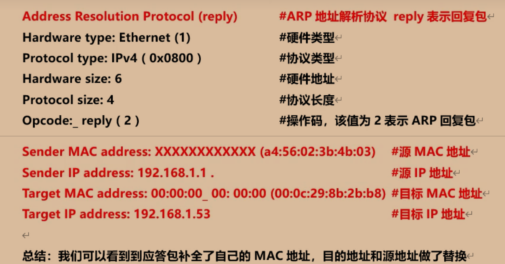
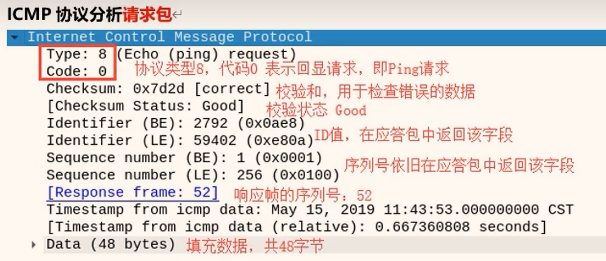
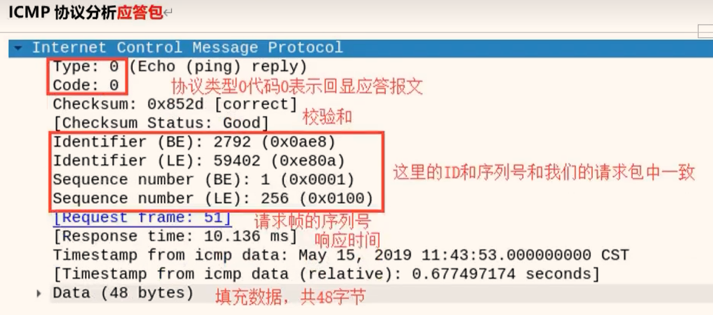
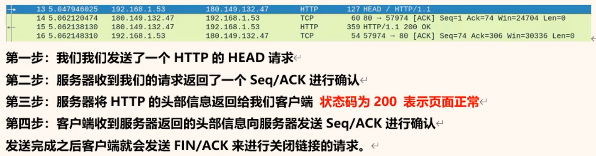

# 三、WireShark抓包及常用协议分析

## 3.1  常见协议包

- **ARP协议**
- **ICMP协议**
- **TCP协议**
- **UDP协议**
- **DNS协议**
- **HTTP协议**

**混杂模式介绍**

混杂模式就是接收所有经过网卡的数据包，包括不是发给本机的包，即不验证
MAC地址。

普通模式下网卡只接收发给本机的包（包括广播包）传递给上层程序，其它的包一律丢弃。

开关 ： 捕获 -- 选项 --混杂模式


## 3.2  WireShark的过滤器使用

```bash
#筛选arp
arp
#筛选syn包
tcp.flags.syn == 1
#筛选源地址是192.168.1.1的包或目标地址是192.168.1.3
ip.scr_host == 192.168.1.1 or ip.dst_host == 192.168.1.3
#筛选ip地址是192.168.1.3，不分源地址和目标地址
ip.addr == 192.168.1.3
```


## 3.3  常用协议分析

- ARP协议



- ICMP





- TCP

三次握手和四次分手

- HTTP




