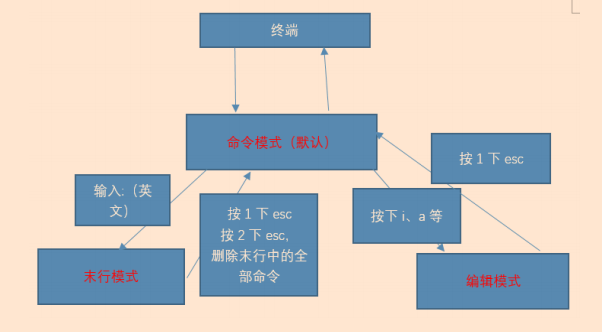
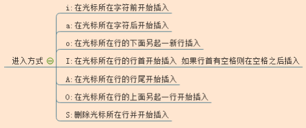

# vim编辑器

## vim三种模式

- 命令模式：在该模式下是不能对文件直接编辑，可以输入快捷键进行一些操作（删除行，复制行，移动光标，粘贴等等）【打开文件之后默认进入的模式】

- 编辑模式：在该模式下可以对文件的内容进行编辑

- 末行模式：可以在末行输入命令来对文件进行操作（搜索、替换、保存、退出、撤销、高亮等等）

**Vim的打开文件的方式：**

```bash
vim 文件路径            #打开指定的文件
vim +数字 文件的路径     #打开指定的文件，并且将光标移动到指定行
vim +/关键词 文件的路径  #打开指定的文件，并且高亮显示关键词
vim 文件路径1 文件路径2  #同时打开多个文件
```

## 命令模式

> 该模式是打开文件的第一个看到的模式（打开文件即可进入）

1、光标移动

```bash
①光标移动到行首
	按键：^
②光标移动到行尾
	按键：$
③光标移动到首行
	按键：gg
④光标移动到末行
	按键：G
⑤翻屏
	向上翻屏：按键ctrl + b （before） 或 PgUp
	向下翻屏：按键ctrl + f （after） 或 PgDn
```

2、复制操作

```bash
①复制光标所在行
	按键：yy
	粘贴：在想要粘贴的地方按下p键
②以光标所在行为准（包含当前行），向下复制指定的行数
	按键：数字yy
③可视化复制
	按键：ctrl + v（可视块）或V（可视行）或v（可视），然后按下↑↓←→方向键来选中需要复制的区块，按下y键进行复制，最后按下p键粘贴
```

3、剪切/删除

```bash
①剪切/删除光标所在行
	按键：dd （删除之后下一行上移）
	注意：dd 严格意义上说是剪切命令，但是如果剪切了不粘贴就是删除的效果。
②剪切/删除光标所在行为准（包含当前行），向下删除/剪切指定的行
	按键：数字dd （删除之后下一行上移）
③剪切/删除光标所在的当前行之后的内容，但是删除之后下一行不上移
	按键：D （删除之后当前行会变成空白行）
④可视化删除
	按键：ctrl + v（可视块）或V（可视行）或v（可视），上下左右移动，按下D表示删除选
中行，d表示删选中块
```

4、撤销\恢复

```bash
撤销：输入:u （不属于命令模式） 或者 u （undo）
恢复：ctrl + r 恢复（取消）之前的撤销操作
```

5、光标的快速移动

```bash
①快速将光标移动到指定的行	
	按键：数字G
②以当前光标为准向上/向下移动n行
	按键：数字↑，数字↓
③以当前光标为准向左/向右移动n字符
	按键：数字←，数字→
④末行模式下的快速移动方式：移动到指定的行
	按键：输入英文“:”，其后输入行数数字，按下回车
```


## 模式切换




## 末行模式

进入方式：由命令模式进入，按下“:” 或者“/（表示查找）”即可进入

退出方式：按下esc，或连按2次esc

```bash
①保存操作（write）
	输入：“:w” 保存文件
	输入：“:w 路径” 另存为
②退出（quit）
	输入：“:q” 退出文件
③保存并退出
	输入：“:wq” 保存并且退出
④强制 （!）
	输入：“:q!” 表示强制退出，刚才做的修改操作不做保存
⑤调用外部命令（了解）
	输入：“:!外部命令” 
⑥搜索/查找
	输入：“/关键词” 
⑦替换
%表示整个文件
g表示全局（global）
	:s/关键词/新的内容        #替换光标所在行的第一处符合条件的内容
	:s/关键词/新的内容/g       #替换光标所在行的全部符合条件的内容
	:%s/关键词/新的内容       #替换整个文档中每行第一个符合条件的内容
	:%s/关键词/新的内容/g      #替换整个文档的符合条件的内容
⑧显示行号（临时）
	输入：“:set nu”[number]
	如果想取消显示，则输入：“:set nonu”
⑨关闭搜索高亮
	输入：“:noh”[nohlsearch]
```


## 编辑模式



重点看前2个进入方式：i（insert）、a（after）。

退出方式：按下esc键

代码着色：

显示：”:syntax on“

关闭：”:syntax off“


