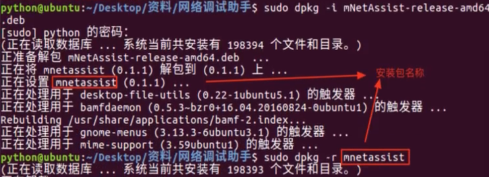

# Linux命令

```bash
按两下TAB键，命令补全
~ ——#代表当前用户的主目录
. ——#代表当前目录
.. ——#代表上一级目录
- ——#最近两次工作目录
sudo ——#表示以管理员身份执行
pwd ——#显示当前目录
#文件点带.表示隐藏文件
```

## 文件管理

```bash
cd / ——#进入根目录
tree  ——#显示树状结构
	-C 上色，区分文件和目录
	-d 仅列出目录名称（不含文件）
	-L 2 只显示两层目录
ls ——#显示当前目录下所有文件
	-a 显示所有文件，包括隐藏文件
	-l 详细列表详细信息
	-h 配合-l 以人性化的方式显示文件大小
mkdir ——#在当前目录创建目录
	-p 创建多层目录
rmdir ——#删除目录（只能删空目录）
rm ——#删除文件或文件夹
   -r 递归，包含所有子文件
   -f 强制，不报错
cp  ——#复制文件
    -a 保留原文件的权限和时间戳、文件属性等信息
    -i 覆盖提示
    -r 包含子文件，生成新的时间戳
mv ——#移动文件或文件夹
file ——#识别文件类型
touch ——#创建一个文件
gedit ——#编辑文件
clear ——#清屏
```

## 文档编辑

```bash
echo ——#输出字符串或提取后的变量值
cat ——#显示文件所有内容
	-b 空行不会编号
	-n 空行会编号
find [路径] [参数] 文件名
	-name 匹配文件名
	-perm 匹配文件权限
	-size 匹配文件大小
	-type 匹配文件类型
	-user 匹配文件所属主
	-group 	匹配文件所属组
head -n 文件路径 -- 显示文件前n行（默认10行）
tail -n 文件路径 -- 显示文件末n行（默认10行）
more ——#分屏显示文件内容，只能向后浏览
less ——#分屏显示，可以pgup和pgdn上下翻页，可以搜索关键字
	-N 显示文件内容时带行号
	-m 显示阅读进度百分比
	-i 忽略搜索时的大小写
wc -- 统计文件内容信息（包含行数、单词数、字节数）
	-l 表示lines，行数
	-w 表示words，单词数 依照空格来判断单词数量
	-c 表示bytes，字节数
cut [参数] 文件名 ——#按列提取文件内容
	-b 以字节为单位进行分割
	-c 以字符为单位进行分割
	-d 设置分隔符
	-f 显示指定字段的内容
cut -d : -f 1 /etc/passwd  #冒号分割，取第一列内容
cut -c 1-4 /etc/passwd     #取每行的前4个字符

```

## 系统管理

```bash
shutdown ——#关机，默认一分钟关机
         -r 重启
         -now 现在
         -20.25 这个时间关机
         +10 10分钟后关机
         -c 取消关机    
init 0   ——#关机
init 6   ——#重启
reboot   ——#重启
poweroff ——#关机
systemctl redis restart
systemctl redis stop
systemctl status sshd ——#查看sshd服务状态
systemctl enable redis ——#开机自启动
systemctl disable redis ——#关闭开机自启
date ——#查看系统时间
date "+%Y-%m-%d %H:%M:%S"   #按格式显示日期时间
timedatectl set-timezone Asia/Shanghai #设置时区
cal ——#查看日历。-y可以查看一年日历
uptime ——#输出计算机持续时间
```

```bash
who ——#查看当前登录用户信息
which ——#查找命令文件所在位置
uname ——#显示系统内核信息
	-a 显示系统所有相关信息
	-r 显示内核发行版本号
	-i 显示硬件平台
nice -n -20 bash ——#设置bash优先级20，优先级范围为-20~19
top ——#动态显示运行中的进程并且排序
htop ——#更美观显示运行中的进程并且排序
kill [-9] pid ——#终止指定代号的进程，-9表示强行终止
killall sshd ——#终止所有程序相关进程
pidof sshd ——#查找服务进程的PID号码
ps aux ——#显示所有进程
	a 显示终端上的所有进程，包括其他用户的进程
	u 显示进程的详细状态
	x 显示没有控制终端的进程
crontab ——#计划任务，分、时、日、月、星期
	-l list，列出指定用户的计划任务列表
	-e：edit，编辑指定用户的计划任务列表
	-u：user，指定的用户名，如果不指定，则表示当前用户
	-r：remove，删除指定用户的计划任务列表
	ctrl+x退出编辑模式
#每周1,3,5的3点25份压缩打包一次www文件夹
25 3 * * 1,3,5 /usr/bin/tar -czvf File.tar.gz /Dir/www
```

## 磁盘管理

```bash
df [参数] [磁盘/分区] ——#显示磁盘空间使用量情况（disk file）
	-l 只显示本地文件系统
	-h 以更易读的方式显示
free ——#显示系统内存使用量情况
	-h 自动调整合适的显示单位
	-g 设置显示单位为GB
	-m 设置显示单位为MB
	-s 持续显示内存数据，后面跟数字表示隔多少秒刷新一次
du -sch * ——#查看当前目录所有子目录和文件大小（disk usage）
	-h 以更易读的方式显示
	-a 显示目录及其下目录和文件占用的磁盘空间大小
	-s 显示目录占用的磁盘空间大小
	-c 显示几个目录或文件占用的磁盘空间大小，还要统计它们的总和
ln -s 源文件名 目标文件名 ——#建立文件软链接（类快捷方式）
```

1. 没有- s选项建立的是一个**硬链接**文件，两个文件占用相同大小的硬盘空间，**工作中几乎不会建立文件的硬链接**
2. **源文件要使用绝对路径**，不能使用相对路径，这样可以方便移动链接文件后，仍然能够正常使用，目标文件可以使用相对路径

> 在 Linux 中，**文件名** 和 **文件的数据** 是分开存储的

```bash
mount [参数] [设备名] [目录名] ——#将文件系统挂载到目录
	-a	加载/etc/fstab文件中记录的所有文件系统
	-U	挂载指定UUID的设备分区
	-t	挂载指定文件类型的设备分区
umount /dev/backup ——#取消挂载
blkid ——#查询设备UUID（block ID）
lsblk ——#树形查看已挂载的磁盘的空间使用情况（list block devices）
mkfs.ext4 目录 ——#格式化为ext4格式，可以支持多种格式（make file system）
echo "/dev/sdb2 /backup ext4 defaults 0 0" >> /etc/fstab
mount -a   #写入设备信息并不会立即生效，需要使用mount -a参数进行自动挂载
```

**物理设备的命名规则**

在Linux系统中一切都是文件，硬件设备也不例外。既然是文件，就必须有文件名称。系统内核中的udev设备管理器会自动把硬件名称规范起来，目的是让用户通过设备文件的名字可以猜出设备大致的属性以及分区信息等；

| 硬件设备      | 文件名称           |
| ------------- | ------------------ |
| IDE设备       | /dev/hd[a-d]       |
| SCSI/SATA/U盘 | /dev/sd[a-z]       |
| virtio设备    | /dev/vd[a-z]       |
| 软驱          | /dev/fd[0-1]       |
| 打印机        | /dev/lp[0-15]      |
| 光驱          | /dev/cdrom         |
| 鼠标          | /dev/mouse         |
| 磁带机        | /dev/st0或/dev/ht0 |

> 主分区或扩展分区的编号从1开始，到4结束；
>
> 逻辑分区从编号5开始。

## 文件传输

```bash
tftp [参数] 域名或IP地址 ——#上传及下载文件
	-r 设置端口号
	-m 设置传输模式
tftp常用命令：
	put 上传指定文件
	get 下载指定文件
fsck ——#检查与修复文件系统
	-f 强制检查而不询问
lprm [参数] 任务编号 ——#移除打印队列中的任务
	-P 设置目标打印机
ftpwho ——#显示FTP会话信息
	-h 显示帮助信息
	-v 详细信息模式
```

## 网络通信

```bash
ssh [参数] 域名或IP地址 ——#安全的远程连接服务
	-1 使用SSH协议版本1
	-2 使用SSH协议版本2
	-V 显示版本信息
	-l 设置登录用户名
netstat -ntlp ——#查看当前所有tcp端口·
netstat -an | grep 3306 ——#查看所有3306端口使用情况
	-a 显示所有连接和侦听端口
	-t 显示TCP端口，t是TCP的首字母
	-u 显示UDP端口，u是UDP的首字母
	-l 表示过滤出“state（状态）”列中其值为LISTEN（监听）的连接
	-p 表示显示发起连接的进程pid和进程名称
	-n 表示将地址从字母组合转化成ip地址，将协议转化成端口号来显示
dhclient [参数] [网卡名] ——#动态获取或释放IP地址
	-r 释放IP地址
	-p 设置DHCP客户端监听的端口号
	-s 在获取IP地址前指定DHCP服务器
	-x 停止DHCP客户端，而不释放当前租约
ping ——#测试主机间网络连通性
	-c 设置发送数据包的次数
	-i 设置收发信息的间隔时间，单位秒
	-W 设置最长等待时间，单位秒
	-I 使用指定的网络接口送出数据包
```

诸如ifconfig、route、arp和netstat等命令行工具来源于安装包net-tools，Linux社区都已经停止维护了，现在大多数发行版linux已经完全抛弃了net-tools，只支持iproute2。

```bash
tracepath ——#追踪报文的路由信息
ifconfig [参数] [网卡名] [动作] ——#显示或设置网络设备参数信息
	-a 显示所有网卡状态
	add 设置网络设备的IP地址
	del	删除网络设备的IP地址
	down 关闭指定的网络设备
	up 启动指定的网络设备
ifconfig eth0 192.168.1.100/24 #设置ip
route [参数] [域名或IP地址] ——#显示与设置路由信息
	-n 显示数字形式的IP地址
	-host 一个主机的路由表
	-net 一个网络的路由表
#添加默认路由
route add -net 192.168.10.0 netmask 255.255.255.0 dev ens160
route add default gw 192.168.10.1 #添加默认网关
ip link ——#只能看链路层的状态，看不到ip地址
ip link set eth0 up/down ——#启用/禁用指定接口
ip addr ——#查看网卡信息，侧重ip层
ip addr add 2.2.2.2/24 dev eth0 
ip addr del 2.2.2.2/24 dev eth0
ip route ——#查看路由
ip route add 1.1.1.0/24 via 1.1.1.1 dev eth0
ip route del 1.1.1.0/24
ip neigh ——#查看arp
ip neigh add 1.1.1.1 lladdr 0a-00-27-00-0-007 dev eth0
ip neigh del 1.1.1.1 dev eth0
ss -tunlp ——#显示监听状态tcp、udp端口（Socket Statistics）
	-a	显示所有套接字
    -t	仅显示TCP套接字
    -u	仅显示UDP套接字
    -n	不解析域名
    -l	显示处于监听状态的套接字
    -p	显示使用套接字的进程
```

## 备份压缩

```bash
tar 参数 压缩包名 文件或目录名 ——#压缩和解压缩文件
	-c 创建新的压缩
	-x 从压缩包内提取文件
	-z 使用gzip压缩格式
	-j 使用bzip2压缩格式
	-v 显示执行过程详细信息
	-f 指定压缩包文件
	-C 解压缩到指定目录
	--remove-files 删除原始文件
tar czvf File.tar.gz /etc  #压缩文件
tar xzvf File.tar.gz  	   #解压缩文件
tar cvf File.tar *.cfg     #对cfg文件打包不压缩
unzip ——#解压缩zip文件
```

## 其他命令

```bash
history ——#查看历史命令
	!n 执行第n个历史命令
watch [参数] 任务命令 ——#周期性执行任务命令
	-n 设置间隔时间，单位秒
	-d 高亮显示变化内容
id ——#查看用户基本信息
hostname ——#显示系统主机名，可在/etc/hostname修改
```

## 安装卸载

Ubuntu软件安装有两种方式:

- 离线安装(deb文件格式安装）
- 在线安装(apt-get方式安装)

```bash
dpkg -i xxx.deb    #安装软件
dpkg -r 安装包名    #卸载软件，卸载包名和安装包名不一样 	 	
```



- apt是Advanced Packaging Tool,是Linux下的一款安装包管理工具
- 可以在终端中方便的 **安装 /卸载 / 更新软件包**

```bash
sudo apt list --installed #查看已安装的软件
sudo apt install 软件包 #安装软件
sudo apt remove 软件名  #删除已安装的软件包，不会删除依赖软件包，且保留配置文件
apt remove --purge 软件名 #删除已安装包（不保留配置文件)
sudo apt upgrade #更新已安装的包
```

1. 下载的软件的存放位置：/var/cache/apt/archives
2. 安装后软件的默认位置：/usr/share
3. 可执行文件位置：/usr/bin
4. 配置文件位置：/etc
5. lib文件位置：/usr/lib

```bash
#清理 APT 缓存,删除 /var/cache/apt/archives 目录的内容（除了锁文件）
sudo apt clean
```

**配置软件源**

- 如果希望在linux中安装软件，更加快速，可以通过设置镜像源，选择一个访问网速更快的服务器来提供软件下载/安装服务
- 更换服务器之后，需要一个相对比较长时间的更新过程，需要耐心等待。更新完成后，再安装软件都会从新设置的服务器下载软件了

```bash
vim /etc/apt/sources.list
```

> https://mirrors.tuna.tsinghua.edu.cn/help/ubuntu/

## linux三剑客

### grep

grep来自英文词组“global search regular expression and print out the line”的缩写，意思是用于全面搜索的正则表达式，并将结果输出。人们通常会将grep命令与正则表达式搭配使用。

```bash
grep ——#对文本文件进行查找
     -n 显示匹配行行号
     -v 显示不包含匹配文本的所有行（相当于求反）
     -i 忽略大小写
     -r 递归查找子目录中的文件
     -B 显示匹配字符行和上面n行
     -C 显示匹配字符行和上面n行
     -E 支持更多正则表达式
#例：ifconfig | grep inet   #显示ifconfig中含inet的行
#例：grep -C3 root /etc/passwd  #显示含root和下三行
#例：grep -En "([1-2]?[0-9]?[0-9]\.){3}([1-2]?[0-9]?[0-9])" SW1.txt  #搜索文本里的ip地址
#例：grep -r update /etc/acpi   #显示/etc/acpi目录下所有文件包含update的行
```

### sed

sed命令来自英文词组“stream editor”的缩写，其功能是用于利用语法/脚本对文本文件进行批量的编辑操作。

语法格式：sed 参数 操作 文件名

```bash
sed --对文本进行增删改查
	-i 直接修改文件内容，而不输出到终端
	-n 仅显示脚本处理后的结果
	-r 支持扩展正则表达
```

所有文件要改原始文件，需要加-i参数

```bash
#将文本里所有1.1.1.1都替换为2.2.2.2，写入原始文本
sed -i 's/1.1.1.1/2.2.2.2/g' 1.txt  
```

1、替换

```bash
#不加g匹配每一行第一个替换，g代表全局，全部替换
sed 's/原字符/新字符/g' filename  #替换操作
例：sed 's/bule/yellow/g' filename  #将文件所有bule替换成yellow
例：sed 's/^/hello /g' example.txt  #每一行前面添加文本“hello”
```

2、删除行

```bash
sed '开始行,结束行d' filename
例：sed '3,5d' file.txt         #删除文件3到5行
例：sed '/apple/d' file.txt     #删除所有带有apple的行
```

3、插入行

```bash
sed '行数i 内容' filename
例：sed -i '1i apple' file.txt  #插入第一行，内容为apple
sed '/apple/i apple' file.txt  #在apple文本前插入一行apple
```

4、追加行

```bash
sed '行数a 内容' file.txt
例：sed -i '1a apple' file.txt   #在第一行后面追加一行内容，等同插入第二行
sed '/apple/a apple' file.txt   #在apple文本后面追加一行apple
sed '2,4a\
This is line 2.\
This is line 3.\
This is line 4.' file.txt
#在file.txt文件的第2行到第4行之间添加三行文字
```

5、打印

```bash
sed -n '行数p' file.txt
例：sed -n '5p' file.txt     #打印第5行内容
sed -n '/apple/p' file.txt  #打印文件中匹配到了apple
```

总结

- 替换命令 s：s/old/new/g 全局替换 old 为 new
- 删除命令 d：d 删除指定行
- 插入命令 i：i 在指定行前插入新行
- 追加命令 a：a 在指定行后追加新行
- 打印命令 p：p 打印指定行

### awk

awk命令来自三位创始人“Alfred Aho，Peter Weinberger, Brian Kernighan”的姓氏缩写，其功能是用于对文本和数据进行处理的编程语言。使用awk命令可以让用户自定义函数或正则表达式对文本内容进行高效管理，与sed、grep并称为Linux系统中的文本三剑客。

语法格式：ask  参数  ’{操作}'  文件名

```bash
awk --对文本和数据进行处理
	-v 自定义变量信息
	
内置变量：
	OFS	输出域分隔符
	NF  每行的字段数
```

1、打印内容

```bash
awk '{print } {print }' File.cfg
#仅显示指定文件中第1、2列的内容
awk '{print $1,$2}' File.cfg
#仅显示第一列，并每列前面加上接口编号>>
awk '{print "接口编号>>" $1}' File.cfg
#显示第一列和第二列，每列前面加上相应文本
awk '{print "接口编号:"$1,"接口ip"$2}' File.cfg
#先筛选行，再筛选列，再加上标题和结尾
cat 1.txt | grep -E $ip | awk BEGIN'{print "以下显示接口及ip地址"} {print "接口编号>>"$1,"接口ip："$2} END{print "==="}'
```

2、定义变量

```bash
awk -v a=num '{}'
#输入第一列和第二列，之间用--分割，OFS为内置的输出域分隔符
awk -v OFS=-- '{print $1,$2}' 1.txt
```

3、使用条件语句

```bash
#如果第二列小于100，count就加1，输出count
awk -v conunt=0 '{if($2<100) count++} END{print count}' 1.txt
```

4、求和

```bash
#对第一列进行求和
awk '{sum += $1} END {print sum}' 1.txt 
```

5、使用正则表达式

```bash
awk '/正则表达式/ {}' file.txt
#满足开头是1或2的行，输出第一列和第二列
awk '/^[1-2]/ {print $1, $2}' 1.txt
```


