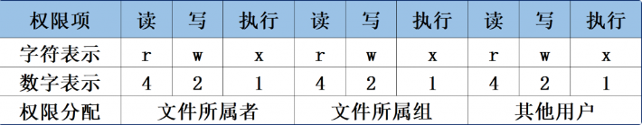
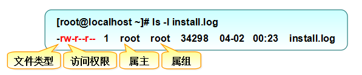

# 用户和权限

Linux是一个多用户、多任务的操作系统，具有很好的稳定性与安全性，在幕后保障Linux系统的安全则是一系列复杂的配置工作。

## 用户身份与能力

Linux系统的管理员之所以是root，并不是因为它的名字叫root，而是因为该用户的身份号码即UID（User IDentification）的数值为0。在Linux系统中，UID就像我们的身份证号码一样具有唯一性，因此可通过用户的UID值来判断用户身份。

- **管理员UID为0**：系统的管理员用户。
- **系统用户UID为1～999**：Linux系统为了避免因某个服务程序出现漏洞而被黑客提权至整台服务器，默认服务程序会由独立的系统用户负责运行，进而有效控制被破坏范围。
- **普通用户UID从1000开始**：是由管理员创建的用于日常工作的用户。

为了方便管理属于同一组的用户，Linux系统中还引入了用户组的概念。通过使用用户组号码（GID，Group IDentification），可以把多个用户加入到同一个组中，从而方便为组中的用户统一规划权限或指定任务。

在Linux系统中创建每个用户时，将自动创建一个与其同名的基本用户组，而且这个基本用户组只有该用户一个人。如果该用户以后被归纳到其他用户组，则这个其他用户组称之为扩展用户组。一个用户只有一个基本用户组，但是可以有多个扩展用户组，从而满足日常的工作需要。

> 基本用户组就像是原生家庭，是在创建账号（出生）时就自动生成的；而扩展用户组则像工作单位，为了完成工作，需要加入到各个不同的群体中，这是需要手动添加的。

```bash
id ——#查询用户基本信息
who ——#查看当前所有登录的用户列表
whoami ——#查看当前登录用户的账户名
useradd [参数] 用户名 ——#创建新的用户账户
	-a	将用户添加至扩展组中
    -d	指定用户的家目录（默认为/home/username）
    -m  自动创建家目录
    -e	账户的到期时间，格式为YYYY-MM-DD.
    -u	指定该用户的默认UID
    -g	指定一个初始的用户基本组（必须已存在）
    -G	指定一个或多个扩展用户组
    -N	不创建与用户同名的基本用户组
    -s	指定该用户的默认Shell解释器
groupadd [参数] 群组名 ——#创建新的用户组
	-g	设置用户组ID
usermod [参数] 用户名 ——#修改用户的属性
    -c	填写用户账户的备注信息
    -d -m  可重新指定用户的家目录并自动把旧的数据转移过去
    -e	账户的到期时间，格式为YYYY-MM-DD
    -g	变更所属用户组
    -G	变更扩展用户组
    -L	锁定用户禁止其登录系统
    -U	解锁用户，允许其登录系统
    -s	变更默认终端
    -u	修改用户的UID
gpasswd -d 用户名 组 ——#删除用户附加组
passwd [参数] 用户名 ——#修改用户的密码、过期时间等
    -l	锁定用户，禁止其登录
    -u	解除锁定，允许用户登录
    --stdin	允许通过标准输入修改用户密码
    -d	使该用户可用空密码登录系统
    -e	强制用户在下次登录时修改密码
    -S	显示用户的密码是否被锁定，以及密码所采用的加密算法名称
userdel [参数] 用户名 ——#删除已有的用户账户
    -f	强制删除用户
    -r	同时删除用户及用户家目录
    
例：
useradd -m -g 组 用户名  #新建用户并指定用户组
groupadd yage           #创建用户组
usermod -g root yage    #yage修改基本组
usermod -G root yage    #yage修改扩展组
passwd yage             #修改yage密码
userdel -r yage         #同时删除用户和家目录
```

## 文件权限与归属

在Linux系统中，每个文件都有归属的所有者和所属组，并且规定了文件的所有者、所属组以及其他人对文件所拥有的可读（r）、可写（w）、可执行（x）等权限。

对于一般文件来说，“可读”表示能够读取文件的实际内容；“可写”表示能够编辑、新增、修改、删除文件的实际内容；“可执行”则表示能够运行一个脚本程序。

对于目录文件来说，“可读”表示能够读取目录内的文件列表；“可写”表示能够在目录内新增、删除、重命名文件；而“可执行”则表示能够进入该目录。



文件权限的数字表示法基于字符（rwx）的权限计算而来，其目的是简化权限的表示方式。



chmod在设置权限时，可以简单地使用三个数字分别对应 **拥有者/组** 和 **其他** 用户的权限，直接修改文件目录的读|写|执行权限，但是不能精确到拥有者|组|其他

```bash
chown 用户名 文件名    #修改文件拥有者
chgrp -R 组名 文件名   #递归修改文件的组
chmod -R 775 文件名    #递归修改文件权限
chmod a+/- rwx 文件名   #单独修改文件的权限
	u 表示用户（所有者）权限。
	g 表示组权限。
	o 表示其他用户权限。
	a 表示所有用户权限（u+g+o 的简写）。
```

## 文件的特殊权限

**1）SUID**

SUID是一种对二进制程序进行设置的特殊权限，能够让二进制程序的执行者临时拥有所有者的权限（**仅对拥有执行权限的二进制程序有效**）。

例如，所有用户都可以执行passwd命令来修改自己的用户密码，而用户密码保存在/etc/shadow文件中。它的默认权限是000，也就是说除了root管理员以外，所有用户都没有查看或编辑该文件的权限。但是，passwd命令有SUID特殊权限，就可让普通用户临时获得程序所有者的身份，把变更的密码信息写入到shadow文件中。

```bash
[root@linuxprobe ~]#ls -l /etc/shadow
----------. 1 root root 1312 Jul 21 05:08 /etc/shadow
[root@linuxprobe ~]#ls -l /bin/passwd 
-rwsr-xr-x. 1 root root 34512 Aug 13 2018 /bin/passwd
```

查看passwd命令属性时发现所有者的权限由rwx变成了rws，其中x改变成s就意味着该文件被赋予了SUID权限。另外有读者会好奇，那么如果原本的权限是rw-呢？如果原先权限位上没有x执行权限，那么被赋予特殊权限后将变成大写的S。

```bash
chmod u+s 文件名   #添加SUID权限
chmod u-s 文件名   #删除SUID权限
```

**2）SGID**

SGID特殊权限有两种应用场景：当对二进制程序进行设置时，能够让执行者临时获取文件所属组的权限；当对目录进行设置时，则是让目录内新创建的文件自动继承该目录原有用户组的名称。

```bash
chmod g+s 文件名   #添加SGID权限
chmod g-s 文件名   #删除SGID权限
```

 **3）SBIT**

SBIT特殊权限位可确保用户只能删除自己的文件，而不能删除其他用户的文件。换句话说，当对某个目录设置了SBIT粘滞位权限后，那么该目录中的文件就只能被其所有者执行删除操作了。

/tmp目录上的SBIT权限默认已经存在，这体现为“其他用户”权限字段的权限变为rwt。

```bash
[root@linuxprobe ~]#ls -ald /tmp
drwxrwxrwt. 17 root root 4096 Oct 28 00:29 /tmp

chmod o+t	#添加SBIT权限
chmod o-t	#删除SBIT权限
```

其实，SUID、SGID与SBIT也有对应的数字表示法，分别为4、2、1。也就是说777还不是最大权限，最大权限应该是7777，其中第1个数字代表的是特殊权限位。

## 文件的隐藏属性

chattr命令用于设置文件的隐藏权限，英文全称为change attributes。如果想要把某个隐藏功能添加到文件上，则需要在命令后面追加“+参数”，如果想要把某个隐藏功能移出文件，则需要追加“-参数”。

lsattr命令用于查看文件的隐藏权限，英文全称为“list attributes”

```bash
chattr [参数] 文件名称 ——#更改文件隐藏属性
    i	无法对文件进行修改；若对目录设置了该参数，则仅能修改其中的子文件内容而不能新建或删除文件
    a	仅允许补充（追加）内容，无法覆盖/删除内容（Append Only）
    S	文件内容在变更后立即同步到硬盘（sync）
    s	彻底从硬盘中删除，不可恢复（用0填充原文件所在硬盘区域）
    A	不再修改这个文件或目录的最后访问时间（atime）
    b	不再修改文件或目录的存取时间
    D	检查压缩文件中的错误
    d	使用dump命令备份时忽略本文件/目录
    c	默认将文件或目录进行压缩
    u	当删除该文件后依然保留其在硬盘中的数据，方便日后恢复
    t	让文件系统支持尾部合并（tail-merging）
    x	可以直接访问压缩文件中的内容
lsattr 文件名 ——#查看文件的隐藏权限

chattr +a text.txt  #文件仅允许追加内容，无法删除和覆盖
[root@yage ~] lsattr text.txt
-----a---------- text.txt
```

## 文件访问控制列表

隐藏权限其实有一个共性—权限是针对某一类用户设置的，能够对很多人同时生效。如果希望对某个指定的用户进行单独的权限控制，就需要用到文件的访问控制列表（ACL）了。

通俗来讲，基于普通文件或目录设置ACL其实就是针对指定的用户或用户组设置文件或目录的操作权限，更加精准地派发权限。另外，如果针对某个目录设置了ACL，则目录中的文件会继承其ACL权限；若针对文件设置了ACL，则文件不再继承其所在目录的ACL权限。

setfacl命令用于管理文件的ACL权限规则，英文全称为“set files ACL”

getfacl命令用于查看文件的ACL权限规则，英文全称为“get files ACL”

```bash
setfacl [参数] 文件名称 ——#管理文件的ACL权限规则
    -m	修改权限
    -M	从文件中读取权限
    -x	删除某个权限
    -b	删除全部权限
    -R	递归子目录
  
setfacl -Rm u:yage:rwx /root  #给普通用户yage添加/root rwx权限
[root@yage ~] ls -ld /root
dr-xrwx---+ 14 root root 4096 May 4 2020 /root
[root@yage ~] #getfacl /root
ggetfacl: Removing leading '/' from absolute path names
#file: root
#owner: root
#group: root
user::r-x
user:yage:rwx
group::r-x
mask::rwx
other::---
```

> 常用的ls命令是看不到ACL信息的，但是却可以看到文件权限的最后一个点（**.**）变成了加号（**+**），这就意味着该文件已经设置了ACL。

## su命令与sudo服务

su命令可以解决切换用户身份的需求，使得当前用户在不退出登录的情况下，顺畅地切换到其他用户，比如从root管理员切换至普通用户。su命令与用户名之间有一个减号（-），这意味着完全切换到新的用户，即把环境变量信息也变更为新用户的相应信息，而不是保留原始的信息。强烈建议在切换用户身份时添加这个减号（-）。

```bash
su - yage
su - root
```

> 当从root管理员切换到普通用户时是不需要密码验证的，而从普通用户切换成root管理员就需要进行密码验证了；

使用sudo命令可以给普通用户提供额外的权限来完成原本只有root管理员才能完成的任务，可以限制用户执行指定的命令，记录用户执行过的每一条命令，集中管理用户与权限（/etc/sudoers），以及可以在验证密码后的一段时间无须让用户再次验证密码。

```bash
sudo [参数] 用户名 ——#授权普通用户执行管理员命令
	-i  以root用户登陆
    -h	列出帮助信息
    -l	列出当前用户可执行的命令
    -u  用户名或UID值	以指定的用户身份执行命令
    -k	清空密码的有效时间，下次执行sudo时需要再次进行密码验证
    -b	在后台执行指定的命令
    -p	更改询问密码的提示语
```

**用户添加sudo权限**

1）用户添加进sudo组

```bash
sudo usermod -aG yage  #yage用户添加到sudo组中，-aG选项用于附加
```

2）`/etc/sudoers` 是一个重要的系统文件，用于配置和管理sudo命令的权限进行细粒度的控制。`visudo`命令用于编辑、配置用户sudo的权限文件。自动调用vi编辑器来配置`/etc/sudoers`权限文件的命令。不仅如此，`visudo`命令还可以对配置文件内的参数进行语法检查，并在发现参数错误时进行报错提醒。这要比用户直接修改文件更友好、安全、方便。

- **谁可以使用 允许使用的主机 = （以谁的身份） 可执行命令的列表**

- **谁可以使用：**稍后要为哪位用户进行命令授权。
- **允许使用的主机：**可以填写ALL表示不限制来源的主机，亦可填写如192.168.10.0/24这样的网段限制来源地址，使得只有从允许网段登录时才能使用sudo命令。
- **以谁的身份：**可以填写ALL表示系统最高权限，也可以是另外一位用户的名字。
- **可执行命令的列表：**可以填写ALL表示不限制命令，亦可填写如/usr/bin/cat这样的文件名称来限制命令列表，多个命令文件之间用逗号（,）间隔。

```bash
visudo   #自动调用vi编辑器来配置/etc/sudoers

#Allow members of the sudo group to execute any command
%sudo   ALL=(ALL:ALL) ALL

yage ALL=(ALL:ALL) ALL      #添加需要sudo权限的用户
visudo -f /etc/sudoers      #修复错误
```

每次执行sudo命令后都会要求验证一下密码。虽然这个密码就是当前登录用户的密码，但是每次执行sudo命令都要输入一次密码其实也挺麻烦的，这时可以添加NOPASSWD参数，使得用户下次再执行sudo命令时就不用密码验证。

```bash
yage ALL=(ALL:ALL) NOPASSWD:/usr/bin/cat,/usr/sbin/reboot
```


