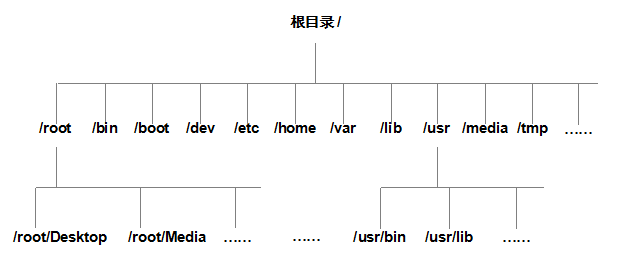

# 存储和硬盘

## 存储结构

在Linux系统中，目录、字符设备、套接字、硬盘、光驱、打印机等都被抽象成文件形式，“Linux系统中一切都是文件”。Linux系统中的一切文件都是 **从“根”目录（/）开始**的，并按照文件系统层次标准（FHS）采用倒树状结构来存放文件，以及定义了常见目录的用途。



| 目录名称    | 应放置文件的内容                                             |
| ----------- | ------------------------------------------------------------ |
| /boot       | 开机所需文件—内核、开机菜单以及所需配置文件等                |
| /dev        | 以文件形式存放任何设备与接口                                 |
| /etc        | 配置文件                                                     |
| /home       | 用户主目录                                                   |
| /bin        | 存放单用户模式下还可以操作的[命令](https://www.linuxcool.com/) |
| /lib        | 开机时用到的函数库，以及/bin与/sbin下面的命令要调用的函数    |
| /sbin       | 开机过程中需要的命令                                         |
| /media      | 用于挂载设备文件的目录                                       |
| /opt        | 放置第三方的软件                                             |
| /root       | 系统管理员的家目录                                           |
| /srv        | 一些网络服务的数据文件目录                                   |
| /tmp        | 任何人均可使用的“共享”临时目录                               |
| /proc       | 虚拟文件系统，例如系统内核、进程、外部设备及网络状态等       |
| /usr/local  | 用户自行安装的软件                                           |
| /usr/sbin   | Linux系统开机时不会使用到的软件/命令/[脚本](https://www.linuxcool.com/) |
| /usr/share  | 帮助与说明文件，也可放置共享文件                             |
| /var        | 主要存放经常变化的文件，如日志                               |
| /lost+found | 当文件系统发生错误时，将一些丢失的文件片段存放在这里         |


## 物理设备的命名规则

在Linux系统中一切都是文件，硬件设备也不例外。既然是文件，就必须有文件名称。系统内核中的udev设备管理器会自动把硬件名称规范起来，目的是让用户通过设备文件的名字可以猜出设备大致的属性以及分区信息等；

| 硬件设备      | 文件名称           |
| ------------- | ------------------ |
| IDE设备       | /dev/hd[a-d]       |
| SCSI/SATA/U盘 | /dev/sd[a-z]       |
| virtio设备    | /dev/vd[a-z]       |
| 软驱          | /dev/fd[0-1]       |
| 打印机        | /dev/lp[0-15]      |
| 光驱          | /dev/cdrom         |
| 鼠标          | /dev/mouse         |
| 磁带机        | /dev/st0或/dev/ht0 |

> 主分区或扩展分区的编号从1开始，到4结束；
>
> 逻辑分区从编号5开始。


首先，/dev/目录中保存的应当是硬件设备文件；其次，sd表示的是存储设备；然后，a表示系统中同类接口中第一个被识别到的设备；最后，5表示这个设备是一个逻辑分区。


## 文件系统与数据资料

用户在硬件存储设备中执行的文件建立、写入、读取、修改、转存与控制等操作都是依靠文件系统来完成的。文件系统的作用是合理规划硬盘，以保证用户正常的使用需求。

Linux系统支持数十种文件系统，最常见的文件系统如下：

**Ext2**：最早可追溯到1993年，是Linux系统的第一个商业级文件系统，它基本沿袭了UNIX文件系统的设计标准。但由于不包含日志读写功能，数据丢失的可能性很大，因此大家能不用就不用，或者顶多建议用于SD存储卡或U盘。

**Ext3**：是一款日志文件系统，它会把整个硬盘的每个写入动作的细节都预先记录下来，然后再进行实际操作，以便在发生异常宕机后能回溯追踪到被中断的部分。Ext3能够在系统异常宕机时避免文件系统资料丢失，并能自动修复数据的不一致与错误。然而，当硬盘容量较大时，所需的修复时间也会很长，而且也不能100%地保证资料不会丢失。

**Ext4**：Ext3的改进版本，作为RHEL 6系统中默认的文件管理系统，它支持的存储容量高达1EB（1EB=1,073,741,824GB），且能够有无限多的子目录。另外，Ext4文件系统能够批量分配block（块），从而极大地提高了读写效率。现在很多主流服务器也会使用Ext4文件系统。

**XFS**：是一种高性能的日志文件系统，而且是RHEL 7/8中默认的文件管理系统。它的优势在发生意外宕机后尤其明显，即可以快速地恢复可能被破坏的文件，而且强大的日志功能只需花费极低的计算和存储性能。它支持的最大存储容量为18EB，这几乎满足了所有需求。

在拿到一块新的硬盘存储设备后，先需要分区，然后再格式化文件系统，最后才能挂载并正常使用。硬盘的分区操作取决于您的需求和硬盘大小；也可以选择不进行分区，但是必须对硬盘进行格式化处理。


## 挂载硬件设备

mount命令用于挂载文件系统，格式为“mount文件系统 挂载目录”。挂载是在使用硬件设备前所执行的最后一步操作。只需使用mount命令把硬盘设备或分区与一个目录文件进行关联，然后就能在这个目录中看到硬件设备中的数据了。对于比较新的Linux系统来讲，一般不需要使用-t参数来指定文件系统的类型，Linux系统会自动进行判断。

| 参数 | 作用                                 |
| ---- | ------------------------------------ |
| -a   | 挂载所有在/etc/fstab中定义的文件系统 |
| -t   | 指定文件系统的类型                   |
| -U   | 挂载指定UUID的设备分区               |

```bash
mount /dev/sdb2 /backup   #把设备/dev/sdb2挂载到/backup目录
```

如果在工作中要挂载一块网络存储设备，该设备的名字可能会变来变去，这样再写为sdb就不太合适了。这时推荐用UUID（Universally Unique Identifier，通用唯一识别码）进行挂载操作。UUID是一串用于标识每块独立硬盘的字符串，具有唯一性及稳定性，特别适合用来挂载网络设备。

blkid命令用于显示设备的属性信息，英文全称为“block id”，语法格式为“blkid [设备名]”。使用blkid命令来查询设备UUID的。

```bash
blkid
mount UUID=478fRb-1pOc-oPXv-fJOS-tTvH-KyBz-VaKwZG /backup
```

虽然按照上面的方法执行mount命令后就能立即使用文件系统了，但系统在重启后挂载就会**失效**，也就是说需要每次开机后都手动挂载一下。这肯定不是我们想要的效果，如果想让硬件设备和目录永久地进行自动关联，就必须把挂载信息按照指定的填写格式“设备文件 挂载目录 格式类型 权限选项 是否备份 是否自检”写入到/etc/fstab文件中。这个文件中包含着挂载所需的诸多信息项目，一旦配置好之后就能一劳永逸了。

```bash
echo "/dev/sdb2 /backup ext4 defaults 0 0" >> /etc/fstab
mount -a   #写入设备信息并不会立即生效，需要使用mount -a参数进行自动挂载
```


## 添加硬盘设备

fdisk命令用于新建、修改及删除磁盘的分区表信息，英文全称为“format disk”，语法格式为“fdisk磁盘名称”。

在Linux系统中，管理硬盘设备最常用的方法就当属fdisk命令了。它提供了集添加、删除、转换分区等功能于一身的“一站式分区服务”。

| 参数 | 作用                   |
| ---- | ---------------------- |
| m    | 查看全部可用的参数     |
| n    | 添加新的分区           |
| d    | 删除某个分区信息       |
| l    | 列出所有可用的分区类型 |
| t    | 改变某个分区的类型     |
| p    | 查看分区表信息         |
| w    | 保存并退出             |
| q    | 不保存直接退出         |

首先使用fdisk命令来尝试管理/dev/sdb硬盘设备。在看到提示信息后输入参数p来查看硬盘设备内已有的分区信息，其中包括了硬盘的容量大小、扇区个数等信息：

```bash
[root@yage ~]#fdisk /dev/sdb

Welcome to fdisk (util-linux 2.32.1).
Changes will remain in memory only, until you decide to write them.
Be careful before using the write command.

Device does not contain a recognized partition table.
Created a new DOS disklabel with disk identifier 0x88b2c2b0.

Command (m for help): p
Disk /dev/sdb: 20 GiB, 21474836480 bytes, 41943040 sectors
Units: sectors of 1 * 512 = 512 bytes
Sector size (logical/physical): 512 bytes / 512 bytes
I/O size (minimum/optimal): 512 bytes / 512 bytes
Disklabel type: dos
Disk identifier: 0x88b2c2b0
```

输入参数n尝试添加新的分区。系统会要求用户是选择继续输入参数p来创建主分区，还是输入参数e来创建扩展分区。这里输入参数p来创建一个主分区：


```bash
Command (m for help): n
Partition type
   p   primary (0 primary, 0 extended, 4 free)
   e   extended (container for logical partitions)
Select (default p): p
```

在确认创建一个主分区后，系统要求用户先输入主分区的编号。主分区的编号范围是1～4，因此这里输入默认的1就可以了。接下来系统会提示定义起始的扇区位置，这不需要改动，敲击回车键保留默认设置即可，系统会自动计算出最靠前的空闲扇区的位置。最后，系统会要求定义分区的结束扇区位置，这其实就是要去定义整个分区的大小是多少。我们不用去计算扇区的个数，只需要输入+2G即可创建出一个容量为2GB的硬盘分区。

```bash
Partition number (1-4, default 1): 1
First sector (2048-41943039, default 2048): 此处敲击回车即可
Last sector, +sectors or +size{K,M,G,T,P} (2048-41943039, default 41943039): +2G

Created a new partition 1 of type 'Linux' and of size 2 GiB.
```

再次使用参数p来查看硬盘设备中的分区信息。果然就能看到一个名称为/dev/sdb1、起始扇区位置为2048、结束扇区位置为4196351的主分区了。这时千万不要直接关闭窗口，而应该敲击参数w后按回车键，这样分区信息才是真正地写入成功啦。

```bash
Command (m for help): p
Disk /dev/sdb: 20 GiB, 21474836480 bytes, 41943040 sectors
Units: sectors of 1 * 512 = 512 bytes
Sector size (logical/physical): 512 bytes / 512 bytes
I/O size (minimum/optimal): 512 bytes / 512 bytes
Disklabel type: dos
Disk identifier: 0x88b2c2b0

Device     Boot Start     End Sectors Size Id Type
/dev/sdb1        2048 4196351 4194304   2G 83 Linux

Command (m for help): w
The partition table has been altered.
Calling ioctl() to re-read partition table.
Syncing disks.
```

Linux系统会自动把这个硬盘主分区抽象成/dev/sdb1设备文件。可以使用file命令查看该文件的属性，但我在讲课和工作中发现，有些时候系统并没有自动把分区信息同步给Linux内核，而且这种情况似乎还比较常见（但不能算作严重的bug）。可以输入partprobe命令手动将分区信息同步到内核，而且一般推荐连续两次执行该命令，效果会更好。如果使用这个命令都无法解决问题，那么就重启计算机吧，这个“杀手锏”百试百灵，一定会有用的。

```bash
[root@yage ~]#file /dev/sdb1
/dev/sdb1: cannot open `/dev/sdb1' (No such file or directory)
[root@yage ~]#partprobe
[root@yage ~]#partprobe
[root@yage ~]#file /dev/sdb1
/dev/sdb1: block special
```

如果硬件存储设备没有进行格式化，则Linux系统无法得知怎么在其上写入数据。因此，在对存储设备进行分区后还需要进行格式化操作。在Linux系统中用于格式化操作的命令是mkfs。

Shell终端中输入mkfs名后再敲击两下用于补齐命令的Tab键，会把常用的文件系统名称用后缀的方式保存成了多个命令文件。

```bash
[root@yage ~]#mkfs
mkfs         mkfs.ext2    mkfs.ext4    mkfs.minix   mkfs.vfat    
mkfs.cramfs  mkfs.ext3    mkfs.fat     mkfs.msdos   mkfs.xfs   
[root@yage ~]#mkfs.xfs /dev/sdb1
meta-data=/dev/sdb1              isize=512    agcount=4, agsize=131072 blks
         =                       sectsz=512   attr=2, projid32bit=1
         =                       crc=1        finobt=1, sparse=1, rmapbt=0
         =                       reflink=1
data     =                       bsize=4096   blocks=524288, imaxpct=25
         =                       sunit=0      swidth=0 blks
naming   =version 2              bsize=4096   ascii-ci=0, ftype=1
log      =internal log           bsize=4096   blocks=2560, version=2
         =                       sectsz=512   sunit=0 blks, lazy-count=1
realtime =none                   extsz=4096   blocks=0, rtextents=0
```

终于完成了存储设备的分区和格式化操作，接下来就是要来挂载并使用存储设备了。与之相关的步骤也非常简单：首先是创建一个用于挂载设备的挂载点目录；然后使用mount命令将存储设备与挂载点进行关联；最后使用df -h命令来查看挂载状态和硬盘使用量信息。

```bash
[root@yage ~]#mkdir /newFS
[root@yage ~]#mount /dev/sdb1 /newFS
[root@yage ~]#df -h
Filesystem             Size  Used Avail Use% Mounted on
devtmpfs               969M     0  969M   0% /dev
tmpfs                  984M     0  984M   0% /dev/shm
tmpfs                  984M  9.6M  974M   1% /run
tmpfs                  984M     0  984M   0% /sys/fs/cgroup
/dev/mapper/rhel-root   17G  3.9G   14G  23% /
/dev/sr0               6.7G  6.7G     0 100% /media/cdrom
/dev/sda1             1014M  152M  863M  15% /boot
tmpfs                  197M   16K  197M   1% /run/user/42
tmpfs                  197M  3.5M  194M   2% /run/user/0
/dev/sdb1              2.0G   47M  2.0G   3% /newFS
```

使用mount命令挂载的设备文件会在系统下一次重启的时候失效。如果想让这个设备文件的挂载永久有效，则需要把挂载的信息写入配置文件中。

```bash
echo "/dev/sdb1 /newFS xfs defaults 0 0" >> /etc/fstab
mount -a   #写入设备信息并不会立即生效，需要使用mount -a参数进行自动挂载
```


