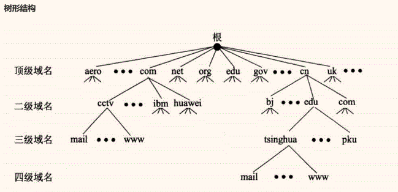
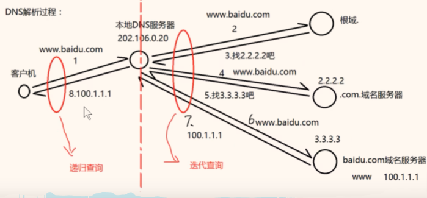

# 八、DNS部署与安全

## 8.1 DHCP

- 域名服务（Domain Name Service）
  
- 作用：为客户机提供域名解析服务器
  

## 8.2 域名组成

如w.sina.com.cn"是一个域名，从严格意义上讲，"sina.com.cn"才被称为域名（全球唯一），而"www"是主机 名。

"主机名.域名" 称为完全限定域名(FQDN)。一个域名下可以有多个主机，域名全球唯一，那么"主机.名域名"肯定也 是全球唯一的。

以"sina.com.cn"域名为例，一般管理员在命名其主机的时候会根据其主机的功能而命名，比如网站的是ww,博 客的是blog,论坛的是bbs,那么对应的FQDN为www.sina.com.cn，blog.sina.com.cn，bbs.sina.com.cn。这么 多个FQDN,然而我们只需要申请一个域名即"sina.com.cn"即可。

如：www.baidu.com.  
.为根域，一般情况下浏览器自动补全  
.com为顶级域  
baidu为一级域名  
www为主机名  
​  
FQDN=主机名.DNS后缀  
DQDN（完整合格的域名）

## 8.3 监听端口

- TCP 53
  
- UDP 53
  

## 8.4 DNS解析种类

**按照查询方式分类**

- 递归查询：客户机与本地DNS服务器之间（所问即所答）
  
- 迭代查询：本地DNS服务器与根等其他DNS服务器的解析过程（所问非所答）
  

**按照查询内容分类**

- 正向解析：已知域名，解析IP地址
  
- 反向解析：已知IP地址，解析域名
  

## 8.5 解析过程

**客户机域名请求解析顺序：**

DNS缓存 -- 本地hosts文件 -- 本地DNS服务器

**服务器对域名请求的处理顺序：**

DNS高速缓存 -- 本地区域解析文件 -- 转发器 -- 根

## 8.6 DNS服务器搭建过程

1）网卡设置静态ip

2）安装DNS服务器插件

3）开始->所有程序->管理工具->DNS->找到正向查找区域->右击->新建区域->主要区域->创建区域文件（负责一个域名后缀的解析，如baidu.com为域名后缀，一台DNS服务器内可存放多个区域文件）

4）右击->新建主机A记录 ->添加主机

5）查看创建的A记录。

**DNS转发器设置**

在服务器上右击属性->转发器->编辑->添加 8.8.8.8 dns服务器

**服务器上清除缓存**

windows服务器：dns工具–查看–高级，调出缓存来，然后右键清除缓存

## 8.7 相关命令

nslookup 域名/ip            # 查询DNS的记录，查看域名解析  
ipconfig /flushdns         # 清除dns缓存  
ipconfig /displaydns       # 查看dns缓存

## 8.8 域名解析记录类型

- A记录： 正向解析记录
  
- CNAME记录：别名
  
- PTR记录：反向解析记录
  
- MX：邮件交换记录
  
- NS：域名服务器解析
  

## 8.9 DNS服务器分类

- 主要名称服务器
  
- 辅助名称服务器 (备份服务器)
  
- 根名称服务器
  
- 高速缓存名称服务器
  

