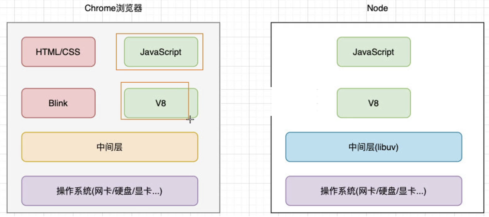
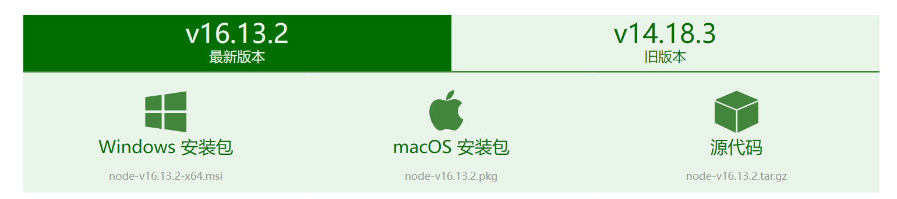
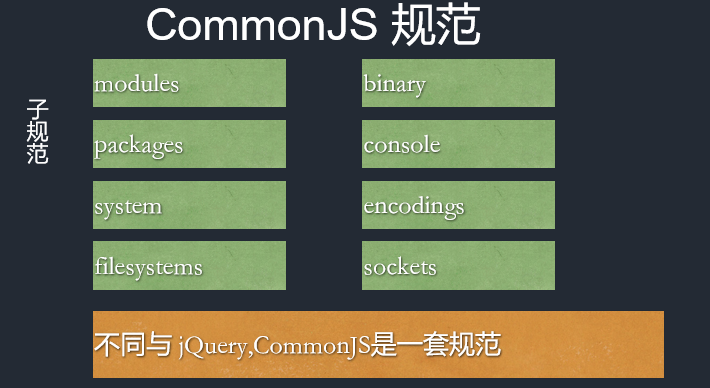
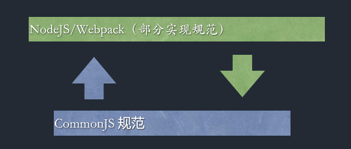
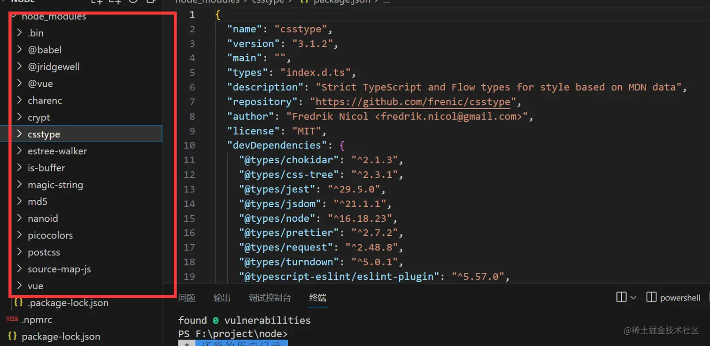
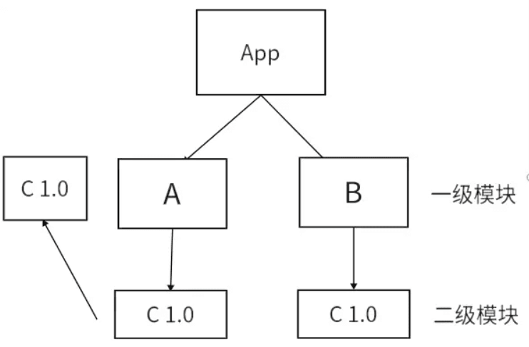
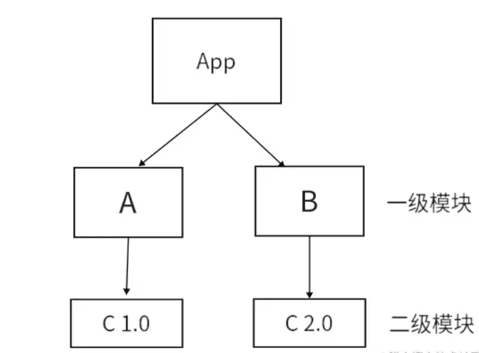
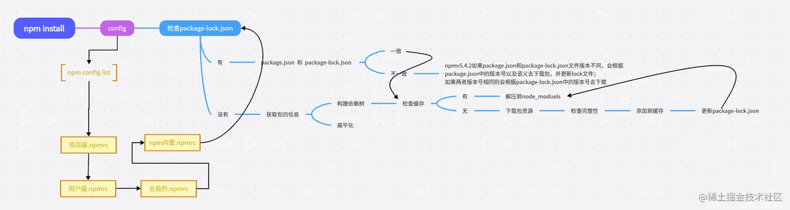

# 一、Node.js基础

## 1.  认识Node.js

> 1. nodejs 并不是`JavaScript`应用，也不是编程语言，因为编程语言使用的`JavaScript`，Nodejs是 `JavaScript`的运行时。
> 2. Nodejs是构建在V8引擎之上的，V8引擎是由C/C++编写的，因此我们的JavaSCript代码需要由C/C++转化后再执行。
> 3. NodeJs 使用异步 I/O 和事件驱动的设计理念，可以高效地处理大量并发请求，提供了非阻塞式 I/O 接口和事件循环机制，使得开发人员可以编写高性能、可扩展的应用程序,异步I/O最终都是由`libuv` 事件循环库去实现的。
> 4. NodeJs 使用npm 作为包管理工具类似于python的pip，或者是java的Maven，目前npm拥有上百万个模块。 [www.npmjs.com/](https://link.juejin.cn/?target=https%3A%2F%2Fwww.npmjs.com%2F)
> 5. nodejs适合干一些IO密集型应用，不适合CPU密集型应用，nodejsIO依靠libuv有很强的处理能力，而CPU因为nodejs单线程原因，容易造成CPU占用率高，如果非要做CPU密集型应用，可以使用C++插件编写 或者nodejs提供的`cluster`。(CPU密集型指的是图像的处理 或者音频处理需要大量数据结构 + 算法)

### 01 nodejs的特性

- Nodejs语法完全是js语法，只要你懂js基础就可以学会Nodejs后端开发
- NodeJs超强的高并发能力,实现高性能服务器
- 开发周期短、开发成本低、学习成本低

### 02 使用 Node.js 需要了解多少 JavaScript

> http://nodejs.cn/learn/how-much-javascript-do-you-need-to-know-to-use-nodejs

### 03 浏览器环境vs node环境



Node.js 可以解析JS代码（没有浏览器安全级别的限制）提供很多系统级别的API，如：

- 文件的读写 (File System)

  ```js
  const fs = require('fs')
  
  fs.readFile('./ajax.png', 'utf-8', (err, content) => {
    console.log(content)
  })
  ```

- 进程的管理 (Process)

  ```js
  function main(argv) {
    console.log(argv)
  }
  
  main(process.argv.slice(2))
  
  ```

- 网络通信 (HTTP/HTTPS)

  ```js
  const http = require("http")
  
  http.createServer((req,res) => {
    res.writeHead(200, {
      "content-type": "text/plain"
    })
    res.write("hello nodejs")
    res.end()
  }).listen(3000)
  
  ```

## 2.  开发环境搭建

> http://nodejs.cn/download/



## 3.  模块、包、commonJS

Nodejs 模块化规范遵循两套一 套`CommonJS`规范另一套`esm`规范


### 01 CommonJS规范





- 引入模块（require）支持四种格式

  1. 支持引入内置模块例如 `http` `os` `fs` `child_process` 等nodejs内置模块
  2. 支持引入第三方模块`express` `md5` `koa` 等
  3. 支持引入自己编写的模块 ./ ../ 等
  4. 支持引入addon C++扩展模块 `.node`文件
  5. 支持引入`json`文件

  ```js
  const fs = require('node:fs');       // 导入核心模块
  const express = require('express');  // 导入 node_modules 目录下的模块
  const myModule = require('./myModule.js');      // 导入相对路径下的模块
  const nodeModule = require('./myModule.node');  // 导入扩展模块
  const data = require('./data.json')             // 导入json文件
  ```

- 导出模块exports 和 module.exports
  ```js
  module.exports = {
    hello: function() {
      console.log('Hello, world!');
    }
  };
  
  // 如果不想导出对象直接导出值
  module.exports = 123
  ```

### 02 modules模块化规范写法

引入模块 `import` 必须写在头部

> 注意使用ESM模块的时候必须开启一个选项 打开`package.json` 设置 `type:module`

- 引入模块
  ```js
  import fs from 'node:fs'         // 导入核心模块
  import hello from './test.js'    // 导入相对路径下的模块
  
  // 如果要引入json文件需要特殊处理 需要增加断言并且指定类型json node低版本不支持（实验特性）
  import data from './data.json' assert { type: "json" };
  ```

  ```js
  import * as all from './test.js'   // 加载模块的整体对象
  console.log(all)  				   // 查看所有的导出
  ```

- 导出模块， default只能有一个不可重复export default
  ```js
  export const a = 1
  
  // 导出一个默认对象
  export default {
      name: 'test',
  }
  ```

### 03 Cjs 和 ESM 的区别

1. Cjs是基于运行时的同步加载，esm是基于编译时的异步加载
2. Cjs是可以修改值的，esm值并且不可修改（可读的）
3. Cjs不可以tree shaking，esm支持tree shaking
4. commonjs中顶层的this指向这个模块本身，而ES6中顶层this指向undefined

## 4.  Npm

`npm`（全称 Node Package Manager）是 Node.js 的包管理工具，它是一个基于命令行的工具，用于帮助开发者在自己的项目中安装、升级、移除和管理依赖项。

### 01 npm的使用

```js
npm init     // 初始化一个新的 npm 项目，创建 package.json 文件
npm install 包名 –g  （uninstall,update）    // 安装包，-g表示全局安装
npm install 包名 --save-dev (uninstall,update)  // 安装开发依赖，简写（npm i 包名 -D）
npm list -g  // 不加-g，列举当前目录下的安装包
npm info 包名（详细信息） npm info 包名 version(获取最新版本)
npm install md5@1  //安装指定版本
npm outdated   // 列出当前项目中需要更新的包。
npm config list  // 用于列出所有的 npm 配置信息。
npm config set registry 网址   // 切换镜像源
```

### 02 全局安装 nrm  

> NRM (npm registry manager)是npm的镜像源管理工具，有时候国外资源太慢，使用这个就可以快速地在 npm 源间切换。

`手动切换方法： npm config set registry https://registry.npm.taobao.org`

**安装 nrm**

在命令行执行命令，npm install -g nrm，全局安装nrm。

**使用 nrm**

执行命令 nrm ls 查看可选的源。 其中，带*的是当前使用的源，上面的输出表明当前源是官方源。

**切换 nrm**

如果要切换到taobao源，执行命令nrm use taobao。

**测试速度**

你还可以通过 nrm test 测试相应源的响应时间。

```shell
nrm test
```

> 

 ```bash
 npm install -g cnpm --registry=https://registry.npmmirror.com
 ```

### 03 yarn使用

```shell
npm install -g yarn
```

```js
对比npm:
	速度超快: Yarn 缓存了每个下载过的包，所以再次使用时无需重复下载。 同时利用并行下载以最大化资源利用率，因此安装速度更快。
    超级安全: 在执行代码之前，Yarn 会通过算法校验每个安装包的完整性。

开始新项目
	yarn init 
添加依赖包
	yarn add [package] 
	yarn add [package]@[version] 
	yarn add [package] --dev 
升级依赖包
	 yarn upgrade [package]@[version] 
移除依赖包
	 yarn remove [package]
	 
安装项目的全部依赖
	 yarn install 
```

### 04 Package json

执行npm init 便可以初始化一个package.json

1. `name`：项目名称，必须是唯一的字符串，通常采用小写字母和连字符的组合。
2. `version`：项目版本号，通常采用语义化版本号规范。
3. `description`：项目描述。
4. `main`：项目的主入口文件路径，通常是一个 JavaScript 文件。
5. `keywords`：项目的关键字列表，方便他人搜索和发现该项目。
6. `author`：项目作者的信息，包括姓名、邮箱、网址等。
7. `license`：项目的许可证类型，可以是自定义的许可证类型或者常见的开源许可证（如 MIT、Apache 等）。
8. `dependencies`：项目所依赖的包的列表，这些包会在项目运行时自动安装。
9. `devDependencies`：项目开发过程中所需要的包的列表，这些包不会随项目一起发布，而是只在开发时使用。
10. `peerDependencies`：项目的同级依赖，即项目所需要的模块被其他模块所依赖。
11. `scripts`：定义了一些脚本命令，比如启动项目、运行测试等。
12. `repository`：项目代码仓库的信息，包括类型、网址等。
13. `bugs`：项目的 bug 报告地址。
14. `homepage`：项目的官方网站地址或者文档地址。

> version 三段式版本号一般是1.0.0 大版本号 次版本号 修订号， 大版本号一般是有重大变化才会升级， 次版本号一般是增加功能进行升级， 修订号一般是修改bug进行升级

> npm install 安装模块的时候一般是扁平化安装的，但是有时候出现嵌套的情况是因为版本不同 A 依赖 C1.0, B 依赖 C1.0, D 依赖 C2.0, 此时C 1.0就会被放到A B的node_moduels, C2.0 会被放入D模块下面的node_moduels

### 05 Npm install 原理

> 首先安装的依赖都会存放在根目录的node_modules，默认采用扁平化的方式安装，并且排序规则.bin第一个然后@系列，再然后按照首字母排序abcd等，并且使用的算法是广度优先遍历，在遍历依赖树时，npm会首先处理项目根目录下的依赖，然后逐层处理每个依赖包的依赖，直到所有依赖都被处理完毕。在处理每个依赖时，npm会检查该依赖的版本号是否符合依赖树中其他依赖的版本要求，如果不符合，则会尝试安装适合的版本。



- **扁平化只是理想状态如下**
  
  - **安装某个二级模块时，若发现第一层级有相同名称，相同版本的模块，便直接复用那个模块**
  - 因为A模块下的C模块被安装到了第一级，这使得B模块能够复用处在同一级下；且名称，版本，均相同的C模块

- **非理想状态下**
  
  - 因为B和A所要求的依赖模块不同，（B下要求是v2.0的C，A下要求是v1.0的C ）所以B不能像2中那样复用A下的C v1.0模块 所以如果这种情况还是会出现模块冗余的情况，他就会给B继续搞一层node_modules，就是非扁平化了。

- **npm install 后续流程**



### 06 package-lock.json

很多朋友只知道这个东西可以锁定版本记录依赖树详细信息

- version 该参数指定了当前包的版本号
- resolved 该参数指定了当前包的下载地址
- integrity 用于验证包的完整性
- dev 该参数指定了当前包是一个开发依赖包
- bin 该参数指定了当前包中可执行文件的路径和名称
- engines 该参数指定了当前包所依赖的Node.js版本范围

知识点来了，package-lock.json 帮我们做了缓存，他会通过 `name + version + integrity` 信息生成一个唯一的key，这个key能找到对应的index-v5 下的缓存记录，也就是npm cache 文件夹下的。如果发现有缓存记录，就会找到tar包的hash值，然后将对应的二进制文件解压到node_modeules

### 07 npm 生命周期

```js
"predev": "node prev.js",
"dev": "node index.js",
"postdev": "node post.js"
```

执行 npm run dev 命令的时候 predev 会自动执行 他的生命周期是在dev之前执行，然后执行dev命令，再然后执行postdev，也就是dev之后执行

运用场景例如npm run build 可以在打包之后删除dist目录等等

post例如你编写完一个工具发布npm，那就可以在之后写一个ci脚本顺便帮你推送到git等等

谁用到了例如vue-cli [github.com/vuejs/vue-c…](https://link.juejin.cn/?target=https%3A%2F%2Fgithub.com%2Fvuejs%2Fvue-cli%2Fblob%2Fdev%2Fpackage.json)

### 08 npx

npx是一个命令行工具，它是npm 5.2.0版本中新增的功能。它允许用户在不安装全局包的情况下，运行已安装在本地项目中的包或者远程仓库中的包。

npx的作用是在命令行中运行node包中的可执行文件，而不需要全局安装这些包。这可以使开发人员更轻松地管理包的依赖关系，并且可以避免全局污染的问题。它还可以帮助开发人员在项目中使用不同版本的包，而不会出现版本冲突的问题。

**npx 的优势**

1. 避免全局安装：`npx`允许你执行npm package，而不需要你先全局安装它。
2. 总是使用最新版本：如果你没有在本地安装相应的npm package，`npx`会从npm的package仓库中下载并使用最新版。
3. 执行任意npm包：`npx`不仅可以执行在`package.json`的`scripts`部分定义的命令，还可以执行任何npm package。
4. 执行GitHub gist：`npx`甚至可以执行GitHub gist或者其他公开的JavaScript文件。

> npm 和 npx 区别：
>
> `npx`侧重于执行命令的，执行某个模块命令。虽然会自动安装模块，但是重在执行某个命令
>
> `npm`侧重于安装或者卸载某个模块的。重在安装，并不具备执行某个模块的功能。

### 09 发布npm包

- 方便团队或者跨团队共享代码，使用npm包就可以方便的管理，并且还可以进行版本控制
- 做开源造轮子必备技术，否则你做完的轮子如何让别人使用难道是U盘拷贝？
- 面试题我面字节的时候就问到了这个
- 增加个人IP 让更多的人知道你的技术能力和贡献

**下面的操作都要必须要用npm源才行**

1. 注册账号。也可以直接取官网注册，作用一样。
   ```bash
   # 打开网址注册账户
   npm adduser
   ```

2. 登录账号
   ```bash
   npm login
   ```

3. 发布包
   ```bash
   npm publish
   ```

   > 如果出现403说明包名被占用了 或 版本重复


## 5.  内置模块

### 01 全局变量

在nodejs中使用global定义全局变量，定义的变量。在浏览器中我们定义的全局变量都在window中。不同的环境还需要判断，于是在ECMAScript 2020 出现了一个`globalThis`全局变量，在nodejs环境会自动切换成global ，浏览器环境自动切换window非常方便。

```js
globalThis.name = 'yage'
```

关于其他全局API：

- `__dirname` ：当前模块的所在`目录`的绝对路径
- `__filename`：当前模块`文件`的绝对路径，包括文件名和文件扩展名
- `process` ：全局对象，可以在任何模块中直接访问，无需导入或定义。
- `Buffer` ： 全局对象，可以在任何模块中直接访问，无需导入或定义。

### 02 path模块

```js
const path = require('node:path')

// 1。返回文件名
console.log(path.basename(__filename))
// 2. 返回文件路径，正好和basename互补
console.log(path.dirname(__filename));
// 3. 返回文件后缀名
console.log(path.extname(__filename));
// 4. 拼接路径
console.log(path.join('./a', 'b', 'c'));
// 5. 返回绝对路径(如果都是绝对路径返回最后一个)
console.log(path.resolve('./a', 'b', 'c'))
// 6. 路径 --> 对象
console.log(path.parse(__filename));
// 7. 对象 --> 路径
console.log(path.format({
    root: 'e:\\',
    dir: 'e:\\DemoCode\\yage',
    base: 'main.js',
    ext: '.js',
    name: 'main'
}));
// 8. 路径分隔符
console.log(path.sep)
```

### 03 OS模块

```js
const os = require('node:os')

// 1. 获取操作系统平台 -- win32
console.log(os.platform())
// 2. 获取操作系统发行版本 -- 10.0.22631
console.log(os.release());
// 3. 获取操作系统类型 -- Windows_NT
console.log(os.type());
// 4. 获取操作系统版本 -- Windows 11 Pro
console.log(os.version());
// 5. 获取操作系统架构 -- x64
console.log(os.arch());
// 6. 获取操作系统用户目录 -- C:\Users\Administrator
console.log(os.homedir());
// 7. 获取操作系统CPU信息 -- [Object]
console.log(os.cpus());
// 8. 获取操作系统网络接口信息 -- [Object]
console.log(os.networkInterfaces());
```

### 04 process

```js
const path = require('node:process')

// 1. 获取操作系统信息，和os.arch()一样
console.log(process.arch);
// 2. 获取操作系统平台信息，和os.platform()一样
console.log(process.platform);
// 3. 获取命令行参数 -- [数组](前面2项是node路径和js文件路径，后面的是参数)
console.log(process.argv);
// 4. 获取当前工作目录(esm模式下用不了__dirname,可以用cwd代替)
console.log(process.cwd());
// 5. 获取内存使用情况
console.log(process.memoryUsage());
// 6. 退出进程
process.exit()
// 7. 杀死进程
process.kill(pid)
// 8. 获取环境变量(可以修改，但是只在当前进程下生效)
console.log(process.env);
```

### 05 child_process

创建一个新的子进程来执行指定的命令，共有`7个`API Sync同步API 不加是异步API。

- 以下命令都要一个可选项，options：
  - `cwd` 子进程的当前工作目录。默认值：`process.cwd()`。
  - `env` 环境变量键值对。默认值：`process.env`。
  - `encoding`默认值：`utf8`
  - `shell` 用于执行命令的 shell。参见 [Shell 要求](https://nodejs.cn/api/child_process.html#shell-requirements) 和 [默认 Windows shell](https://nodejs.cn/api/child_process.html#default-windows-shell)。默认值：Unix 上为 `/bin/sh`，Windows 上为 `process.env.ComSpec`。
  - `signal`允许使用 AbortSignal 中止子进程。
  - `timeout` 默认值：`0`
  - `maxBuffer` 标准输出或标准错误上允许的最大数据量（以字节为单位）。如果超过，则子进程将终止并截断任何输出。
  - `killSignal` 默认值：`SIGTERM`
  - `uid`  设置进程的用户身份。
  - `gid`设置进程的组标识。
  - `windowsHide` 隐藏通常在 Windows 系统上创建的子进程控制台窗口。默认值：`false`。

```js
const cp = require('child_process');

// 1. 执行shell命令，传参可以直接在后面加。
// ecec返回buffer，buffer的大小是200k，如果超出会报错。
// 异步
cp.exec('node -v',(err,stdout,stderr)=>{
    if(err){
        console.log(err);
    }else{
        console.log(stdout);
    }
})
//同步
const nodeVersion = cp.execSync('node -v');  // 返回buffer
console.log(nodeVersion.toString());

// 2. spawn 用于执行一些实时获取的信息，因为spawn返回的是流边执行边返回
// spawn在执行完成后会抛出close事件监听，并返回状态码，通过状态码可以知道子进程是否顺利执行。
const {stdout} = cp.spawn('netstat')
stdout.on('data',(msg)=>{
    console.log(msg.toString());
})
stdout.on('close',()=>{
    console.log('结束');
})

// 3. 执行可执行文件
cp.execFile('./bat.cmd',null,(err,stdout,stderr)=>{
    if(err){
        console.log(err);
    }else{
        console.log(stdout);
    }
})

// 4. 只能接受js模块，场景适合大量的计算，或者容易阻塞主进程操作的一些代码，就适合开发fork
const testProcess = fork('./test.js')
// 主进程向子进程发送消息和接受消息
testProcess.send('我是主进程')
testProcess.on('message',(res)=>{
    console.log('收到消息：',res);
})
// test.js  监听主进程发来的消息和发送消息
process.on('message',(msg)=>{
    console.log('收到消息：',msg);
})
process.send('我是子进程')
```

### 06  util模块

```js
const util = require('node:util');
const fs = require('node:fs');

// 1. 异步函数 --> promise
const readPromise = util.promisify(fs.readFile);
readPromise('main.less','utf-8').then(res=>{
    console.log(res)
}).catch(err=>{
    console.log(err)
})

// 2. promise --> 回调函数
const fn = (type) => {
    if(type == 1){
        return Promise.resolve('test')
    }
    return Promise.reject('error')
}

const callback = util.callbackify(fn)
callback(1222,(err,val)=>{
    console.log(err,val)
})

// 3. 格式化字符串
// %s：将参数作为字符串插入。
// %d 或 %i：将参数作为整数插入。
// %f：将参数作为浮点数插入，可选地指定小数位数（如 %f.2 表示两位小数）。
// %j：将参数（通常是对象或数组）作为 JSON 字符串插入。
// %o 或 %O：将参数（通常是对象）作为可供 console.log() 输出的格式插入。
// %%：插入一个字面的 '%' 符号。
console.log(util.format('%s---%s','name','age'));  // name---age
```

### 07 fs模块

在 Node.js 中，`fs` 模块是文件系统模块（File System module）的缩写，它提供了与文件系统进行交互的各种功能。通过 `fs` 模块，你可以执行诸如读取文件、写入文件、更改文件权限、创建目录等操作，`Node.js 核心API之一`。

1. fs支持同步和异步两种模式 增加了`Sync` fs 就会采用同步的方式运行代码，会阻塞下面的代码，不加Sync就是异步的模式不会阻塞。
2. fs新增了promise版本，只需要在引入包后面增加/promise即可，fs便可支持promise回调。
3. fs返回的是一个buffer二进制数据 每两个十六进制数字表示一个字节

```js
// 以下是三种方式使用示例，以下方法都可以使用这三种方式
const fs = require('node:fs')
const fs2 = require('node:fs/promises')

// 1. 读取文件，异步方式
fs.readFile('./data.txt',{
    encoding:'utf-8',
    flag:'r'
},(err,data)=>{
    if(err) throw err
    console.log(data);
})

// 2. 读取文件，同步方式
const data = fs.readFileSync('./data.txt',{
    encoding:'utf-8',
    flag:'r'
})
console.log(data);

// 3. 读取文件，promise方式
fs2.readFile('./data.txt',{
    encoding:'utf-8',
    flag:'r'
}).then(data=>{
    console.log(data);
}).catch(err=>{
    throw err
})
```

```js
const fs = require('node:fs')

// 1. 可读流（适合处理大文件）
const readStream = fs.createReadStream('./data.txt')
readStream.on('data', (chunk) => {
  console.log(chunk.toString())
})
readStream.on('end', () => {
  console.log('读取完成了')
})

// 2. 可写流（适合处理大文件）
const writeStream = fs.createWriteStream('./data.txt')
writeStream.write('hello')
writeStream.write('world')
writeStream.end()
writeStream.on('finish', () => {
  console.log('写入完成')
})

// 3. 写入文件
fs.writeFileSync('./data.txt','hello world')
// 追加文件
fs.writeFileSync('./data.txt','hello world',{
    flag:'a'
})
// 追加文件
fs.appendFileSync('./data.txt','hello world')

// 4. 创建文件夹（一般用同步）
fs.mkdirSync('./test')
// 递归创建
fs.mkdirSync('./test/test2',{
    recursive:true
})

// 5. 删除文件夹
fs.rmdirSync('./test')
// 递归删除
fs.rmdirSync('./test/test2',{
    recursive:true
})

// 6. 删除文件或文件夹,也可以递归删除
fs.rmSync('./data.txt')

// 7. 重命名文件
fs.renameSync('./data.txt','./dataNew.txt')

// 8. 监听文件变化 -- change data.txt
fs.watch('./data.txt',(eventType,filename)=>{
    console.log(eventType,filename)
})

// 9. 监控文件元数据变化,文件的大小、修改时间（mtime）、访问时间（atime）等
fs.watchFile('data.txt', (curr, prev) => {
  console.log(`the current mtime is: ${curr.mtime}`)
  console.log(`the previous mtime was: ${prev.mtime}`)
})

// 10. 创建硬链接（共享内存地址）
fs.linkSync('./index.txt', './index2.txt') 

//  11. 创建软链接
fs.symlinkSync('./index.txt', './index3.txt' ,"file") //软连接
```

```js
const fs = require('fs')

// pipe()能把一个文件流和另一个文件流串起
const readstream = fs.createReadStream('./1.txt')
const writestream = fs.createWriteStream('./2.txt')

readstream.pipe(writestream)
```

### 08 crypto

- 对称加密

```js
const crypto = require('node:crypto');

// 生成一个随机的 16 字节的初始化向量 (IV)
const iv = Buffer.from(crypto.randomBytes(16));

// 生成一个随机的 32 字节的密钥
const key = crypto.randomBytes(32);

// 创建加密实例，使用 AES-256-CBC 算法，提供密钥和初始化向量
const cipher = crypto.createCipheriv("aes-256-cbc", key, iv);

// 对输入数据进行加密，并输出加密结果的十六进制表示
cipher.update("小满zs", "utf-8", "hex");
const result = cipher.final("hex");
console.log(result);

// 解密
const de = crypto.createDecipheriv("aes-256-cbc", key, iv);
de.update(result, "hex");
const decrypted = de.final("utf-8");
console.log("Decrypted:", decrypted);
```

- 非对称加密

```js
const crypto = require('node:crypto')
// 生成 RSA 密钥对
const { privateKey, publicKey } = crypto.generateKeyPairSync('rsa', {
  modulusLength: 2048,
});

// 要加密的数据
const text = '小满zs';

// 使用公钥进行加密
const encrypted = crypto.publicEncrypt(publicKey, Buffer.from(text, 'utf-8'));
console.log(encrypted.toString("hex"));  // 查看加密后16进制数据

// 使用私钥进行解密
const decrypted = crypto.privateDecrypt(privateKey, encrypted);
console.log(decrypted.toString());      // 解密
```

- 哈希函数

```js
const crypto = require('node:crypto');


const md5 = (data) => {
    // 创建哈希对象，并使用 MD5 算法
    const hash = crypto.createHash('md5');
    // 更新哈希对象的数据,update()方法需要一个字符串或Buffer类型的参数
    hash.update(String(data));
    // 计算哈希值，并以十六进制字符串形式输出
    return hash.digest('hex');
};

console.log(md5(123456));
```

### 09 Zlib

在 Node.js 中，`zlib` 模块提供了对数据压缩和解压缩的功能，以便在应用程序中减少数据的传输大小和提高性能。该模块支持多种压缩算法，包括 Deflate、Gzip 和 Raw Deflate。

- `Gzip` 算法

```js
const zlib = require('zlib'); // zlib 模块提供数据压缩和解压缩功能
const fs = require('node:fs'); // 引入 Node.js 的 fs 模块用于文件操作

// 1. gzip压缩文件
// 创建可读流和可写流
const readStream = fs.createReadStream('index.txt'); 
const writeStream = fs.createWriteStream('index.txt.gz'); 
// 使用管道将可读流中的数据通过 Gzip 压缩，再通过管道传输到可写流中进行写入
readStream.pipe(zlib.createGzip()).pipe(writeStream)

// 2. gzip解压文件
const readStream = fs.createReadStream('index.txt.gz')
const writeStream = fs.createWriteStream('index2.txt')
readStream.pipe(zlib.createGunzip()).pipe(writeStream)
```

- `Deflate` 算法

```js
// 1. Deflate压缩文件
const readStream = fs.createReadStream('index.txt'); 
const writeStream = fs.createWriteStream('index.txt.deflate'); 
readStream.pipe(zlib.createDeflate()).pipe(writeStream);

// 2. Deflate解压文件
const readStream = fs.createReadStream('index.txt.deflate')
const writeStream = fs.createWriteStream('index3.txt')
readStream.pipe(zlib.createInflate()).pipe(writeStream)
```

gzip 和 deflate 区别

1.  Deflate 是一种具体的压缩算法，基于 LZ77 算法（Lempel-Ziv coding）和 Huffman 编码的结合，用于减少数据存储或传输所需的字节数。它是无损压缩，意味着解压后能够恢复原始数据。
2. Gzip 格式内部使用 Deflate 算法作为其核心的压缩机制。当你使用 Gzip 对数据进行压缩时，实际上是先使用 Deflate 算法对数据进行压缩，然后再将其封装在一个包含特定头部信息（如文件名、修改时间、CRC校验等）和尾部信息的 Gzip 容器中。

```js
// http请求压缩
const zlib = require('zlib'); 
const http = require('node:http'); 
const server = http.createServer((req,res)=>{
    const txt = '小满zs'.repeat(10000);
    
    res.writeHead(200,{ 
      // 'Content-Encoding':'gzip',
        'Content-Encoding':'deflate',
        'content-type':'text/plan;charset=utf-8'
    })
   
    const result = zlib.deflateSync(txt);
    res.end(result)
})

server.listen(80)
```

### 	10   url模块

`url.parse`方法因为采用的是传统的`urlObject`，不符合现行的URL标准-WHATWG URL API，因此被官方弃用了。同时，与之相关的`url.format()`和`url.resolve()`方法也被弃用。官方推荐使用新的`URL`类来替代这些方法。

```js
const urlStr = 'https://www.baidu.com:443/ad/index.html?id=8&name=mouse#tag=110';
const url1 = new URL(urlStr);
const url2 = new URL('/admin', 'http://127.0.0.1);
console.log(url1,url2)
// 获取查询参数的值
console.log(url.searchParams.get('id'));
```

### 11  http模块

```js
const http = require('node:http'); // 引入 http 模块
const url = require('node:url'); // 引入 url 模块

// 创建 HTTP 服务器，并传入回调函数用于处理请求和生成响应
http.createServer((req, res) => {
  // 解析请求的 URL，获取路径和查询参数
  const { pathname, query } = url.parse(req.url, true); 

  if (req.method === 'POST') { // 检查请求方法是否为 POST
    if (pathname === '/login') { // 检查路径是否为 '/login'
      let data = '';
      req.on('data', (chunk) => {
        data += chunk;    // 获取 POST 请求的数据
        console.log(data);
      });
      req.on('end', () => {
         // 设置响应头的 Content-Type 为 'application/json'
        res.setHeader('Content-Type', 'application/json');
        res.statusCode = 200; // 设置响应状态码为 200
        res.end(data); // 将获取到的数据作为响应体返回
      });
    } else {
      // 设置响应头的 Content-Type 为 'application/json'
      res.setHeader('Content-Type', 'application/json'); 
      res.statusCode = 404; // 设置响应状态码为 404
      res.end('Not Found'); // 返回 'Not Found' 作为响应体
    }
  } else if (req.method === 'GET') { // 检查请求方法是否为 GET
    if (pathname === '/index') {  // 检查路径是否为 '/index'
      console.log(query.a); 	// 打印查询参数中的键名为 'a' 的值
      res.end('get success');   // 返回 'get success' 作为响应体
    }
  }
}).listen(8080, () => {
  console.log('server is running on port 8080'); // 打印服务器启动的信息
});
```

### 12 Http动静分离

动静分离是一种在Web服务器架构中常用的优化技术，旨在提高网站的性能和可伸缩性。它基于一个简单的原则：将动态生成的内容（如动态网页、API请求）与静态资源（如HTML、CSS、JavaScript、图像文件）分开处理和分发。

这里静态资源使用缓存提高效率。

```js
import http from 'node:http' // 导入http模块
import fs from 'node:fs' // 导入文件系统模块
import path from 'node:path' // 导入路径处理模块
import mime from 'mime' // 导入mime模块

const server = http.createServer((req, res) => {
    const { url, method } = req

    // 处理静态资源
    if (method === 'GET' && url.startsWith('/static')) {
        const filePath = path.join(process.cwd(), url) // 获取文件路径
        const mimeType = mime.getType(filePath) // 获取文件的MIME类型
        console.log(mimeType) // 打印MIME类型

        fs.readFile(filePath, (err, data) => { // 读取文件内容
            if (err) {
                res.writeHead(404, {
                    "Content-Type": "text/plain" // 设置响应头为纯文本类型
                })
                res.end('not found') // 返回404 Not Found
            } else {
                res.writeHead(200, {
                    "Content-Type": mimeType, // 设置响应头为对应的MIME类型
                    "Cache-Control": "public, max-age=3600" // 设置缓存控制头
                })
                res.end(data) // 返回文件内容
            }
        })
    }

    // 处理动态资源
    if ((method === 'GET' || method === 'POST') && url.startsWith('/api')) {
        // ...处理动态资源的逻辑
    }
})

server.listen(80) // 监听端口80
```

### 	12  http模块补充

**12.1 接口：jsonp**

```js
const http = require('http')
const url = require('url')

const app = http.createServer((req, res) => {
  let urlObj = url.parse(req.url, true)

  switch (urlObj.pathname) {
    case '/api/user':
      res.end(`${urlObj.query.cb}({"name": "gp145"})`)
      break
    default:
      res.end('404.')
      break
  }
})

app.listen(8080, () => {
  console.log('localhost:8080')
})
```

**12.2 跨域：CORS**

```js
const http = require('http')
const url = require('url')
const querystring = require('querystring')

const app = http.createServer((req, res) => {
  let data = ''
  let urlObj = url.parse(req.url, true)

  res.writeHead(200, {
    'content-type': 'application/json;charset=utf-8',
    'Access-Control-Allow-Origin': '*'
  })

  req.on('data', (chunk) => {
    data += chunk
  })

  req.on('end', () => {
    responseResult(querystring.parse(data))
  })

  function responseResult(data) {
    switch (urlObj.pathname) {
      case '/api/login':
        res.end(JSON.stringify({
          message: data
        }))
        break
      default:
        res.end('404.')
        break
    }
  }
})

app.listen(8080, () => {
  console.log('localhost:8080')
})
```
**12.3 模拟get**

```js
var http = require('http')
var https = require('https')

// 1、接口 2、跨域
const server = http.createServer((request, response) => {
  var url = request.url.substr(1)

  var data = ''

  response.writeHeader(200, {
    'content-type': 'application/json;charset=utf-8',
    'Access-Control-Allow-Origin': '*'
  })

  https.get(`https://m.lagou.com/listmore.json${url}`, (res) => {

    res.on('data', (chunk) => {
      data += chunk
    })

    res.on('end', () => {
      response.end(JSON.stringify({
        ret: true,
        data
      }))
    })
  })

})

server.listen(8080, () => {
  console.log('localhost:8080')
})
```

**12.4 模拟post：服务器提交（攻击）**

```js
const https = require('https')
const querystring = require('querystring')

const postData = querystring.stringify({
  province: '上海',
  city: '上海',
  district: '宝山区',
  address: '同济支路199号智慧七立方3号楼2-4层',
  latitude: 43.0,
  longitude: 160.0,
  message: '求购一条小鱼',
  contact: '13666666',
  type: 'sell',
  time: 1571217561
})

const options = {
  protocol: 'https:',
  hostname: 'ik9hkddr.qcloud.la',
  method: 'POST',
  port: 443,
  path: '/index.php/trade/add_item',
  headers: {
    'Content-Type': 'application/x-www-form-urlencoded',
    'Content-Length': Buffer.byteLength(postData)
  }
}

function doPost() {
  let data

  let req = https.request(options, (res) => {
    res.on('data', chunk => data += chunk)
    res.on('end', () => {
      console.log(data)
    })
  })

  req.write(postData)
  req.end()
}

// setInterval(() => {
//   doPost()
// }, 1000)
```

**12.5 爬虫**

```js
const https = require('https')
const http = require('http')
const cheerio = require('cheerio')

http.createServer((request, response) => {
  response.writeHead(200, {
    'content-type': 'application/json;charset=utf-8'
  })

  const options = {
    // protocol: 'https:',
    hostname: 'i.maoyan.com',
    port: 443,
    path: '/',
    method: 'GET'
  }

  const req = https.request(options, (res) => {
    let data = ''
    res.on('data', (chunk) => {
      data += chunk
    })

    res.on('end', () => {
      filterData(data)
    })
  })

  function filterData(data) {
    //   console.log(data)
    let $ = cheerio.load(data)
    let $movieList = $('.column.content')
    console.log($movieList)
    let movies = []
    $movieList.each((index, value) => {
      movies.push({
        title: $(value).find('.movie-title .title').text(),
        detail: $(value).find('.detail .actor').text(),
      })
    })

    response.end(JSON.stringify(movies))
  }

  req.end()
}).listen(3000)
```

### 	13  event模块

```js
const EventEmitter = require('events')

class MyEventEmitter extends EventEmitter {}

const event = new MyEventEmitter()

event.on('play', (movie) => {
  console.log(movie)
})

event.emit('play', '我和我的祖国')
event.emit('play', '中国机长')
```

## 6. 外置模块

### md5

```js
const md5 = require('md5');

console.log(md5(123456));
```

### http-proxy-middleware

反向代理（Reverse Proxy）是一种网络通信模式，它充当服务器和客户端之间的中介，将客户端的请求转发到一个或多个后端服务器，并将后端服务器的响应返回给客户端。

```js
// index.js    实现层
const http = require('node:http');
const fs = require('node:fs')
const url = require('node:url')
const {createProxyMiddleware} = require('http-proxy-middleware')
const config = require('./proxy.config.js')
const html = fs.readFileSync('./index.html')  //给html文件起个服务

const server = http.createServer((req, res) => {
    const {pathname} = url.parse(req.url)
    const proxyList = Object.keys(config.server.proxy) //获取代理的路径
    //如果请求的路径在里面匹配到 就进行代理
    if(proxyList.includes(pathname)){ 
        const proxy = createProxyMiddleware(config.server.proxy[pathname]) //代理
        proxy(req,res)
        return
    }
    console.log(proxyList)
    res.writeHead(200, {
        'Content-Type': 'text/html'
    })
    res.end(html) //返回html

})

server.listen(80) //监听端口
```

```js
// proxy.config.js    配置proxy代理
module.exports = {
    server:{
        proxy:{
        //代理的路径
            '/api': {
                target: 'http://localhost:3000', //转发的地址
                changeOrigin: true, //是否有跨域
                // 可以重写路由
                // rewirte:(path)=>{
                //     return path.replace('/api','')
                // }
            }
        }
    }
}
```

```js
// server.js   配置服务器
const http = require('node:http')
const url = require('node:url')

http.createServer((req, res) => {
    const {pathname} = url.parse(req.url)
    if(pathname === '/api'){
        res.end('success proxy')
    }
    
}).listen(3000)
```

### nodemailder

```js
const nodemailder = require('nodemailer')

const transPort = nodemailder.createTransport({
    service: "qq",
    port: 587,
    host: 'smtp.qq.com',
    secure: true,
    auth: {
        user: '26694482@qq.com',
        pass: 'lyjtrugqajrebgec'
    }
})

transPort.sendMail({
  to: '26694482@qq.com',
  from: '26694482@qq.com',
  subject: 'test',
  text: 'ok,200'
})
```

## 7.   路由

### 	01   基础

```js
/*
 * @作者: kerwin
 * @公众号: 大前端私房菜
 */
var fs = require("fs")
var path = require("path")

function render(res, path) {
    res.writeHead(200, { "Content-Type": "text/html;charset=utf8" })
    res.write(fs.readFileSync(path, "utf8"))
    res.end()
}


const route = {
    "/login": (req, res) => {
        render(res, "./static/login.html")
    },

    "/home": (req, res) => {
        render(res, "./static/home.html")
    },
    "/404": (req, res) => {
        res.writeHead(404, { "Content-Type": "text/html;charset=utf8" })
        res.write(fs.readFileSync("./static/404.html", "utf8"))
    }
}


```

### 02   获取参数

get请求

```js
    "/api/login":(req,res)=>{
        const myURL = new URL(req.url, 'http://127.0.0.1:3000');
        console.log(myURL.searchParams.get("username"))   
        render(res,`{ok:1}`)
    }
```

post请求

```js
"/api/login": (req, res) => {
        var post = '';
        // 通过req的data事件监听函数，每当接受到请求体的数据，就累加到post变量中
        req.on('data', function (chunk) {
            post += chunk;
        });

        // 在end事件触发后，通过querystring.parse将post解析为真正的POST请求格式，然后向客户端返回。
        req.on('end', function () {
            post = JSON.parse(post);
            render(res, `{ok:1}`)
        });
    }
```


### 03   静态资源处理

```js
function readStaticFile(req, res) {
    const myURL = new URL(req.url, 'http://127.0.0.1:3000')
    var filePathname = path.join(__dirname, "/static", myURL.pathname);

    if (fs.existsSync(filePathname)) {
        // console.log(1111)
        res.writeHead(200, { "Content-Type": `${mime.getType(myURL.pathname.split(".")[1])};charset=utf8` })
        res.write(fs.readFileSync(filePathname, "utf8"))
        res.end()
        return true
    } else {
        return false
    }
}
```
