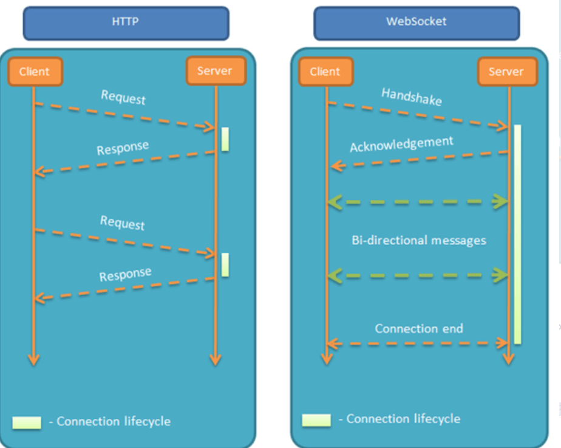

# 十、Socket编程

## 1.websocket介绍



**应用场景：**

- 弹幕

- 媒体聊天

- 协同编辑

- 基于位置的应用

- 体育实况更新

- 股票基金报价实时更新


WebSocket并不是全新的协议，而是利用了HTTP协议来建立连接。我们来看看WebSocket连接是如何创建的。

首先，WebSocket连接必须由浏览器发起，因为请求协议是一个标准的HTTP请求，格式如下：

```js
GET ws://localhost:3000/ws/chat HTTP/1.1
Host: localhost
Upgrade: websocket
Connection: Upgrade
Origin: http://localhost:3000
Sec-WebSocket-Key: client-random-string
Sec-WebSocket-Version: 13
```

该请求和普通的HTTP请求有几点不同：

1. GET请求的地址不是类似`/path/`，而是以`ws://`开头的地址；
2. 请求头`Upgrade: websocket`和`Connection: Upgrade`表示这个连接将要被转换为WebSocket连接；
3. `Sec-WebSocket-Key`是用于标识这个连接，并非用于加密数据；
4. `Sec-WebSocket-Version`指定了WebSocket的协议版本。

随后，服务器如果接受该请求，就会返回如下响应：

```
HTTP/1.1 101 Switching Protocols
Upgrade: websocket
Connection: Upgrade
Sec-WebSocket-Accept: server-random-string
```

该响应代码`101`表示本次连接的HTTP协议即将被更改，更改后的协议就是`Upgrade: websocket`指定的WebSocket协议。

版本号和子协议规定了双方能理解的数据格式，以及是否支持压缩等等。如果仅使用WebSocket的API，就不需要关心这些。

现在，一个WebSocket连接就建立成功，浏览器和服务器就可以随时主动发送消息给对方。消息有两种，一种是文本，一种是二进制数据。通常，我们可以发送JSON格式的文本，这样，在浏览器处理起来就十分容易。

为什么WebSocket连接可以实现全双工通信而HTTP连接不行呢？实际上HTTP协议是建立在TCP协议之上的，TCP协议本身就实现了全双工通信，但是HTTP协议的请求－应答机制限制了全双工通信。WebSocket连接建立以后，其实只是简单规定了一下：接下来，咱们通信就不使用HTTP协议了，直接互相发数据吧。

安全的WebSocket连接机制和HTTPS类似。首先，浏览器用`wss://xxx`创建WebSocket连接时，会先通过HTTPS创建安全的连接，然后，该HTTPS连接升级为WebSocket连接，底层通信走的仍然是安全的SSL/TLS协议。

**浏览器支持**

很显然，要支持WebSocket通信，浏览器得支持这个协议，这样才能发出`ws://xxx`的请求。目前，支持WebSocket的主流浏览器如下：

- Chrome
- Firefox
- IE >= 10
- Sarafi >= 6
- Android >= 4.4
- iOS >= 8

**服务器支持**

由于WebSocket是一个协议，服务器具体怎么实现，取决于所用编程语言和框架本身。Node.js本身支持的协议包括TCP协议和HTTP协议，要支持WebSocket协议，需要对Node.js提供的HTTPServer做额外的开发。已经有若干基于Node.js的稳定可靠的WebSocket实现，我们直接用npm安装使用即可。

## 2.ws模块

服务器：

```js
const  WebSocket = require("ws")
WebSocketServer = WebSocket.WebSocketServer
const wss = new WebSocketServer({ port: 8080 });
wss.on('connection', function connection(ws) {
    ws.on('message', function message(data, isBinary) {
        wss.clients.forEach(function each(client) {
            if (client !== ws && client.readyState === WebSocket.OPEN) {
                client.send(data, { binary: isBinary });
            }
        });

    });

    ws.send('欢迎加入聊天室');
});
```

客户端：

```js
var ws = new WebSocket("ws://localhost:8080")
ws.onopen = ()=>{
    console.log("open")
}
ws.onmessage = (evt)=>{
    console.log(evt.data)
}
```

授权验证：


```js
//前端
var ws = new WebSocket(`ws://localhost:8080?token=${localStorage.getItem("token")}`)
ws.onopen = () => {
      console.log("open")
      ws.send(JSON.stringify({
        type: WebSocketType.GroupList
      }))
    }
ws.onmessage = (evt) => {
    console.log(evt.data)
}
//后端
const WebSocket = require("ws");
const JWT = require('../util/JWT');
WebSocketServer = WebSocket.WebSocketServer
const wss = new WebSocketServer({ port: 8080 });
wss.on('connection', function connection(ws, req) {
  const myURL = new URL(req.url, 'http://127.0.0.1:3000');
  const payload = JWT.verify(myURL.searchParams.get("token"))
  if (payload) {
    ws.user = payload
    ws.send(createMessage(WebSocketType.GroupChat, ws.user, "欢迎来到聊天室"))

    sendBroadList() //发送好友列表
  } else {
    ws.send(createMessage(WebSocketType.Error, null, "token过期"))
  }
  // console.log(3333,url)
  ws.on('message', function message(data, isBinary) {
    const messageObj = JSON.parse(data)
    switch (messageObj.type) {
      case WebSocketType.GroupList:
        ws.send(createMessage(WebSocketType.GroupList, ws.user, JSON.stringify(Array.from(wss.clients).map(item => item.user))))
        break;
      case WebSocketType.GroupChat:
        wss.clients.forEach(function each(client) {
          if (client !== ws && client.readyState === WebSocket.OPEN) {
            client.send(createMessage(WebSocketType.GroupChat, ws.user, messageObj.data));
          }
        });
        break;
      case WebSocketType.SingleChat:
        wss.clients.forEach(function each(client) {
          if (client.user.username === messageObj.to && client.readyState === WebSocket.OPEN) {
            client.send(createMessage(WebSocketType.SingleChat, ws.user, messageObj.data));
          }
        });
        break;
    }

    ws.on("close",function(){
      //删除当前用户
      wss.clients.delete(ws.user)
      sendBroadList() //发送好用列表
    })
  });

});
const WebSocketType = {
  Error: 0, //错误
  GroupList: 1,//群列表
  GroupChat: 2,//群聊
  SingleChat: 3//私聊
}
function createMessage(type, user, data) {
  return JSON.stringify({
    type: type,
    user: user,
    data: data
  });
}

function sendBroadList(){
  wss.clients.forEach(function each(client) {
    if (client.readyState === WebSocket.OPEN) {
      client.send(createMessage(WebSocketType.GroupList, client.user, JSON.stringify(Array.from(wss.clients).map(item => item.user))))
    }
  });
}
```


## 3.socket.io模块

服务端：

```js
const io = require('socket.io')(server);
io.on('connection', (socket) => {

  const payload = JWT.verify(socket.handshake.query.token)
  if (payload) {
    socket.user = payload
    socket.emit(WebSocketType.GroupChat, createMessage(socket.user, "欢迎来到聊天室"))
    sendBroadList() //发送好友列表
  } else {
    socket.emit(WebSocketType.Error, createMessage(null, "token过期"))
  }


  socket.on(WebSocketType.GroupList, () => {
    socket.emit(WebSocketType.GroupList, createMessage(null, Array.from(io.sockets.sockets).map(item => item[1].user).filter(item=>item)));
  })

  socket.on(WebSocketType.GroupChat, (messageObj) => {
    socket.broadcast.emit(WebSocketType.GroupChat, createMessage(socket.user, messageObj.data));
  })

  socket.on(WebSocketType.SingleChat, (messageObj) => {
    Array.from(io.sockets.sockets).forEach(function (socket) {
      if (socket[1].user.username === messageObj.to) {
        socket[1].emit(WebSocketType.SingleChat, createMessage(socket[1].user, messageObj.data));
      }
    })
  })

  socket.on('disconnect', reason => {
     
     sendBroadList() //发送好用列表
  });

});

function sendBroadList() {
  io.sockets.emit(WebSocketType.GroupList, createMessage(null, Array.from(io.sockets.sockets).map(item => item[1].user).filter(item=>item)))
}
//最后filter，是因为 有可能存在null的值

```

客户端：

```js
const WebSocketType = {
    Error: 0, //错误
    GroupList: 1, //群列表
    GroupChat: 2, //群聊
    SingleChat: 3 //私聊
}


const socket = io(`ws://localhost:3000?token=${localStorage.getItem("token")}`);
socket.on("connect",()=>{
	socket.emit(WebSocketType.GroupList)
})
socket.on(WebSocketType.GroupList, (messageObj) => {
    select.innerHTML = ""
    select.innerHTML = `<option value="all">all</option>` + messageObj.data.map(item => `
    <option value="${item.username}">${item.username}</option>`).join("")
})

socket.on(WebSocketType.GroupChat, (msg) => {
	console.log(msg)
})

socket.on(WebSocketType.SingleChat, (msg) => {
	console.log(msg)
})

socket.on(WebSocketType.Error, (msg) => {
    localStorage.removeItem("token")
    location.href = "/login"
})

send.onclick = () => {
    if (select.value === "all") {
        socket.emit(WebSocketType.GroupChat,{
            data: text.value
        })
    } else {
        socket.emit(WebSocketType.SingleChat,{
            data: text.value,
            to:select.value
        })
    }
}
```


