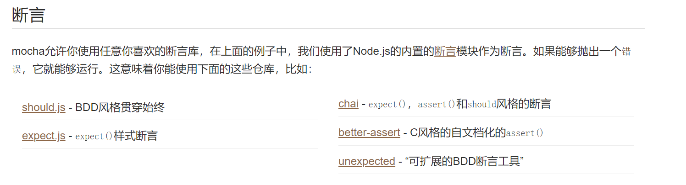

# 十一、mocha

单元测试是用来对一个模块、一个函数或者一个类来进行正确性检验的测试工作。

比如对函数abs()，我们可以编写出以下几个测试用例：

输入正数，比如1、1.2、0.99，期待返回值与输入相同；

输入负数，比如-1、-1.2、-0.99，期待返回值与输入相反；

输入0，期待返回0；

输入非数值类型，比如null、[]、{}，期待抛出Error。

把上面的测试用例放到一个测试模块里，就是一个完整的单元测试。

如果单元测试通过，说明我们测试的这个函数能够正常工作。如果单元测试不通过，要么函数有bug，要么测试条件输入不正确，总之，需要修复使单元测试能够通过。

单元测试通过后有什么意义呢？如果我们对abs()函数代码做了修改，只需要再跑一遍单元测试，如果通过，说明我们的修改不会对abs()函数原有的行为造成影响，如果测试不通过，说明我们的修改与原有行为不一致，要么修改代码，要么修改测试。

这种以测试为驱动的开发模式最大的好处就是确保一个程序模块的行为符合我们设计的测试用例。在将来修改的时候，可以极大程度地保证该模块行为仍然是正确的。

mocha是JavaScript的一种单元测试框架，既可以在浏览器环境下运行，也可以在Node.js环境下运行。

使用mocha，我们就只需要专注于编写单元测试本身，然后，让mocha去自动运行所有的测试，并给出测试结果。

mocha的特点主要有：

1. 既可以测试简单的JavaScript函数，又可以测试异步代码，因为异步是JavaScript的特性之一；
2. 可以自动运行所有测试，也可以只运行特定的测试；
3. 可以支持before、after、beforeEach和afterEach来编写初始化代码。

## 1.编写测试

```js
const assert = require('assert');
const sum = require('../test');
describe('#hello.js', () => {

    describe('#sum()', () => {
        it('sum() should return 0', () => {
            assert.strictEqual(sum(), 0);
        });

        it('sum(1) should return 1', () => {
            assert.strictEqual(sum(1), 1);
        });

        it('sum(1, 2) should return 3', () => {
            assert.strictEqual(sum(1, 2), 3);
        });

        it('sum(1, 2, 3) should return 6', () => {
            assert.strictEqual(sum(1, 2, 3), 6);
        });
    });
});
```


## 2.chai断言库




```js
var chai = require('chai')
var assert = chai.assert;

describe('assert Demo', function () {
    it('use assert lib', function () {
        var value = "hello";
        assert.typeOf(value, 'string')
        assert.equal(value, 'hello')
        assert.lengthOf(value, 5)
    })
})

```

```js
var chai = require('chai');
chai.should();

describe('should Demo', function(){
    it('use should lib', function () {
        var value = 'hello'
        value.should.exist.and.equal('hello').and.have.length(5).and.be.a('string')
        // value.should.be.a('string')
        // value.should.equal('hello')
        // value.should.not.equal('hello2')
        // value.should.have.length(5);
    })
});

```

```js
var chai = require('chai');
var expect = chai.expect;

describe('expect Demo', function() {
    it('use expect lib', function () {
        var value = 'hello'
        var number = 3

        expect(number).to.be.at.most(5)
        expect(number).to.be.at.least(3)
        expect(number).to.be.within(1, 4)

        expect(value).to.exist
        expect(value).to.be.a('string')
        expect(value).to.equal('hello')
        expect(value).to.not.equal('您好')
        expect(value).to.have.length(5)
    })
});

```


## 3.异步测试

```js
var fs =require("fs").promises
var chai = require('chai');
var expect = chai.expect;
it('test async function',async function () {
    const data =await fs.readFile('./1.txt',"utf8");
    expect(data).to.equal('hello')
});
```


## 4.http测试

```js
const request = require('supertest')
const app = require('../app');

describe('#test koa app', () => {
    let server = app.listen(3000);
    describe('#test server', () => {
        it('#test GET /', async () => {
            await request(server)
                .get('/')
                .expect('Content-Type', /text\/html/)
                .expect(200, '<h1>hello world</h1>');
        });

        after(function () {
            server.close()
        });
    });
});
```


## 5.钩子函数

```js
describe('#hello.js', () => {
    describe('#sum()', () => {
        before(function () {
            console.log('before:');
        });

        after(function () {
            console.log('after.');
        });

        beforeEach(function () {
            console.log('  beforeEach:');
        });

        afterEach(function () {
            console.log('  afterEach.');
        });
    });
});
```