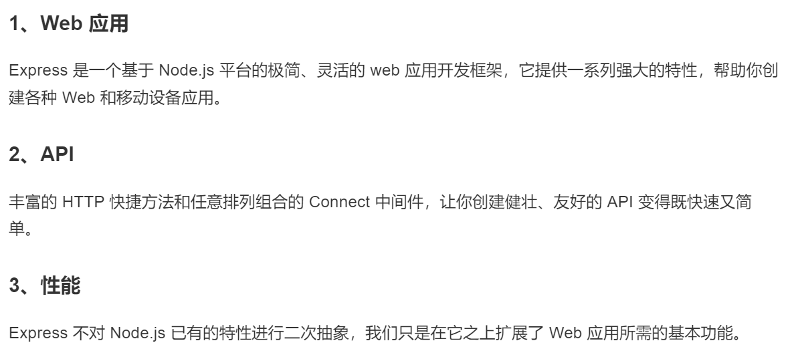
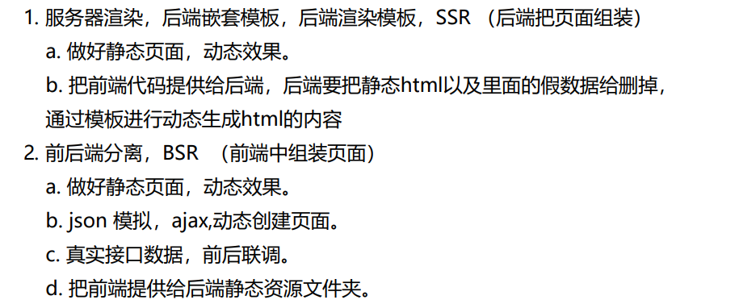
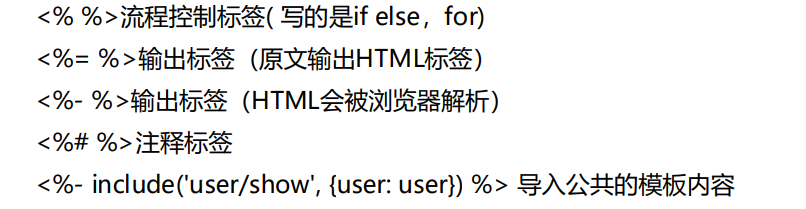

# 二、Express

Express是一个流行的Node.js Web应用程序框架，用于构建灵活且可扩展的Web应用程序和API。它是基于Node.js的HTTP模块而创建的，简化了处理HTTP请求、响应和中间件的过程。

> https://www.expressjs.com.cn/

## 1. 特色



```shell
// 安装express
npm install express --save
```

Express Generator 是一个基于命令行的工具，用于快速生成Express.js应用程序的基本结构。

```bash
npm install -g express-generator  # 安装Express Generator
express myapp                     # 创建项目myapp
cd myapp                          # 进入项目
npm i                             # 安装依赖
```

## 2. 路由

路由是指如何定义应用的端点（URIs）以及如何响应客户端的请求。

路由是由一个 URI、HTTP 请求（GET、POST等）和若干个句柄组成，它的结构如下： app.METHOD(path, [callback...], callback)， app 是 express 对象的一个实例， METHOD 是一个 HTTP 请求方法， path 是服务器上的路径， callback 是当路由匹配时要执行的函数。

```js
const express = require('express')
const app = express()

// get请求
app.get('/', (req, res) => {
  res.send("hello get")
})

// post请求
app.post('/', (req, res) => {
  res.send(("hello post"))
})

// 动态参数
app.get(':bookid', (req, res) => {
  res.send('get id')
})

// 基于字符串模式的路由路径，字符 ?、+、* 和 () 是它们的正则表达式对应物的子集
// 此路由路径将匹配 acd 和 abcd。
app.get('/ab?cd', (req, res) => {
  res.send('ab?cd')
})

// 基于正则表达式的路由路径，path不是字符串是正则表达式
app.get(/.*fly$/, (req, res) => {
  res.send('/.*fly$/')
})

app.listen(80, () => {
  console.log('HTTP server is runing!')
})
```

## 3. 获取请求参数

```js
//如果前端使用的是post并且传递json 需要注册此中间件 不然是undefined
app.use(express.json()) 

app.get('/', (req, res) => {
    console.log(req.query) //get 用query
    res.send('get')
})

app.post('/create', (req, res) => {
    console.log(req.body) //post用body
    res.send('post')
})

//如果是动态参数用 params
app.get('/:id', (req, res) => {
    console.log(req.params)
    res.send('get id')
})
```

## 4. 请求和响应

**Request 对象** - request 对象表示 HTTP 请求，包含了请求查询字符串，参数，内容，HTTP 头部等属性。常见属性有：

1. `req.app`：当callback为外部文件时，用req.app访问express的实例
2. `req.baseUrl`：获取路由当前安装的URL路径
3. `req.body / req.cookies`：获得「请求主体」/ Cookies
4. `req.fresh / req.stale`：判断请求是否还「新鲜」
5. `req.hostname / req.ip`：获取主机名和IP地址
6. `req.originalUrl`：获取原始请求URL
7. `req.params`：获取路由的parameters
8. `req.path`：获取请求路径
9. `req.protocol`：获取协议类型
10. `req.query`：获取URL的查询参数串
11. `req.route`：获取当前匹配的路由
12. `req.subdomains`：获取子域名
13. `req.accepts()`：检查可接受的请求的文档类型
14. `req.acceptsCharsets / req.acceptsEncodings / req.acceptsLanguages`：返回指定字符集的第一个可接受字符编码
15. `req.get()`：获取指定的HTTP请求头
16. `req.is()`：判断请求头Content-Type的MIME类型

**Response 对象** - response 对象表示 HTTP 响应，即在接收到请求时向客户端发送的 HTTP 响应数据。常见属性有：

1. `res.app`：同req.app一样
2. `res.append()`：追加指定HTTP头
3. `res.cookie(name，value [，option])`：设置Cookie
   `opition: domain / expires / httpOnly / maxAge / path / secure / signed`
5. `res.clearCookie()`：清除Cookie
6. `res.download()`：传送指定路径的文件
7. `res.get()`：返回指定的HTTP头
8. `res.json()`：传送JSON响应
9. `res.jsonp()`：传送JSONP响应
10. `res.location()`：只设置响应的Location HTTP头，不设置状态码或者close response
11. `res.redirect()`：设置响应的Location HTTP头，并且设置状态码302
12. `res.render(view,[locals],callback)`：渲染一个view，同时向callback传递渲染后的字符串，如果在渲染过程中有错误发生next(err)将会被自动调用。callback将会被传入一个可能发生的错误以及渲染后的页面，这样就不会自动输出了。
13. `res.send()`：传送HTTP响应
14. `res.sendFile(path [，options] [，fn])`：传送指定路径的文件 -会自动根据文件extension设定Content-Type
15. `res.set()`：设置HTTP头，传入object可以一次设置多个头
16. `res.status()`：设置HTTP状态码
17. `res.type()`：设置Content-Type的MIME类型

## 5. 中间件

Express 是一个自身功能极简，完全是由路由和中间件构成一个的 web 开发框架：从本质上来说，一个 Express 应用就是在调用各种中间件。

中间件（Middleware） 是一个函数，它可以访问请求对象（request object (req)）, 响应对象（response object (res)）, 和 web 应用中处于请求-响应循环流程中的中间件，一般被命名为 next 的变量。

中间件的功能包括：

- 执行任何代码。
- 修改请求和响应对象。
- 终结请求-响应循环。
- 调用堆栈中的下一个中间件。

如果当前中间件没有终结请求-响应循环，则必须调用 next() 方法将控制权交给下一个中间件，否则请求就会挂起。

Express 应用可使用如下几种中间件：

- 应用级中间件
- 路由级中间件
- 错误处理中间件
- 内置中间件
- 第三方中间件

使用可选则挂载路径，可在应用级别或路由级别装载中间件。另外，你还可以同时装在一系列中间件函数，从而在一个挂载点上创建一个子中间件栈。

### （1）应用级中间件

应用级中间件绑定到 app 对象 使用 app.use() 和 app.METHOD()， 其中， METHOD 是需要处理的 HTTP 请求的方法，例如 GET, PUT, POST 等等，全部小写。例如：

```js
const app = express()

// 没有挂载路径的中间件，应用的每个请求都会执行该中间件
app.use((req, res, next) => {
  console.log('Time:', Date.now())
  next()
})

// 挂载在 /user/:id 中间件函数。针对 /user/:id 路径上的任何类型的 HTTP 请求执行。
app.use('/user/:id', (req, res, next) => {
  console.log('Request Type:', req.method)
  next()
})
```

### （2）路由级中间件

路由级中间件和应用级中间件一样，只是它绑定的对象为 express.Router()。

```js
const router = express.Router()
// 存放静态文件
app.use(express.static('static'))

// 没有挂载路径的中间件，通过该路由的每个请求都会执行该中间件
router.use(function (req, res, next) {
  console.log('Time:', Date.now())
  next()
})

// 一个中间件栈，显示任何指向 /user/:id 的 HTTP 请求的信息
router.use('/user/:id', function(req, res, next) {
  console.log('Request URL:', req.originalUrl)
  next()
}, function (req, res, next) {
  console.log('Request Type:', req.method)
  next()
})

// 一个中间件栈，处理指向 /user/:id 的 GET 请求
router.get('/user/:id', function (req, res, next) {
  // 如果 user id 为 0, 跳到下一个路由
  if (req.params.id == 0) next('route')
  // 负责将控制权交给栈中下一个中间件
  else next() //
}, function (req, res, next) {
  // 渲染常规页面
  res.render('regular')
})

// 处理 /user/:id， 渲染一个特殊页面
router.get('/user/:id', function (req, res, next) {
  console.log(req.params.id)
  res.render('special')
})

module.exports = router;
```

```js
const app = express()
const User = require('./user.js')
// 将路由挂载至应用
app.use('/User', User)
```

### （3）错误处理中间件

错误处理中间件和其他中间件定义类似，只是要使用 4 个参数，而不是 3 个，其签名如下： (err, req, res, next)。

```js
app.use(function(err, req, res, next) {
  console.error(err.stack)
  res.status(500).send('Something broke!')
})
```

### （4）内置的中间件

从版本 4.x 开始，Express 不再依赖 [Connect](https://github.com/senchalabs/connect)。以前包含在 Express 中的中间件函数现在位于单独的模块中；见 [中间件函数列表](https://github.com/senchalabs/connect#middleware)。

Express 具有以下内置中间件函数：

- [express.static](https://express.nodejs.cn/en/4x/api.html#express.static) 提供静态资源，例如 HTML 文件、图片等。
- [express.json](https://express.nodejs.cn/en/4x/api.html#express.json) 使用 JSON 有效负载解析传入请求。注意：Express 4.16.0+ 提供
- [express.urlencoded](https://express.nodejs.cn/en/4x/api.html#express.urlencoded) 使用 URL 编码的负载解析传入的请求。注意：Express 4.16.0+ 提供

### （5）第三方中间件

#### cookie-parser

安装所需功能的 node 模块，并在应用中加载，可以在应用级加载，也可以在路由级加载。

下面的例子安装并加载了一个解析 cookie 的中间件： cookie-parser

```shell
$ npm install cookie-parser
```

```js
const express = require('express')
const app = express()
const cookieParser = require('cookie-parser')

// 加载用于解析 cookie 的中间件，可以传入加密密钥（可选）
app.use(cookieParser())

app.get('/', (req, res) => {
  // 读取Cookie
  let username = req.cookies.username || 'Guest';
  
  // 设置Cookie
  res.cookie('username', 'John Doe', { 
    maxAge: 3600000, // Cookie有效期为1小时（毫秒数）
    httpOnly: true, // 防止客户端JS访问
    secure: false // 是否仅在HTTPS连接上传输，默认为false，生产环境建议设置为true
  });

  res.send(`Welcome, ${username}!`);
});
```

#### express-session

`session`运行在服务器端，当客户端第一次访问服务器时，可以将客户的登录信息保存。

`secret`：一个`String`类型的字符串，作为服务器端生成`session`的签名。
`name`：返回客户端的key的名称，默认为`connect.sid`,也可以自己设置。
`resave`：(是否允许)当客户端并行发送多个请求时，其中一个请求在另一个请求结束时对`session`进行修改覆盖并保存。默认为`true`。但是(最好手动添加。
`saveUninitialized`：初始化session时是否保存到存储。默认为`true`， 但是最好手动添加。
`cookie`：设置返回到前端key的属性，默认值为`{ path: ‘/', httpOnly: true, secure: false, maxAge: null }` 。

- `Session.destroy()` ：删除`session`，当检测到客户端关闭时调用。
- `Session.reload()` ：当`session`有修改时，刷新`session`。
- `Session.regenerate()` ：将已有`session`初始化。
- `Session.save()` ：保存`session`。

```shell
$ npm install cookie-parser
```

```js
const express = require('express');
const session = require('express-session');
const app = express();

// 配置 express-session 中间件
app.use(session({
  secret: 'your-secret-key', // 必须设置，用于签名生成 session id 的密钥
  resave: false, // 若会话无任何更改，则不保存会话数据到存储器
  saveUninitialized: false, // 若未初始化，则不保存新建的空会话
  cookie: { // 可选，配置 session cookie 的选项
    maxAge: 3600000, // 会话过期时间，单位为毫秒
    secure: false, // 在 HTTPS 环境下才设置为 true
  },
  store: new SomeSessionStore(), // 可选，用于会话数据持久化存储的第三方库，例如 MongoDB 或 Redis
}));

// 使用 session 中间件之后，即可在请求对象(req)上访问 session
app.get('/', (req, res) => {
  // 创建或读取会话
  if (!req.session.views) {
    req.session.views = 0;
  }
  req.session.views++;

  res.setHeader('Content-Type', 'text/html');
  res.write('<p>Views: ' + req.session.views + '</p>');
  res.end();
});

// 清除会话
app.get('/logout', (req, res) => {
  req.session.destroy((err) => {
    if (err) {
      return res.status(500).send('Error clearing the session.');
    }
    res.clearCookie('connect.sid'); // 清除客户端上的 session id cookie
    res.send('Session destroyed successfully.');
  });
});
```

## 6. 托管静态文件

通过 Express 内置的 express.static 可以方便地托管静态文件，例如图片、CSS、JavaScript 文件等。

将静态资源文件所在的目录作为参数传递给 express.static 中间件就可以提供静态资源文件的访问了。例如，假设在 public 目录放置了图片、CSS 和 JavaScript 文件，你就可以：

```js
app.use(express.static('public'))
```

现在，public 目录下面的文件就可以访问了。

```js
http://localhost:3000/images/kitten.jpg
http://localhost:3000/css/style.css
http://localhost:3000/js/app.js
http://localhost:3000/images/bg.png
http://localhost:3000/hello.html
```

> 所有文件的路径都是相对于存放目录的，因此，存放静态文件的目录名不会出现在 URL 中。

如果你的静态资源存放在多个目录下面，你可以多次调用 express.static 中间件：

```js
app.use(express.static('public'))
app.use(express.static('files'))
```

访问静态资源文件时，express.static 中间件会根据目录添加的顺序查找所需的文件。

如果你希望所有通过 express.static 访问的文件都存放在一个“虚拟（virtual）”目录（即目录根本不存在）下面，可以通过为静态资源目录指定一个挂载路径的方式来实现，如下所示：

```
app.use('/static', express.static('public'))
```

现在，你就可以通过带有 “/static” 前缀的地址来访问 public 目录下面的文件了。

```js
http://localhost:3000/static/images/kitten.jpg
http://localhost:3000/static/css/style.css
http://localhost:3000/static/js/app.js
http://localhost:3000/static/images/bg.png
http://localhost:3000/static/hello.html
```

## 7. 防盗链

防盗链（Hotlinking）是指在网页或其他网络资源中，通过直接链接到其他网站上的图片、视频或其他媒体文件，从而显示在自己的网页上。这种行为通常会给被链接的网站带来额外的带宽消耗和资源浪费，而且可能侵犯了原始网站的版权。

为了防止盗链，网站管理员可以采取一些措施：

1. 通过HTTP引用检查：网站可以检查HTTP请求的来源，如果来源网址与合法的来源不匹配，就拒绝提供资源。这可以通过服务器配置文件或特定的脚本实现。
2. 使用Referrer检查：网站可以检查HTTP请求中的Referrer字段，该字段指示了请求资源的来源页面。如果Referrer字段不符合预期，就拒绝提供资源。这种方法可以在服务器配置文件或脚本中实现。
3. 使用访问控制列表（ACL）：网站管理员可以配置服务器的访问控制列表，只允许特定的域名或IP地址访问资源，其他来源的请求将被拒绝。
4. 使用防盗链插件或脚本：一些网站平台和内容管理系统提供了专门的插件或脚本来防止盗链。这些工具可以根据需要配置，阻止来自未经授权的网站的盗链请求。
5. 使用水印技术：在图片或视频上添加水印可以帮助识别盗链行为，并提醒用户资源的来源。

```js
import express from 'express';

const app = express();

const whitelist = ['localhost'];  // 定义白名单

// 防盗链中间件
const preventHotLinking = (req, res, next) => {
  const referer = req.get('referer'); // 获取请求头部中的 referer 字段
  if (referer) {
    const { hostname } = new URL(referer); // 从 referer 中解析主机名
    if (!whitelist.includes(hostname)) { // 检查主机名是否在白名单中
      res.status(403).send('Forbidden'); // 如果不在白名单中，返回 403 Forbidden
      return;
    }
  }
  next(); // 如果在白名单中，继续处理下一个中间件或路由
};

app.use(preventHotLinking); // 应用防止热链中间件
app.use(express.static('static')); // 处理静态资源请求

app.listen(80, () => {
  console.log('Listening on port 3000'); // 启动服务器，监听端口3000
});
```

## 8. 服务端渲染（模板引擎）



```js
npm i ejs
```

需要在应用中进行如下设置才能让 Express 渲染模板文件：

- views, 放模板文件的目录，比如： app.set('views', './views')
- view engine, 模板引擎，比如： app.set('view engine', 'ejs')



## 9. 跨域

跨域资源共享（Cross-Origin Resource Sharing，CORS）是一种机制，用于在浏览器中实现跨域请求访问资源的权限控制。当一个网页通过 XMLHttpRequest 或 Fetch API 发起跨域请求时，浏览器会根据同源策略（Same-Origin Policy）进行限制。**同源策略要求请求的源（协议、域名和端口）必须与资源的源相同，否则请求会被浏览器拒绝**

默认情况下cors仅支持客户端向服务器发送如下九个请求头：

1. Accept：指定客户端能够处理的内容类型。
2. Accept-Language：指定客户端偏好的自然语言。
3. Content-Language：指定请求或响应实体的自然语言。
4. Content-Type：指定请求或响应实体的媒体类型。
5. DNT (Do Not Track)：指示客户端不希望被跟踪。
6. Origin：指示请求的源（协议、域名和端口）。
7. User-Agent：包含发起请求的用户代理的信息。
8. Referer：指示当前请求的源 URL。
9. Content-type：application/x-www-form-urlencoded | multipart/form-data | text/plain

> tips ：默认Content-type没有application/json

预检请求OPTIONS的主要目的是确保跨域请求的安全性 它需要满足一定条件才会触发

1. 自定义请求方法：当使用非简单请求方法（Simple Request Methods）时，例如 PUT、DELETE、CONNECT、OPTIONS、TRACE、PATCH 等，浏览器会发送预检请求。
2. 自定义请求头部字段：当请求包含自定义的头部字段时，浏览器会发送预检请求。自定义头部字段是指不属于简单请求头部字段列表的字段，例如 Content-Type 为 application/json、Authorization 等。
3. 带凭证的请求：当请求需要在跨域环境下发送和接收凭证（例如包含 cookies、HTTP 认证等凭证信息）时，浏览器会发送预检请求。

```js
app.use((req, res, next) => {
  res.set({
    // 允许的请求源
    'Access-Control-Allow-Origin': '127.0.0.1',
    // 允许的请求方法，默认只支持post,get,head
    'Access-Control-Allow-Methods': 'GET, POST, PUT, DELETE, OPTIONS',
    // 允许的请求头支持Content-Type（默认不支持json）
    'Access-Control-Allow-Headers': 'Content-Type',
    // 允许前端读取自定义响应头yage
    'Access-Control-Expose-Headers': 'yage',
    // 允许凭据随请求发送
    'Access-Control-Allow-Credentials': true
  })
  next()
})
```

## 10. SSE技术

Server-Sent Events（SSE）是一种在客户端和服务器之间实现单向事件流的机制，允许服务器主动向客户端发送事件数据。在 SSE 中，可以使用自定义事件（Custom Events）来发送具有特定类型的事件数据。主要用于大屏项目。

> webSocket属于全双工通讯，也就是前端可以给后端实时发送，后端也可以给前端实时发送，SSE属于单工通讯，后端可以给前端实时发送

```js
app.get('/sse',(req,res)=>{
    res.setHeader('Content-Type', 'text/event-stream')
    res.status(200)
    // 模拟持续不断的发数据
    setInterval(() => {
        res.write('data: ' + new Date().getTime() + '\n\n')
    }, 1000)
})
```

```js
// 前端接收
const sse = new EventSource('http://localhost:3000/sse')
sse.addEventListener('message', (event) => {
    console.log(event.data)
})
```

