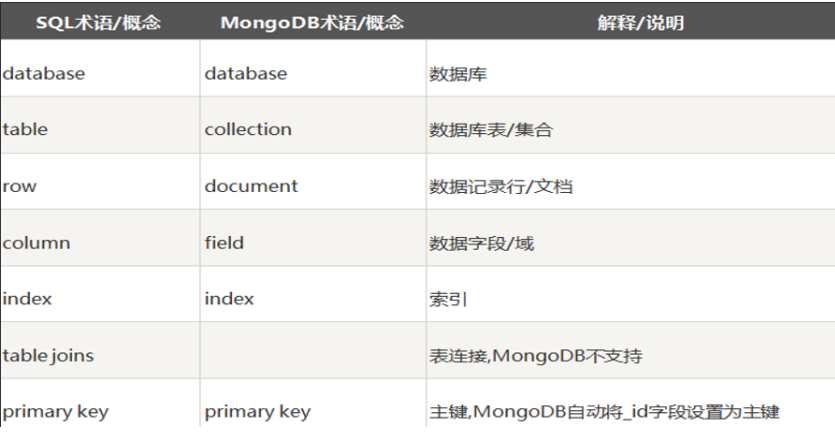

# 三、MongoDB

## 1.关系型与非关系型数据库





## 2.安装数据库

MongoDB Community Server：https://www.mongodb.com/try/download/community

MongoDB Shell ：https://www.mongodb.com/try/download/shell

## 3.启动数据库

### （1）windows

```shell
mongod --dbpath d:/data/db
mongo
```

### （2）mac

```shell
mongod --config /usr/local/etc/mongod.conf
mongo
```

## 4.在命令行中操作数据库


## 5.字段类型

| 类型          | 描述                                                         |
| ------------- | ------------------------------------------------------------ |
| String        | 字符串                                                       |
| Number        | 数字                                                         |
| Boolean       | 布尔值                                                       |
| Array         | 数组，也可以使用 [] 来标识                                   |
| Date          | 日期                                                         |
| Buffer Buffer | 对象                                                         |
| Mixed         | 任意类型，需要使用 mongoose.Schema.Types.Mixed 指定          |
| ObjectId      | 对象 ID，需要使用 mongoose.Schema.Types.ObjectId 指定        |
| Decimal       | 128 高精度数字，需要使用 mongoose.Schema.Types.Decimal128 指定 |

## 6.nodejs连接使用流程

```js
//1. 安装 mongoose
//2. 导入 mongoose
const mongoose = require('mongoose');
//3. 连接数据库
mongoose.connect('mongodb://localhost/user')
    .then(() => console.log('You are now connected to Mongo!'))
    .catch(err => console.error('Something went wrong', err))
//4. 设置连接回调
//连接成功
mongoose.connection.once('open', () => {
    console.log('连接成功');
    //5. 创建文档结构对象
    let BookSchema = new mongoose.Schema({
        title: String,
        author: String,
        price: Number
    });
    //6. 创建文档模型对象
    let BookModel = mongoose.model('book', BookSchema);
    //7. 插入文档
    BookModel.create({
        title: '西游记',
        author: '吴承恩',
        price: 19.9
    });
});
//连接出错
mongoose.connection.once('error', () => {
    console.log('连接出错~~');
})
//连接关闭
mongoose.connection.once('close', () => {
    console.log('连接关闭');
})
```

## 7.字段值验证

Mongoose 有一些内建验证器，可以对字段值进行验证

```js
// 必填项
title: {
    type: String,
    required: true // 设置必填项
},

// 默认值
createdAt: {
    type: String,
   default: Date.now //默认值
},

// 枚举值
gender: {
    type: String,
    enum: ['男','女'] //设置的值必须是数组中的
},
    
// 唯一值
username: {
    type: String,
    unique: true
},
```

> `unique` 需要 重建集合 才能有效果

## 8.CURD

数据库的基本操作包括四个，增加（create），删除（delete），修改（update），查（read）

- 增
  ```js
  BookModel.create({
      name: '西游记',
      author: '吴承恩',
      price: 29.9
  }).then((result) => {
      console.log(`${result.name}创建成功`);
  }).catch((err) => {
      console.log(err);
  });
  ```

  ```js
  BookModel.insertMany([
      {
          name: '西游记',
          author: '吴承恩',
          price: 29.9
      },
      {
          name: '红楼梦',
          author: '曹雪芹',
          price: 18.8
      }
  ]).then((result) => {
      console.log(`插入${result.length}本图书`)
  }).catch((err) => {
      console.log(err);
  });
  ```

- 删
  ```js
  BookModel.deleteOne({ name: "西游记" })
    .then(result => {
      console.log(result);
      if (!result.deletedCount) {
        console.log('No matching document found');
      } else {
        console.log(`${result.deletedCount} document(s) deleted`);
      }
    })
    .catch(error => {
      console.error('Error deleting the document:', error);
    });
  ```

  ```js
  // 批量删除
  BookModel.deleteMany({ price: { $gt: 10 } })
      .then((result) => {
          console.log(`删除${result.deletedCount}本图书`)
      })
      .catch((err) => {
          console.log(err);
      });
  ```

- 改
  ```js
  BookModel.updateOne({ name: '西游记' }, { $set: { name: '红楼梦',price: 29.9 }})
    .then(result => {
      console.log(result);
      if (result.modifiedCount) {
        console.log(`Successfully updated the book with the old title.`);
      } else {
        console.log('No book found with the specified title.');
      }
    })
    .catch(error => {
      console.error('Error occurred during update:', error);
    });
  ```

  ```js
  // 批量删除
  BookModel.deleteMany({price:'9.9'})
      .then((result) => {
          console.log(`删除${result.deletedCount}本图书`)
      })
      .catch((err) => {
          console.log(err);
      });
  ```

- 查
  ```js
  // 查找 并只显示name和price字段
  BookModel.findOne({ name: '西游记' }, 'name price')
    .then(foundUser => {
      if (foundUser) {
        console.log('Found book:', foundUser);
      } else {
        console.log('Book not found');
      }
    })
    .catch(error => {
      console.error('Error occurred during querying:', error);
    });
  ```

  ```js
  // 批量查找
  BookModel.find({ price: { $gt: 9 } })
    .then(books => {
      console.log('Found books:');
      books.forEach(book => console.log(book));
    })
    .catch(error => {
      console.error('Error occurred during querying:', error);
    });
  ```

## 9.条件控制

在 mongodb 不能 > < >= <= !== 等运算符，需要使用替代符号

- `>` 使用 `$gt`
- `<` 使用 `$lt``
- ``>=` 使用 `$gte`
- `<=` 使用 `$lte`
- `!==` 使用 `$ne`

```js
// id号比3大的所有的记录
db.students.find({id:{$gt:3}});  

// $or 逻辑或的情况
db.students.find({$or:[{age:18},{age:24}]});
// $and 逻辑与的情况
db.students.find({$and: [{age: {$lt:20}}, {age: {$gt: 15}}]});

// 正则匹配
db.students.find({name:/imissyou/})
```

```js
// 个性化读取
// 字段筛选
//0:不要的字段
//1:要的字段
BookModel.find({}, { _id: 0 ,name: 1}) 
    .exec()
    .then(books => {
        console.log(books);
    })
    .catch(error => {
        console.error('Error occurred:', error);
    });

//  数据排序
//sort 排序
//1:升序
//-1:倒序
BookModel.find({})
  .sort({ price: 1 })
  .exec()
  .then(books => {
    console.log(books);
  })
  .catch(error => {
    console.error('Error occurred:', error);
  });

// 数据截取
//skip 跳过 limit 限定
BookModel.find({}) // 查询所有书籍
  .skip(1) // 跳过前几条记录
  .limit(3) // 只返回指定数量的记录
  .exec()
  .then(books => {
    console.log(books);
  })
  .catch(error => {
    console.error('Error occurred:', error);
  });
```


