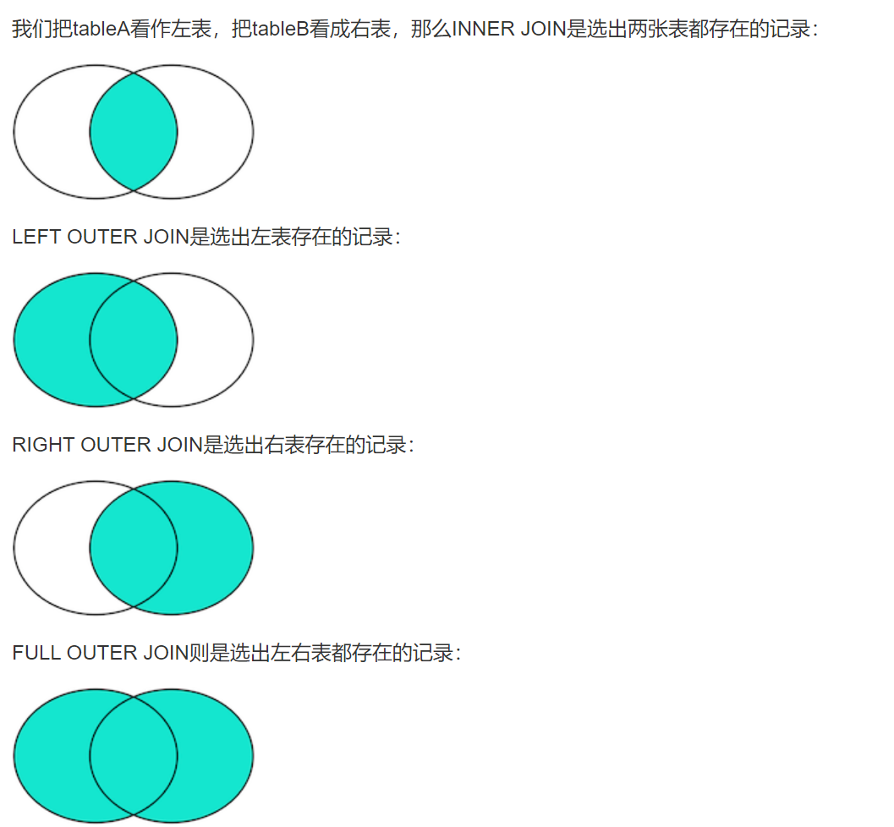

# 九、MySQL

## 1.介绍

付费的商用数据库：

- Oracle，典型的高富帅；
- SQL Server，微软自家产品，Windows定制专款；
- DB2，IBM的产品，听起来挺高端；
- Sybase，曾经跟微软是好基友，后来关系破裂，现在家境惨淡。

这些数据库都是不开源而且付费的，最大的好处是花了钱出了问题可以找厂家解决，不过在Web的世界里，常常需要部署成千上万的数据库服务器，当然不能把大把大把的银子扔给厂家，所以，无论是Google、Facebook，还是国内的BAT，无一例外都选择了免费的开源数据库：

- MySQL，大家都在用，一般错不了；
- PostgreSQL，学术气息有点重，其实挺不错，但知名度没有MySQL高；
- sqlite，嵌入式数据库，适合桌面和移动应用。

作为一个JavaScript全栈工程师，选择哪个免费数据库呢？当然是MySQL。因为MySQL普及率最高，出了错，可以很容易找到解决方法。而且，围绕MySQL有一大堆监控和运维的工具，安装和使用很方便。


## 2.与非关系数据库区别

关系型和非关系型数据库的主要差异是数据存储的方式。关系型数据天然就是表格式的，因此存储在数据表的行和列中。数据表可以彼此关联协作存储，也很容易提取数据。

与其相反，非关系型数据不适合存储在数据表的行和列中，而是大块组合在一起。非关系型数据通常存储在数据集中，就像文档、键值对或者图结构。你的数据及其特性是选择数据存储和提取方式的首要影响因素。

**关系型数据库最典型的数据结构是表，由二维表及其之间的联系所组成的一个数据组织**
优点：
1、易于维护：都是使用表结构，格式一致；
2、使用方便：SQL语言通用，可用于复杂查询；
3、复杂操作：支持SQL，可用于一个表以及多个表之间非常复杂的查询。
缺点：
1、读写性能比较差，尤其是海量数据的高效率读写；
2、固定的表结构，灵活度稍欠；
3、高并发读写需求，传统关系型数据库来说，硬盘I/O是一个很大的瓶颈。

**非关系型数据库严格上不是一种数据库，应该是一种数据结构化存储方法的集合，可以是文档或者键值对等。**

优点：

1、格式灵活：存储数据的格式可以是key,value形式、文档形式、图片形式等等，文档形式、图片形式等等，使用灵活，应用场景广泛，而关系型数据库则只支持基础类型。
2、速度快：nosql可以使用硬盘或者随机存储器作为载体，而关系型数据库只能使用硬盘；
3、高扩展性；
4、成本低：nosql数据库部署简单，基本都是开源软件。

缺点：

1、不提供sql支持；
2、无事务处理；
3、数据结构相对复杂，复杂查询方面稍欠。

## 3.sql语句


插入：

```sql
INSERT INTO `students`(`id`, `name`, `score`, `gender`) VALUES (null,'kerwin',100,1)
//可以不设置id,create_time
```
更新：
```sql
UPDATE `students` SET `name`='tiechui',`score`=20,`gender`=0 WHERE id=2;
```
删除：
```sql
DELETE FROM `students` WHERE id=2;
```
查询：
```sql
查所有的数据所有的字段
SELECT * FROM `students` WHERE 1;

查所有的数据某个字段
SELECT `id`, `name`, `score`, `gender` FROM `students` WHERE 1;

条件查询
SELECT * FROM `students` WHERE score>=80;
SELECT * FROM `students` where score>=80 AND gender=1

模糊查询
SELECT * FROM `students` where name like '%k%'

排序
SELECT id, name, gender, score FROM students ORDER BY score;
SELECT id, name, gender, score FROM students ORDER BY score DESC;

分页查询
SELECT id, name, gender, score FROM students LIMIT 50 OFFSET 0

记录条数
SELECT COUNT(*) FROM students;
SELECT COUNT(*) kerwinnum FROM students;

多表查询

SELECT * FROM students, classes;（这种多表查询又称笛卡尔查询，使用笛卡尔查询时要非常小心，由于结果集是目标表的行数乘积，对两个各自有100行记录的表进行笛卡尔查询将返回1万条记录，对两个各自有1万行记录的表进行笛卡尔查询将返回1亿条记录）
SELECT
    students.id sid,
    students.name,
    students.gender,
    students.score,
    classes.id cid,
    classes.name cname
FROM students, classes; （要使用表名.列名这样的方式来引用列和设置别名，这样就避免了结果集的列名重复问题。）

SELECT
    s.id sid,
    s.name,
    s.gender,
    s.score,
    c.id cid,
    c.name cname
FROM students s, classes c; （SQL还允许给表设置一个别名）


联表查询
SELECT s.id, s.name, s.class_id, c.name class_name, s.gender, s.score
FROM students s
INNER JOIN classes c
ON s.class_id = c.id; （连接查询对多个表进行JOIN运算，简单地说，就是先确定一个主表作为结果集，然后，把其他表的行有选择性地“连接”在主表结果集上。）


```



注意：

> 1. InnoDB 支持事务，MyISAM 不支持事务。这是 MySQL 将默认存储引擎从 MyISAM 变成 InnoDB 的重要原因之一；
> 2. InnoDB 支持外键，而 MyISAM 不支持。对一个包含外键的 InnoDB 表转为 MYISAM 会失败；

**外键约束**

CASCADE
在父表上update/delete记录时，同步update/delete掉子表的匹配记录 

SET NULL
在父表上update/delete记录时，将子表上匹配记录的列设为null (要注意子表的外键列不能为not null)  

NO ACTION
如果子表中有匹配的记录,则不允许对父表对应候选键进行update/delete操作 

RESTRICT
同no action, 都是立即检查外键约束

## 4.nodejs 操作数据库

```js
const express = require('express')
const app = express()
const mysql2 = require('mysql2')
const port = 9000

app.get('/',async (req, res) => {
  const config = getDBConfig()
  const promisePool = mysql2.createPool(config).promise();
  // console.log(promisePool)
      let user = await promisePool.query('select * from students');

      console.log(user)
      if (user[0].length) {
          //存在用户
          res.send(user[0])
      } else {
          //不存在
          res.send( {
              code: -2,
              msg: 'user not exsit',
          })
      }      
})

app.listen(port, () => {
  console.log(`Example app listening at http://localhost:${port}`)
})


function getDBConfig() {
  return {
    host: '127.0.0.1',
    user: 'root',
    port: 3306,
    password: '',
    database: 'kerwin_test',
    connectionLimit: 1 //创建一个连接池
  }
}
```

```js
查询：
promisePool.query('select * from users');

插入：
promisePool.query('INSERT INTO `users`(`id`,`name`,`age`, `password`) VALUES (?,?,?,?)',[null,"kerwin",100,"123456"]);

更新：
promisePool.query(`UPDATE users SET name = ? ,age=? WHERE id = ?`,["xiaoming2",20,1])

删除：
promisePool.query(`delete from users where id=?`,[1])

```


