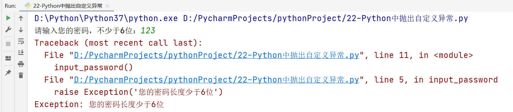
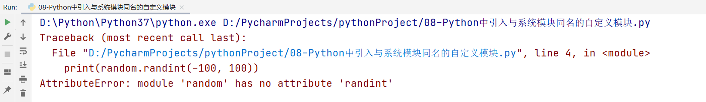
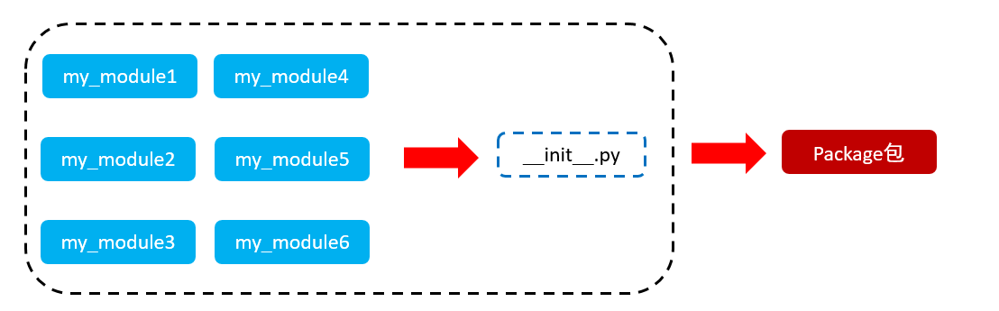
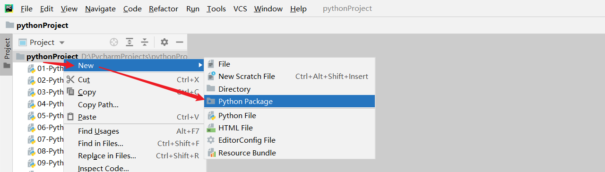
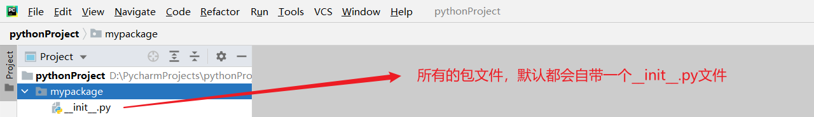
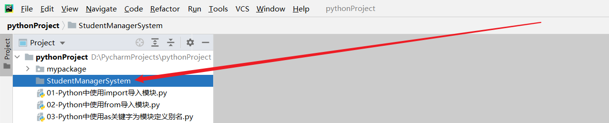
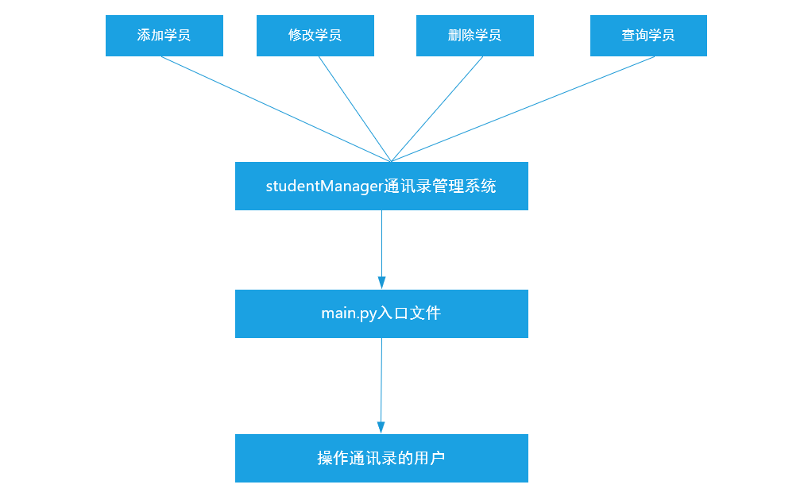

# Python的异常、模块以及包管理

## 一、Python异常

### 1、什么是异常

当检测到一个错误时，解释器就无法继续执行了，反而出现了一些错误的提示，这就是所谓的"异常"。

### 2、异常演示

```python
#运算符
#print(10/0)

#文件异常
f = open('python.txt', 'r')
content = f.readlines()
print(content)
```

### 3、异常捕获

基本语法：

```python
try:
    可能发生错误的代码
except(捕获):
    如果出现异常执行的代码
```

> try...except主要用于捕获代码运行时异常

案例：

```python
try:
    f = open('python.txt', 'r')
    content = f.readline()
    print(content, end='')
except:
    f = open('python.txt', 'w', encoding='utf-8')
    f.write('发生异常，执行except语句中的代码')

f.close()
```

### 4、捕获指定异常

在以上案例代码中，except相当于捕获了所有异常，无论遇到什么错误都会自动执行except中封装的代码。但是有些情况下，我们向针对性的捕获异常，并执行相应的代码。

基本语法：

```python
try:
    可能遇到异常的代码
except 异常类型:
    捕获到对应的错误以后，执行的代码
```

> ① 如果尝试执行的代码的异常类型和要捕获的异常类型不一致，则无法捕获异常。
>
> ② 一般try下方只放一行尝试执行的代码。

案例：捕获FileNotFoundError异常

```python
try:
    f = open('python.txt', 'r')
except FileNotFoundError as e:
    print(e)
```

### 5、同时捕获多个异常

```python
try:
    print(name)
    # print(10/0)
except (NameError, ZeroDivisionError) as e:
    print(e)
```

### 6、捕获所有未知异常

无论我们在except后面定义多少个异常类型，实际应用中，也可能会出现无法捕获的未知异常。这个时候，我们考虑使用Exception异常类型捕获可能遇到的所有未知异常：

```python
try:
    可能遇到的错误代码
except Exception as e:
    print(e)
```

案例：打印一个未定义变量，使用Exception异常类进行捕获

```python
try:
    print(name)
except Exception as e:
    print(e)
```

### 7、异常捕获中else语句

else语句：表示的是如果没有异常要执行的代码。

```python
try:
    print(1)
except Exception as e:
    print(e)
else:
    print('哈哈，真开森，没有遇到任何异常')
```

案例：

```python
try:
    f = open('python.txt', 'r')
except Exception as e:
    print(e)
else:
    content = f.readlines()
    print(content, end='')
    f.close()
```

### 8、异常捕获中的finally语句

finally表示的是无论是否异常都要执行的代码，例如关闭文件、关闭数据库连接。

```python
try:
    f = open('python.txt', 'r')
except:
    f = open('python.txt', 'w')
else:
    print('哈哈，真开森，没有遇到任何异常')
finally:
    print('关闭文件')
    f.close()
```

### 9、异常的综合案例

#### ☆ 异常的传递

需求：

① 尝试只读方式打开python.txt文件，如果文件存在则读取文件内容，文件不存在则提示用户即可。

② 读取内容要求：尝试循环读取内容，读取过程中如果检测到用户意外终止程序，则`except`捕获

```python
import time

try:
   f = open('python.txt', 'r')
   try:
       while True:
           content = f.readline()
           if len(content) == 0:
               break
           time.sleep(3)
           print(content, end='')
   except:
       # Ctrl + C（终端里面，其代表终止程序的继续执行）
       print('python.txt未全部读取完成，中断了...')
   finally:
       f.close()
except:
   print('python.txt文件未找到...')
```

#### ☆ raise抛出自定义异常

在Python中，抛出自定义异常的语法为`raise 异常类对象`。

需求：密码长度不足，则报异常（用户输入密码，如果输入的长度不足6位，则报错，即抛出自定义异常，并捕获该异常）。

原生方法：

```python
def input_password():
    password = input('请输入您的密码，不少于6位：')
    if len(password) < 6:
        # 抛出异常
        raise Exception('您的密码长度少于6位')
        return
    # 如果密码长度正常，则直接显示密码
    print(password)
        
input_password()
```



面向对象抛出自定义异常：

```python
class ShortInputError(Exception):
    # length代表输入密码长度，min_length代表ShortInputError最小长度
    def __init__(self, length, min_length):
        self.length = length
        self.min_length = min_length

    # 定义一个__str__方法，用于输出字符串信息
    def __str__(self):
        return f'您输入的密码长度为{self.length}，不能少于{self.min_length}个字符'

try:
    password = input('请输入您的密码，不少于6位：')
    if len(password) < 6:
        raise ShortInputError(len(password), 6)
except Exception as e:
    print(e)
else:
    print(f'密码输入完成，您的密码是：{password}')
```


### 10、异常类型

| 异常名称                  | 描述                                               |
| ------------------------- | -------------------------------------------------- |
| BaseException             | 所有异常的基类                                     |
| SystemExit                | 解释器请求退出                                     |
| KeyboardInterrupt         | 用户中断执行(通常是输入^C)                         |
| Exception                 | 常规错误的基类                                     |
| StopIteration             | 迭代器没有更多的值                                 |
| GeneratorExit             | 生成器(generator)发生异常来通知退出                |
| SystemExit                | Python 解释器请求退出                              |
| StandardError             | 所有的内建标准异常的基类                           |
| ArithmeticError           | 所有数值计算错误的基类                             |
| FloatingPointError        | 浮点计算错误                                       |
| OverflowError             | 数值运算超出最大限制                               |
| ZeroDivisionError         | 除(或取模)零 (所有数据类型)                        |
| AssertionError            | 断言语句失败                                       |
| AttributeError            | 对象没有这个属性                                   |
| EOFError                  | 没有内建输入,到达EOF 标记                          |
| EnvironmentError          | 操作系统错误的基类                                 |
| IOError                   | 输入/输出操作失败                                  |
| OSError                   | 操作系统错误                                       |
| WindowsError              | 系统调用失败                                       |
| ImportError               | 导入模块/对象失败                                  |
| KeyboardInterrupt         | 用户中断执行(通常是输入^C)                         |
| LookupError               | 无效数据查询的基类                                 |
| IndexError                | 序列中没有没有此索引(index)                        |
| KeyError                  | 映射中没有这个键                                   |
| MemoryError               | 内存溢出错误(对于Python 解释器不是致命的)          |
| NameError                 | 未声明/初始化对象 (没有属性)                       |
| UnboundLocalError         | 访问未初始化的本地变量                             |
| ReferenceError            | 弱引用(Weak reference)试图访问已经垃圾回收了的对象 |
| RuntimeError              | 一般的运行时错误                                   |
| NotImplementedError       | 尚未实现的方法                                     |
| SyntaxError               | Python 语法错误                                    |
| IndentationError          | 缩进错误                                           |
| TabError                  | Tab 和空格混用                                     |
| SystemError               | 一般的解释器系统错误                               |
| ValueError                | 传入无效的参数                                     |
| UnicodeError              | Unicode 相关的错误                                 |
| UnicodeDecodeError        | Unicode 解码时的错误                               |
| UnicodeEncodeError        | Unicode 编码时错误                                 |
| Warning                   | 警告的基类                                         |
| DeprecationWarning        | 关于被弃用的特征的警告                             |
| FutureWarning             | 关于构造将来语义会有改变的警告                     |
| OverflowWarning           | 旧的关于自动提升为长整型(long)的警告               |
| PendingDeprecationWarning | 关于特性将会被废弃的警告                           |
| RuntimeWarning            | 可疑的运行时行为(runtime behavior)的警告           |
| SyntaxWarning             | 可疑的语法的警告                                   |
| UserWarning               | 用户代码生成的警告                                 |
| FileNotFoundError         | 文件未找到错误                                     |

## 二、Python内置模块

### 1、什么是Python模块

Python 模块(Module)，是一个**Python 文件**，以 .py 结尾，包含了 Python 对象定义和Python语句。模块能定义**函数，类和变量**，模块里也能包含可执行的代码。

### 2、模块的分类

在Python中，模块通常可以分为两大类：**内置模块(目前使用的)** 和 **自定义模块**

### 3、模块的导入方式

☆ import 模块名

☆ from 模块名 import 功能名

☆ from 模块名 import *

☆ import 模块名 as 别名

☆ from 模块名 import 功能名 as 别名

### 4、使用import导入模块

基本语法：

```python
import 模块名称
或
import 模块名称1, 模块名称2, ...
```

使用模块中封装好的方法：

```python
模块名称.方法()
```


案例：使用import导入math模块

```python
import math

#求数字9的平方根 = 3
print(math.sqrt(9))
```

案例：使用import导入math与random模块

```python
import math, random

print(math.sqrt(9))
print(random.randint(-100, 100))
```


### 5、使用from 模块名 import 功能名

提问：已经有了import导入模块，为什么还需要使用from 模块名 import 功能名这样的导入方式？

答：import代表导入某个或多个模块中的所有功能，但是有些情况下，我们只希望使用这个模块下的某些方法，而不需要全部导入。这个时候就建议采用from 模块名 import 功能名

#### ☆ from 模块名 import *

这个导入方式代表导入这个模块的所有功能（等价于import 模块名）

```python
from math import *
```

#### ☆ from 模块名 import 功能名（推荐）

```python
from math import sqrt, floor
```


注意：以上两种方式都可以用于导入某个模块中的某些方法，但是在调用具体的方法时，我们只需要`功能名()`即可

```python
功能名()
```


案例：

```python
#from math import *
#或
from math import sqrt, floor

#调用方式
print(sqrt(9))
print(floor(10.88))
```

### 6、使用as关键字为导入模块定义别名

在有些情况下，如导入的模块名称过长，建议使用as关键字对其重命名操作，以后在调用这个模块时，我们就可以使用别名进行操作。

```python
import time as t

#调用方式
t.sleep(10)
```

> 在Python中，如果给模块定义别名，命名规则建议使用大驼峰。

### 7、使用as关键字为导入功能定义别名

```python
from 模块 import 功能名 as 功能名别名
```

案例：

```python
from time import sleep as sl, time as t

#调用方式
print('hello world')
sl(10)
print('hello python')
```

### 8、扩展：time模块中的time()方法

在Python中，time模块除了sleep方法以外，还有一个方法叫做time()方法

```python
time.time()
```

主要功能：就是返回格林制时间到当前时间的秒数（时间戳）


案例：求运行递归代码的执行时间

```python
import time

#返回：格林制时间到当前时间的秒数
start = time.time()

#编写递归函数
def func(n):
    if n == 10:
        return 1
    return (func(n+1) + 1) * 2

print(func(1))

end = time.time()
print(f'以上代码共执行了{end - start}s')
```

## 三、Python中的自定义模块

### 1、什么是自定义模块

在Python中，模块一共可以分为两大类：内置系统模块  和  自定义模块

模块的本质：在Python中，模块的本质就是一个Python的独立文件（后缀名.py），里面可以包含**全局变量、函数以及类**。

> 注：在Python中，每个Python文件都可以作为一个模块，模块的名字就是**文件的名字**。也就是说自定义模块名必须要符合标识符命名规则。

### 2、定义一个自定义模块

案例：在Python项目中创建一个自定义文件，如my_module1.py

```python
def sum_num(num1, num2):
    return num1 + num2
```

### 3、导入自定义模块

```python
import 模块名称
或
from 模块名称 import 功能名
```

案例：

```python
import my_module1


#调用my_module1模块中自定义的sum_num方法
print(my_module1.sum_num(10, 20))
```

### 4、自定义模块中功能测试

在我们编写完自定义模块以后，最好在模块中对代码进行提前测试，以防止有任何异常。

引入一个魔方方法：`__name__`，其保存的内存就是一个字符串类型的数据。

随着运行页面的不同，其返回结果也是不同的：

① 如果`__name__`是在当前页面运行时，其返回结果为`__main__`

② 如果`__name__`在第三方页面导入运行时，其返回结果为模块名称

基于以上特性，我们可以把`__name__`编写在自定义模块中，其语法如下：

```python
if __name__ == '__main__':
    # 执行测试代码
```


`__name__`魔术方法除了可以在自定义模块中测试使用，还可以用于编写程序的入口：

```python
#定义一个main方法（入口文件）
def main():
    # 执行我们要执行的功能
    # ① 打印选择菜单
    # ② 添加学员信息
    # ③ 删除学员信息
    # ...
    
#调用执行入口
if __name__ == '__main__':
    main()
```

### 5、多模块中功能命名冲突问题

#### ☆ 命名冲突

当我们编写了多个模块时，可能在导入到其他页面时，会产生一个问题：全局变量、函数、类出现重名情况，我们把这个情况就称之为“命名冲突”。

如导入my_module2和my_module3，里面都封装了一个func()方法，其在导入以后，my_module3中的func()方法就会覆盖my_module2中的func()方法。

my_module2.py

```python
def func():
    print('my_module2中的func方法')
```

my_module3.py

```python
def func():
    print('my_module3中的func方法')
```

导入到其他Python文件中，测试效果：

```python
from my_module2 import func
from my_module3 import func

func()
```

#### ☆ 解决方案

① 把所有模块的导入方式都写入文件的最上面，如果发现命名冲突了，马上和模块的开发人员进行功能核对

② 给重名的方法进行as重命名

```python
from my_module2 import func as my_module2_func
from my_module3 import func as my_module3_func
```

### 6、模块命名的注意事项

在实际项目开发中，一定要特别注意：我们自定义的模块名称一定不能和系统内置的模块名称相同，否则会导致代码无法正常执行。


举个栗子：定义一个与系统内置模块同名的模块

random.py

08-Python中引入与系统模块同名的自定义模块.py

```python
import random

print(random.randint(-100, 100))
```

以上代码运行结果：



randint属于random模块的内置方法，不可能存在找不到的情况。之所以出现以上问题的主要原因在于：我们的项目中存在了一个与系统模块同名的模块文件。所以其在引用random模块式，其执行顺序：

`引入某个模块 => 当前项目中寻找是否有同名的文件 => 如果找到则直接使用，未找到 => 继续向上寻找 => Python解析器中`

如何证明：模块的引用一定是按照你说的这个顺序呢？

答：使用`__file__`魔术方法

```python
print(random.__file__)
```

### 7、\__all__魔术方法

如果一个模块文件中有`__all__`变量，当使用`from xxx import *`导入时，只能导入这个列表中的元素。

主要功能：限制使用模块中的某些功能，也就是说你导入后可以使用的方法只能是`__all__`中封装好的方法。

案例：

my_module.py

```python
__all__ = ['func1']

def func1():
    print('func1方法')

def func2():
    print('func2方法')
```

09-Python中限制引用模块中的方法.py

```python
from my_module import *

func1()
func2()  # 报错
```

## 四、Python中的Package包

### 1、什么是包

包将有联系的模块组织在一起，即放到同一个文件夹下，并且在这个文件夹创建一个名字为`__init__.py` 文件，那么这个文件夹就称之为包。



### 2、包的制作



新建报名如mypackage：



### 3、在包中创建多个模块

在mypackage包中创建多个模块：my_module1和my_module2

my_module1.py

```python
print('my_module1')
def func1():
    print('mypackage包中的my_module1模块的func1方法')
```

my_module2.py

```python
print('my_module2')
def func2():
    print('mypackage包中的my_module2模块的func2方法')
```

### 4、在项目代码中导入包Package

方法一：使用import导入包

```python
import 包名.模块名

#调用模块中的方法
包名.模块名.方法名()
```

方法二：使用from导入包

```python
from 包名 import *

#调用模块方法
模块名.方法名()
```

> 注意：必须在`__init__.py`文件中添加`__all__ = []`，控制允许导入的模块列表。


## 五、综合案例（一）

### 1、需求分析

使用**面向对象编程思想**完成学员管理系统的开发，具体如下：

① 系统要求：**学员数据存储在文件中**

② 系统功能：**添加学员、删除学员、修改学员信息、查询学员信息、显示所有学员信息、保存学员信息及退出系统**等功能。

### 2、角色分析

在面向对象编程思想中，必须找到要具体实现操作的实体。

通过系统实现添加学员操作

通过系统实现删除学员操作

....

最终可以得出一个结论：这个通讯管理系统，其主要的实体就是**通讯录管理系统本身**


注意事项

① 为了方便维护代码，一般一个角色一个程序文件

② 项目要有主程序入口，习惯为`main.py`

### 3、创建项目



创建类文件 => studentManager.py

创建项目入口文件 => main.py




### 4、学员信息存储代码分析

students = [{}, {}, {}]

学员姓名

学员年龄

学员电话

学员信息（姓名、年龄、电话），可以使用字典来表示。但是我们已经学习了面向对象，其学员信息可以完全用对象来进行实现。

学员（主体） =>  属性（姓名、年龄、电话）

### 5、student.py类文件编写

需求：

学员信息包含：姓名、年龄、电话

添加`__str__`魔法方法，方便查看学员对象信息

```python
#定义一个Student类
class Student():
    # 定义魔术方法，用于初始化属性信息
    def __init__(self, name, age, mobile):
        self.name = name
        self.age = age
        self.mobile = mobile
    # 定义魔术方法，用于打印输出学员信息
    def __str__(self):
        return f'{self.name}, {self.age}, {self.mobile}'
```

### 6、编写studentManager.py代码

studentManager.py

```python
class StudentManager(object):
    # 定义__init__魔术方法，用于初始化操作
    def __init__(self):
        # 定义一个列表，将来用于保存所有学员信息
        self.student_list = []
```

未来数据的存储格式如下：

```python
self.student_list = [p1, p2, p3, p4, ...]
```

### 7、学员管理系统具体功能说明

需求：

存储数据的位置：文件(student.data) 

* 加载文件数据 

* 修改数据后保存到文件

存储数据的形式：列表存储学员对象

系统功能： 

① 添加学员信息

② 删除学员信息

③ 修改学员信息

④ 查询学员信息

⑤ 显示所有学员信息

⑥ 保存学员信息

⑦ 退出系统

编写程序代码，用于实现以上的所有功能：

#### ☆ 基础逻辑代码

```python
class StudentManager(object):
    # 定义一个__init__魔术方法，用于初始化数据
    def __init__(self):
        # 初始化一个student_list属性，用于将来保存所有学员对象信息
        self.student_list = []

    # 定义load_student()方法
    def load_student(self):
        pass

    # 定义静态show_help()方法
    @staticmethod
    def show_help():
        print('-' * 40)
        print('传智教育通讯录管理系统V2.0')
        print('1.添加学员信息')
        print('2.删除学员信息')
        print('3.修改学员信息')
        print('4.查询学员信息')
        print('5.显示所有学员信息')
        # V2.0新增功能
        print('6.保存学员信息')
        print('7.退出系统')
        print('-' * 40)

    def add_student(self):
        pass

    def del_student(self):
        pass

    def mod_student(self):
        pass

    def show_student(self):
        pass

    def show_all(self):
        pass

    def save_student(self):
        pass

    # 定义一个run()方法，专门用于实现对管理系统中各个功能调用
    def run(self):
        # 1、调用一个学员加载方法，用于加载文件中的所有学员信息，加载完成后，把得到的所有学员信息保存在student_list属性中
        self.load_student()
        # 2、显示帮助信息，提示用户输入要实现的功能编号
        while True:
            # 显示帮助信息
            self.show_help()
            # 提示用户输入要操作功能编号
            user_num = int(input('请输入要操作功能的编号：'))
            if user_num == 1:
                self.add_student()
            elif user_num == 2:
                self.del_student()
            elif user_num == 3:
                self.mod_student()
            elif user_num == 4:
                self.show_student()
            elif user_num == 5:
                self.show_all()
            elif user_num == 6:
                self.save_student()
            elif user_num == 7:
                print('感谢您使用传智教育通讯录管理系统V2.0，欢迎下次使用！')
                break
            else:
                print('信息输入错误，请重新输入...')
```

#### ☆ main.py入口文件的编写

```python
#从studentManager模块中导入StudentManager类功能
from studentManager import StudentManager

#定义入口代码
if __name__ == '__main__':
    student_manager = StudentManager()
    student_manager.run()
```

#### ☆ 编写add_student()学员添加方法实现

需求：用户输入学员姓名、年龄、手机号，将学员添加到系统。

步骤： 

① 用户输入姓名、年龄、手机号

② 创建该学员对象（真正添加到列表中的是对象）

③ 将该学员对象添加到列表[] => append()

```python
    from student import Student
	...    
    ...
    ...
    def add_student(self):
        # 提示用户输入学员信息
        name = input('请输入学员的姓名：')
        age = int(input('请输入学员的年龄：'))
        mobile = input('请输入学员的电话：')
        # 使用Student类实例化对象
        student = Student(name, age, mobile)
        # 调用student_list属性，追加student对象信息
        self.student_list.append(student)
        print('学员信息已添加成功')
```

#### ☆ 编写del_student()学员删除方法实现

需求：用户输入目标学员姓名，如果学员存在则删除该学员。

步骤： 

① 用户输入目标学员姓名

② 遍历学员数据列表，如果用户输入的学员姓名存在则删除，否则则提示该学员不存在。

```python
	    def del_student(self):
        # 提示用户输入要删除的学员姓名
        name = input('请输入要删除的学员姓名：')
        # 对student_list属性（本质列表）进行遍历
        for i in self.student_list:
            if i.name == name:
                # 找到了要删除的学员，删除
                self.student_list.remove(i)
                print(f'学员{name}信息删除成功')
                break
        else:
            print('您要删除的学员不存在...')
```

#### ☆ 编写mod_student()学员修改方法实现

```python
    def mod_student(self):
        # 提示用户输入要修改的学员姓名
        name = input('请输入要修改的学员姓名：')
        # 对student_list属性进行遍历，判断要修改的学员姓名是否存在
        for i in self.student_list:
            if i.name == name:
                i.name = input('请输入修改后的学员姓名：')
                i.age = int(input('请输入修改后的学员年龄：'))
                i.mobile = input('请输入修改后的学员电话：')
                print(f'学员信息修改成功，修改后信息如下 => 学员姓名：{i.name}，学员年龄：{i.age}，学员电话：{i.mobile}')
                break
        else:
            print('您要修改的学员信息不存在...')
```

#### ☆ 编写show_student()学员查询方法实现

```python
    def show_student(self):
        # 提示用户输入要查询的学员姓名
        name = input('请输入要查询的学员姓名：')
        # 对student_list属性进行遍历
        for i in self.student_list:
            if i.name == name:
                print(i)
                break
        else:
            print('您要查找的学员信息不存在...')
```

#### ☆ 编写show_all()方法查询所有学员实现

```python
    def show_all(self):
        # 直接对列表进行遍历
        for i in self.student_list:
            print(i)
```

#### ☆ 编写save_student()方法学员信息保存功能实现

需求：将所有学员信息都保存到存储数据的文件。

步骤： 

① 打开文件 ② 读写文件 ③ 关闭文件

思考：

① 文件写入的数据是学员对象的内存地址吗？

答：一定不能是对象的内存地址，因为随着系统的运行，内存地址可能会随时改变。

② 文件内数据要求的数据类型是什么？答：必须是字符串，可以使用str()转换

#### 扩展：把对象转换为dict字典格式 => `__dict__`

```python
class A(object):
    a = 0
    def __init__(self):
        self.b = 1

aa = A()

print(aa)          #<__main__.A object at 0x0000022DBFB3FA08>
print(aa.__dict__) #{'b': 1}  返回实例属性和值组成的字典
```

案例：demo.py

```python
from student import Student

student_list = []
student = Student('Tom', 23, '10086')
student_list.append(student)

print(student.__dict__)  # {'name': 'Tom', 'age': 23, 'mobile': '10086'}
```

案例：把[对象1, 对象2, 对象3]中的所有对象都转换为字典

```python
from student import Student

student_list = []
student = Student('Tom', 23, '10086')
student_list.append(student)

student = Student('Harry', 25, '10010')
student_list.append(student)

#[student1, student2, student3, ...]
#list1 = []
#for i in student_list:
#list1.append(i.__dict__)
#print(list1)

list1 = [i.__dict__ for i in student_list]
print(list1)
```

最终代码：

```python
	# 把self.student_list转换为字符串保存到student.data文件中
    def save_student(self):
        # 打开文件
        f = open('student.data', 'w', encoding='utf-8')
        # 把列表中的对象转换为字典
        new_list = [i.__dict__ for i in self.student_list]
        # 文件读写（写入）
        f.write(str(new_list))
        # 关闭文件
        f.close()
        # 提示用户数据已经保存成功了
        print('学员信息保存成功')
```

#### ☆ 编写load_student()方法学员加载功能实现

load_student()方法的作用：在系统启动以后，运行run()方法以后，把student.data文件中保存好的学员信息 => 加载 => self.student_list列表中

student.data => 张三、李四、王五

下次重新运行系统

self.student_list = [张三, 李四, 王五]

添加赵六

self.student_list = [张三, 李四, 王五, 赵六]


需求：每次进入系统后，修改的数据是文件里面的数据

步骤： 

☆ 尝试以`"r"`模式打开学员数据文件，如果文件不存在则以`"w"`模式打开文件

* 如果文件存在则读取数据

* 读取数据 => str字符串类型 [{}, {}, {}]

* 转换数据类型为列表并转换列表内的字典i['name']为对象i.name

* 存储学员数据到学员列表self.student_list

☆ 关闭文件

```python
    def load_stu(self):
        # 捕获异常
        try:
            f = open('students.data', 'r', encoding='utf-8')
        except:
            f = open('students.data', 'w', encoding='utf-8')
        else:
            # 如果文件存在，没有异常，则执行else语句
            content = f.read()
            if len(content) > 0:
                # 把字符串转换为原数据类型[{}, {}, {}]
                data = eval(content)
                # 把列表中的所有字典 => 转换为对象
                self.stu_list = [Student(i['name'], i['age'], i['mobile']) for i in data]

        finally:
            f.close()
```


