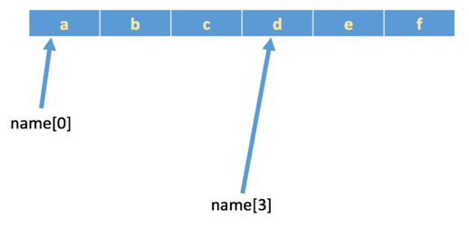

# Python数据序列(一)

## 一、作业回顾

### 1、面试题

有一物，不知其数，三三数之余二，五五数之余三，七七数之余二，问物几何？

白话文：有一个数字，不知道具体是多少，用3去除剩2，用5去除剩3，用7去除剩2个，问这个数是多少？1 ~ 100以内的整数

while循环：

```python
#初始化计数器
i = 1
#编写循环条件
while i <= 100:
    # 判断
    if i % 3 == 2 and i % 5 == 3 and i % 7 == 2:
        print(i)
    # 更新计数器
    i += 1
```

for循环：

```python
for i in range(1, 101):
    # 判断
    if i % 3 == 2 and i % 5 == 3 and i % 7 == 2:
        print(i)
```

### 2、报数字（数7）


一些同学从1开始报数，当需要报出的数字尾数是7或者该数字是7的倍数时，则该同学跳过这个数字，不进行报数。所有同学都参与游戏后，游戏结束。如输入学生数量为50，游戏结束后，报数的同学数量为39。

分析：如何判断某个数字尾数为7以及如何判断某个数字是7的倍数

① 如何判断数字尾数为7，i % 10 == 7      17  %  10 =  1 余 7     27  %  10  =  2  余 7

② 如何判断数字是7的倍数，i % 7 == 0

```python
#定义一个变量n，用于获取学生数量
n = int(input('请输入学生的数量：'))
#定义一个变量，用于统计有多少人报数了
count = 0
#开始循环
for i in range(1, n+1):
    # 判断数字尾数为7,判断数值是7的倍数
    if i % 10 == 7 or i % 7 == 0:
        continue
    # 如果不满足以上if条件，则对count进行+1操作
    count += 1
print(f'{n}个同学，共报数{count}人')
```

## 二、了解字符串

### 1、字符串的定义

字符串是 Python 中最常用的数据类型。我们一般使用引号来创建字符串。创建字符串很简单，只要为变量分配一个值即可。

案例1：使用单引号或双引号定义字符串变量

```python
str1 = 'abcdefg'
str2 = "hello world"

print(type(str1))  # <class 'str'>
print(type(str2))  # <class 'str'>
```

案例2：使用3个引号定义字符串变量

```python
name1 = '''I am Tom, Nice to meet you!'''
print(name1)
print(type(name1))

print('-' * 20)

name2 = """I am Jennify,
           Nice to meet you!"""
print(name2)
print(type(name2))
```

> 注意：三引号形式的字符串支持换行操作

案例3：思考如何使用字符串定义"I'm Tom"

使用单引号情况

```python
str1 = 'I'm Tom'
```

运行结果：


出现以上问题的主要原因在于，以上字符串的定义代码出现了(syntax)语法错误。**单引号在字符串定义中必须成对出现，而且Python解析器在解析代码时，会自动认为第一个单引号和最近的一个单引号是一对！**

如果一定要在单引号中在放入一个单引号，必须使用**反斜杠\**进行转义。

```python
str1 = 'I\'am Tom'
```

使用双引号情况

```python
str2 = "I'm Tom"
```

> 注：在Python中，如果存在多个引号，建议① 单引号放在双引号中 ② 双引号放在单引号中。

### 2、字符串输入

在Python代码中，我们可以使用`input()`方法来接收用户的输入信息。记住：在Python中，input()方法返回的结果是一个`字符串类型`的数据。

```python
name = input('请输入您的姓名：')
age = input('请输入您的年龄：')
address = input('请输入您的住址：')

print(name, age, address)
```

### 3、字符串的输出

#### ☆ 普通输出

```python
print(变量名称)
print(变量名称1, 变量名称2, 变量名称3)
```

#### ☆ 格式化输出

① 百分号（Python2和Python3）

```python
name = input('请输入您的姓名：')
age = input('请输入您的年龄：')
address = input('请输入您的住址：')

print('我的名字是%s，今年%d岁了，家里住在%s...' % (name, age, address))
```

② format方法（Python3）

```python
name = input('请输入您的姓名：')
age = input('请输入您的年龄：')
address = input('请输入您的住址：')

print('我的名字是{}，今年{}岁了，家里住在{}...'.format(name, age, address))
```

③ f形式（Python3）

```python
name = input('请输入您的姓名：')
age = input('请输入您的年龄：')
address = input('请输入您的住址：')

print(f'我的名字是{name}，今年{age}岁了，家里住在{address}...')
```

延伸：

```python
name = input('请输入您购买商品的名称：')
price = float(input('请输入您购买商品的价格：'))  # 18.5

print(f'购买商品名称：{name}，商品价格：{price:.2f}')
```

### 4、字符串在计算机底层的存储形式

在计算机中，Python中的字符串属于序列结构。所以其底层存储占用一段连续的内存空间。

```python
str1 = 'itheima'
```

结构原理图：


> 注意：索引下标从0开始。

### 5、聊聊索引下标

`索引下标`，就是编号。比如火车座位号，座位号的作用：按照编号快速找到对应的座位。同理，下标的作用即是通过下标快速找到对应的数据。


举个例子：

```python
name = 'abcdef'
print(name[0])  # a
print(name[3])  # d
```



## 三、字符串切片

### 1、什么是字符串切片

所谓的切片是指对操作的对象**截取**其中一部分的操作。字符串、列表、元组都支持切片操作。

### 2、字符串切片基本语法

顾头不顾尾：

```python
序列名称[开始位置下标:结束位置下标:步长]
```

① 不包含结束位置下标对应的数据， 正负整数均可；

② 步长是选取间隔，正负整数均可，正数从左向右，负数从右向左。默认步长为1。


还是有点陌生，没关系，举个栗子：

```python
numstr = '0123456789'
```

如果想对numstr字符串进行切片，如下图所示：


### 3、字符串切片小口诀

记口诀：**切片其实很简单，只顾头来尾不管，步长为正正向移，步长为负则逆向移**

如果还是有点不太清楚这个原理，建议大家对字符串进行画图


### 4、字符串切片的小栗子

案例1：

```python
numstr = '0123456789'
#1、从2到5开始切片，步长为1
print(numstr[2:5:1])
print(numstr[2:5])
#2、只有结尾的字符串切片：代表从索引为0开始，截取到结尾字符-1的位置
print(numstr[:5])
#3、只有开头的字符串切片：代表从起始位置开始，已知截取到字符串的结尾
print(numstr[1:])
#4、获取或拷贝整个字符串
print(numstr[:])
#5、调整步阶：类似求偶数
print(numstr[::2])
#6、把步阶设置为负整数：类似字符串翻转
print(numstr[::-1])
#7、起始位置与结束位置都是负数（遵循一个原则：必须是从左向右截取）
print(numstr[-4:-1])
#8、结束字符为负数，如截取012345678
print(numstr[:-1])
```

案例2：


案例3：给定一个图片的名称为"avatar.png"，使用Python方法获取这个图片的名称(avatar)以及这个图片的后缀(.png)。

分析：

① 建议先获取点号的位置（目前还未学习，只能一个一个数）

② 从开头切片到点号位置，得到的就是文件的名称

③ 从点号开始切片，一直到文件的结尾，则得到的就是文件的后缀

```python
filename = 'avatar.png'
#获取点号的索引下标
index = 6
#使用切片截取文件的文件
name = filename[:index]
print(f'上传文件的名称：{name}')

#使用切片截取文件的后缀
postfix = filename[index:]
print(f'上传文件的后缀：{postfix}')
```


## 四、字符串的操作方法（内置）

### 1、字符串中的查找方法

所谓字符串查找方法即是**查找子串在字符串中的位置或出现的次数**。

基本语法：

```python
字符串.find(要查找的字符或者子串)
```

| **编号    ** | **函数** | **作用**                                                     |
| ------------ | -------- | ------------------------------------------------------------ |
| 1            | find()   | 检测某个子串是否包含在这个字符串中，如果在返回这个子串开始的位置下标，否则则返回-1。 |
| 2            | index()  | 检测某个子串是否包含在这个字符串中，如果在返回这个子串开始的位置下标，否则则报异常。 |
| 3            | rfind()  | 和find()功能相同，但查找方向为右侧开始。                     |
| 4            | rindex() | 和index()功能相同，但查找方向为右侧开始。                    |
| 5            | count()  | 返回某个子串在字符串中出现的次数                             |

☆ find()方法

作用：检测某个子串是否包含在这个字符串中，如果在返回这个子串开始的位置下标，否则则返回-1。

```python
#定义一个字符串
str1 = 'hello world hello linux hello python'
#查找linux子串是否出现在字符串中
print(str1.find('linux'))
#在str1中查找不存在的子串
print(str1.find('and'))
```

案例：使用input方法输入任意一个文件名称，求点号的索引下标

```python
filename = input('请输入您要上传文件的名称：')
#获取点号的索引下标
index = filename.find('.')
print(index)

#求文件名称
print(filename[:index])

#求文件后缀
print(filename[index:])
```

#### ☆ index()方法

index()方法其功能与find()方法完全一致，唯一的区别在于当要查找的子串没有出现在字符串中时，find()方法返回-1，而index()方法则直接报错。

```python
str1 = 'apple, banana, orange'
#判断apple是否出现在字符串str1中
print(str1.index('apple'))
print(str1.index('pineapple'))
```

运行结果：


#### ☆ rfind()与rindex()方法

r = right，代表从右开始查找

```python
字符串序列.rfind(子串)
字符串序列.rindex(子串)
```

强调：rfind()方法与rindex()方法适合于查找子串在字符串中出现了多次的情况

案例：有一个文件名称叫20210310axvu.avatar.png，其中点号出现了2次，这个时候，如果我想获取文件的后缀.png，代码应该如何编写？

```python
filename = '20210310axvu.avatar.png'
#求出点号在字符串中第一次出现的位置
index1 = filename.find('.')
print(index1)    #12
#求出点号在字符串中最后一次出现的位置
index2 = filename.rfind('.')
print(index2)    #19
```

rfind()方法和rindex()方法语法上完全一致，唯一的区别就是对子串没有出现在字符串的中的情况，rfind()返回-1，rindex()返回错误。

#### ☆ count()方法

主要功能：求子串在字符串中出现的次数

基本语法：

```python
字符串.count('子串', 开始位置下标, 结束位置下标)
```

案例：获取字符串中and关键字出现的次数

```python
str1 = 'hello world and hello linux and hello python'
#不限定字符串长度
ands = str1.count('and')
#限定开始查找的位置和结束位置
#ands = str1.count('and', 10, 30)
print(f'and字符串出现的次数为：{ands}')
```

### 2、练习题

问题：使用循环嵌套打印正等腰三角形

```python
     * 
    ***
   *****
  *******
 *********
***********

分析：
① 每一行的星星数，是有规律的。
1  1   1*2 - 1
2  3   2*2 - 1
3  5   3*2 - 1
4  7
5  9
6  11
*
***
*****
*******
*********
***********
② 每一行星星的前面，都是有空格的
1  5
2  4
3  3
4  2
5  1
6  0
     * 
    ***
   *****
  *******
 *********
***********
```

最终代码：

```python
num = int(input('请输入打印的行数:'))
for i in range(1,num+1):
    #打印前面空格
    print(' ' * (num - i),end='')
    #打印星星
    print('*' * (2 * i - 1))
```

### 3、字符串的修改方法

所谓修改字符串，指的就是通过函数（方法）的形式修改字符串中的数据。

| **编号** | **函数**                    | **作用**                               |
| -------- | --------------------------- | -------------------------------------- |
| 1        | replace()                   | 返回替换后的字符串                     |
| 2        | split()                     | 返回切割后的列表序列                   |
| 3        | capitalize()                | 首字母大写                             |
| 4        | title()                     | 所有单词首字母大写                     |
| 5        | upper()与lower()            | 返回全部大写或小写的字符串             |
| 6        | lstrip()、rstrip()与strip() | 去除左边、右边以及两边的空白字符       |
| 7        | ljust()、rjust()与center()  | 返回原字符串左对齐、右对齐以及居中对齐 |

#### ☆ replace()方法

基本语法：

```python
字符串.replace(要替换的内容, 替换后的内容, 替换的次数-可以省略)
```

案例：编写一个字符串，然后把字符串中的linux替换为python

```python
str1 = 'hello linux and hello linux'
#把字符串中所有linux字符替换为python
print(str1.replace('linux', 'python'))
#把字符串中的第一个linux进行替换为python
print(str1.replace('linux', 'python', 1))
#把and字符串替换为&&
print(str1.replace('and', '&&'))
```

目前在工作中，replace主要用于实现关键字替换或过滤功能。北京 **> BJ，论坛关键字过滤，共产党 => ***

#### ☆ split()方法

作用：对字符串进行切割操作，返回一个list()列表类型的数据

```python
str1 = 'apple-banana-orange'
print(str1.split('-'))
```

#### ☆ capitalize() 方法

作用：把字符串的首字母大写，其他字符全部小写

#### ☆ title()方法

作用：把字符串中的所有单词的首字母大写，组成大驼峰

```python
str1 = 'myName'
#把str1变成首字母大写字符串
print(str1.capitalize())

str2 = 'student_manager'
#把str2变成大驼峰
print(str2.title().replace('_', ''))
```

#### ☆ upper()与lower() 方法

upper()：把字符串全部转换为大写形式

lower()：把字符串全部转换为小写形式

```python
#用户名以及密码验证案例,可以直接username = input('请输入您的账号：').lower()
username = input('请输入您的账号：')
password = input('请输入您的密码：')

#把username和password全部转换为大写或小写
print(username.lower())
print(password.upper())
```

#### ☆ lstrip()、rstrip()与strip()

strip() 方法主要作用：删除字符串两边的空白字符（如空格）

lstrip() 方法 == left + strip，作用：只删除字符串左边的空白字符

rstrip() 方法，作用：只删除字符串右边的空白字符

```python
#用户名验证案例
username = input('请输入您的账号：')

#去除username两边的空白字符
print(len(username))
print(username.strip())
print(len(username.strip()))
```

#### ☆ ljust()、rjust()、center()

作用：返回原字符串左对齐、右对齐以及居中对齐  

基本语法：

```python
字符串序列.ljust(长度, 填充字符)
```

案例：定义一个字符串，要求返回长度为10个字符，不足的使用.点号进行填充

```python
str1 = 'python'
#左对齐
print(str1.ljust(10, '.'))
#右对齐
print(str1.rjust(10, '#'))
#居中对齐
print(str1.center(10, '@'))
```

### 4、字符串的判断方法

所谓判断即是判断真假，返回的结果是布尔型数据类型：True 或 False。

| **编  号        ** | **函数**     | **作用**                                                     |
| :----------------: | ------------ | :----------------------------------------------------------- |
|         1          | startswith() | 检查字符串是否是以指定子串开头，是则返回 True，否则返回 False。如果设置开始和结束位置下标，则在指定范围内检查。 |
|         2          | endswith()   | 检查字符串是否是以指定子串结尾，是则返回 True，否则返回 False。如果设置开始和结束位置下标，则在指定范围内检查。 |
|         3          | isalpha()    | 如果字符串所有字符(至少有一个字符)都是字母则返回 True, 否则返回 False。 |
|         4          | isdigit()    | 如果字符串只包含数字则返回 True 否则返回 False。             |
|         5          | isalnum()    | Python isalnum() 方法检测字符串是否由字母和数字组成。如果字符串所有字符(至少有一个字符)都是字母或数字则返 回 True,否则返回 False。 |
|         6          | isspace()    | 如果字符串中只包含空白，则返回 True，否则返回 False          |

#### ☆ startswith()

作用：检查字符串是否是以指定子串开头，是则返回 True，否则返回 False。如果设置开始和结束位置下标，则在指定范围内检查。

```python
str1 = 'python program'
print(str1.startswith('python'))
```

#### ☆ endswith()

作用：检查字符串是否是以指定子串结尾，是则返回 True，否则返回 False。如果设置开始和结束位置下标，则在指定范围内检查。  

```python
str2 = 'avatar.png'
print(str2.endswith('.png'))

if str2.endswith('.png') or str2.endswith('.jpg') or str2.endswith('.gif'):
    print('是一张图片格式的图片')
else:
    print('您上传的文件格式异常')
```

#### ☆ isalpha()

作用：如果字符串所有字符(至少有一个字符)都是**字母**则返回 True, 否则返回 False。

```python
str1 = 'admin'
str2 = 'admin123'

print(str1.isalpha())  # True
print(str2.isalpha())  # False
```

#### ☆ isdigit()

作用：如果字符串只包含**数字**则返回 True 否则返回 False。  

```python
password = input('请输入您的银行卡密码：')

if len(password) == 6 and password.isdigit():
    print('输入密码成功，正在验证...')
else:
    print('密码输入错误，请重新输入')
```

#### ☆ isalnum()

作用：Python isalnum() 方法检测字符串是否由**字母和数字**组成。如果字符串所有字符(至少有一个字符)都是字母或数字则返 回 True,否则返回 False。  

```python
username = input('请输入的您的用户名（只能为字母+数字形式）：')

if username.isalnum():
    print('合理的用户名，正在录入系统...')
else:
    print('输入的用户名有误，请重新输入...')
```

#### ☆ isspace()

作用：如果字符串中只包含空白，则返回 True，否则返回 False（逆向思维）

```python
str1 = ' '  # 最少要包含一个空白字符
print(str1.isspace())

username = input('请输入的您的用户名：')
if len(username) == 0 or username.isspace():
    print('您没有输入任何字符...')
else:
    print(f'您的输入的字符{username}')    
```

## 五、列表及其应用场景

### 1、为什么需要列表

思考：有一个人的姓名(TOM)怎么书写存储程序？

答：变量。


思考：如果一个班级100位学生，每个人的姓名都要存储，应该如何书写程序？声明100个变量吗？

答：No，我们使用列表就可以了， 列表一次可以存储多个数据。

> 在Python中，我们把这种数据类型称之为列表。但是在其他的编程语言中，如Java、PHP、Go等等中其被称之为数组。

### 2、列表的定义

```python
列表序列名称 = [列表中的元素1, 列表中的元素2, 列表中的元素3, ...]
```

案例演示：定义一个列表，用于保存苹果、香蕉以及菠萝

```python
list1 = ['apple', 'banana', 'pineapple']
#list列表类型支持直接打印
print(list1)
#打印列表的数据类型
print(type(list1))
```

> 注意：列表可以一次存储多个数据且可以为不同的数据类型

### 3、列表的相关操作

```python
list1 = [1,2,3]
list2 = list('abc')

list3 = list1 + list2  # [1, 2, 3, 'a', 'b', 'c']
list4 = list3 * 2     # [1, 2, 3, 1, 2, 3] 
```

列表的作用是一次性存储多个数据，程序员可以对这些数据进行的操作有：

**增、删、改、查**。

#### ☆ 查操作

列表在计算机中的底层存储形式，列表和字符串一样，在计算机内存中都占用一段连续的内存地址，我们向访问列表中的每个元素，都可以通过"索引下标"的方式进行获取。


如果我们想获取列表中的某个元素，非常简单，直接使用索引下标：

```python
list1 = ['apple', 'banana', 'pineapple']
#获取列表中的banana
print(list1[1])
```

查操作的相关方法：

| **编号** | **函数** | **作用**                                                     |
| -------- | -------- | ------------------------------------------------------------ |
| 1        | index()  | 指定数据所在位置的下标                                       |
| 2        | count()  | 统计指定数据在当前列表中出现的次数                           |
| 3        | in       | 判断指定数据在某个列表序列，如果在返回True，否则返回False    |
| 4        | not in   | 判断指定数据不在某个列表序列，如果不在返回True，否则返回False |

举个栗子：

```python
#1、查找某个元素在列表中出现的位置（索引下标）
list1 = ['apple', 'banana', 'pineapple']
print(list1.index('apple'))  # 0
#print(list1.index('peach'))  # 报错

#2、count()方法：统计元素在列表中出现的次数
list2 = ['刘备', '关羽', '张飞', '关羽', '赵云']
#统计一下关羽这个元素在列表中出现的次数
print(list2.count('关羽'))

#3、in方法和not in方法（黑名单系统）
list3 = ['192.168.1.15', '10.1.1.100', '172.35.46.128']
if '10.1.1.100' in list3:
    print('黑名单IP，禁止访问')
else:
    print('正常IP，访问站点信息')
```

#### ☆ 增操作

| **编号** | **函数** | **作用**                                                     |
| -------- | -------- | ------------------------------------------------------------ |
| 1        | append() | 增加指定数据到列表中                                         |
| 2        | extend() | 列表结尾追加数据，如果数据是一个序列，则将这个序列的数据逐一添加到列表 |
| 3        | insert() | 指定位置新增数据                                             |

##### ☆ append()

append() ：在列表的尾部追加元素

```python
names = ['孙悟空', '唐僧', '猪八戒']
#在列表的尾部追加一个元素"沙僧"
names.append('沙僧')
#打印列表
print(names)
```

> 注意：列表追加数据的时候，直接在原列表里面追加了指定数据，即修改了原列表，故列表为可变类型数据。

##### ☆ extend()方法

列表结尾追加数据，如果数据是一个序列，则将这个序列的数据逐一添加到列表

案例：

```python
list1 = ['Tom', 'Rose', 'Jack']
#1、使用extend方法追加元素"Jennify"
#names.extend("Jennify")
#print(names)

#2、建议：使用extend方法两个列表进行合并
list2 = ['Hack', 'Jennify']
list1.extend(list2)

print(list1)
```

> 总结：extend方法比较适合于两个列表进行元素的合并操作

##### ☆ insert()方法

作用：在指定的位置增加元素

```python
names = ['薛宝钗', '林黛玉']
#在薛宝钗和林黛玉之间，插入一个新元素"贾宝玉"
names.insert(1, '贾宝玉')
print(names)
```

#### ☆ 删操作

| **编号** | **函数**       | **作用**                                         |
| -------- | -------------- | ------------------------------------------------ |
| 1        | del 列表[索引] | 删除列表中的某个元素                             |
| 2        | pop()          | 删除指定下标的数据(默认为最后一个)，并返回该数据 |
| 3        | remove()       | 移除列表中某个数据的第一个匹配项。               |
| 4        | clear()        | 清空列表，删除列表中的所有元素，返回空列表。     |

##### ☆ del删除指定的列表元素

基本语法：

```python
names = ['Tom', 'Rose', 'Jack', 'Jennify']
#删除Rose
del names[1]
#打印列表
print(names)
```

##### ☆ pop()方法

作用：删除指定下标的元素，如果不填写下标，默认删除最后一个。其返回结果：就是删除的这个元素

```python
names = ['貂蝉', '吕布', '董卓']
del_name = names.pop()
#或
#del_name = names.pop(1)
print(del_name)
print(names)
```

##### ☆ remove()方法

作用：删除匹配的元素

```python
fruit = ['apple', 'banana', 'pineapple']
fruit.remove('banana')
print(fruit)
```

##### ☆ clear()方法

清空列表

```python
names = ['貂蝉', '吕布', '董卓']
#随着故事的发展，人物都game over
names.clear()
#打印列表
print(names)
```

#### ☆ 改操作

| **编号** | **函数**                | **作用**               |
| -------- | ----------------------- | ---------------------- |
| 1        | 列表[索引] = 修改后的值 | 修改列表中的某个元素   |
| 2        | reverse()               | 将数据序列进行倒叙排列 |
| 3        | sort()                  | 对列表序列进行排序     |
| 4        | copy()                  | 对列表序列进行拷贝     |

```python
list1 = ['貂蝉', '大乔', '小乔', '八戒']
#修改列表中的元素
list1[3] = '周瑜'
print(list1)

list2 = [1, 2, 3, 4, 5, 6]
list2.reverse()
print(list2)

list3 = [10, 50, 20, 30, 1]
list3.sort()  # 升序(从小到大)
#或
#list3.sort(reverse=True)  # 降序(从大到小)
print(list3)

list4 = list3.copy()
print(list4)
```

### 4、列表的循环遍历

什么是循环遍历？答：循环遍历就是使用while或for循环对列表中的每个数据进行打印输出

while循环：

```python
list1 = ['貂蝉', '大乔', '小乔']

#定义计数器
i = 0
#编写循环条件
while i < len(list1):
    print(list1[i])
    # 更新计数器
    i += 1
```

for循环（个人比较推荐）：

```python
list1 = ['貂蝉', '大乔', '小乔']
for i in list1:
    print(i)
```

### 5、列表的嵌套

列表的嵌套：列表中又有一个列表，我们把这种情况就称之为列表嵌套

> 在其他编程语言中，称之为叫做二维数组或多维数组

应用场景：要存储班级一、二、三  => 三个班级学生姓名，且每个班级的学生姓名在一个列表。

```python
classes = ['第一个班级','第二个班级','第三个班级']

一班：['张三', '李四']
二班：['王五', '赵六']
三班：['田七', '孙八']

把班级和学员信息合并在一起，组成一个嵌套列表
students = [['张三', '李四'],['王五', '赵六'],['田七', '孙八']]

students = [x,y,z]
students[0] == ['张三', '李四']
students[0][1] == ‘李四’
```

问题：嵌套后的列表，我们应该如何访问呢？

```python
#访问李四
print(students[0][1])
#嵌套列表进行遍历，获取每个班级的学员信息
for i in students:
    print(i)
```


