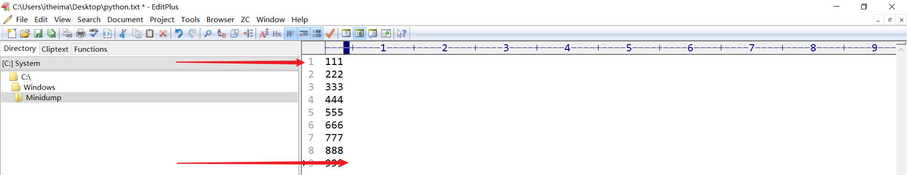

# Python文件操作

## 一、文件的概念

### 1、什么是文件

内存中存放的数据在计算机关机后就会消失。要长久保存数据，就要使用硬盘、光盘、U 盘等设备。为了便于数据的管理和检索，引入了**“文件”**的概念。

一篇文章、一段视频、一个可执行程序，都可以被保存为一个文件，并赋予一个文件名。操作系统以文件为单位管理磁盘中的数据。一般来说，**文件可分为文本文件、视频文件、音频文件、图像文件、可执行文件等多种类别。**


### 2、思考：文件操作包含哪些内容呢？

在日常操作中，我们对文件的主要操作：创建文件、打开文件、文件读写、文件备份等等


### 3、文件操作的作用

文件操作的作用就是**把一些内容(数据)存储存放起来**，可以让程序下一次执行的时候直接使用，而不必重新制作一份，省时省力。

## 二、文件的基本操作

### 1、文件操作三步走

① 打开文件

② 读写文件

③ 关闭文件

### 2、open函数打开文件

在Python，使用open()函数，可以打开一个已经存在的文件，或者创建一个新文件，语法如下：

```python
f = open(name, mode)
注：返回的结果是一个file文件对象（后续会学习，只需要记住，后续方法都是f.方法()）
```

name：是要打开的目标文件名的字符串(可以包含文件所在的具体路径)。

mode：设置打开文件的模式(访问模式)：只读r、写入w、追加a等。

> r模式：代表以只读模式打开一个已存在的文件，后续我们对这个文件只能进行读取操作。如果文件不存在，则直接报错。另外，r模式在打开文件时，会将光标放在文件的一行。

> w模式：代表以只写模式打开一个文件，文件不存在，则自动创建该文件。w模式主要是针对文件写入而定义的模式。但是，要特别注意，w模式在写入时，光标也是置于第一行同时还会清空原有文件内容。

> a模式：代表以追加模式打开一个文件，文件不存在，则自动创建该文件。a模式主要也是针对文件写入而定义模式。但是和w模式有所不同，a模式不会清空文件的原有内容，而是在文件的尾部追加内容。

### 3、write函数写入文件

基本语法：

```python
f.write('要写入的内容，要求是一个字符串类型的数据')
```

### 4、close函数关闭文件

```python
f.close()
```

### 5、入门级案例

```python
#1、打开文件
f = open('python.txt', 'w')
#2、写入内容
f.write('人生苦短，我学Python！')
#3、关闭文件
f.close()
```

> 强调一下：中文乱码问题，默认情况下，计算机常用编码ASCII、GBK、UTF-8

### 6、解决写入中文乱码问题

```python
#1、打开文件
f = open('python.txt', 'w', encoding='utf-8')
#2、写入内容
f.write('人生苦短，我学Python！')
#3、关闭文件
f.close()
```

### 7、文件的读取操作

`read(size)方法`：主要用于文本类型或者二进制文件（图片、音频、视频...）数据的读取

size表示要从文件中读取的数据的长度（单位是字节），如果没有传入size，那么就表示读取文件中所有的数据。

```python
f.read()  # 读取文件的所有内容
f.read(1024)  # 读取1024个字节长度文件内容，字母或数字，一个占1个字节长度。中文utf-8占3个字节长度。
```

```python
#1、打开文件
f = open('python.txt', 'r', encoding='utf-8')
#2、使用read()方法读取文件所有内容
contents = f.read()
print(contents)
#3、关闭文件
f.close()
```

`readline()方法`：每次读取一行，主要用于文本类型数据的读取。

```python
#1、打开文件
f = open('python.txt', 'r', encoding='utf-8')
#2、读取文件
while True:
  line = f.readline()
  #读取不到内容就跳出循环
  if not line:
    break
  print(line,end='') 
#3、关闭文件
f.close()
```

`readlines()方法`：主要用于文本类型数据的读取。

readlines可以按照行的方式把整个文件中的内容进行一次性读取，并且返回的是一个列表，其中每一行的数据为一个元素。

```python
#1、打开文件
f = open('python.txt', 'r', encoding='utf-8')
#2、读取文件
lines = f.readlines()
for line in lines:
  print(line, end='')  #line附带换行，所以输出不用换行，不然有空行
#3、关闭文件
f.close()
```

### 8、聊聊文件操作的mode模式

| **模式** | **描述**                                                     |
| -------- | ------------------------------------------------------------ |
| r        | 以只读方式打开文件。文件的指针将会放在文件的开头。这是默认模式。 |
| rb       | 以二进制格式打开一个文件用于只读。文件指针将会放在文件的开头。这是默认模式。 |
| r+       | 打开一个文件用于读写。文件指针将会放在文件的开头。           |
| rb+      | 以二进制格式打开一个文件用于读写。文件指针将会放在文件的开头。 |
| w        | 打开一个文件只用于写入。如果该文件已存在则打开文件，并从开头开始编辑，即原有内容会被删除。如果该文件不存在，创建新文件。 |
| wb       | 以二进制格式打开一个文件只用于写入。如果该文件已存在则打开文件，并从开头开始编辑，即原有内容会被删除。如果该文件不存在，创建新文件。 |
| w+       | 打开一个文件用于读写。如果该文件已存在则打开文件，并从开头开始编辑，即原有内容会被删除。如果该文件不存在，创建新文件。 |
| wb+      | 以二进制格式打开一个文件用于读写。如果该文件已存在则打开文件，并从开头开始编辑，即原有内容会被删除。如果该文件不存在，创建新文件。 |
| a        | 打开一个文件用于追加。如果该文件已存在，文件指针将会放在文件的结尾。也就是说，新的内容将会被写入到已有内容之后。如果该文件不存在，创建新文件进行写入。 |
| ab       | 以二进制格式打开一个文件用于追加。如果该文件已存在，文件指针将会放在文件的结尾。也就是说，新的内容将会被写入到已有内容之后。如果该文件不存在，创建新文件进行写入。 |
| a+       | 打开一个文件用于读写。如果该文件已存在，文件指针将会放在文件的结尾。文件打开时会是追加模式。如果该文件不存在，创建新文件用于读写。 |
| ab+      | 以二进制格式打开一个文件用于追加。如果该文件已存在，文件指针将会放在文件的结尾。如果该文件不存在，创建新文件用于读写。 |

> 虽然mode文件操作模式很多，但是我们只需要记住3个字符即可。r、w、a

> r+、w+、a+，代加号，功能全，既能读，又能写（区别在于指针到底指向不同）

> rb、wb、ab，代b的字符，代表以二进制的形式对其进行操作，适合读取文本或二进制格式文件，如图片、音频、视频等格式

> rb+、wb+、ab+，代加号，功能全，既能读，又能写（区别在于指针到底指向不同）

### 9、seek函数移动光标

无论是文件读操作，还是写操作。其起始位置都是文件光标决定的。

r => 文件头

w => 清空文件内容，指向文件头

a => 文件尾



光标在刚打开文件时，默认情况下是根据r、w、a模式相关固定的。但是我们可以通过某些方法，人为移动光标。可以通过seek方法实现。

```
f.seek(offset,whence=0)

offset：开始的偏移量，也就是代表需要移动偏移的字节数
whence：给offset参数一个定义，表示要从哪个位置开始偏移；0代表从文件开头开始算起，1代表从当前位置开始算起，2代表从文件末尾算起。
```

实际工作中，seek主要用于重置光标到起始位置。

```python
f.seek(0)
或
f.seek(0, 0)
```

其他应用：

```python
>>> f = open('workfile', 'ab+')
>>> f.write(b'0123456789abcdef')
16
>>> f.seek(5)      # 从0开始向右移动5个字节
5
>>> f.read(1)
b'5'
>>> f.seek(-3, 2)  # 从右向左移动3个字节
13
>>> f.read(1)
b'd'
```

### 10、with 语句

如果我们开发的程序 在进行文件读写之后，忘记使用close方法关闭文件， 就可能造成意想不到的问题。

我们可以使用with 语句 打开文件，像这样，就不需要我们调用close方法关闭文件。 Python解释器会帮我们调用文件对象的close方法。对文件的操作都放在with下面的缩进的代码块中。

```py
#open返回的对象 赋值为 变量 f
with open('tmp.txt') as f:
    linelist = f.readlines() 
    for line in linelist:
        print(line)
```
Python中的`with`语句的本质是一种高级的异常处理机制，它通过上下文管理协议（Context Management Protocol）来简化对资源的获取和释放操作。其本质在于利用了两个特殊的方法——`__enter__()` 和 `__exit__()`，这两个方法在一个实现了上下文管理器的对象中定义。
1. **调用 `__enter__()` 方法**： 当进入 `with` 语句块时，首先会调用 `context_expression` 表达式的结果所指向的对象的 `__enter__()` 方法。此方法通常用于初始化资源，如打开文件、建立网络连接等，并且它可以返回一个值（通常是资源对象本身或其他相关对象），这个值可以被 `as` 关键字后的变量接收并使用。
   
2. **执行 `with` 语句块中的代码**： 在 `__enter__()` 方法成功执行并返回后，`with` 语句块内的代码开始执行。在这个代码块内，开发者可以安全地使用由 `__enter__()` 返回的资源。
   
3. **调用 `__exit__(exc_type, exc_value, traceback)` 方法**： 当 `with` 语句块执行结束时，无论是正常退出还是由于异常导致的退出，都会调用上下文管理器的 `__exit__()` 方法。这个方法负责清理工作，如关闭文件、删除临时文件、释放锁、回滚事务等。更重要的是，它还可以处理在 `with` 语句块中可能抛出的异常，从而实现异常处理和资源清理的一体化。
```python
class foo():
    def __enter__(self):
        return 123
    
    def __exit__(self,exc_type,exc_val,exc_tb):
        pass

with foo() as f:
    print(f)  # 123
```

### 11、写入缓冲

我们来看下面的代码

```py
f = open('tmp.txt','w',encoding='utf8')

f.write('白月黑羽：祝大家好运气')

#等待 30秒，再close文件
import time
time.sleep(30)

f.close()
```

执行该程序时，执行完写入文件内容后，会等待30秒，再关闭文件对象。

在这30秒还没有结束的时候，如果你打开 tmp.txt， 将会惊奇的发现，该文件中啥内容也没有！！！

为什么？

不是刚刚执行过下面的代码吗？

```py
f.write('白月黑羽：祝大家好运气')
```

原来，我们执行write方法写入字节到文件中的时候，其实只是把这个请求提交给 操作系统。

操作系统为了提高效率，通常并不会立即把内容写到存储文件中， 而是写入内存的一个 `缓冲区` 。

等缓冲区的内容堆满之后，或者程序调用close 关闭文件对象的时候，再写入到文件中。

如果你确实希望，在调用write之后，立即把内容写到文件里面，可以使用 文件对象的 flush方法。

如下所示

```py
f = open('tmp.txt','w',encoding='utf8')

f.write('白月黑羽：祝大家好运气')
#立即把内容写到文件里面
f.flush()

#等待 30秒，再close文件
import time
time.sleep(30)

f.close()
```

这样再执行程序，在等待的30秒期间，你打开文件，发现里面已经有写入的字符串 “白月黑羽：祝大家好运气” 了。

## 三、文件备份案例

### 1、案例需求

需求：用户输入当前目录下任意文件名，完成对该文件的备份功能(备份文件名为xx[备份]后缀，例如：test[备份].txt)。


实现思路：

① 接收用户输入的文件名

② 规划备份文件名

③ 备份文件写入数据

### 2、代码实现

```python
#1、接收用户输入的文件名（要备份的文件名）
oldname = input('请输入要备份的文件名称：')  # python.txt
#2、规划备份文件名（python[备份].txt）
#搜索点号
index = oldname.rfind('.')
#返回文件名和文件后缀
name = oldname[:index]
postfix = oldname[index:]
newname = name + '[备份]' + postfix
#3、对文件进行备份操作
old_f = open(oldname, 'rb')
new_f = open(newname, 'wb')

#读取源文件内容写入新文件
while True:
    content = old_f.read(1024)
    if len(content) == 0:
        break
    new_f.write(content)
#4、关闭文件
old_f.close()
new_f.close()
```


## 四、文件备份案例

### 1、实例代码

```python
#1、接收用户输入的文件名（要备份的文件名）
oldname = input('请输入要备份的文件名称：')  # python.txt
#2、规划备份文件名（python[备份].txt）
#搜索点号
index = oldname.rfind('.')
#返回文件名和文件后缀
name = oldname[:index]
postfix = oldname[index:]
newname = name + '[备份]' + postfix
#3、对文件进行备份操作
old_f = open(oldname, 'rb')
new_f = open(newname, 'wb')

#读取源文件内容写入新文件
while True:
    content = old_f.read(1024)
    if len(content) == 0:
        break
    new_f.write(content)
#4、关闭文件
old_f.close()
new_f.close()
```

### 2、查漏补缺

遗留问题：我们要备份的文件名称都是由用户通过input方法输入而来的，但是一定要记住，只要在程序中有人为输入，强烈建议对用户输入的数据进行校检。

> 所有用户的输入都是不靠谱的！

解决用户输入文件名称异常问题：

```python
#1、接收用户输入的文件名（要备份的文件名）
oldname = input('请输入要备份的文件名称：')  # python.txt
#2、规划备份文件名（python[备份].txt）
#搜索点号
index = oldname.rfind('.')
#对index进行判断，判断是否合理（index > 0)
if index > 0:
    # 返回文件名和文件后缀
    name = oldname[:index]
    postfix = oldname[index:]
    newname = name + '[备份]' + postfix
    # 3、对文件进行备份操作
    old_f = open(oldname, 'rb')
    new_f = open(newname, 'wb')

    # 读取源文件内容写入新文件
    while True:
        content = old_f.read(1024)
        if len(content) == 0:
            break
        new_f.write(content)
    # 4、关闭文件
    old_f.close()
    new_f.close()
else:
    print('请输入正确的文件名称，否则无法进行备份操作...')
```

## 五、文件和文件夹操作

### 1、os模块

在Python中文件和文件夹的操作要借助os模块里面的相关功能，具体步骤如下：

第一步：导入os模块

```python
import os
```

第二步：调用os模块中的相关方法

```python
os.函数名()
```

### 2、与文件操作相关方法

| **编号** | **函数**                            | **功能**             |
| -------- | ----------------------------------- | -------------------- |
| 1        | os.rename(目标文件名称，新文件名称) | 对文件进行重命名操作 |
| 2        | os.remove(要删除文件名称)           | 对文件进行删除操作   |

案例：把Python项目目录下的python.txt文件，更名为linux.txt，休眠20s，刷新后，查看效果，然后对这个文件进行删除操作。

```python
#第一步：导入os模块
import os
#第三步：引入time模块
import time


#第二步：使用os.rename方法对python.txt进行重命名
os.rename('python.txt', 'linux.txt')

#第四步：休眠20s
time.sleep(20)

#第五步：删除文件（linux.txt)
os.remove('linux.txt')
```

### 3、与文件夹操作相关操作

前提：

```python
import os
```

相关方法：

| **编号** | **函数**                 | **功能**                                 |
| -------- | ------------------------ | ---------------------------------------- |
| 1        | os.mkdir(新文件夹名称)   | 创建一个指定名称的文件夹                 |
| 2        | os.getcwd()              | current work directory，获取当前目录名称 |
| 3        | os.chdir(切换后目录名称) | change  directory，切换目录              |
| 4        | os.listdir(目标目录)     | 获取指定目录下的文件信息，返回列表       |
| 5        | os.rmdir(目标目录)       | 用于删除一个指定名称的"空"文件夹         |

案例1：

```python
#导入os模块
import os


#1、使用mkdir方法创建一个images文件夹
#os.mkdir('images')
#os.mkdir('images/avatar')

#2、getcwd = get current work directory
print(os.getcwd())

#3、os.chdir，ch = change dir = directory切换目录
os.chdir('images/avatar')
print(os.getcwd())

#切换到上一级目录 => images
os.chdir('../../')
print(os.getcwd())

#4、使用os.listdir打印当前所在目录下的所有文件，返回列表
print(os.listdir())

#5、删除空目录
os.rmdir('images/avatar')
```

案例2：准备一个static文件夹以及file1.txt、file2.txt、file3.txt三个文件

① 在程序中，将当前目录切换到static文件夹

② 创建一个新images文件夹以及test文件夹

③ 获取目录下的所有文件

④ 移除test文件夹

```python
#导入os模块
import os


#① 在程序中，将当前目录切换到static文件夹
os.chdir('static')
#print(os.getcwd())

#② 创建一个新images文件夹以及test文件夹
#os.mkdir('images')
#os.mkdir('test')

#③ 获取目录下的所有文件
#print(os.listdir())
for file in os.listdir():
    print(file)

#④ 移除test文件夹
os.rmdir('test')
```

### 4、文件夹删除补充（递归删除、慎重！）

```python
#导入shutil模块
import shutil

#递归删除非空目录
shutil.rmtree('要删除文件夹路径')
```

> 递归删除文件夹的原理：理论上，其在删除过程中，如果文件夹非空，则自动切换到文件夹的内部，然后把其内部的文件，一个一个删除，当所有文件删除完毕后，返回到上一级目录，删除文件夹本身。

### 5、普及路径的小知识

绝对路径：

```python
D:\PycharmProjects\pythonProject\static
```


相对路径：

① 同级路径，都在同一个文件夹中，兄弟关系，如static目录下有file1.txt和file2.txt，则file1.txt和file2.txt就是同级关系，**同级访问直接使用名称即可**。

② 下一级路径，我们的文件与另外一个文件存在上下级关系，如images文件夹中存在一个avatar文件夹，则images是上级目录，avatar是下级目录。**则我们访问avatar可以通过images/avatar来实现**。

③ 上一级路径，如果我们某些时候，向从当前目录下，跳出到外一层路径，我们可以使用**../**来实现。

## 六、文件操作综合案例

### 1、需求分析

需求：批量修改文件名，既可添加指定字符串，又能删除指定字符串。


步骤：

① 设置添加删除字符串的的标识

② 获取指定目录的所有文件

③ 将原有文件名添加/删除指定字符串，构造新名字

④ os.rename()重命名

### 2、编写实例代码

```python
#1、导入os模块
import os
#2、定义一个要重命名的目录
path = 'static'
#3、切换到上面指定的目录中
os.chdir(path)
#5、定义一个标识，用于确认是添加字符还是删除字符
flag = int(input('请输入您要执行的操作（1-添加字符，2-删除字符）：'))
#4、对目录中的所有文件进行遍历输出 => os.listdir()
for file in os.listdir():
    # 5、判断我们要执行的操作（1-添加字符，2-删除字符）
    if flag == 1:
        # 01.txt => python-01.txt
        newname = 'python-' + file
        # 重命名操作
        os.rename(file, newname)
        print('文件批量重命名成功')
    elif flag == 2:
        # python-01.txt => 01.txt
        index = len('python-')
        newname = file[index:]
        # 重命名操作
        os.rename(file, newname)
        print('文件批量重命名成功')
    else:
        print('输入标识不正确，请重新输入...')

```


