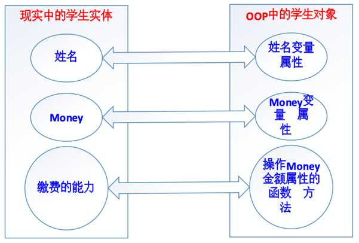

# Python面向对象

## 一、面向对象编程思想

### 1、什么是面向过程

传统的面向过程的编程思想总结起来就八个字——**自顶向下，逐步细化！**

→ 将要实现的功能描述为一个从开始到结束按部就班的连续的“步骤”

→ 依次逐步完成这些步骤，如果某一个步骤的难度较大，又可以将该步骤再次细化为若干个子步骤，以此类推，一直到结尾并得到我们想要的结果

> 就是把要开发的系统分解为若干个步骤，每个步骤就是函数，当所有步骤全部完成以后，则这个系统就开发完毕了！

举个栗子：大家以来传智教育报名学习这件事情，可以分成哪些步骤？开始 → 学员**提出**报名，**提供**相关材料 → 学生**缴纳**学费，**获得**缴费凭证 → 教师凭借学生缴费凭证进行**分配**班级 → 班级**增加**学生信息 → 结束所谓的面向过程，就是将上面分析好了的步骤，依次执行就行了！

### 2、什么是面向对象

思考：上面的整个报名过程，都有哪些动词？

**提出、提供、缴纳、获得、分配、增加**


有动词就一定有实现这个动作的实体！

所谓的模拟现实世界，就是使计算机的编程语言在解决相关业务逻辑的时候，与真实的业务逻辑的发生保持一致，需要使任何一个动作的发生都存在一个支配给该动作的一个实体（主体），因为在现实世界中，任何一个功能的实现都可以看做是一个一个的实体在发挥其各自的“功能”（能力）并在内部进行协调有序的调用过程！

### 3、举个栗子：使用面向对象实现报名系统开发

#### ☆ 第一步：分析哪些动作是由哪些实体发出的

**学生**提出报名

**学生**提供相关资料

**学生**缴费

**机构**收费

**教师**分配教室

**班级**增加学生信息 

于是，在整个过程中，一共有四个实体：**学生、机构、教师、班级**！在现实中的一个具体的实体，就是计算机编程中的一个**对象**！

#### ☆ 第二步：定义这些实体，为其增加相应的属性和功能

属性就是实体固有的某些特征特性信息，在面向对象的术语中，属性就是以前的变量。


比如

一个人的属性有：身高、体重、三围、姓名、年龄、学历、电话、籍贯、毕业院校等

一个手机的属性有：价格、品牌、操作系统、颜色、尺寸等


功能就是就是实体可以完成的动作，在面向对象的术语中，功能就是封装成了函数或方法


#### ☆ 第三步：让实体去执行相应的功能或动作

学生提出报名

学生提供相关资料

教师登记学生信息

学生缴费

机构收费

教师分配教室

班级增加学生信息

### 4、面向对象编程思想迁移

以前写代码，首先想到的是需要实现什么功能——调用系统函数，或者自己自定义函数，然后按部就班的执行就行了！

以后写代码，**首先想到的是应该由什么样的主体去实现什么样的功能，再把该主体的属性和功能统一的进行封装，最后才去实现各个实体的功能。**


注意：面向对象并不是一种技术，而是一种思想，是一种解决问题的最基本的思维方式！ 


所以，面向对象的核心思想是：**不仅仅是简单的将功能进行封装（封装成函数），更是对调用该功能的主体进行封装，实现某个主体拥有多个功能，在使用的过程中，先得到对应的主体，再使用主体去实现相关的功能！**

### 5、面向对象要比面向过程好？

一个面试题：面向过程和面向对象的区别？

① 都可以实现代码重用和模块化编程，面向对象的模块化更深，数据也更封闭和安全

② 面向对象的思维方式更加贴近现实生活，更容易解决大型的复杂的业务逻辑

③ 从前期开发的角度来看，面向对象比面向过程要更复杂，但是从维护和扩展的角度来看，面向对象要远比面向过程简单！

④ 面向过程的代码执行效率比面向对象高

## 二、面向对象的基本概念

### 1、面向对象中两个比较重要概念

#### ☆ 对象

对象，object，现实业务逻辑的一个动作实体就对应着OOP编程中的一个对象！



所以：① 对象使用属性（property）保存数据！② 对象使用方法（method）管理数据！

#### ☆ 类

对象如何产生？又是如何规定对象的属性和方法呢？

答：**在Python中，采用类（class）来生产对象，用类来规定对象的属性和方法！也就是说，在Python中，要想得到对象，必须先有类！**


为什么要引入类的概念？ 类本来就是对现实世界的一种模拟，在现实生活中，任何一个实体都有一个类别，**类就是具有相同或相似属性和动作的一组实体的集合！**所以，在Python中，对象是指现实中的一个具体的实体，而既然现实中的实体都有一个类别，所以，OOP中的对象也都应该有一个类！


一个对象的所有应该具有特征特性信息，都是由其所属的类来决定的，但是每个对象又可以具有不同的特征特性信息，比如，我自己（人类）这个对象，名字叫老王，性别男，会写代码，会教书；另一个对象（人类）可能叫赵薇，性别女，会演戏，会唱歌！

### 2、类的定义

在Python中，我们可以有两种类的定义方式：Python2（经典类）和 Python3（新式类）

经典类：不由任意内置类型派生出的类，称之为经典类

```python
class 类名:
    # 属性
    # 方法
```

新式类：

```python
class 类名():
    # 属性
    # 方法
```

这就是一个类，只不过里面什么都没有！其中，**类名不区分大小写，遵守一般的标识符的命名规则（以字母、数字和下划线构成，并且不能以数字开头），一般为了和方法名相区分，类名的首字母一般大写！（大驼峰法）**

基本语法：

```python
class Person():
    # 属性
    # 方法（函数）
    def eat(self):
        print('我喜欢吃零食')
    def drink(self):
        print('我喜欢喝可乐')
```

### 3、类的实例化（创建对象）

类的实例化就是把抽象的事务具体为现实世界中的实体。

类的实例化就是**通过类得到对象！**

类只是对象的一种规范，类本身基本上什么都做不了，必须利用类得到对象，这个过程就叫作**类的实例化！**

基本语法：

```python
对象名 = 类名()
```

> 在其他的编程语言中，类的实例化一般是通过new关键字实例化生成的，但是在Python中，我们不需要new关键字，只需要类名＋()括号就代表类的实例。

案例：把Person类实例化为为对象p1

```python
#1、定义一个类
class Person():
    # 定义相关方法
    def eat(self):
        print('我喜欢吃零食')
    def drink(self):
        print('我喜欢喝可乐')
        
#2、实例化对象
p1 = Person()
#3、调用类中的方法
p1.eat()
p1.drink()
```

### 4、类中的self关键字

self也是Python内置的关键字之一，其指向了**类实例对象本身**。

```python
#1、定义一个类
class Person():
    # 定义一个方法
    def speak(self):
        print(self)
        print('Nice to meet you!')

#2、类的实例化（生成对象）
p1 = Person()
print(p1)
p1.speak()

p2 = Person()
print(p2)
p2.speak()
```

> 一句话总结：类中的self就是谁实例化了对象，其就指向谁。

## 三、对象的属性添加与获取

### 1、什么是属性

在Python中，任何一个对象都应该由两部分组成：属性 + 方法

属性即是特征，比如：人的姓名、年龄、身高、体重…都是对象的属性。

​											     车的品牌、型号、颜色、载重量...都是对象的属性。

对象属性既可以在类外面添加和获取，也能在类里面添加和获取。

### 2、在类的外面添加属性和获取属性

#### ☆ 设置

```python
对象名.属性 = 属性值
```

案例：

```python
#1、定义一个Person类
class Person():
    pass

#2、实例化Person类，生成p1对象
p1 = Person()
#3、为p1对象添加属性
p1.name = '老王'
p1.age = 18
p1.address = '北京市顺义区京顺路99号'
```

#### ☆ 获取

在Python中，获取对象属性的方法我们可以通过`对象名.属性`来获取

```python
#1、定义一个Person类
class Person():
    pass

#2、实例化Person类，生成p1对象
p1 = Person()
#3、为p1对象添加属性
p1.name = '老王'
p1.age = 18
p1.address = '北京市顺义区京顺路99号'

#4、获取p1对象的属性
print(f'我的姓名：{p1.name}')
print(f'我的年龄：{p1.age}')
print(f'我的住址：{p1.address}')
```

### 3、在类的内部获取外部定义的属性

```python
#1、定义一个Person类
class Person():
    def speak(self):
        print(f'我的名字：{self.name}，我的年龄：{self.age}，我的住址：{self.address}')

#2、实例化Person类，生成p1对象
p1 = Person()
#3、添加属性
p1.name = '孙悟空'
p1.age = 500
p1.address = '花果山水帘洞'
#4、调用speak方法
p1.speak()
```

遗留一个问题：目前我们的确可以通过`对象.属性`的方式设置或获取对象的属性，但是这种设置属性的方式有点繁琐，每次定义一个对象，就必须手工设置属性，在我们面向对象中，对象的属性能不能在实例化对象时，直接进行设置呢？

答：可以，但是需要使用魔术方法

## 四、魔术方法

### 1、什么是魔术方法

在Python中，`__xxx__()`的函数叫做魔法方法，指的是具有**特殊功能**的函数。

`dir()` 是Python中的一个内置函数，用于**列出对象的所有属性和方法**。可以用来查看类的魔术方法。

### 2、\__init__()方法(初始化方法或构造方法)

思考：人的姓名、年龄等信息都是与生俱来的属性，可不可以在生产过程中就赋予这些属性呢？

答：可以，使用`__init__()` 方法，其作用：实例化对象时，连带其中的参数，会一并传给``__init__``函数自动并执行它。`__init__()`函数的参数列表会在开头多出一项，它永远指代新建的那个实例对象，Python语法要求这个参数必须要有，名称为self。

```python
#1、定义一个类
class Person():
    # 初始化实例对象属性
    def __init__(self, name, age):
        # 赋予name属性、age属性给实例化对象本身
        # self.实例化对象属性 = 参数
        self.name = name
        self.age = age

#2、实例化对象并传入初始化属性值
p1 = Person('孙悟空', 500)
#3、调用p1对象自身属性name与age
print(p1.name)
print(p1.age)
```

> ① \__init__()方法，在创建一个对象时默认被调用，不需要手动调用
>
> ② \__init__(self)中的self参数，不需要开发者传递，python解释器会自动把当前的对象
>
> 引用传递过去。

### 3、\__str__()方法

当使用print输出对象的时候，默认打印对象的内存地址。如果类定义了`__str__`方法，那么就会打印从在这个方法中 return 的数据。

没有使用`__str__()`方法的类：

```python
#1、定义一个类
class Car():
    # 首先定义一个__init__方法，用于初始化实例对象属性
    def __init__(self, brand, model, color):
        self.brand = brand
        self.model = model
        self.color = color

    # 定义一个__str__内置魔术方法，用于输出小汽车的相关信息
    def __str__(self):
        return f'汽车品牌：{self.brand}，汽车型号：{self.model}，汽车颜色：{self.color}'

#2、实例化对象c1
c1 = Car('奔驰', 'S600', '黑色')
print(c1)
```

① `__str__`这个魔术方法是在类的外部，使用print(对象)时，自动被调用的

② 在类的内部定义`__str__`方法时，必须使用return返回一个字符串类型的数据

### 4、\__del__()方法（删除方法或析构方法）

当删除对象时，python解释器也会默认调用`__del__()`方法。

```python
class Person():
    # 构造函数__init__
    def __init__(self, name, age):
        self.name = name
        self.age = age
        
    # 析构方法__del__
    def __del__(self):
        print(f'{self}对象已经被删除')

#实例化对象
p1 = Person('白骨精', 100)
#删除对象p1
del p1
```

`__del__()`方法在使用过程中，比较简单，但是其在实际开发中，有何作用呢？

答：主要用于关闭文件操作、关闭数据库连接等等。

### 5、\_call__()方法
`__call__` 是一个特殊的方法，当一个对象被调用（即使用括号 `()` 调用）时，Python 解释器会查找并调用该对象的 `__call__` 方法。如果类定义了 `__call__` 方法，那么这个类的实例就可以像函数一样被调用。
```python
class CallableClass:
    def __call__(self, x):
        return x * 2

#创建一个类的实例
callable_instance = CallableClass()

#调用实例，就像调用函数一样
result = callable_instance(5)
print(result)  # 输出：10
```

### 6、\_setattr__()、_\_getattr()__方法
`__setattr__`是Python中的一个特殊方法，用于重载对象的属性赋值操作。当尝试给对象的属性赋值时，会自动调用这个方法。你可以在类中定义`__setattr__`方法来自定义属性赋值的行为。
`__getattr__`是Python中的一个特殊方法，主要用于获取对象的属性时使用。当尝试访问一个对象不存在的属性时，Python会调用这个方法。
```python
class MyClass:
    def __setattr__(self, name, value):
        print(f"设置属性 {name} 的值为 {value}")
        super().__setattr__(name, value)

obj = MyClass()
obj.x = 10  # 输出：设置属性 x 的值为 10
```
```python
class MyClass:
    def __init__(self):
        self._my_attribute = "This is a real attribute"

    def __getattr__(self, name):
        """当尝试访问不存在的属性时，Python会调用此方法"""
        if name == 'my_magic_attribute':
            return "This is a magic attribute"
        else:
            raise AttributeError(f"'MyClass' object has no attribute '{name}'")

#创建一个对象
obj = MyClass()
#访问实际存在的属性
print(obj._my_attribute)  # 输出: This is a real attribute
#访问不存在的属性，但我们在__getattr__中定义了处理逻辑
print(obj.my_magic_attribute)  # 输出: This is a magic attribute
#访问其他未定义的属性将触发AttributeError
print(obj.some_other_attribute)  # 抛出异常: 'MyClass' object has no attribute 'some_other_attribute'
```
### 7、特殊属性

| 特殊属性                 | 功能描述     |
| ------------------------ | ------------ |
| `obj.__dict__`           | 对象属性字典 |
| `obj.__class__`          | 对象所属的类 |
| `class.__doc__`          | 类的注释     |
| `class.__bases__`        | 类的父类元组 |
| `class.__base__`         | 类的父类     |
| `class.__mro__`          | 类的层次结构 |
| `class.__subclasses__()` | 类的子类列表 |

```python
class A:
  """类A的注释信息"""
  def __init__(self,name):
    self.name = name

class B(A):
  pass

a = A('yage')
print(a.__dict__)   #{'name': 'yage'}
print(a.__class__)  #<class '__main__.A'>
print(A.__doc__)    #类A的注释信息
print(A.__base__)   #<class 'object'>
print(B.__bases__)  #(<class '__main__.A'>,)
print(B.__mro__)    #(<class '__main__.B'>, <class '__main__.A'>, <class 'object'>)
print(A.__subclasses__())  #[<class '__main__.B'>]
```

### 8、总结

提到魔术方法：① 这个方法在什么情况下被触发 ② 这个方法有什么实际的作用。

`__init__()`：初始化方法或者称之为“构造函数”，在对象初始化时执行，其主要作用就是在对象初始化时，对对象进行初始化操作（如赋予属性）

`__str__()`：对象字符串方法，当我们在类的外部，使用print方法输出对象时被触发，其主要功能就是对对象进行打印输出操作，要求方法必须使用return返回字符串格式的数据。

`__del__()`：删除方法或者称之为“析构方法”，在对象被del删除时触发，其主要作用就是适用于关闭文件、关闭数据库连接等等。

## 五、面向对象的综合案例

案例1：定义学员信息类，包含姓名、成绩属性，定义成绩打印方法（90分及以上显示优秀，80分及以上显示良好，70分及以上显示中等，60分及以上显示合格，60分以下显示不及格）

学员对象（属性、方法）


```python
#1、定义学员信息类
class Student():
    # 2、定义学员对象属性
    def __init__(self, name, score):
        self.name = name
        self.score = score

    # 3、定义一个方法，用于打印学员的成绩等级
    def print_grade(self):
        if self.score >= 90:
            print(f'学员姓名：{self.name}，学员成绩：{self.score}，优秀')
        elif self.score >= 80:
            print(f'学员姓名：{self.name}，学员成绩：{self.score}，良好')
        elif self.score >= 70:
            print(f'学员姓名：{self.name}，学员成绩：{self.score}，中等')
        elif self.score >= 60:
            print(f'学员姓名：{self.name}，学员成绩：{self.score}，及格')
        else:
            print(f'学员姓名：{self.name}，学员成绩：{self.score}，不及格')

#4、实例化对象
tom = Student('Tom', 80)
tom.print_grade()

jennifier = Student('Jennifier', 59)
jennifier.print_grade()
```

案例2：小明体重75.0公斤，小明每次跑步会减掉0.50公斤，小明每次吃东西体重增加1公斤分析：① 对象：小明② 属性：姓名、体重③ 方法：跑步、吃东西


```python
#1、定义Person类
class Person():
    # 2、初始化对象属性，name和weight
    def __init__(self, name, weight):
        self.name = name
        self.weight = weight

    # 3、定义一个__str__方法打印对象的信息
    def __str__(self):
        return f'姓名：{self.name}，目前体重：{self.weight}KG'

    # 4、定义一个run方法代表跑步
    def run(self):
        self.weight -= 0.5

    # 5、定义一个eat方法代表吃饭
    def eat(self):
        self.weight += 1

#6、实例化对象
xiaoming = Person('小明', 75.0)
print(xiaoming)

#7、吃饭
xiaoming.eat()
print(xiaoming)

#8、减肥跑步
xiaoming.run()
print(xiaoming)
```

## 六、面向对象的三大特性

### 1、面向对象有哪些特性

三种：封装性、继承性、多态性

### 2、Python中的封装

在Python代码中，封装有两层含义：

① 隐藏内部细节，对外提供操作方式即为封装

```python
class Person():
    # 封装属性
    # 封装方法
```

② 封装可以为属性和方法添加为私有权限

### 3、封装中的私有属性和私有方法

在面向对象代码中，我们可以把属性和方法分为两大类：公有（属性、方法）、私有（属性、方法）

公有属性和公有方法：无论在类的内部还是在类的外部我们都可以对属性和方法进行操作。但是有些情况下，我们不希望在类的外部对类内部的属性和方法进行操作。我们就可以把这个属性或方法封装成私有形式。

单下划线开头：以单下划线开头的属性或方法表示protected受保护的成员，这类成员被视为仅供内部使用，允许类本身和子类进行访问，但实际上它**可以被外部代码访问**。

双下划线开头：表示private私有的成员，这类成员只允许定义该属性或方法的类本身进行访问。

首尾双下划线：一般表示特殊的方法，魔术方法。

### 4、私有属性的访问限制

设置私有属性和私有方法的方式非常简单：在属性名和方法名 前面 加上两个下划线 `__` 即可。

基本语法：

```python
class Girl():
    def __init__(self, name):
        self.name = name
        self.__age = 18

xiaomei = Girl('小美')
print(xiaomei.name)
print(xiaomei.__age)  # 报错，提示Girl对象没有__age属性
```

> 类中的私有属性和私有方法，不能被其子类继承。

由以上代码运行可知，私有属性不能在类的外部被直接访问。但是出于种种原因，我们想在外部对私有属性进行访问，该如何操作呢？

答：我们可以定义一个统计的访问"接口"（函数），专门用于实现私有属性的访问。

### 5、私有属性设置与访问接口

在Python中，一般定义函数名' get_xx '用来获取私有属性，定义' set_xx '用来修改私有属性值。

```python
class Girl():
    def __init__(self, name):
        self.name = name
        self.__age = 18

    # 公共方法：提供给外部的访问接口
    def get_age(self):
        # 本人访问：允许直接访问
        # 外人访问：加上限制条件
        return self.__age

    # 公共方法：提供给外部的设置接口
    def set_age(self, age):
        self.__age = age


girl = Girl('小美')
girl.set_age(19)
print(girl.get_age())
```

### 6、私有方法

私有方法的定义方式与私有属性基本一致，在方法名的前面添加两个下划线`__方法名()`，只能在类的内部被访问。

### 7、封装性到底有何意义

① 以面向对象的编程思想进行项目开发

② 封装数据属性：明确的区分内外，控制外部对隐藏的属性的操作行为（过滤掉异常数据）

```python
class People():
    def __init__(self, name, age):
        self.__name = name
        self.__age = age

    def tell_info(self):
        print('Name:<%s> Age:<%s>' % (self.__name, self.__age))

    # 对私有属性的访问接口
    def set_info(self, name, age):
        if not isinstance(name, str):
            print('名字必须是字符串类型')
            return
        if not isinstance(age, int):
            print('年龄必须是数字类型')
            return
        self.__name = name
        self.__age = age

p = People('jack', 38)
p.tell_info()

p.set_info('jennifer', 18)
p.tell_info()

p.set_info(123, 35)
p.tell_info()
```

③ 私有方法封装的意义：降低程序的复杂度

```python
class ATM:
    def  __card(self):
         print('插卡')
    def  __auth(self):
         print('用户认证')
    def __input(self):
          print('输入取款金额')
    def __print_bill(self):
          print('打印账单')
    def __take_money(self):
          print('取款')

    # 定义一个对外提供服务的公共方法
    def withdraw(self):
          self.__card()
          self.__auth()
          self.__input()
          self.__print_bill()
          self.__take_money()

atm = ATM()
atm.withdraw()
```


## 七、Python中的继承

### 1、什么是继承

我们接下来来聊聊Python代码中的“继承”：类是用来描述现实世界中同一组事务的共有特性的抽象模型，但是类也有上下级和范围之分，比如：生物 => 动物 => 哺乳动物 => 灵长型动物 => 人类 => 黄种人

从哲学上说，就是共性与个性之间的关系，比如：白马和马！所以，我们在OOP代码中，也一样要体现出类与类之间的共性与个性关系，这里就需要通过类的继承来体现。简单来说，如果一个类A使用了另一个类B的成员（属性和方法），我们就可以说A类继承了B类，同时这也体现了OOP中**代码重用的特性**！

### 2、继承的基本语法

假设A类要继承B类中的所有属性和方法（私有属性和私有方法除外）

```python
class B(object):
    pass

clss A(B):
    pass

a = A()
a.B中的所有公共属性
a.B中的所有公共方法
```

案例：Person类与Teacher、Student类之间的继承关系

```python
class Person(object):
    def eat(self):
        print('i can eat food!')

    def speak(self):
        print('i can speak!')
        
class Teacher(Person):
    pass

class Student(Person):
    pass

teacher = Teacher()
teacher.eat()
teacher.speak()

student = Student()
student.eat()
studnet.speak()
```

### 3、与继承相关的几个概念

继承：一个类从另一个已有的类获得其成员的相关特性，就叫作继承！

派生：从一个已有的类产生一个新的类，称为派生！

很显然，继承和派生其实就是从不同的方向来描述的相同的概念而已，本质上是一样的！


父类：也叫作基类，就是指已有被继承的类！

子类：也叫作派生类或扩展类


扩展：在子类中增加一些自己特有的特性，就叫作扩展，没有扩展，继承也就没有意义了！

单继承：一个类只能继承自一个其他的类，不能继承多个类，单继承也是大多数面向对象语言的特性！

多继承：一个类同时继承了多个父类， （C++、Python等语言都支持多继承）

### 4、单继承

单继承：一个类只能继承自一个其他的类，不能继承多个类。这个类会有具有父类的属性和方法。

基本语法：

```python
#1、定义一个共性类（父类）
class Person(object):
    pass
#2、定义一个个性类（子类）
class Teacher(Person):
    pass
```

案例：比如汽车可以分为两种类型（汽油车、电动车）

```python
#1、定义一个共性类（车类）
class Car(object):
    def run(self):
        print('i can run')
#2、定义汽油车
class GasolineCar(Car):
    pass
#3、定义电动车
class EletricCar(Car):
    pass

bwm = GasolineCar()
bwm.run()
```

### 5、单继承特性：传递性

在Python继承中，如A类继承了B类，B类又继承了C类。则根据继承的传递性，则A类也会自动继承C类中所有属性和方法（公共）

```python
class C(object):
    def func(self):
        print('我是C类中的相关方法func')
        
class B(C):
    pass

class A(B):
    pass

a = A()
a.func()
```

### 6、编写面向对象代码中的常见问题

问题1：在定义类时，其没有遵循类的命名规则

答：在Python中，类理论上是不区分大小写的。但是要遵循一定的命名规范：首字母必须是字母或下划线，其中可以包含字母、数字和下划线，而且要求其命名方式采用大驼峰。

电动汽车：EletricCar

父类：Father

子类：Son


问题2：父类一定要继承object么？Car(object)

答：在Python面向对象代码中，建议在编写父类时，让其自动继承object类。但是其实不写也可以，因为默认情况下，Python中的所有类都继承自object。


问题3：打印属性和方法时，都喜欢用print

```python
class Person():
    def __init__(self, name):
        self.name = name
        
    def speak(self):
        print('i can speak')
        
#创建对象，打印属性和方法
p = Person('Tom')
print(p.name)
p.speak()
```

### 7、多继承

什么是多继承？

Python语言是少数支持多继承的一门编程语言，所谓的多继承就是允许一个类同时继承自多个类的特性。


基本语法：

```python
class B(object):
    pass

class C(object):
    pass

class A(B, C):
    pass

a = A()
a.B中的所有属性和方法
a.C中的所有属性和方法
```

案例：汽油车、电动车 => 混合动力汽车（汽车 + 电动）

```python
class GasolineCar(object):
    def run_with_gasoline(self):
        print('i can run with gasoline')
        
class EletricCar(object):
    def run_with_eletric(self):
        print('i can run with eletric')
        
class HybridCar(GasolineCar, EletricCar):
    pass

tesla = HybridCar()
tesla.run_with_gasoline()
tesla.run_with_eletric()
```

> 注意：虽然多继承允许我们同时继承自多个类，但是实际开发中，应尽量避免使用多继承，因为如果两个类中出现了相同的属性和方法就会产生命名冲突，谁先继承用谁。

### 8、子类扩展：重写父类属性和方法

扩展特性：继承让子类继承父类的所有公共属性和方法，但是如果仅仅是为了继承公共属性和方法，继承就没有实际的意义了，应该是在继承以后，子类应该有一些自己的属性和方法。

什么是重写？

重写也叫作覆盖，就是当子类成员与父类成员名字相同的时候，从父类继承下来的成员会重新定义！

此时，通过子类实例化出来的对象访问相关成员的时候，真正其作用的是子类中定义的成员！

上面单继承例子中 Animal 的子类 Cat和Dog 继承了父类的属性和方法，但是我们狗类Dog 有自己的叫声'汪汪叫'，猫类 Cat 有自己的叫声 '喵喵叫' ，这时我们需要对父类的 call() 方法进行重构。如下：

```python
class Animal(object):
    def eat(self):
        print('i can eat')
    
    def call(self):
        print('i can call')
        
class Dog(Animal):
    pass

class Cat(Animal):
    pass

wangcai = Dog()
wangcai.eat()
wangcai.call()

miaomiao = Cat()
miaomiao.eat()
miaomiao.call()
```

Dog、Cat子类重写父类Animal中的call方法：

```python
class Animal(object):
    def eat(self):
        print('i can eat')
    # 公共方法
    def call(self):
        print('i can call')


class Dog(Animal):
    # 重写父类的call方法
    def call(self):
        print('i can wang wang wang')


class Cat(Animal):
    # 重写父类的call方法
    def call(self):
        print('i can miao miao miao')


wangcai = Dog()
wangcai.eat()
wangcai.call()

miaomiao = Cat()
miaomiao.eat()
miaomiao.call()
```

思考：重写父类中的call方法以后，此时父类中的call方法还在不在？

答：还在，只不过是在其子类中找不到了。类方法的调用顺序，当我们在子类中重构父类的方法后，Cat子类的实例先会在自己的类 Cat 中查找该方法，当找不到该方法时才会去父类 Animal 中查找对应的方法。

### 9、super()调用父类属性和方法

`super()` 函数是一个用于调用父类（超类）的方法的内置工具。它常用于实现方法重写（override）和继承，让子类可以访问父类的属性和方法。

案例：Car汽车类、GasolineCar汽油车、ElectricCar电动车

```python
class Car(object):
    def __init__(self, brand, model, color):
        self.brand = brand
        self.model = model
        self.color = color
    def run(self):
        print('i can run')
        
class GasolineCar(Car):
    #重写：在子类中定义一个和父类同名的方法来实现
    def run(self):
        print('i can run with gasoline')
        
class ElectricCar(Car):
    def __init__(self, brand, model, color):
        #继承父类的__init__方法并添加属性
        super().__init__(brand, model, color)
        # 电池属性
        self.battery = 70
        
    def run(self):
        #继承父类的run方法
        super().run()
        #Car.run(self)   #也可以调用父类的run()方法
        print(f'remain:{self.battery}')
        
bwm = GasolineCar('宝马', 'X5', '白色')
bwm.run()

tesla = ElectricCar('特斯拉', 'Model S', '红色')
tesla.run()
```

### 10、MRO属性或MRO方法：方法解析顺序

MRO(Method Resolution Order)：方法解析顺序，我们可以通过`类名.__mro__`或`类名.mro()`获得“类的层次结构”，方法解析顺序也是按照这个“类的层次结构”寻找到。

```python
class Car(object):
    def __init__(self, brand, model, color):
        self.brand = brand
        self.model = model
        self.color = color
     def run(self):
        print('i can run')
        
class GasolineCar(Car):
    def __init__(self, brand, model, color):
        super().__init__(brand, model, color)
        
    def run(self):
        print('i can run with gasoline')
        
class ElectricCar(Car):
    def __init__(self, brand, model, color):
        super().__init__(brand, model, color)
        # 电池属性
        self.battery = 70
        
    def run(self):
        print(f'i can run with electric，remain:{self.battery}')
        
print(ElectricCar.__mro__)
print(ElectricCar.mro())
```


说明：有MRO方法解析顺序可知，在类的继承中，当某个类创建了一个对象时，调用属性或方法，首先在自身类中去寻找，如找到，则直接使用，停止后续的查找。如果未找到，继续向上一级继承的类中去寻找，如找到，则直接使用，没有找到则继续向上寻找...直到object类，这就是Python类继承中，其方法解析顺序。

> 综上：object类还是所有类的基类（因为这个查找关系到object才终止）

## 八、Python中多态

### 1、什么是多态

多态指的是一类事物有多种形态。


定义：多态是一种使用对象的方式，子类重写父类方法，调用不同子类对象的相同父类方法，可以产生不同的执行结果。

① 多态依赖继承

② 子类方法必须要重写父类方法

> 首先定义一个父类，其可能拥有多个子类对象。当我们调用一个公共方法时，传递的对象不同，则返回的结果不同。


好处：调用灵活，有了多态，更容易编写出通用的代码，做出通用的编程，以适应需求的不断变化！

### 2、多态原理图


公共接口service就是多态的体现，随着传入水果对象的不同，能返回不同的结果。

### 3、多态代码实现

多态：可以基于继承也可以不基于继承

```python
class Fruit(object):
    # 公共方法
    def makejuice(self):
        print('i can make juice')

class Apple(Fruit):
    def makejuice(self):
        print('i can make apple juice')

class Banana(Fruit):
    def makejuice(self):
        print('i can make banana juice')

class Orange(Fruit):
    def makejuice(self):
        print('i can make orange juice')

class Peach(Fruit):
    def makejuice(self):
        print('i can make peach juice')


#定义公共方法如service
def service(obj):
    obj.makejuice()


apple = Apple()
banana = Banana()
orange = Orange()

for i in (apple, banana, orange):
    service(i)
```

扩展：在Python中还有哪些多态的案例呢？

+多态体现

+加号只有一个，但是不同的对象调用+方法，其返回结果不同。

1 + 1 = 2

'a' + 'b' = 'ab'

[1,2,3] + [4,5,6] = [1,2,3,4,5,6]

## 九、类的深拷贝和浅拷贝

在Python中，深拷贝和浅拷贝是两种不同的对象复制方式。

1. 浅拷贝：创建一个新的对象，但它包含的是对原始对象中包含项的引用，而不是副本。如果原始对象中的项是可变的，改变它们将影响浅拷贝。
2. 深拷贝：创建一个新的对象，并且递归地复制原始对象中的所有对象。这意味着如果原始对象中的项是可变的，改变它们不会影响深拷贝。

在Python中，可以使用`copy`模块的`copy()`函数进行浅拷贝，使用`deepcopy()`函数进行深拷贝。

```python
import copy

class MyClass:
    def __init__(self, value):
        self.value = value

obj1 = MyClass([1, 2, 3])
obj2 = copy.copy(obj1)  # 浅拷贝
obj3 = copy.deepcopy(obj1)  # 深拷贝

obj1.value.append(4)
print(obj2.value)  # [1, 2, 3, 4]
print(obj3.value)  # [1, 2, 3]
```

## 十、面向对象其他特性

### 1、类属性

Python中，属性可以分为实例属性和类属性。

类属性就是 类对象中定义的属性，它被该类的所有实例对象所共有。通常用来记录 与这类相关 的特征，类属性 不会用于记录 具体对象的特征。

> 在Python中，一切皆对象。类也是一个特殊的对象，我们可以单独为类定义属性。

```python
class Person(object):
    # 定义类属性
    count = 0
    def __init__(self, name, age):
        self.name = name
        self.age = age
        
p1 = Person('Tom', 23)
p2 = Person('Harry', 26)
```

### 2、类属性代码实现

定义count类属性，用于记录实例化Person类，产生对象的数量。

```python
class Person(object):
    # 定义类属性count
    count = 0

    # 定义一个__init__魔术方法，用于进行初始化操作
    def __init__(self, name):
        self.name = name
        # 对count类属性进行+1操作，用于记录这个Person类一共生成了多少个对象
        Person.count += 1

#1、实例化对象p1
p1 = Person('Tom')
p2 = Person('Harry')
p3 = Person('Jennifer')
#2、在类外部输出类属性
print(f'我们共使用Person类生成了{Person.count}个实例对象')
```

### 3、类方法

为什么需要类方法，在面向对象中，特别强调数据封装性。所以不建议直接在类的外部对属性进行直接设置和获取。所以我们如果想操作类属性，建议使用类方法。

需要使用装饰器@classmethod来表示其为类方法，对于类方法，第一个参数必须是类对象，一般以cls作为第一个参数。

```python
class Tool(object):
    # 定义一个类属性count
    count = 0
    # 定义一个__init__初始化方法
    def __init__(self, name):
        self.name = name
        Tool.count += 1
    # 封装一个类方法：专门实现对Tool.count类属性进行操作
    @classmethod
    def get_count(cls):
        print(f'我们使用Tool类共实例化了{cls.count}个工具')
        
t1 = Tool('斧头')
t2 = Tool('榔头')
t3 = Tool('铁锹')

Tool.get_count()  #我们使用 Tool类共实例化了3个工具
t1.get_count()   #对象也能调用类方法
```

> 类方法主要用于操作类属性或类中的其他方法。

### 4、静态方法

在开发时，如果需要在类中封装一个方法，这个方法：  

**① 既 不需要访问实例属性或者调用实例方法**

**② 也 不需要访问类属性或者调用类方法**

这个时候，可以把这个方法封装成一个静态方法

```python
#开发一款游戏
class Game(object):
    # 开始游戏，打印游戏功能菜单
    @staticmethod
    def menu():
        print('1、开始游戏')
        print('2、游戏暂停')
        print('3、退出游戏')

#开始游戏、打印菜单
Game.menu()
```

## 十一、综合案例

### 1、需求分析

设计一个`Game`类

属性：

定义一个类属性`top_score`记录游戏的历史最高分

定义一个实例属性`player_name`记录当前游戏的玩家姓名


方法：

静态方法`show_help`显示游戏帮助信息

类方法`show_top_score`显示历史最高分

实例方法`start_game`开始当前玩家的游戏

### 2、实例代码

```python
class Game(object):
    # 1、定义类属性top_score
    top_score = 0

    # 2、定义初始化方法__init__
    def __init__(self, player_name):
        self.player_name = player_name

    # 3、定义静态方法，用于输出帮助信息
    @staticmethod
    def show_help():
        print('游戏帮助信息')

    # 4、定义类方法
    @classmethod
    def show_top_score(cls):
        print(f'本游戏历史最高分：{cls.top_score}')

    # 5、定义实例方法，start_game()
    def start_game(self):
        print(f'{self.player_name}，游戏开始了，你准备好了么？')


#实例化类生成实例对象
mario = Game('itheima')
mario.start_game()

#显示历史最高分
Game.show_top_score()

#弹出游戏帮助信息
Game.show_help()
```

## 十二、面向对象中的单例模式

### 1、什么是设计模式

设计模式就是前人根据实际的问题提出的问题解决方案，我们把这种就称之为设计模式。

### 2、单例模式

单例模式是一种常见的设计模式！

所谓的设计模式，不是一种新的语法，而是人们在实际的应用中，面对某种特定的情形而设计出来的某种常见的有效的解决方案，所以，设计模式只是经验的总结！


什么又是单例模式？单例，就是单一实例！

**在实际的运用中，存在一些类，只需要实例化一个对象，就可以完成其所有的功能操作。所以，如果我们能够通过某些技巧，使得一个类只能开辟一个对象空间的话，这样就可以节省相应的对象资源，这种模式就叫作单例模式！**


应用场景：音乐播放器对象、回收站对象、打印机对象

### 3、\__new__()方法

在Python中，我们目前已经学了3个魔术方法了，分别是`__init__()`、`__str__()`、`__del__()`，接下来介绍一下`__new__()`方法。

使用类名()创建对象时，Python的解释器首先会调用`__new__方法`为对象分配空间。

__new__是一个由object积累提供的内置的静态方法，主要作用有两个：

○ **在内存中为对象分配空间**

○ **返回对象的引用**

Python解析器获得对象的引用后，将引用作为第一个参数，传递给`__init__方法`重写`__new__方法`的代码非常固定，一定要使用`return super(). __new__(cls)`，否则Python解释器得不到分配了空间的对象引用，就不会调用对象的初始化方法。

> `__new__方法`是一个静态方法，在调用时，要求将自身类信息cls作为参数传递到这个方法中，这个方法属于object类中的一个静态方法。

案例：

```python
#定义一个播放器类
class MusicPlayer(object):
    # 重写__new__()魔术方法
    def __new__(cls, *args, **kwargs):
        print('1、开辟内存空间')
        print('2、返回实例化对象引用地址')
        return super().__new__(cls)

    def __init__(self, name):
        self.name = name

#1、实例mp1对象
mp1 = MusicPlayer('红色的高跟鞋')
print(mp1)

#2、实例化mp2对象
mp2 = MusicPlayer('春夏秋冬')
print(mp2)
```

### 4、单例模式的代码实现

```python
#定义一个播放器类
class MusicPlayer(object):
    # 定义一个类属性，如instance，用于记录之前实例化对象返回的内存引用
    instance = None
    # 重写__new__()魔术方法
    def __new__(cls, *args, **kwargs):
        # 判断实例化时有没有分配过内存空间
        if cls.instance is None:
            cls.instance = super().__new__(cls)
        return cls.instance

    def __init__(self, name):
        self.name = name

#1、实例mp1对象
mp1 = MusicPlayer('红色的高跟鞋')
print(mp1)

#2、实例化mp2对象
mp2 = MusicPlayer('春夏秋冬')
print(mp2)
```

> 注：类属性在内存中是一个特殊的存在，其不用于以前讲过的局部变量（局部变量当函数执行完毕后，其会被内存所销毁）。但是类属性一旦定义，除非对象以及这个类在内存中被销毁了，否则其不会自动销毁。


