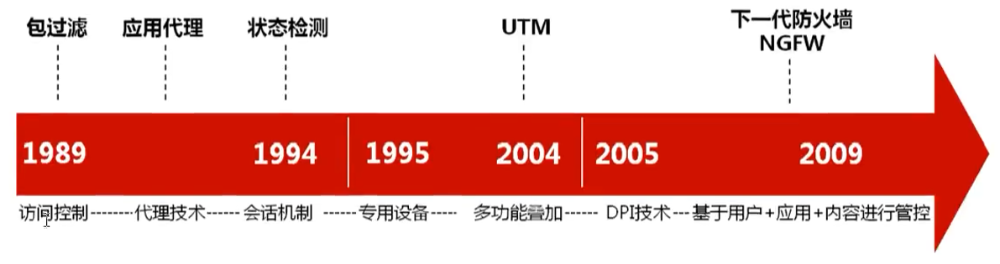

# 网络安全基础

## 华为常见的安全产品

https://support.huawei.com/enterprise/zh/index.html

https://info.support.huawei.com/network/imagelib/index?lang=zh&domain=0

**防火墙：USG Eudemon - 区域隔离和访问控制**

WAF (Web应用防火墙)：保护网站-imperva-中小企业用

SVN：做VPN的产品，目前功能内置到了USG防火墙

**IPS：入侵防御设备，基于特征码反病毒，通常部署在出口区域防火墙的后端，用于防范去往内网的安全威胁，在中大型企业中较为常见；**

**AntiDDoS：DDoS防御设备，主要用于大型企业，如银行、互联网公司等DDoS重灾区，价格昂贵**

**FireHunter：沙箱，新一代高性能APT威胁检测系统，基于行为反病毒**

UMA堡垒机：专业的运维审计设备，主要用于管控管理员的操作权限及监控操
作过程，企业通常根据需要部署

iMaster-NCE：企业中常见的准入控制设备，常与交换机/防火墙组成准入控制
方案，对员工进行身份认证、授权访问资源及审计上网行为

ASG：上网行为管理

VSCAN：漏洞扫描

数据库审计：虚拟化产品 - 启明星辰

安全控制器：可以接收态势感知系统下发的策略，安全控制器直接通过防火墙把流量干掉。也可以通过Imaster NCE把阻断策略下发给交换机。

> 安全产品越多，相对来说越安全。

**三级等级保护：**

- 安全通信网络：NGFW、SVN等
- 安全区域边界：NGFW、IPS、APT、AntiDDos、防病毒网关等
- 安全计算环境：IPS、WAF、数据防泄露等
- 安全管理中心：日志审计、数据库审计、统一运维审计、态势感知系统、漏洞扫描、安全控制器等

## 防火墙发展史

第一代防火墙：包过滤防火墙，也就是使用访问控制列表

第二代防火墙：应用代理，最安全的防火墙

华为WAF、思科WSA网页安全、思科ESA邮件安全等

第三代：状态检测，以色列Checkpoint，会话表，基于状态表放行流量

抵御攻击：IPS，思科IPS4000

反病毒：AV

实现企业内网互通：VPN，思科VPN3000

**上一代防火墙：UTM，统一威胁管理**，集成了尽可能多的安全功能

思科ASA (2005年推出) 防火墙属于UTM，基于五元组，取代PIX防火墙 + VPN3000 + HPS4000

多款产品融合度不好，不能同时处理数据

**下一代防火墙：**基于用户、应用、内容（关键字）

多个模块可以同时处理数据，效率高

