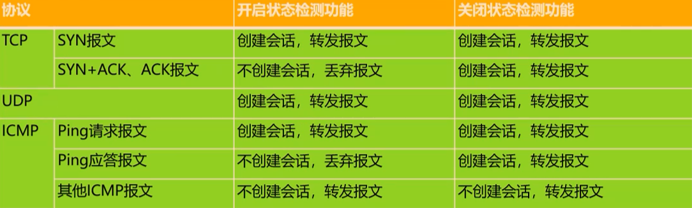
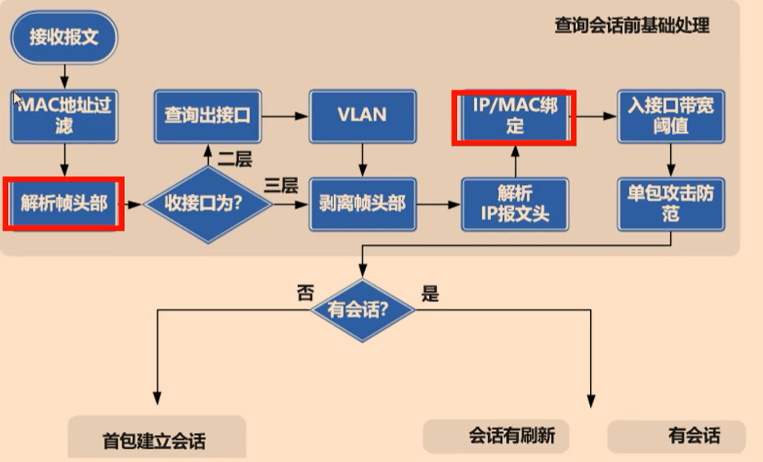

# 防火墙基础原理

## 状态检测技术

FW会对TCP、UDP和ICMP协议的报文创建会话，前提还是这些报文要通过防火墙上包括安全策略在内的各项安全机制的检查，然后才会创建会话。



FW采用了基于“状态”的报文控制机制：只对首包，或者少量报文进行检测就确定条连接的状态，大量报文直接根据所属连接的状态进行控制。这种状态检测机制迅速提高了FW的检测和转发效率。

开启状态检测功能时，只有 **首包** 通过设备时才可建立会话

关闭状态检测功能时，没有找到相应会话的后续报文也可以建立



```bash
firewall session link-state check   #开启状态检测，默认开启
display firewall session link-state #查看状态检测
firewall session link-state exclude acl 3000  #状态检测排除掉acl 3000的流量
display firewall session table verbose        #查看会话表详细信息
display firewall session table service telnet #查看固定服务会话表
reset firewall session table                  #清除会话，后面可以跟指定协议和会话id等
```


## 会话机制

防火墙会将属于同一连接的所有报文作为一个整体的数据流（会话）来对待。会话表是用来记录TCP、UDP、ICMP等协议连接状态的表项，是防火墙转发报文的重要依据。

会话是通信双方的连接在防火墙上的具体体现，代表两者的连接状态，一条会话就表示通信双方的一个连接。

- 通过会话中的五元组信息可以唯一确定通信双方的一条连接；
- 防火墙将要删除会话的时间称为会话的老化时间；
- 一条会话表示通信双方的一个连接，多条会话的集合叫做会话表。

防火墙为各种协议设定了会话老化机制。当一条会话在老化时间内没有被任何报文匹配，则会被从会话表中删除。而会话表项在一直有流量匹配的情况下不会老化，所以在某些情况下可能需要清除会话表信息，以重新生成会话表，例如：

- 更改了安全策略的配置，将某些用户的动作设置为“允许”修改为“禁止”并希望该配置立即生效。
- 更改了NAT的配置，NAT转换前后的IP地址发生了变化，并且希望立即生效。

> 注意：清除时，需尽量减小清除范围

但是对于某些特殊业务中，一条会话的两个连续报文可能间隔时间很长。例如：

- 用户通过FTP下载大文件，需要间隔很长时间才会在控制通道继续发送控制报文；
- 用户需要查询数据库服务器上的数据，这些查询操作的时间间隔远大于TCP的会话老化时间。
- 在以上的场景中，如果会话表项被删除，则对应的业务就会中断。**长连接（Long** 
  **Link）机制** 可以给部分连接设定超长的老化时间。

对象 -- 服务 里可以修改会话服务集的老化时间，做安全策略时可以配置会话老化时间，最大65535s，也可以配置自定义长连接，最大2400小时。

> 注意：基于策略的自定义长连接 > 基于策略的老化时间 > 基于服务集的老化时间

**防火墙功能模块处理流程（假设是初始会话）：**

- IP-MAC绑定
- 入接口带宽阈值
- 单包攻击防范
- 状态检测
- 黑名单
- Server-map
- **路由表**
- 认证策略
- **安全策略**
- 连接数限制
- 创建会话
- 带宽策略 (最大带宽、保证带宽、连接数限制)
- 内容安全策略 (反病毒、入侵防御、内容过滤等)
- **源NAT**
- VPN
- 出接口带宽阈值


## Server-map表

在TCP/IP模型中，应用层提供常见的网络应用服务，如Telnet、HTTP、FTP等协议。而应用层协议根据占用的端口数量可以分为 **单通道应用层协议** 与 **多通道应用层协议**。

- 单通道应用层协议：通信过程中只需占用一个端口的协议。例如： Telnet只需占用23端口，HTTP只需占用80端口；
- 多通道应用层协议：通信过程中需占用两个或两个以上端口的协议。例如：FTP被动模式下需要占用21号端口以及一个随机端口。

 传统包过滤防火墙针对多通道应用层协议访问控制的不足：

- 传统的包过滤防火	墙只能实现简单的访问控制；
- 传统的包过滤防火墙只能阻止一些使用固定端口的单通道协议的应用数据。

为了解决这一类问题，FW引入了Server-map表，Server-map用于存放一种映射关系，这种映射关系可以是控数据协商出来的数据连接关系，也可以是配置NAT中的地址映射关系，使得外部网络能透过设备主动访问内部网络。生成Server-map表之后，如果一个数据连接匹配了Server-map表项，那么就能够被设备正常转发，并在匹配Server-map表后创建会话，保证后续报文能够按照会话表转发。

```bash
display firewall server-map   #查看Server-map表
diagnose   #进入诊断视图
reset firewall server-map     #清除Server-map 表信息
```

Server-map表与会话表的关系如下：

- Server-map表记录了应用层数据中的关键信息，报文命中该表后，不再受安全策略的控制；
- 会话表是通信双方连接状态的具体体现；
- Server-map表不是当前的连接信息，**而是防火墙对当前连接分析后得到的即将到来报文的预测**。

防火墙接收报文的处理过程如图所示：

- 防火墙收到报文先检查是否命中会话表；
- 如果没有命中则检查是否命中Server-map表；
-  **命中Server-map表的报文不受安全策略控制**；
-  防火墙最后为命中Server-map表的数据创建会话表。


### ASPF

ASPF（Application Specific Packet Filter）是针对应用层的包过滤。

通过检测协商报文的应用层携带的地址和端口信息，自动生成相应的Server-map表，当数据通道的首包经过防火墙时，防火墙根据Server-map生成一条session，用于放行后续数据通道的报文，相当于自动创建了一条精细的“安全策略”。

对于特定应用协议的所有连接，每一个连接状态信息都将被ASPF维护并用于动态的决定数据包是否被允许通过防火墙或丢弃。。

策略 -- ASPF配置 里可以开启对应协议的ASPF/ALG功能

```bash
display firewall detect #查看ASPF开启情况
firewall detect ftp     #全局开启ftp协议Aspf/ALG功能
firewall interzone trust untrust   #域间开启ftp协议Aspf/ALG功能
detect ftp
firewall zone trust     #域内开启ftp协议Aspf/ALG功能
detect ftp
```


### ALG

ALG(Application Level Gateway，**应用层网关**) 功能用于NAT场景下自动检测某些报文的应用层信息，根据应用层信息放开相应的访问规侧（生成Server-map表），并自动转换报文载荷中的IP地址和端口信息。

普通NAT只能转换报文头中的IP地址和端口，无法对应用层的数据进行转换。在许多应用层协议中，报文载荷中也带有地址或端口信息，如果这些数据不进行转换可能导致后续通信异常。

通过配置ALG功能，既可以根据应用层信息放开相应的访问规则，同时对应用层的数据进行NAT转换。

> 开启方法和命令和ASPF一模一样，可以看作开启后ASPF/ALG功能都开启了


## 防火墙基本配置

安全域，Netscreen提出的，基于安全域做策略控制不同安全域之间的流量互访。

必须把接口划分到安全域，不然接口没有用。

防火墙接口可以改为二层口，vlanif接口需要加入zone才能使用。

默认情况下有 **四个安全域**：

​		Tust —— 般用于连接办公网络（信任）

​		Untrust —— 般用于连接外网（不信任）

​		Local —— 防火墙自身

​		Dmz —— 般用于连接服务器区域（隔离区）


### 防火墙默认规则

- 任何两个安全域之间的流量不通，一个安全域内部的接口互通。

- 所有抵达 **防火墙自身的管理类型的流量受service-manage的控制** (比如ping、telnet、http、https、ssh、snmp等)，可以进入接口下 service-manage all permit 放行。
- 所有防火墙始发的流量，**受安全策略的控制**。

- 安全策略仅对单播报文进行控制，**对广播和组播报文不做控制**，直接转发。可以通过firewall l2-multicast packet-filter enable 命令配置二层组播报文受安全策略控制(包括经过FW和从Fw发出的二层组播报文)
- OSPF、BGP、IP-LINK、LDP、DHCPv4/v6等这些协议的单播报文，默认不受安全策略的控制。可以通过firewall packet-filter basic-protocol enable 命令受安全策略控制。

- g0/0/0 为管理口，默认绑定vpn-instance default，配置了地址，放行ping、http、https。

防火墙出厂存在一条显式的缺省策略default，默认禁止所有的域间流量。缺省策略永远位于策略列表的最底端，且不可删除。

用户创建的安全策略，按照创建顺序从上往下排列，新创建的安全策略默认位于策略列表底部，缺省策略之前。防火墙接收到流量之后，按照安全策略列表从上向下依次匹配。一旦某一条安全策略匹配成功，则停止匹配，并按照该安全策略指定的动作处理流量。可以在安全策略里通过rule move移动规则顺序。


### 华为防火墙基本配置步骤

- 接口配置ip地址，接口加入安全域

- 路由
- Nat （取决于具体环境）
- 安全策略

```shell
display zone          //查看安全域
display security-policy rule all  //查看所有安全策略和撞击数
reset security-policy counter all //清洗安全策略撞击数
display firewall session table    //查看会话表
default action deny   //缺省安全策略动作为拒绝
#接口加入区域
firewall zone trust   //进入trust区域
 add interface g1/0/0  //接口加入域
 service-manage https permit   
#nat
nat-policy
 rule name nat
 source-zone trust
 destination-zone untrust
 source-address 192.168.1.0 24
 service icmp http dns          //放行的协议
 action source-nat easy-ip
#设置安全策略
security-policy
 rule name Internet
 source-zone trust
 destination-zone untrust
 source-address 192.168.1.0 mask 255.255.255.0
```

```bash
time-range Work     #设置时间段
 period-range 08:00:00 to 17:00:00 working-day
ip address-set PC1PC2 type object   #设置一个地址集,object对象，group可以包含object
 address 0 192.168.1.2 mask 32
 address 1 192.168.2.2 mask 32
ip service-set HTTP type object     #设置一个服务集
 service 0 protocol tcp destination-port 80
 service 1 protocol tcp destination-port 443
security-policy
 rule name Deny_PC1PC2_HTTP
  source-zone trust
  destination-zone dmz
  source-address address-set PC1PC2
  destination-address 100.1.1.1 mask 255.255.255.255
  service Server
  time-range work
  send-deny-packet reset to-client    #拒绝后会回复拒绝报文
  action deny
```


### 思科ASA基本理论和基本配置

- 接口配置IP地址，接口配置nameif(名字，和安全域不一样，不同接口nameif唯一)
  - 如果nameif为Inside，安全级别默认为100
  - 如果nameif不为Inside，安全级别默认为0
  - 通常来说，连接内网接口设置为Inside，连接外网接口设置为Outside，连接服务器区域的接口设置DMZ
- 路由
- NAT（取决于具体环境）
- 策略

**思科ASA防火墙策略：**

- 所有抵达ASA自身的流量都是通的
- 所有ASA自身发起的流量都是通道
- 思科ASA通过安全放行流量
  - 从低安全级别的接口收到流量（inbound），无法通过高安全级别的接口发出去
  - 从高安全级别的接口收到流量（outbound），可以通过低安全级别的接口发出去
  - 相同安全级别的接口之间的流量，默认不通，可以通过命令放行
  - 一个接口收到的流量，默认不会从此接口再发出去，可以通过放行

```bash
show conn     //查看会话表
#接口配置
int g0/1
nameif Inside
int g0/2
nameif Onside
int g0/3
nameif DMZ
security-level 60
#路由
route Ouside 0.0.0.0 0.0.0.0 12.1.1.2
#nat
object network Internet                 //创建一个对象
subnet 192.168.1.0 255.255.255.0        //定义一个网段
nat (Inside,Outside) dynamic interface
```


### Hillstore防火墙基本配置步骤

- 接口加安全域（分2层和3层安全域），接口配置IP地址
- 路由
- NAT
- 安全策略

CLI配置复杂，可以用web配置

```bash
show configuration             #查看当前配置
show configuration int e0/0    ##查看接口配置
ip vrouter trust-vr
ip route 0.0.0.0 0.0.0.0 12.1.1.2
```


## 防火墙基本管理配置

**系统 -- 升级中心**

- 病毒：病毒库
- 攻击：签名库
- 地址：地址地区库
- URL：URL库

华为特征库升级/补丁升级：

- 在线升级
- 本地升级


**防火墙管理员角色**

| 缺省角色                                   | 说明                                                         |
| ------------------------------------------ | ------------------------------------------------------------ |
| 系统管理员 <br />system-admin              | 拥有除审计功能以外的所有权限                                 |
| 配置管理员 <br />device-admin              | 拥有业务配置和设备监控权限。                                 |
| 配置管理员（监控） device-admin（monitor） | 拥有设备监控权限。                                           |
| 审计管理员 <br />audit-admin               | 审计管理员拥有配置审计策略、查看审计日志、获取AV及PS攻击取证数据包。查看及导出所有日志（沙箱检测日志除外）的权限。其中配置审计策略、查看审计日志、获取AV及IPS攻击取证数据包的权限只有审计管理员拥有，其他角色的管理员没有。 |

```bash
aaa
manager-user yage
password cipher Admin@123
level 15
service-type ssh web terminal
authentication-scheme admin_local
bind manager-user yage role admin
```


**配置telnet**：

- 系统视图开启Telnet
- 接口下放行Telnet
- VTY链路上放行Telnet
- 账号/账号 具备Telnet权限

```bash
telnet server enable
int g1/0/1
service-manage telnet permit
user-interface vty 0 4
protocol inbound all
authentication-mode aaa
quit
aaa
manager-user yage
service-type web terminal telnet  //注意：只填写一个会把之前放行的其他覆盖掉
```

**配置Stelnet**：

和开启telnet一样，改成全部放行Stelnet，然后创建密钥对（有的设备默认产生了）

```bash
rsa local-key-pair create
```


