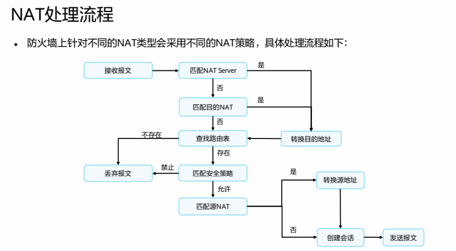
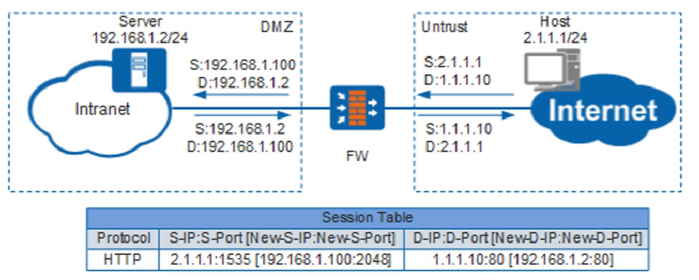
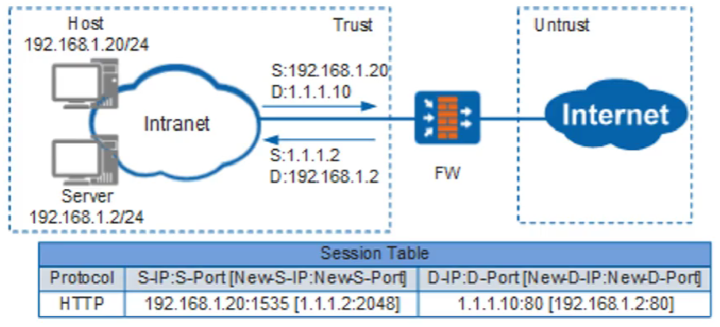

# 防火墙NAT



## 源NAT

- NAT No-PAT（No-Port Address Translation，非端口地址转换）是一种 **只转换地址，不转换端口**，实现私网地址与公网地址一对一的地址转换方式，产生server-map表。
  - 静态nat：只能一对一，一台主机对应一条公网地址，并没有起到节省公网ip的作用

  - 动态nat：使用公有地址池，并以先到先得的原则分配这些地址。当数据会话结束后，释放地址回地址池。

```bash
nat address-group nat
 mode no-pat local      #local就是流量受安全策略控制
 section 1.1.1.1
nat-policy
 rule name SNAT
 source-zone trust
 destination-zone untrust
 source-address 10.1.1.0 mask 255.255.255.0
 action source-nat address-group nat
```

- NAPT/PAT：（Network Address and Port Translation，网络地址端口转换）是一种 **同时转换地址和端口**，实现多个私网地址共用一个或多个公网地址的地址转换方式，不会产生server-map

```bash
nat address-group nat
 mode pat
 section 1.1.1.1
nat-policy
 rule name SNAT
 source-zone trust
 destination-zone untrust
 source-address 10.1.1.0 mask 255.255.255.0
 action source-nat address-group nat
```

- Easy IP ：Easy IP是一种特殊的NAPT，Easy IP使用出接口的公网IP地址作为NAT转换后的地址。

```bash
nat-policy
 rule name SNAT
 source-zone trust
 destination-zone untrust
 source-address 10.1.1.0 mask 255.255.255.0
 action source-nat easy-ip
```


## 目的Nat

### nat server

NAT Server：是一种特殊的静态目的NAT，NAT Server将发往私网服务器的报文中的公网地址转换为与之对应的私网地址

```bash
nat server HTTP_Server protocol tcp global 200.1.1.11 80 inside 10.1.1.12 80
```

> 当NAT公网地址和出接口不在一个网段的时候，可能会导致数据在出口防火墙和运营商路由器之间成环，必须配置黑洞路由
>
> 当NAT公网地址和出接口在一个网段的时候，可能会导致防火墙产生大量的p,建议配置黑洞路由
>
> 当NAT公网地址和出接口一致的时候，不需要配置黑洞路由，不会产生大量arp，也不会导致数据成环


### 静态目的nat

静态目的NAT是一种转换报文目的IP地址的方式，转换前后的地址存在一种固定的映射关系

- 公网地址 与 私网地址 一对一映射

```bash
#配置目的nat地址池
destination-nat address-group server 0
 section 10.1.1.1 10.1.1.2
nat-policy
 rule name server
  source-zone untrust
  destination-address range 1.1.1.1 1.1.1.2
  service http
  service https
  action destination-nat static address-to-address address-group yage
```

- 公网端口 与 私网端口 一对一映射

```bash
destination-nat address-group server 0
 section 10.1.1.1 10.1.1.1
nat-policy
 rule name server
  source-zone untrust
  destination-address 1.1.1.1 32
  service protocol tcp destination-port 80 443
  action destination-nat static port-to-port address-group yage 80 443
```

- 公网端口 与 私网地址 一对一映射
  - 访问公网地址不同端口 映射 不同私网地址相同端口

```bash
destination-nat address-group server 0
 section 10.1.1.1 10.1.1.2
nat-policy
 rule name server
  source-zone untrust
  destination-address 1.1.1.1 32
  service protocol tcp destination-port 80 443
  action destination-nat static port-to-address address-group yage 80
```

- 公网地址 与 私网端口 一对一映射
  - 访问不同公网地址 映射 相同私网地址不同端口

```bash
destination-nat address-group server 0
 section 10.1.1.1 10.1.1.1
nat-policy
 rule name server
  source-zone untrust
  destination-address 1.1.1.1 1.1.1.2
  service protocol tcp destination-port 80
  action destination-nat static address-to-port address-group yage 80 to 81
```


### 动态目的nat

转换前后没有固定的映射，一般用于对流量的重定向

比如原本去往114.114.114.114的dns解析，重定向到8.8.8.8

```bash
nat-policy
 rule name DNS
  source0zone trust
  source-address 10.1.1.1 32
  destination-address 114.114.114.114 32
  service protocol udp destination-port 53
  action source-nat easy-ip
  action destination-nat address 8.8.8.8
```


## 双向nat

场景一：内网服务器不需要上网，**不配置网关**，为了能正常对外提供服务，需要防火墙做双向NAT



```bash
nat address-group add_group1               #源地址池
 mode pat
 section 192.168.1.100
 route enable    #开启黑洞路由
destination-nat address-group add_group2   #目的地址池
 section 192.168.1.2
nat-policy
 rule name policy_nat1
  source-zone untrust
  destination-address 1.1.1.10
  service http
  service ftp
  action source-nat address-group add_group1
  action destination-nat static address-to-address address-group add_group2
ip route-static 1.1.1.1 32 null0  #黑洞路由防止环路
firewall detect ftp               #开启ftp协议的nat ALG功能
```


场景二：内网主机通过公网IP地址访问内网服务器，为了让TCP三次握手成功建立，需要访问做双向NAT

host通过公网地址访问，tcp第一个包syn发给FW，FW nat转换目的地址发给server，server和host在一个网段，直接发给host syn+ack，存在流量异步问题，导致不能访问。



```bash
nat server protocol tcp global 1.1.1.1 80 inside 10.1.1.100 80
nat-policy
 rule name easy
  source-zone trust
  destination-zon trust
  source-address 192.168.1.0 24
  action source-nat easy-ip
```


