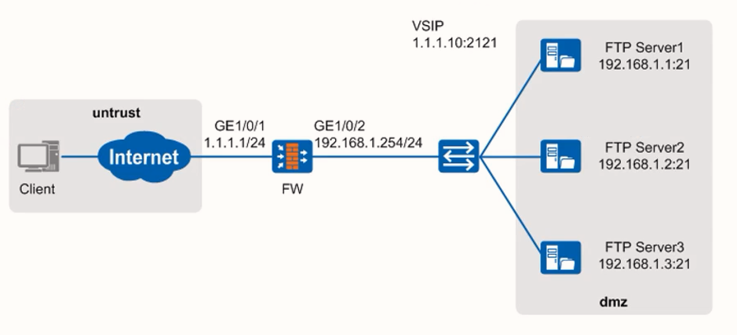

# 防火墙高可靠性技术

防火墙高可靠性技术分为两类：设备高可靠性和链路高可靠性

- 设备高可靠性技术
  - 双机热备：两台防火墙组成双机热备，当一台防火墙发生故障时，另一台防火墙接替工作，保障业务的连续性
  - 跨数据中心集群 ：当某一个数据中心防火墙发生故障或灾难的情况下，其他数据中心防火墙可以对其业务实现接管，达到互为备份的效果
  - 硬件Bypass：当防火墙工作失效时，会导致网络中断，而硬件Bypass则能让防火墙在工作失效后，对流量不作任何处理，直接转发
- 链路高可靠性技术
  - Eth-Trunk ：绑定多个物理接口为一个逻辑接口，提高链路的可靠性
  - IP-Link：周期性发送ARP或ICMP报文，检测链路的可用性
  - BFD：周期性发送BFD控制报文，检测设备或系统之间链路的可用性
  - Link-Group：Link-Group功能是将多个接口的状态相互绑定，组成一个逻辑组
  - 健康检查：防火墙上的功能，对服务可用性、链路可用性或链路时延等进行探测，目前与防火墙智能选路特性结合使用


## 双机热备

VRRP（Virtual Router Redundancy Protocol）是一种容错协议，它保证当主机的下一跳路由器（默认网关）出现故障时，由备份路由器自动代替出现故障的路由器完成报文转发任务，从而保持网络通信的连续性和可靠性。同一VRRP备份组内的路由器有两种角色：Master设备（活动状态）、Backup设备（备份状态）。

VGMP（VRRP Group Management Protocol）是VRRP组管理协议，主要用于 实现对VRRP备份组的统一管理，**保证多个VRRP备份组状态的一致性**，同时VGMP的状态也会影响路由协议的开销。

HRP（Huawei Redundancy Protocol）协议，主要用于实现防火墙双机之间关键配置命令和状态化信息的备份，状态化信息主要包括会话表、Servermap表、黑白名单、NAT映射表等。

备份通道：也称为“心跳线”，用于HRP协议和VGMP协议的通信。

- 备份方向
  - 支持备份的配置命令默认只能在配置主设备上执行，这些命令会自动备份到备设备上。例如，安全策略配置命令、NAT策略配置命令等；
  - 主备备份组网中，只有主设备会处理业务，主设备上生成业务表项，并向备设备备份。负载分担组网中，两台防火墙都会处理业务，都会生成业务表项并向对端设备备份。
-  备份通道
  - 配置和状态数据需要网络管理员指定备份通道接口进行备份。一般情况下，在两台设备上直连的端口作为备份通道，有时也称为**“心跳线”**（VGMP也通过该通道进行通信）。

防火墙双机热备和路由器VRRP区别：

- 路由器的主备需要通过优先级控制，防火墙的主备是 **人为直接指定**。
- 路由器双机热备环境，可以异步路由（流量来回路径不一致），但是防火墙双机热备环境，如果流量异步必须得把会话表同步过来，**防火墙心跳线可以同步配置(路由、接口地址等除外)，可以同步会话表等表项信息、HRP心跳报文等**，不转发业务流量
- 路由器双机热备就是VRRP，防火墙双机热备用到VGMP（VRRP组管理协议）

```bash
interface GigabitEthernet1/0/0
vrrp vrid 1 virtual-ip 10.1.1.254 active   #主设备
interface GigabitEthernet1/0/0
vrrp vrid 2 virtual-ip 10.1.1.253 standby  #备设备

hrp interface g1/0/2 remote 10.1.1.2 
hrp enable
dis hrp state verbose      #查看hrp状态详细信息
	mirror seesion：off    #意味着会话快速同步功能关闭
#开启会话快速同步，适用于负载分担的工作方式，以应对报文来回路径不一致的场景
hrp mirror session enable  
```

双机热备工作模式：

- 主备模式：两台设备一主一备，所有流量由主设备处理
- 负载分担：两台设备互为主备，共同承担整网流量


## 链路高可靠性技术

### Eth-Trunk

- Eth-Trunk技术简称 **链路聚合**，可以将多条以太网物理链路捆绑在一起成为一条逻辑链路，可实现增加带宽、提高链路可靠性的作用。
- Eth-Trunk主要功能如下：
  -  增加带宽：链路聚合接口的最大带宽可以达到各成员接口带宽之和。
  - 流量负载分担：在一个链路聚合组内，可以实现业务流量的负载分担。
  - 提高可靠性：当某条链路出现故障时，流量可以切换到其他可用链路上，从而提高链路聚合接口的可靠性。

```bash
interface eth-trunk 1     #创建聚合口
interface GigabitEthernet 0/0/1
 eth-trunk 1              #加入聚合口
interface GigabitEthernet 0/0/2
 eth-trunk 1
display eth-trunk
```


###  IP-Link

传统双机热备存在的不足：传统的双机热备通常只监控防火墙的直连接口，当主用防火墙的直连接口状态由UP转为DOWN时，防火墙触发主备切换。但是对于非直连链路的故障，防火墙无法感知，不会进行主备切换，导致业务中断

- IP-Link探测技术是指防火墙通过向指定的目的IP周期性地发送探测报文并等待应答，来判断链路是否发生故障。IP-Link可以检测到非直连链路的故障，与双机热备技术结合使用，提高网络可靠性

- IP-Link技术根据探测报文的不同，可以分为以下两种探测模式
  - ARP探测模式：ARP探测模式仅能用于探测二层网络的连通性
  - ICMP探测模式：ICMP探测模式适用于探测二层/三层网络的连通性

```bash
ip-link check enable
ip-link name test
 destination 100.1.1.1 interface GigabitEthernet 0/0/3
hrp track ip-link test   #hrp关联ip-link
display ip-link
```


### BFD

IP-Link探测技术的不足：IP-Link探测基于ARP或ICMP协议实现，若探测路径上存在某些安全设备，对ARP/ICMP报文进行了过滤，则会导致IP-Link探测失效

- BFD（Bidirectional Forwarding Detection，双向转发检测）用于快速检测设备之间的通信故障，并在出现故障时通知上层协议。
- BFD技术基于UDP报文进行探测，目的端口号为3784。
-  需要在防火墙和被探测设备（如路由器）之间建立BFD会话，**需要会话两端设备支持BFD协议**。


**基于单跳会话的BFD Echo功能**

- 如果对端设备不支持BFD功能，则无法正常建立会话。此时可以使用基于单跳会话的BFD Echo功能来检测链路。
-  BFD Echo功能也称为BFD回声功能，是由本地发送BFD Echo报文，远端系统将报文环回的一种检测机制。
-  为了能够快速的检测这两台设备之间的故障，可以在支持BFD功能的设备上创建单臂回声功能的BFD会话。支持BFD功能的设备主动发起回声请求功能，不支持BFD功能的设备接收到该报文后直接将其环回，从而实现转发链路的连通性检测功能

**BFD会话建立过程**

- BFD通过控制报文中的本地标识符和远端标识符区分不同的会话。
- BFD会话有四种状态：Down、Init、Up和AdminDown

```bash
bfd
bfd cfg-name bind peer-ip peer-ip [ vpn-instance vpn-instance-name ] [ interface interface-type interface-number [ nexthop { nexthop-address | dhcp } ] ] [ source-ip source-ip ]
discriminator local local-discr-value
discriminator remote remote-discr-value
commit
```


### Link-Group

- Link-Group功能可以将防火墙的多个接口组成一个逻辑组，组内接口始终保持相同的状态(UP/DOWN)。
  - 若组内任一接口出现故障，系统将组内所有接口的状态置为DOWN
  - 组内所有接口均恢复正常后，系统才会将组内接口的状态置为UP
- 配置Link-Group功能，使防火墙直联的网络设备可以感知到主备发生切换，从而切换路由，恢复业务

```bash
interface GigabitEthernet 0/0/2
 link-group 1
interface GigabitEthernet 0/0/3
 link-group 1
display link-group 1 
```


## 双机热备版本升级及故障排查

- 双机热备系统版本升级是现网中常见的运维操作之一，系统升级主要有以下原因
  - 当前现网软件版本出现Bug，需要升级版本修复Bug
  - 当前现网软件版本不支持某些特性，需要新增设备特性
  - 设备现网软件版本不统一，需要进行全网版本规范整改


### 升级前准备

- 确定升级方式：Web升级或者命令行方式升级
- 准备升级环境：配置防火墙作为Web server或FTP server
- 准备升级工具：登录工具及配置文件比较工具
- 获取升级所需的文件：如系统软件，以.bin为后缀名；内容安全组件包；特征库本地升级包等
- 查看设备当前运行情况
  - 查询当前版本软件的信息 -- display version
  - 确认当前License的使用情况 -- display license
  - 查看设备当前硬件运行状态 -- display device
  - 查询设备当前配置文件 -- display startup
  - 查看设备接口信息 -- display interface brief
  - 查看设备双机状态 -- display hrp state -- display vrrp
  - 查询业务运行情况 -- display ip routing-table -- display mac-address
  - 查看设备会话表 -- display firewall session table

- 查看和备份重要数据
  - 备份系统软件
  - 保存配置并备份配置文件 -- ftp> get remote-filename [ local-filename ] 

- 检查剩余空间 -- dir hda1

- 上传待升级版本软件，并设置为下次启动时使用的软件版本
  - ftp> put local-filename [ remote-filename ]
  - startup system-software filename


### 版本升级

为保障升级过程中业务的连续性，系统升级通常选择在业务运行较少的时段，如非工作时间段；此外，升级需要遵循的主要原则是Active设备和Standby设备分别升级，先升级Standby设备，然后再升级Active设备，在升级过程中HRP备份通道（心跳线）必须断开。

- Shutdown备机的业务接口；
- Shutdown备机的心跳接口；
- 升级备机的系统软件版本；
- Undo shutdown备机的心跳接口；
- 等待主备防火墙同步会话表等表项；
- Undo shutdown备机的业务接口；
- 验证备机的升级结果：版本信息、License信息、设备运行状态、接口信息、配置对比、路由表、会话表等；
- 保存配置


### 升级后验证

- 使用display hrp state命令可以查看防火墙的业务主备状态。
-  使用Ping命令测试业务是否正常。
- 测试双机倒换：
- 在内网的PC上长Ping公网的IP地址，然后将主用防火墙的上行或下行接口shutdown，观察防火墙状态切换及Ping包丢包情况。如果切换正常，备用防火墙会立即切换为主机承载业务。备用防火墙命令行提示符前的前缀由HRP_S变为HRP_M，主用防火墙命令行提示符前的前缀由HRP_M变为HRP_S。Ping测试观察是否存在丢包情况；
- 再将主用防火墙的上行或下行接口恢复，观察防火墙状态切换及Ping包丢包情况。如果切换正常，在抢占延迟时间到达（缺省是60s）后，主用防火墙会重新切换为主机承载业务。主用防火墙命令行提示符前的前缀由HRP_S变为HRP_M，备用防火墙命令行提示符前的前缀由HRP_M变为HRP_S。Ping测试观察存在丢包情况


### 故障排查

**HRP协议状态异常**

- 故障现象：防火墙主备备份组网场景中，在防火墙A查看HRP运行状态，对端状态显示为“unknown”

- 故障原因分析：
  - 对端设备没有开启双机热备功能。
  - 当前没有可用的备份通道

- 解决措施：
  - 启用对端防火墙的双机热备功能。
  - 使用命令display hrp interface检查备份通道并修复


**NAT场景中流量转发路径异常**

- 组网描述：防火墙负载分担组网场景中，**上下行链路均采用VRRP协议**

- 故障现象：路由器发送的返程报文时而到达防火墙A，时而达到防火墙B，影响业务的正常运行

- 故障原因分析：
  - 以VRRP备份组1为例，内网用户访问Internet的流量到达防火墙A后，源IP地址被NAT策略修改为公网地址；
  - 防火墙A会将NAT策略和NAT映射信息同步至防火墙B；
  - 路由器发送返程报文时，会发送ARP请求公网的MAC地址，防火墙A、B均会响应，导致返程流量路径异常

- 解决措施：
  - 需要在防火墙上将NAT地址池与VRRP备份组进行绑定
  - 绑定后，仅有主用防火墙A会响应ARP请求，且响应的MAC地址为上行VRRP对应的虚拟MAC地址，所有返程流量只会转发至防火墙A


**防火墙主备切换频繁**

- 故障现象：防火墙主备备份组网场景中，防火墙双机热备的状态反复切换，导致流量异常。
- 故障原因分析：
  - 防火墙业务接口状态异常，频繁UP/DOWN，导致主备切换频繁；
  - 主备防火墙的心跳报文发送间隔不一致。

- 解决措施：
  - 检查业务接口配置是否错误；
  - 若业务接口为光接口，检查光模块是否存在异常；
  - 检查防火墙心跳报文的发送间隔，并配置一致


## 服务器负载均衡

服务器负载均衡（SBL，server load balancing）,日益增长的网络业务量对服务器造成了巨大压力，当单个服务器无法满足网络需求时，企业一般会采取更换高性能设备或增加服务器数量的方法来解决性能不足的问题。

服务器负载均衡就是 **将本应由一个服务器处理的业务分发给多个服务器来处理**，以此提高处理业务的效率和能力。处理业务的服务器组成服务器集群，对外体现为一台逻辑上的服务器，由FW决定如何分配流量给各个服务器。

负载均衡算法是服务器负载均衡功能的核心，通过负载均衡算法即可得到由哪台实服务器来处理业务流量。

- 简单轮询算法 -- 依次轮询连接
- 最小连接算法 -- 哪个连接最少连哪个
- 会话保持算法(源IP hash算法) -- 单位时间内同设备连接的都是同一台真实服务器

> 三种算法都可以加权

**服务健康检查**：

FW通过向服务器定期发送探测报文来及时了解服务器的状态，根据服务类型的不同，使用不同协议类型的探测报文。FW支持的探测报文协议类型包括TCP、ICMP、HTTP、DNS和RADIUS。

**注意事项：**

- 服务器负载均衡功能 **仅支持IPv4协议**
- 服务器负载均衡功能支持的多通道协议 **仅为FTP协议**
- 配置服务器负载均衡功能后，在 **配置策略（如安全策略）时，需针对虚拟服务器的IP地址进行配置。在配置路由时，需针对实服务器的IP地址进行配置**

> 配置负载均衡，FW会自动进行nat处理



```bash
slb enable
#配置会话保持
slb
 persistence 0 FTP
  type source-ip aging-time 180   #根据源ip会话保持180s
 #配置负载均衡算法
 group 0 FTP-SERVER
  metric weight-least-connection
  #配置真实服务器地址和权重
  rserver 0  rip 192.168.1.1 port 21 weight 4
  rserver 1  rip 192.168.1.2 port 21 weight 2
  rserver 2  rip 192.168.1.3 port 21 weight 1
  #配置健康检查功能，流量不受安全策略控制
  health-check type icmp tx-interval 5 times 3
 #配置虚拟服务器类型和端口
 vserver 0 FTP-VSERVER
  vip 0 1.1.1.10
  protocol tcp
  vport 2121
  #绑定会话保持
  persistence FTP
  #关联虚拟服务器和真实服务器
  group FTP-SERVER
#启用ftp协议的ASPF功能
firewall detect ftp
```


## 单USG双ISP配置

```bash
#策略路由，优于普通路由
policy-based-route
 rule name Internet1
  ingress-interface GigabitEthernet1/0/0
  source-address 172.16.1.0 mask 255.255.255.0
  action pbr next-hop 1.1.1.1     #执行策略路由动作
 rule name Internet2
  ingress-interface GigabitEthernet1/0/3
  source-address 10.1.1.0 mask 255.255.255.0
  action pbr next-hop 2.2.2.2
#nat匹配条件
rule name Internet
  source-zone trust
  destination-zone untrust
  source-address 10.1.1.0 mask 255.255.255.0
  source-address 172.16.1.0 mask 255.255.255.0
  action source-nat easy-ip
#安全策略
security-policy
 rule name Internet
  source-zone trust
  destination-zone untrust
  source-address 10.1.1.0 mask 255.255.255.0
  source-address 172.16.1.0 mask 255.255.255.0
  action permit
#策略路由绑定ip-link
ip-link check enable
ip-link name Internet1
 destination 1.1.1.1 interface GigabitEthernet1/0/1 mode icmp
ip-link name Internet2
 destination 2.2.2.2 interface GigabitEthernet1/0/2 mode icmp
policy-based-route
 rule name Internet1
  track ip-link Internet1   #当ip-link down的时候，策略路由失效
 rule name Internet2
  track ip-link Internet2
```


