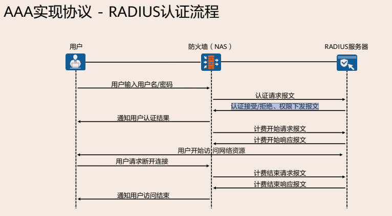
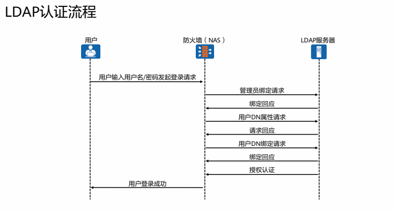

# 防火墙用户管理技术

## AAA原理

### AAA简介

AAA是Authentication（认证）、Authorization（授权）和Accounting（计费）的简称，是网络安全的一种管理机制，提供了认证、授权、计费三种安全功能。

- 认证：验证用户是否可以获得访问权，确定哪些用户可以访问网络；
- 授权：授权用户可以使用哪些服务；
- 计费：记录用户使用网络资源的情况

AAA的基本架构中包括用户、NAS、AAA服务器。

- NAS负责集中收集和管理用户的访问请求，现网常见的NAS设备有交换机、防火墙等；
- AAA服务器负责集中管理用户信息

**NAS基于域来对用户进行管理**，每个域都可以配置不同的认证、授权和计费方案，用
于对该域下的用户进行认证、授权和计费。

- 每个用户都属于某一个域。用户属于哪个域是由用户名中的域名分隔符@后的
  字符串决定。例如，如果用户名是User1@Domain1，则用户属于Domain1域。
  如果用户名后不带有@，则用户属于系统缺省域；

- 在NAS上会创建多个域来管理用户，不同的域可以关联不同的AAA方案；当收
  到用户接入网络的请求时，NAS会根据用户名来判断用户所在的域，根据该域
  对应的AAA方案对用户进行管控。

用户域即用户所在的区域，域名为该区域的名字，一般情况下用户名@域名则表明用户属于这个区域。

> 目前华为设备支持基于RADIUS、HWTACACS、LDAP或AD来实现AAA，在实际应用中，RADIUS最为常用。


### 认证

防火墙支持的三种认证方式：

- 不认证：完全信任用户，不对用户身份进行合法性检查。鉴于安全考虑，这种认证方式很少被采用。
- 本地认证：将本地用户信息（包括用户名、密码和各种属性）配置在NAS上，此时NAS就是AAA Server。本地认证的优点是处理速度快、运营成本低；缺点是存储信息量受设备硬件条件限制。这种认证方式常用于对用户登录设备进行管理，如Telnet，FTP等。
- 远端认证：将用户信息（包括用户名、密码和各种属性）配置在认证服务器上。支持通过RADIUS协议进行远端认证。NAS作为客户端，与RADIUS服务器服务器进行通信。


### 授权

授权表示用户可以使用哪些业务，如公共业务以及敏感业务等。

 防火墙支持的授权方式有：不授权、本地授权、远端授权。授权内容包括：用户组、VLAN、ACL编号等。


### 计费

 防火墙支持的AAA计费方式有：不计费，远端计费。

计费功能用于监控授权用户的网络行为和网络资源的使用情况。

计费主要的含义有三个：

- 用户用多长时间；
- 用户花了多少钱；
-  用户做了哪些操作；


### RADIUS

AAA可以通过多种协议来实现，在实际应用中，最常使用RADIUS协议。

RADIUS是一种分布式的、客户端/服务器结构的信息交互协议，能保护网络不受未授权访问的干扰，常应用在既要求有较高安全性、又允许远程用户访问的各种网络环境中。

该协议定义了基于UDP（User Datagram Protocol）的RADIUS报文格式及其传输机制，并**规定UDP端口1812、1813分别作为默认的认证、计费端口**。RADIUS有时也会使用1645、1646分别作为默认的认证、计费端口

RADIUS协议的主要特征如下：

- 客户端/服务器模式
- 安全的消息交互机制
- 良好的扩展性




### LDAP

LDAP是轻量级目录访问协议的简称，LDAP基于C/S架构。

LDAP服务器负责对来自应用服务器的请求进行认证，同时还指定用户访问的资源范围等。

LDAP定义了多种操作来实现LDAP的各种功能，其中可以利用LDAP的绑定和查询操作来实现用户的认证和授权功能。

> 应用场景：网络接入设备和LDAP服务器对接，利用LDAP的绑定和查询操作来实现用
> 户的认证和授权功能

目录是一组具有类似属性、以一定逻辑和层次组合的信息。LDAP协议中目录是按照树型结构组织，目录由条目（Entry）组成，条目是具有区别名DN的属性集合。属性由类型和多个值组成。




## 用户认证及应用

### 用户组织架构及分类

用户是网络访问的主体，是防火墙进行网络行为控制和网络权限分配的基本单元。用户组织架构中涉及三个概念：

- 认证域：用户组织结构的容器，防火墙缺省存在default认证域，用户可以根据需求新建认证域，**决定对用户的认证方式**；
- 用户组/用户：用户按树形结构组织，用户隶属于组（部门）。管理员可以根据企业的组织结构来创建部门和用户；
- 安全组：横向组织结构的跨部门群组。当需要基于部门以外的维度对用户进行管理可以创建跨部门的安全组。例如企业中跨部门成立的群组。

 系统默认有一个缺省认证域，每个用户组可以包括多个用户和用户组。每个用户组只能属于一个父用户组，每个用户至少属于一个用户组，也可以属于多个用户组。

用户 指的是访问网络资源的主体，表示“谁”在进行访问，是网络访问行为的重要标识，用户的三种形式：

- 上网用户
- 接入用户【SSLVPN、L2TP/L2 TP Over IPSec、IPSec等】
- 管理用户【Telnet、SSH、SNMP等】

防火墙通过 **认证** 来验证访问者的身份，防火墙对访问者进行认证的方式包括：

- 本地认证

- 服务器认证【Radius、LDAP、MSAD、Agile Controller等】
- 单点登陆

用户按树形结构组织，部门对应**用户组**，员工对应**用户**，跨部门群组对应**安全组**


### 认证域

认证域是认证流程中的重要环节，认证域上的 **配置决定了对用户的认证方式 **以及 **用户的组织结构**。

- 作为用户组织结构的容器
- 决定对用户的认证方式

用户名中@后面的字符为认证域，如用户名中无@则用户缺省属于default域。如用户yage@huawei 属于huawei认证域，用户zhuyage属于default域。

认证域中可以配置的选项：

- 认证方式：本地认证 或 服务器认证
- 认证服务器：服务器地址
- 地址池：L2TP用户 和 PPPoE用户需要
- 新用户选项：单点登录时需要


### 认证策略

认证策略的作用是 **选出需要进行免认证或会话认证的数据流**

- 对免认证的数据流，防火墙根据用户与IP/MAC地址的绑定关系来识别用户

- 对会话认证的数据流，防火墙会推送认证页面

- **认证策略对单点登录或事前认证方式不起作用**

认证策略的条件：

- 源安全区域、目的安全区域

- 源地址/地区、目的地址/地区

**认证策略的动作：Portal认证(网页认证)、短信认证、免认证、不认证**

注意：以下流量即使匹配了认证策略也不会触发认证：

- 访问设备或设备发起的流量
- DHCP、BGP、OSPF、LDP报文
- 触发认证的第一条HTTP业务数据流对应的DNS报文不受认证策略控制，用户认证通过上线后的DNS报文受认证策略控制

匹配顺序：多条认证策略规则时，由上至下匹配，匹配上就不再匹配后续规则。如果所有规则都没匹配到，按照缺省认证策略进行处理。


### 认证配置

创建用户：

​	WBE页面：对象 -- 用户 -- default -- 新建用户组 和 用户

```bash
user-manage group /default/yunwei    #创建用户组
user-manage user yage                #创建用户
 password Huawei@123                 #设置密码
 parent-group /default/yunwei        #绑定用户组
display user-manage online-user      #查看在线用户
#认证策略，哪些流量需要认证，可以web上创建
auth-policy
 rule name Internet
  source-zone trust
  destination-zone untrust
  action auth
#放行认证流量
security-policy
 rule name Auth
  source-zone trust
  destination-zone local
  source-address 10.1.1.0 24
  destination-address 10.1.1.1 32
  service protocol tcp destination-port 8887
  action permit
```

> 安全策略可以基于用户去做


