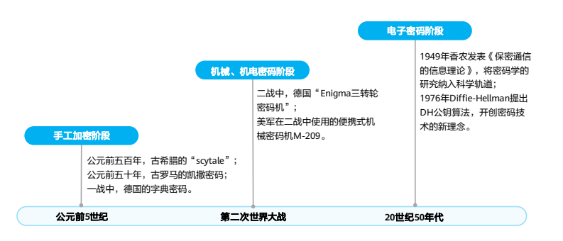
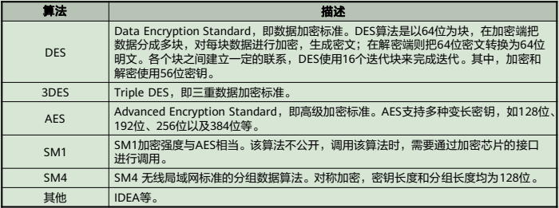
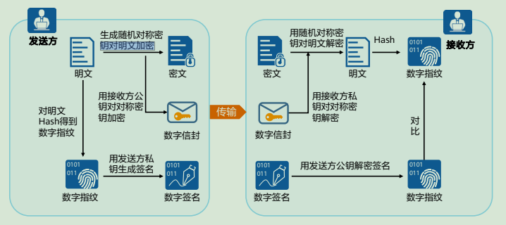

# 加解密及PKI

## 加密技术发展

### **加解密定义**

- 数据加密的基本过程就是对原来为明文的文件或数据按某种算法进行处理，使其成为不可读的一段代码，通常称为“密文”，通过这样的途径来达到保护数据不被非法人员窃取、阅读的目的。

- 数据解密的过程就是对密文使用相应的算法和密钥进行解密处理，将密文解密成明文的过程。

### 加密的目的

通过加密可保证信息的机密性、完整性、鉴别性和不可否认性

- 机密性
  -  通过数据加密实现
  - 提供只允许特定用户访问和阅读信息，任何非授权用户对信息都不可理解的服务

- 完整性
  - 通过数据加密、散列或数字签名来实现
  -  提供确保数据在存储和传输过程中不被未授权修改的服务
- 鉴别性
  - 通过数据加密、数据散列或数字签名来实现
  -  提供与数据和身份识别有关的服务，即认证数据发送和接收者的身份
- 不可否认性
  - 通过对称加密或非对称加密，以及数字签名等，并借助可信的注册机构或证书机构的辅助来实现
  - 提供阻止用户否认先前的言论或行为的抗抵赖服务

### 加密技术的发展史

- 加密作为保障信息安全的一种方式，它不是现代才有的，它产生的历史相当久远，可以追溯到人类刚刚出现，并且尝试去学习如何通信的时候。他们不得不去寻找方法确保他们的通信的机密。
- 但是最先有意识地使用一些技术方法来加密信息的可能是公元前五百年的古希腊人。他们使用的是一根叫scytale的棍子，送信人先绕棍子卷一张纸条，然后把要加密的信息写在上面，接着打开纸送给收信人。如果不知道棍子的宽度（这里作为密钥）是不可能解密信里面内容的。
- 大约在公元前5世纪，古罗马的统治者凯撒发明了一种战争时用于传递加密信息的方法，后来称之为“凯撒密码”。它的原理就是：将26个字母按自然顺序排列，并且首尾相连，明文中的每个字母都用其后的第三个字母代替，例如HuaweiSymantec通过加密之后就变成KxdzhlvBPdqwhf。
- 在第一次世界大战中，德国人曾依靠字典编写密码，比如：10-4-2，就是某字典第10页，第4段的第2个单词。
-  在二次世界大战中，最广为人知的编码机器是德国人的Enigma三转轮密码机，在二次世界大战中德国人利用它加密信息。
- 电子密码阶段有两个里程碑：
  - 1949年香农发表《保密通信的信息理论》，将密码学的研究纳入科学轨道；
  - 1976年Diffie-Hellman提出DH公钥算法，开创密码技术的新理念。

## 加解密技术原理

### 加密技术分类

- 对称加密
  - 对称加密又称为共享密钥加密，它使用同一个密钥对数据进行加密和解密。即发送和接收数据的双方 **必须使用相同的密钥**。
  - 经对称加密算法加密后的密文被非法用户窃取后无法读取其中的信息，可实现数据的机密性。
  - 加密快，一般用在 **对大量数据进行加解密** 的场景，如IPSec VPN中对业务数据加解密。
- 非对称加密
  - 非对称加密使用两个不同的密钥，公开密钥（简称公钥）和私有密钥（简称私钥）。公钥和私钥是一对，如果用公钥对数据加密，只有用对应的私钥才能解密。
  - 非对称加密中一般用私钥用来保护数据。公钥可在网络中公开传递，解决了密钥交互不安全的问题。
  - 加密慢，一般用来对 **密钥或身份信息** 等敏感信息加密，如数字签名

### 对称加密算法

- 对称加密算法的加密和解密都是用同一个密钥。

- 如果通信双方都各自持有同一个密钥，且没有别人知道，则两方的通信安全是可以被保证的（除非密钥被破解）。然而，最大的问题就是这个密钥怎么让传输的双方知晓，同时不被别人知道。如果由服务器生成一个密钥并传输给浏览器，这个传输过程中密钥被别人劫持，之后他就能用密钥解开双方传输的任何内容。如果浏览器内部预存了网站A的密钥，且可以确保除了浏览器和网站A，不会有任何外人知道该密钥，那理论上用对称加密是可以的。这样，浏览器只要预存好世界上所有HTTPS网站的密钥就可以了。显然，这样做是不现实的。为了解决这个问题，我们就需要非对称加密

### 非对称加密算法

- 非对称加密算法需要一组密钥对，分别是公钥和私钥，这两个密钥是成对出现的。
- 非对称加密解决了对称密钥的发布和管理问题，一个用于加密信息，另一个则用于解密信息，通双方无需事先交换密钥就可进行保密通信。通常以公钥作为加密密钥，以私钥作为解密密钥。

| 加密算法   | 优点                                             | 缺点                                                         | 使用场景                       |
| ---------- | ------------------------------------------------ | ------------------------------------------------------------ | ------------------------------ |
| 对称加密   | 效率高，算法简单，系统开销小，适合加密大量数据   | 实现困难，扩展性差                                           | 对大量数据进行加解密           |
| 非对称加密 | 无法从一个密钥推导出另一个密钥；公钥加密的信息只 | 算法非常复杂，导致加密大量数据所用的时间较长，而且加密后的报文较长，不利于网络传输 | 对密钥或身份信息等敏感信息加密 |

- 采用非对称加密与对称加密结合的方式，可以减少非对称加密的次数，HTTPS就是采用了这种方案。首先通过非对称加密交换对称加密密钥，然后使用对称加密算法加密业务数据

## 加解密常见算法

- DES是由美国国家标准与技术研究院开发的。DES算法是第一个得到广泛应用的密码算法，使用相同的密钥来加密和解密。DES是一种分组加密算法，输入的明文为64位，密钥为56位，生成的密文为64位（把数据加密成64位的block）。因密码容量只有56位，因此针对其不具备足够安全性的弱点，后来又提出了3DES。
- 3DES使用了128位密钥。信息首先使用56位的密钥加密，然后用另一个56位的密钥译码，最后再用原始的56位密钥加密，这样3DES使用了有效的128位长度的密钥。3DES最大的优点就是可以使用已存在的软件和硬件，并且在DES加密算法上的技术可以轻松地实施3DES。
- AES采用128位的分组长度，支持长度为128位、192位、256位和384位的密钥长度，并可支持不同的平台。128位的密钥长度能够提供足够的安全性，且相比更长的密钥需要较少的处理时间。到目前为止，AES还没有出现任何致命缺陷。但由于快速DES芯片的大量生产，使得DES仍能继续使用。但AES取代DES和3DES以增强安全性和效率已是大势所趋。
- 国密算法是由国家密码管理局编制的一种商用密码分组标准对称算法，国密算法的分组长度和密钥长度都为128位。在安全级别要求较高的情况下，使用SM1或SM4国密算法可以充分满足加密需求。
- IDEA（International Data Encryption Algorithm)是对称分组密码算法，输入明文为64位，密钥为128位，生成的密文为64位。应用方面有很多，其中SSL就将IDEA包含在其加密算法库中。

- 非对称加密算法此处有两个作用：
  - 根据算法自动生成一对公私钥；
  -  按照非对称加密算法的交互数据。
- DH算法一般用于双方协商出一个对称加密的密钥，即加密解密都是同一个密钥。实质是双方共享一些参数，然后各自生成密钥，然后根据数学原理，各自生成的密钥是相同的，这个密钥不会涉及到在链路中传播，但是之前的参数的交互会涉及链路传输；
- RSA公钥加密算法是1977年由Ron Rivest、Adi Shamir和LenAdleman在（美国麻省理工学院）开发的。RSA取名来自开发他们三者的名字。RSA是目前最有影响力的公钥加密算法，它能够抵抗到目前为止已知的所有密码攻击，已被ISO推荐为公钥数据加密标准。是第一个能同时用于加密和数字签名的算法；
- DSA在保证数据的完整性、不可抵赖性等方面起着非常重要的作用。DSA是基于整数有限域离散对数难题的，其安全性与RSA相比差不多。在DSA数字签名和认证中，发送者使用自己的私钥对文件或消息进行签名，接受者收到消息后使用发送者的公钥来验证签名的真实性。DSA只是一种算法，和RSA不同之处在于它不能用作加密和解密，也不能进行密钥交换，只用于签名，它比RSA要快很多。

## 散列算法

### 散列算法简介

- 在通信过程中，使用加密技术实现了数据的机密性，但对安全级别需求较高的用户来说，仅对数据加密是不够的，数据仍能够被非法破解并修改。使用散列算法可检查出数据在通信过程中是否被篡改，从而实现数据完整性校验。
- 散列算法就是把任意长度的数据作为输入，然后通过Hash得到一个固定长度的输出值，该输出值就是散列值，它是一种数据压缩映射关系。简单来说就是将任意长度的消息转换到某一固定长度的消息摘要的函数。散列算法具有正向快速、不可逆、输入敏感、抗碰撞的特点。
  - 正向快速：给定明文和Hash算法，在有限时间和有限资源内计算Hash值；
  - 不可逆性：给定任意的Hash值，在有限时间内很难逆推出明文；
  -  输入敏感：如果输入的数据信息被轻微修改，输出的Hash值也会有很明显的变化；
  -  抗碰撞性：任意输入不同的数据，其输出的Hash值不可能相同。对于一个给定的数据块，找到和它hash值相同的数据块极为困难

### 散列算法应用

在数据通信过程中发送方对报文进行Hash，并将报文和Hash值发送给接收方。接收方采用相同的算法对报文进行Hash，然后通过对比两个Hash值，来判断通信过程中报文是否受到篡改，从而实现完整性校验

### 常见散列算法

- MD5（消息摘要算法第五版）是计算机安全领域广泛使用的一种散列函数，用以提供消息的完整性保护。将数据（如汉字）运算为另一固定长度值。
- SHA（安全散列算法）是由NIST开发的散列算法，和MD5一样，都可以作为数字签名标准（DSS）里面定义的数字签名算法（DSA）来使用。
  - SHA-0：NIST最早载明的算法，在发布后很快被撤回，取而代之的是SHA-1；
  - SHA-1：数据块通过SHA-1算法能够产生160位的消息摘要。SHA-1比MD5要慢，但是更安全。因为它的签名比较长，具有更强大的抗碰撞能力，并可以更有效地发现共享的密钥；
  -  SHA-2：SHA-2是SHA-1的加强版本，SHA-2算法相对于SHA-1加密数据长度有所上升，安全性能要远远高于SHA-1。SHA-2算法包括SHA2-256、SHA2-384和SHA2-512，密钥长度分别为256位、384位和512位。
- SM3属于国密即国家密码局认定的国产密码算法。
- HMAC：密钥相关的哈希运算消息认证码，在IPSec、SSL中广泛应用。
- 以上几种算法各有特点，MD5算法的计算速度比SHA-1算法快，而SHA-1算法的安全强度比MD5算法高，SHA-2、SM3算法相对于SHA-1来说，加密数据位数的上升增加了破解的难度，使得安全性能要远远高于SHA-1。

## 数据安全通信技术

### 演进过程

数字信封

- 在现实生活中我们可以把信件装进信封，这样信件的内容就不会被他人窥探，而数据通信中也可以把通信的数据装在数字信封中。
- 数字信封是指发送方采用接收方的公钥来加密对称密钥后所得的数据。采用数字信封时，接收方需要使用自己的私钥才能打开数字信封得到对称密钥

数字签名

- 数字签名是指发送方 **用自己的私钥对数字指纹进行加密** 后所得的数据。
- 数字指纹又称为信息摘要，它是指发送方 **通过Hash算法对明文信息计算后得出的数据**。采用数字指纹时，发送方会将数字指纹和明文一起发送给接收方，接收方用同样的Hash算法对明文计算生成的数据指纹，与收到的数字指纹进行匹配，如果一致，便可确定明文信息没有被篡改

数字证书

- 数字证书简称证书， 它是一个经证书授权中心（即在PKI中的证书认证机构CA）数字签名的文件，包含拥有者的公钥及相关身份信息。数字证书技术解决了数字签名技术中无法确定公钥是指定拥有者的问题。
- 数字证书可以说是Internet上的安全护照或身份证。当人们到其他国家旅行时，用护照可以证实其身份，并被获准进入这个国家。数字证书提供的是网络上的身份证明

- 数字证书有三种类型：CA证书、本地证书及自签名证书

- 数字证书支持三种文件格式保存
  - PKCS#12：以二进制格式保存证书，可以包含私钥，也可以不包含私钥。常用的后缀有：.P12 和 .PFX。
  - DER：以二进制格式保存证书，不包含私钥。常用的后缀有：.DER、.CER 和 .CRT。
  - PEM：以ASCII码格式保存证书，可以包含私钥，也可以不包含私钥。常用的后缀有：.PEM、.CER 和 .CRT。

