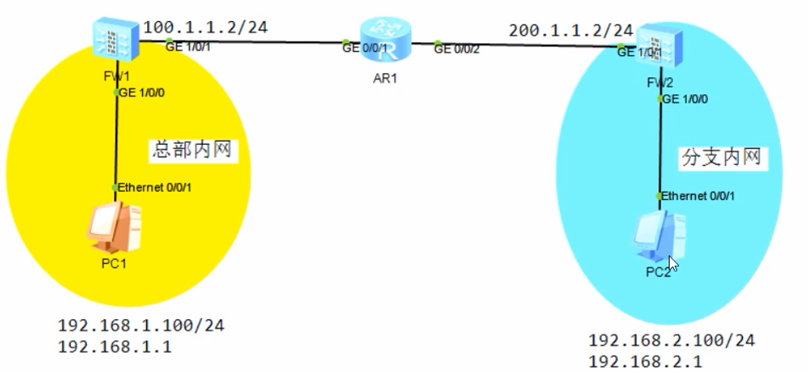

# VPN

## IPsec

IPSec VPN:最常见的部署为Site To Site,运行在企业的两个出口设备之间，直接把企业的两个或者多个内网打通

IKEV1简单说说协商过程：

阶段一：协商出加密和解密后续消息（协商包）所需的安全参数(SA，安全关联)，使用UDP 500数据连接。

- 认证方式
- 加密算法
- 对端地址

阶段二：协商出封装和解封装实际数据所需的安全参数(SA，安全关联)

- 加密算法：DES3、DES、 AES、SM1、SM2 等  -- 私密性
- 完整性校验算法：MD5、SHA等  -- 完整性
- 认证方式：PSK预共享密钥/数字证书  -- 源认证
- 定义感兴趣流：匹配出需要走VPN通道的流量
- 封装协议：ESP/AH
- 是否自动触发协商

业务数据传输安全传输

> 阶段一是为了保障阶段二协商的安全，阶段二是为了保障后续实际数据的安全。



```bash
ike proposal 10    #ike提议，自带默认参数
ike peer FW2       #ike对等体，对端地址
 pre-shared-key Huawei@123   #预共享密钥
 ike-proposal 10             #关联ike提议
 remote-address 200.1.1.2    #对端地址
ipsec proposal 10  #ipsec提议，自带默认参数
acl number 3000              #感兴趣列表，匹配哪些走vpn
 rule 5 permit source 192.168.1.0 0.0.0.255 destination 192.168.2.0 0.0.0.255
ipsec policy yageVPN 10 isakmp  #自动安全策略
 security acl 3000    #关联acl列表
 ike-peer FW2         #关联阶段1
 proposal 10          #关联阶段2
 sa trigger-mode      #sa自动触发协商
int g1/0/1
 ipsec policy yageVPN #接口调用策略
 
#放行ISAKMP流量，udp500
security-policy
 rule name ISAKMP
  source-zone local untrust
  destination-zone untrust local
  source-address 100.1.1.2 32
  source-address 200.1.1.2 32
  destination-address 100.1.1.2 32
  destination-address 200.1.1.2 32
  service protocol udp source-port 500 destination-port 500
  service esp
  action permit
#防火墙先匹配nat流量，就不会执行后续VPN流量，让VPN流量不执行nat
nat-policy
 rule name NoNat
  source-zone trust
  destination-zone untrust
  source-address 192.168.1.0 24
  destination-address 192.168.2.0 24
  action no-nat        #这段流量不执行nat
 rule move NoNat top   #规则移动到顶部
```


## SSL VPN

运行在客户端(PC)和企业出口之间的，进行移动用户远程接入

- 创建用户：对象 -- 用户 

- 创建资源：网络 -- SSL VPN -- 新建
  - Web代理：允许用户访问企业内部网站资源
  - 文件共享：允许用户访问企业内部文件服务器（SMB共享文件夹）
  - 端口转发：RDP、Telnet、SSH、FTP、POP3等
  - 以上三个功能属于代理模型，流量从 用户--FW，FW--服务器，2个tcp连接，**防火墙需要放行两段流量**
  - 网络扩展：允许用户访问企业内部IP网段的资源

- 资源授权：
  - 把 账号 和 资源 做绑定

- 安全策略放行流量


