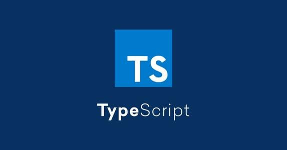
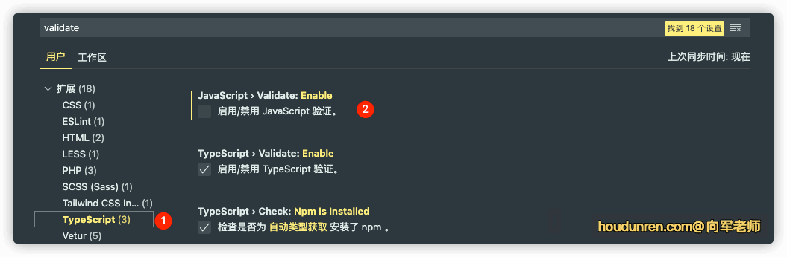

# 环境配置

> 说明：本文档摘自 向军大叔 https://doc.houdunren.com/

## 介绍

typescript 是 javascript 的一个超集，typescript 可以运行于任何系统，并且是开源免费的。



typescript 有以下几个特点

- typescript 会在编译时对代码进行严格的静态类型检查，可以在编码阶段就发现问题，而不是在上线运行时才发现
- typeScript 语法遵循 ES 规范，更细速度快，不断支持最新的 ECMAScript 新特性，如装饰器、public/private 修饰符
- typescript 支持 OOP（面向对象）的接口，抽象类，多态特性
- typescript 可以为 IDE 提供更好的代码补全、接口提示、跳转到定义
- 还有重要一点是众多科技公司已经采用 typeScript 进行开发，也是前端工程师需要掌握的就业技能

## 安装环境

下面来安装学习 typescript 时的开发环境

### node

首先需要安装 [node.js](https://nodejs.org/en/) 我相信做前端的都已经安装了

### 全局安装 TS

然后执行以下命令安装 typescript

```ts
npm install -g typescript
```

如果你使用的是 mac 系统也可以执行

```ts
brew install typescript
```

如果是 linux 系统可以通过相应的软件管理命令安装，比如以下是 manjaro 的安装示例

```ts
sudo pacman -Sy typescript
```

安装后执行以下命令检查是否安装成功

```ts
tsc -v
//如果显示以下内容即表示安装成功
// Version 4.2.4
```

### 项目安装 TS

除了全局安装外，也可以在项目中独立安装 typescript，这可以限定项目使用的 typescript 版本

```ts
yarn init -y
```

安装 typescript

```ts
yarn add -D typescript
```

查看版本

```ts
yarn tsc -v
```

## 编辑器

.ts 是 typescript 的扩展名，在首次使用 vscode 编写.ts 文件时，vscode 会自动下载支持 typescript 的插件环境


### 关闭 JS 的检验

默认在编写普通.js 文件时，vscode 也会进行类型校验，这有时不需要



## 编译 TS

我们使用 tsc 命令可以将 ts 文件编译为 js 文件，如果在编译过程中有 ts 错误将在命令行报出

```ts
tsc hd.ts //会编译生成 hd.js 文件
```

每次修改 ts 文件后再执行命令编译会过于繁琐，可以执行以下命令自动监听 ts 文件内容并自动生成 js 文件

```ts
tsc hd.ts -w
```

## 常见问题

### windows

如果在 windows 系统中执行 tsc 命令报以下错误

```ts
... 因为在此系统上禁止运行脚本 ...
```

需要以管理员身份执行 powerShell，然后执行以下命令，在出现的提示选择 `Y`

```ts
set-ExecutionPolicy RemoteSigned
```


