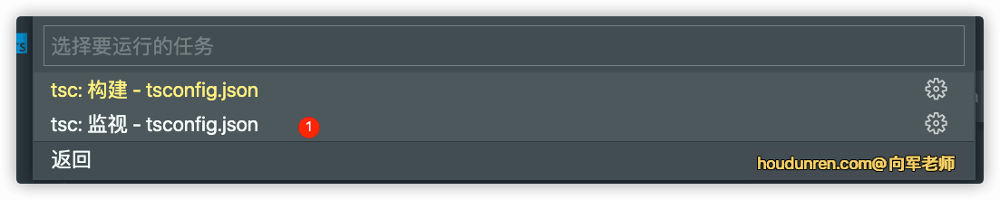

# 基础类型

## 类型含义

### js

javascript 本身提供类型支持，但有以下几个问题。

- js 是弱类型，类型可以根据值发生改变

  ```ts
  let a = 1
  let b = 2
  let c = a + b;

  //改变值后，a 的类型是字符串，这是不稳定的
  a = '后盾人';
  c = a + b;
  ```

- 使用 js 不能自定义类型，比如下面的 name 我们想只允许是 houdunren、hdcms 值，但实际上是可以传递任何值的。

  ```ts
  function getTitle(name) {
  	return name === 'houdunren' ? '后盾人' : 'hdcms 系统';
  }
  
  getTitle('向军大叔') //不报错
  ```

  如果换成 ts 就方便了，我们可以定义类型来修饰参数 name，使其值只能为 houdunren 或 hdcms

  ```ts
  function getTitle(name: 'houdunren' | 'hdcms') {
  	return name === 'houdunren' ? '后盾人' : 'hdcms 系统';
  }
  
  getTitle('向军大叔') //报错
  ```

### typescript

可以将 typescript 中的类型理解为一类值的集合，比如 'houdunren'、'后盾人'都属于 string 类型集合。

- 有些类型没有值比如 never，不能将任何值赋予 never 类型的变量

- 有些类型只有一个值，下面的`hd`变量的值只能是字符串`a`

  ```ts
   type HOUDUNREN='a' ;
   const hd:HOUDUNREN='a'
  ```

- string、number 是无限集合，而上例中的 HOUDUNREN 类型为有限集合

## 类型校验

下面没有使用类型限制时，函数参数传入字符串也是可以执行的，显示这个结果是不对的

```ts
function sum(a,b){
	return a+b;
}

console.log(sum('a',3)); //结果为 a3
```

加上严格类型后，在编译环节就会提示错误

```ts
function sum(a:number,b:number){
	return a+b;
}

console.log(sum('a',3))
//报错 Argument of type 'string' is not assignable to parameter of type 'number'.
```

## 类型推断

当没有明确设置类型时，系统会根据值推断变量的类型

### 字符串

下例中系统会根据值推断 hd 变量为 string，当将 hd 设置为 18 的 number 类型时编译时将报误

```ts
let hd = 'houdunren.com'; //let hd: string
hd = 18;
```

### 数值

ts 中的数值类型包括了小数、负数、整数

```ts
let hd =100 //let hd: number
hd = 100.1
hd = -101
```

### 布尔值

值为 true 或 false 会被推断为 boolean 类型

```ts
let state = true; //let state: boolean
```

### 数组

下面是数组类型的推断结果，表示数组内容值为字符串

```ts
const hd = ['houdunren.com', '后盾人'] //const hd: string[]

hd.push(100) //因为类型不允许，所以报错
```

下面会推断数组允许的值为字符串或数值

```ts
const hd = ['houdunren.com', '后盾人',100] //const hd:(string|number)[]

hd.push(100,'向军') //数组允许数值、字符串类型，所以编译通过
```

### 对象

ts 也可以推断字面量类型

```ts
const user = {name:'后盾人',age:18,open:true}
```

推断结果如下

```ts
const user: {
    name: string;
    age: number;
    open: boolean;
}
```

如果向对象中添加类型中不存在的属性将报错

```ts
const user = {name:'后盾人',age:18,open:true}

user.city = '北京'
//将产生错误 Property 'city' does not exist on type
```

下面是更复杂的在对象中嵌套对象，TS 也是可以推断出来的

```ts
const user = {name:'后盾人',age:18,open:true,lessons:[
    {title:'linux'},
    {title:'TS'}
]}

user.lessons[0].title
```

上例推断的结果是

```ts
const user: {
    name: string;
    age: number;
    open: boolean;
    lessons: {
        title: string;
    }[];
}
```

## 配置文件

TS 支持对编译过程使用配置项自定义，因为下面要讲的有些类型在不同 TS 配置时有差异，所以我们要掌握 TS 配置文件的创建与使用。

### 初始化

配置项的具体选项使用，会在讲到某个知识点用到时再具体说

执行以下命令创建配置项

```ts
tsc --init
```

然后执行以下命令使用配置项的定义进行监测

```ts
tsc -w
```

也可以使用 vscode `终端 > 运行任务 >typescript`菜单运行监视



### 配置选项

| 配置             | 说明                                                      |
| :--------------- | :-------------------------------------------------------- |
| noImplicitAny    | 禁止使用隐含的 any 类型，如函数参数没有设置具体类型       |
| strictNullChecks | 开启时不否允许将 null、undefined 赋值给其他类型比如字符串 |
| target           | 转换成 JS 的版本                                          |
| strict           | 是否严格模式执行                                          |
| module           | 使用的模块系统                                            |

## 基本类型

除了上面的类型自动推断外，更多的时候是明确设置变量类型

### 字符串

字符串使用 string 来声明

```ts
const hd:string = 'houdunren.com'
```

### 数值

在 TS 中不区分整数与浮点数，都使用 number 来声明

```ts
const hd:number = 100
```

### 布尔

使用 boolean 来声明布尔类型

```ts
const hd:boolean = true
```

### 数组

下面是对数组值类型为字符串

```ts
let hd:string[] =[]
hd.push('houdunren','后盾人')
```

也可以使用泛型来声明数组（泛型的详细使用后面内容会介绍）

```ts
let hd:Array<string> =[]
hd.push('houdunren','后盾人')
```

创建值类型字符串的数组，并填充内容为`houdunren.com`

```ts
let hd = new Array<string>(3).fill('houdunren.com')
console.log(hd);
```

### 元组

明确数组每个成员值类型的数组为元组

```ts
let hd: [string, number, boolean]
hd = ['houdunren.com', 2090, true]
console.log(hd);
```

### 对象

下面是声明对象类型但不限制值类型

```ts
let hd:object
hd ={name: '后盾人'}
hd = {} //使用字面量声明对象
hd = [] //数组是对象
hd = Object.prototype //原型对象
hd='houdunren' //报错，改变了类型为字符串
```

限定对象值类型

```ts
let hd:{name: string,year:number}

hd={name:'后盾人',year:2010}
```

属性后面跟上`?` 用来指定 url 为可选值，这样的属性是非必填项

```ts
let hd:{name: string,year:number,url?:string}
hd={name:'后盾人',year:2010}
```

### 索引签名

如果有明确的索引名称可以使用下面方式来定义签名

```ts
type HOUDUNREN = {
  name: string
  city: string
}

let hd: HOUDUNREN = {
  name: 'houdunren',
  city: 'beijing'
}
```

如果定义任意属性的签名，可以使用索引签名完成

```ts
type HOUDUNREN = {
  [key: string]: keyof any
}

let hd: HOUDUNREN = {
  name: 'houdunren'
}
```

也可以添加明确的索引

```ts
type HOUDUNREN = {
  [key: string]: keyof any
  city: string
}

let hd: HOUDUNREN = {
  name: 'houdunren',
  city: 'beijing'
}
```

下例中我们要求索引后有 Hd 的后缀，则可以使用模板字面量形式

```ts
type HOUDUNREN = {
  [key: `${string}Hd`]: keyof any
}

let hd: HOUDUNREN = {
  nameHd: 'houdunren'
}
```

当然也可以使用 Record 工具类型来定义

```ts
type HOUDUNREN = Record<string, string>

let hd: HOUDUNREN = {
  name: 'houdunren'
}
```

Record 可以使用联合类型定义索引

```ts
type HOUDUNREN = Record<'name' | 'age' | 'city', string>

let hd: HOUDUNREN = {
  name: 'houdunren',
  age: '18',
  city: 'beijing'
}
```

### any

使用 any 指包含所有值的顶部类型，所以 any 不进行类型检查，等于关闭了 TS 对该变量的严格类型校验

- 使用 any 类型等同于使用纯 JavaScript 的开发方式
- any 类型是顶部类型，所有其他类型是他的子类型
- 使用 any 类型将失去 typescript 静态类型的强制检测
- 只有在描述一个根本不知道的类型时使用 any

可以将 any 视为所有类型的组合表示

```ts
let hd:string|boolean|number;
hd = '后盾人'

let houdunren:any
hd = '后盾人'
```

下面是设置基本 any 的示例

```ts
let hd:any

//以下赋值不会报错
hd='houdunren'
hd=2010
hd=true
hd=[]
hd ={}
hd= class{}
```

在数组中使用 any 类型，可以设置任意类型的值

```ts
let hd:any[] =['houdunren.com','后盾人',2010,true]
```

也可以使用泛型的方式设置 any 类型数组

```ts
let hd:Array<any> =['houdunren.com','后盾人',2010,true]
```

为对象属性设置类型

```ts
let hd:{
    name:any,
    year:any
}
//以下设置都不会报错
hd={name:'后盾人',year:2010}
hd={name:2010,year:'后盾人'}
```

any 太过宽泛所以不建议使用，他会丢失 TS 的严格类型校验，比如下面的示例并不会报错

```ts
let hd:any
hd.get() //不会报错
```

下面再来看一下对象的使用 any 类型造成的问题

```ts
class Hd {
    constructor() { }
    get = () => 'houdunren'
}

const obj:any = new Hd;
console.log(obj.get());

obj.show()
```

所以上例需要指定正确的 Hd 类型，而不是使用 any

```ts
...
const obj:Hd = new Hd;
...
```

能过设置 tsconfig.json 的 `noImplicitAny=true` 配置项，可以禁止隐含的 any 类型。以下代码会在编译时报错

```ts
function sum(a, b) {
  return a + b
}
```

### unknown

unknown 类型也是顶部类型这与 any 一样

- unknown 用于表示未知的类型
- 会进行 TS 的类型检查，any 不进行 TS 检查
- 使用 unknown 类型时可以使用 `as` 类型断言来明确类型

下面是 any 与 unknown 赋值上的区别，unknown 需要明确类型后赋值，any 则不需要

```ts
let xj:any ='后盾人'
let hd:unknown = 'houdurnen'

let a:string = xj
let b:string=hd //报错: 'unknown'未知类型不能赋值给'string'类型

// unknown 类型需要明确类型后赋值
let c:string=hd as string
```

可以把任何值赋值给 unknown 类型，但在使用时需要指明类型

```ts
let hd: unknown
hd = 'houdunren'
hd = 100

//在使用时，TS不知道是什么类型，所以需要使用类型断言进行告之
let c = hd as number + 20
```

使用 keyof 类型工具时 unknown 与 any 的区别

```ts
type HD<T> = { [P in keyof T]: string }

//{[x: string]: string;}
type HOUDUNREN = HD<any>

//结果为{}，因为 keyof unknow 是never，所以被忽略了
type XJ = HD<unknown>
```

不同类型赋值时会报错

```ts
let hd:string ='99'
let xj:number =hd as number //报错，TS 认为字符串转数值会出现错误
```

这里需要使用 unknown 做个中间层转换，将其先转换为 unknown 未知类型，再转换为 string 类型

```ts
let hd:string ='99'
let xj:number =hd as unknown as number
```

any 与 unknown 在类型检查上是有区别的

```ts
let houdunren: any
houdunren.show();//any不进行类型检查，所以不会报错

let hd: unknown

hd.show();//unknown进行类型检查，unknown是未知类型所以报错
```

使用 any 类型 ts 不进行类型校验，所以在编译时不会报错，但执行编译后的 js 后会显示 NaN

```ts
function get(val: any) {
  val = val * 100;
  return val
}

console.log(get('后盾人'));  //NaN
```

使用 unknown 类型时，结合 typeof 进行类型判断，根据不同类型使用不同逻辑

```ts
function get(val: unknown) {
  if (typeof val === 'number') {
    return val * 100;
  }
  return 0
}

console.log(get(100));  //NaN
```

### null & undefined

null 与 undefined 也是变量类型，用于定义值为 null 或 undefined

```ts
let hd:null =null
let houdunren:undefined=undefined

console.log(hd,houdunren);
```

下面是函数返回值的使用

```ts
function getName():string |null{
    return null
}

console.log(getName());
```

**strictNullChecks**

当配置项启用 `strictNullChecks` 时，null 与 undefined 只能赋值给 void、null、undefined 类型

```ts
let hd:string =undefined; //配置strictNullChecks=true 时将报错
```

在TS中null与undefined使用与js是有区别的，下面的代码是有问题的，因为null没有toLowerCase()方法。但默认是不报错的，在tsconfig.json配置文件中定义 `"strictNullChecks":true` 或 `"strict": true` 将会对代码进行报错提示。

```ts
function render(content: string) {
	console.log(content.toLowerCase())
}

render(null)
```

### void

void 类型的值为 null 或 undefined，常用于对函数返回值类型定义

- 严格模式（tsconfig.json 配置中关闭`strict`）时，void 值只能是 undefined（有关 TS 配置会在后面章节介绍）
- 如果函数没有返回值请使用 void 类型，这会使用代码更易读，并可对不小心造成的函数返回内容进行校验
- 你也可以将 void 理解为对返回 null 或 undefined 的函数返回值声明
- TypeScript 中，不返回任何内容的 void 函数实际上返回的是 undefined

void 类型的值可以是 null 或 undefined，但如果 TS 配置开启了 `strict` 或 `strictNullChecks`则不允许 void 为 null

```ts
let hd:void = undefined;
let houdunren:void = null;
```

void 不允许设置其他类型

```ts
let hd:void
hd='houdunren.com' //设置string 将报错
```

TypeScript 中，不返回任何内容的 void 函数实际上返回的是 undefined

```ts
function hd(): void {
}

let xj = hd();
xj = undefined
```

经过 void 限定后是不允许函数返回内容的，所以以下代码将报错

```ts
function hd():void{
    return 'hd'
}
```

### never

never 是任何类型的子类型，可以赋值给任何类型，没有类型是 never 的子类型。

never 类型的特点

- never 没有任何子类型，所以任何类型都不可以赋值给 never
- 函数抛出异常或无限循环时返回值是 never
- 可以将每个类型理解为某类值的集合，比如 number 类型包含所有数字，但 never 类型没有任何值。

```ts
function hd():never{
	throw new Error("出错了")
}
```

never 是所有类型的子类型，可以分配给任何类型，所以下面类型为 `string`

```ts
type HOUDUNREN = never extends string ? string : boolean //string
```

其他类型不可以分配给 never 类型

```ts
type HOUDUNREN = string extends never ? string : boolean //boolean
```

never 是所有类型的子类型，所以下面实际类型是 `string | number`

```ts
type HOUDUNREN = never | string | number //string | number
```

### union 联合类型

union 联合类型是多个类型的组合，使用 `|` 进行连接，`|` 类似于 javascript 中的 `||` 或运算符。

下面是为变量声明字符串或数值类型

```ts
let hd:string | number = 'houdunren.com'
hd = 2010
```

下面是为数组声明多种类型

```ts
let hd:(string | number | boolean)[]  = []
hd.push('houdunren.com',2010,true)
```

也可以使用泛型方式声明（泛型的详细使用后面内容会介绍）

```ts
let hd:Array<string|number|boolean>  = []
hd.push('houdunren.com',2010,true)
```

函数参数是联合类型时，可以使用 typeof 进行判断后分别处理，ts 会根据条件进行类型推断

```ts
type HD = {
  name: '后盾人'
}

function get(a: string | HD) {
  if (typeof a === 'string') {
    a.includes('houdunren')
  } else {
    return a.name
  }
}
```

## 交叉类型

交差类型是将 interface、object 等进行合并，组合出新的类型

- interface、object 进行属性合并
- 交叉时要保证类型是一致的，string 与 number 交叉将得到 never 类型

对象类型会进行属性合并

```ts
interface A { name: string }
type B = { age: number }

let c: A & B = { name: '后盾人', age: 100 }
```

两个类型有相同属性，且类型不同时，返回类型为 never

```ts
let a = { name: '后盾人' }
let b = { age: 10, name: true }

type HD = typeof a & typeof b

//报错 不能将类型“string”分配给类型“never”。
let c: HD = { age: 30, name: 'houdunren' }
```

上面的问题可以使用 Pick 类型工具移除 name 索引

```ts
let a = { name: '后盾人' }
let b = { age: 10, name: true }

//通过Pick移除name索引
type HD = typeof a & Pick<typeof b, 'age'>

let c: HD = { age: 30, name: 'houdunren' }
```

通过交叉类型将 **User** 类型组合成新的 **Member** 类型

```ts
type User = { name: string, age: number }
type Member = { avatar: string } & User

let member: Member = {
  name: 'houdunren', avatar: 'xj.png', age: 30
}
```

下面是属性合并函数的类型定义

```ts
function merge<T, U>(a: T & U, b: U): T & U {
  for (const key in b) {
    // a[key as Extract<keyof U, string>] = b[key] as any
    a[key] = b[key] as any
  }

  return a;
}
```

string 和 number 因为类型不同，交叉计算后得到 never 类型

```ts
type HD = string & number;

type HD2 = 'a' & 'b'
```

联合类型交叉

```ts
type HD = ('a' | 'b') & ('a' )  // a  因为字符串'b'与右侧联合类型交叉后得到never，所以被过滤了

type HD2 = ('a' | 'b') & ('a' | string)  // a |b
```

## 函数

下面我们来掌握函数在 TypeScript 中的使用方式。

### 函数定义

下面是 TS 自动推断的函数类型

```ts
let hd = ()=>'后盾人'

hd='houdunren.com' //更改类型为字符串后将报错
```

我们可以使用 unknown 转为字符串，但这也没有意义

```ts
let a:string=hd as unknown as string
```

下面是使用显示类型定义函数 ，注意类型要使用大写的`Function` 这与 string/number/boolean 是有区别

```ts
let hd:Function
hd = ()=>'houdunren.com'
console.log(hd());
```

### 参数类型

下面是没有限定类型的函数定义，代码是不稳定的

```ts
function sum(a, b) {
    return a + b;
}

console.log(sum('a', 3));//a3
```

因为这是个计算函数，下面来设置参数类型，让代码更健壮。

- 因为限定了数值类型，所以函数参数必须传递数值

```ts
function sum(a: number, b: number) {
    return a + b;
}

console.log(sum(2, 3));
```

如果参数是可选的，使用 `?` 修饰

- 下面的*ratio* 参数可以不传
- 不传时*ratio* 值为`undefined`

```ts
function sum(a: number, b: number, ratio?: number) {
    return a + b;
}

console.log(sum(3, 3));
```

如果参数设置默认值了就不需要可选参数符号`?`了

```ts
function sum(a: number, b: number, ratio: number = .8) {
    return (a + b) * ratio;
}

console.log(sum(3, 3));
```

### 返回值类型

下面是系统自动推断的参数返回值为 `number`

```ts
function sum(a: number, b: number) {
    return a + b;
}
//函数结构为 function sum(a: number, b: number): number
```

我们也可以明确返回类型

```ts
function sum(a: number, b: number): string {
    return `计算结果是：${a + b}`;
}

console.log(sum(3, 3));
```

下面是箭头函数的表示方法

- 因为函数体只有一条语句，所以省略了`{}`

```ts
let sum = (a: number, b: number): string => `计算结果是：${a + b}`
```

当函数没有明确返回值时，使用 void 类型。TS 会自动推断，建议明确声明 void 类型

```ts
let hd = (): void => {
    console.log('后盾人');
}
hd()
```

### 参数声明

有时多个函数会用到相同的类型的参数，比如下面的示例

```ts
let addUser = (user: { name: string; age: number }): void => {
  console.log('添加用户')
}

let updateUser = (user: { name: string; age: number }): void => {
  console.log('更新用户')
}

updateUser({ name: '后盾人', age: 18 })
```

我们可以使用 type 对参数对象进行声明，通过这种复用的手段可以很好的优化代码

```ts
type userType = { name: string; age: number }

let addUser = (user: userType): void => {
  console.log('添加用户')
}

let updateUser = (user: userType): void => {
  console.log('更新用户')
}

updateUser({ name: '后盾人', age: 18 })
```

### 函数定义

对没有返回值函数的定义

```ts
let hd: () => void

hd = (): void => console.log('后盾人')
```

下例是对 hd 函数的定义

- 函数定义中声明的变量 a，在具体实现函数是可以为任何名称

```ts
let hd: (a: number, b: number) => number

hd = (x: number, y: number): number => {
    return x + y
}
```

也可以在声明函数时就定义函数的结构

```ts
let hd: (a: number, b: number) => number = (x: number, y: number): number => {
    return x + y;
}

console.log(hd(2, 3));
```

参数是对象结构的函数定义

- 下例中的参数 `u` 不定义类型结构，TS 也是可以推断出来的

```ts
let addUser: (user: { name: string, age: number }) => boolean;

addUser = (u: { name: string, age: number }): boolean => {
    console.log('添加用户');

    return true;
}
```

上例中使用了重复的参数描述 `{ name: string, age: number }` ，下面我们将参数对象使用 type 进行描述，就可以很好的优化代码

```ts
type userType = { name: string, age: number }

let addUser: (user: userType) => boolean;

addUser = (u: userType): boolean => {
    console.log('添加用户');

    return true;
}

addUser({ name: '后盾人', age: 12 })
```

上面是将参数使用 type 进行了描述，我们也可以将函数结构使用 type 进行描述

```ts
type userType = { name: string, age: number }

type addUserFunc = (user: userType) => boolean;

let addUser: addUserFunc = (u: userType): boolean => {
    console.log('添加用户');

    return true;
}

addUser({ name: '后盾人', age: 12 })
```

### 剩余参数

下面的求合函数接收多个参数

```ts
function sum(...args: any[]): number {
    return args.reduce((s, n) => s + n, 0);
}

console.log(sum(1, 2, 3, 4, 5));
```

下面通过第二个参数接收剩余参数，来实现数据追加的示例

```ts
function push(arr: any[], ...args: any[]): any[] {
    arr.push(...args)
    return arr;
}

const hd: any[] = ['houdunren.com']

console.log(push(hd, '向军', '后盾人')); // [ 'houdunren.com', '向军', '后盾人' ]
```

### Tuple 元组

元组与数组类似，但元组要为每个值进行类型声明。

数组只是定义了值的类型，并没有约束某个位置的值必须是什么类型，请看下例

```ts
const arr: (number | string | boolean)[] = ['后盾人', 2030, true];

arr[1] = 'houdunren.com' //不会报错，可以将原来是数值的更改为字符串，这是数组允许的类型范围
arr[10] = '向军老师' 			//不会报错，类型也是允许的
console.log(arr);
```

下面看使用元组来限制值的类型

```ts
const hd: [string, number] = ['后盾人', 2030]
hd[0] = true //报错，第一个值必须是字符串
```

### 函数重载

函数的参数类型或数量不同时，会有不同的返回值，函数重载就是定义这种不同情况的函数。

**重载签名**

重载签名是对函数多种调用方式的定义，定义不同的函数参数签名与返回值签名，但是没有函数体的实现。

- 使用函数时调用的是重载签名函数，在 vscode 代码跟踪时也会定位到重载签名
- 将从第一个重载签名尝试调用，向下查找是否有匹配的重载签名
- 定义重载签名可以在 idea、vscode 中拥有更好的代码提示

```ts
function getId(id: string): string;
function getId(id: number): number;
```

**实现签名**

实现签名是是函数功能的实现，对参数与返回值要包扩符合函数签名的宽泛类型。

- 重载签名可以是多个，实现签名只能是一个
- 实现签名是最终执行的函数
- 用户在调用时调用的是重载签名
- 重载签名可被调用，实现签名不能被调用
- 实现签名要使用通用类型

```ts
//重载签名
function getId(id: string): string;
function getId(id: number): number;

//实现签名
function getId(id: unknown): unknown {
	if (typeof id === 'string') {
		return id;
	}
	return id;
}

//function getId(id: string): string (+1 overload)
getId('后盾人');
```

实现签名要使用通用的类型

```ts
function getId(id: string): string;
function getId(id: number): number;

//报错：因为实现签名不通用 「不能将类型“unknown”分配给类型“string”」
function getId(id: unknown): string {
	if (typeof id === 'string') {
		return id;
	}
	return id;
}

getId('后盾人');
```


