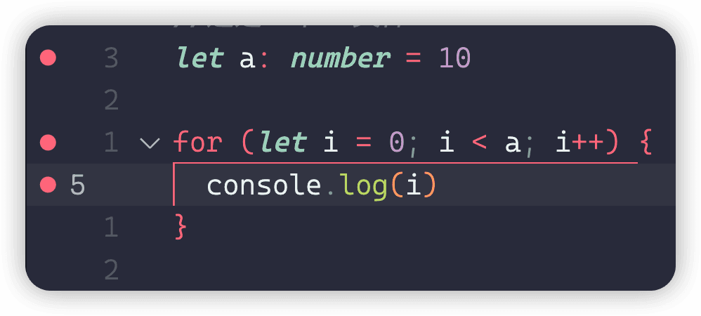

# 配置与调试

## 配置文件

### 创建文件

typescript文件的编译可以通过 tsconfig.json进行配置，使用以下命令可以创建tsconfig.json 配置文件

```ts
tsc --init
```

### 配置项说明

下面介绍常用的配置项

```ts
{
  "compilerOptions": {
  	//编译JS的版本
 		"target": "es2016",
 		//模块类型
 		"module": "commonjs",
 		//源码根目录
 		"rootDir": "./src/",
 		//开启sourceMap会生成index.js.map，进行编译后的js文件与源ts文件的关联
 		"sourceMap": true,
 		//编译的JS文件保存目录
 		"outDir": "./dist",
 		//当编译过程出错时停止编译
 		"noEmitOnError": true,
 		//开启严格模式
 		"strict": true,
 		//对隐式的any类型，不进行报错
 		noImplicitAny:false,
 		//不能将null和undefined赋值给其他类型的变量 
 		//let a:number=33; a=undefined//报错
 		strictNullChecks:true,
 		//函数参数未使用时报错
 		"noUnusedParameters": true
 		//在函数没有返回值是报错
 		"noImplicitReturns": true,
 		//在未使用本地变量时报错
 		"noUnusedLocals": true
  }
}
```

### 示例代码

下面向军大叔对有些晦涩的配置项，举例进行来说明使用场景。

**noUnusedLocals**

在未使用本地变量时报错，下面的变量a没有被使用

```ts
function make() {
  let a = 1
}
```

**noUnusedParameters**

函数参数未使用时报错

```ts
function make(n: number) {

}
```

**noImplicitReturns**

在函数没有返回值是报错

```ts
function make(n: number) {
  if (n > 1) return 3
}
```

## 调试

下面介绍使用vscode调试typescript，你需要先创建好tsconfig.json文件。

首先创建调试配置文件。


具体内容如下

```ts
{
	"version": "0.2.0",
	"configurations": [
		{
			"type": "node",
			"request": "launch",
			"name": "Launch Program",
			"skipFiles": [
				"<node_internals>/**"
			],
			"program": "${workspaceFolder}/src/index.ts",
			"runtimeExecutable": "/Users/hd/Library/pnpm/ts-node",
			"outFiles": [
				"${workspaceFolder}/**/*.js"
			]
		}
	]
}
```

然后编写src/index.ts 文件并设置断点



现在可以开始调试了


