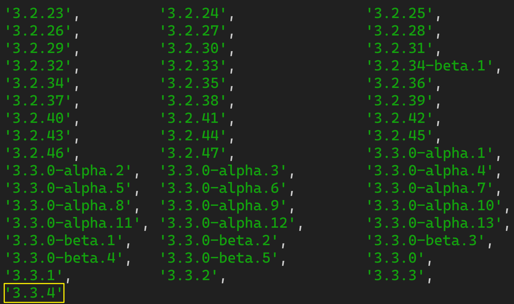

# 1. Vue3简介
- 2020年9月18日，`Vue.js`发布版`3.0`版本，代号：`One Piece`（n
- 经历了：[4800+次提交](https://github.com/vuejs/core/commits/main)、[40+个RFC](https://github.com/vuejs/rfcs/tree/master/active-rfcs)、[600+次PR](https://github.com/vuejs/vue-next/pulls?q=is%3Apr+is%3Amerged+-author%3Aapp%2Fdependabot-preview+)、[300+贡献者](https://github.com/vuejs/core/graphs/contributors)
- 官方发版地址：[Release v3.0.0 One Piece · vuejs/core](https://github.com/vuejs/core/releases/tag/v3.0.0)
- 截止2023年10月，最新的公开版本为：`3.3.4`

   

## 1.1. 【性能的提升】

- 打包大小减少`41%`。

- 初次渲染快`55%`, 更新渲染快`133%`。

- 内存减少`54%`。

  
## 1.2.【 源码的升级】

- 使用`Proxy`代替`defineProperty`实现响应式。

- 重写虚拟`DOM`的实现和`Tree-Shaking`。

  
## 1.3. 【拥抱TypeScript】

- `Vue3`可以更好的支持`TypeScript`。

  
## 1.4. 【新的特性】

1. `Composition API`（组合`API`）：
   - `setup`
   - `ref`与`reactive`
   - `computed`与`watch`
   
     ......
   
2. 新的内置组件：
   - `Fragment`
   - `Teleport`
   - `Suspense`

     ......

3. 其他改变：
   - 新的生命周期钩子
   - `data` 选项应始终被声明为一个函数
   - 移除`keyCode`支持作为` v-on` 的修饰符

     ......

