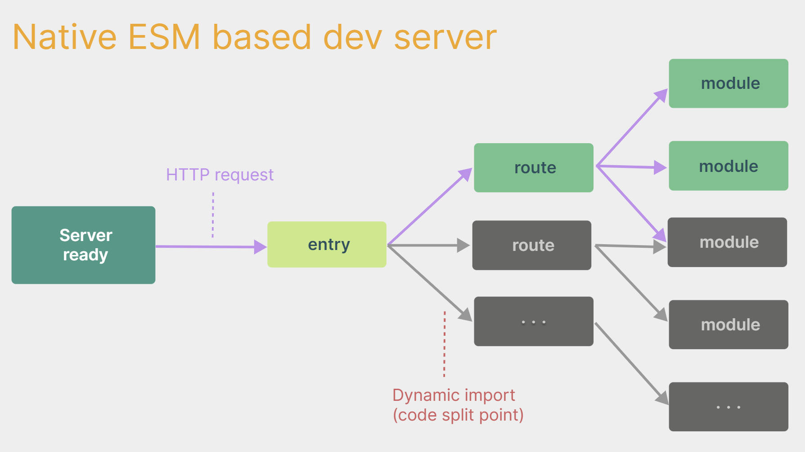

# 2. 创建Vue3工程

## 2.1. 【基于 vue-cli 创建】
点击查看[官方文档](https://cli.vuejs.org/zh/guide/creating-a-project.html#vue-create)

> 备注：目前`vue-cli`已处于维护模式，官方推荐基于 `Vite` 创建项目。

```powershell
## 查看@vue/cli版本，确保@vue/cli版本在4.5.0以上
vue --version

## 安装或者升级你的@vue/cli 
npm install -g @vue/cli

## 执行创建命令
vue create vue_test

##  随后选择3.x
##  Choose a version of Vue.js that you want to start the project with (Use arrow keys)
##  > 3.x
##    2.x

## 启动
cd vue_test
npm run serve
```

## 2.2. 【基于 vite 创建】(推荐)
`vite` 是新一代前端构建工具，官网地址：[https://vitejs.cn](https://vitejs.cn/)，`vite`的优势如下：

- 轻量快速的热重载（`HMR`），能实现极速的服务启动。
- 对 `TypeScript`、`JSX`、`CSS` 等支持开箱即用。
- 真正的按需编译，不再等待整个应用编译完成。
- `webpack`构建 与 `vite`构建对比图如下：
	
* 具体操作如下（点击查看[官方文档](https://cn.vuejs.org/guide/quick-start.html#creating-a-vue-application)）

```powershell
## 1.创建命令
npm create vue@latest

## 2.具体配置
## 配置项目名称
√ Project name: vue3_test
## 是否添加TypeScript支持
√ Add TypeScript?  Yes
## 是否添加JSX支持
√ Add JSX Support?  No
## 是否添加路由环境
√ Add Vue Router for Single Page Application development?  No
## 是否添加pinia环境
√ Add Pinia for state management?  No
## 是否添加单元测试
√ Add Vitest for Unit Testing?  No
## 是否添加端到端测试方案
√ Add an End-to-End Testing Solution? » No
## 是否添加ESLint语法检查
√ Add ESLint for code quality?  Yes
## 是否添加Prettiert代码格式化
√ Add Prettier for code formatting?  No
```
自己动手编写一个App组件

```html
<template>
  <div class="app">
    <h1>你好啊！</h1>
  </div>
</template>

<script lang="ts">
  export default {
    name:'App' //组件名
  }
</script>

<style>
  .app {
    background-color: #ddd;
    box-shadow: 0 0 10px;
    border-radius: 10px;
    padding: 20px;
  }
</style>
```

安装官方推荐的`vscode`插件：

 

 

总结：

- `Vite` 项目中，`index.html` 是项目的入口文件，在项目最外层。
- 加载`index.html`后，`Vite` 解析 `<script type="module" src="xxx">` 指向的`JavaScript`。
- `Vue3`中是通过`createApp` 函数创建一个应用实例。
## 2.3. 【一个简单的效果】

`Vue3`向下兼容`Vue2`语法，且`Vue3`中的模板中可以没有根标签

```html
<template>
  <div class="person">
    <h2>姓名：{{name}}</h2>
    <h2>年龄：{{age}}</h2>
    <button @click="changeName">修改名字</button>
    <button @click="changeAge">年龄+1</button>
    <button @click="showTel">点我查看联系方式</button>
  </div>
</template>

<script lang="ts">
  export default {
    name:'App',
    data() {
      return {
        name:'张三',
        age:18,
        tel:'13888888888'
      }
    },
    methods:{
      changeName(){
        this.name = 'zhang-san'
      },
      changeAge(){
        this.age += 1
      },
      showTel(){
        alert(this.tel)
      }
    },
  }
</script>
```

